# 파이썬 사전학습(처음 시작하는 파이썬, 문법부터 시작하라[스마트러닝])

## 파이썬의 특징 및 활용 분야

- 파이썬은 1991년 귀도 반 로썸이 발표한 인터프리터 언어.

- 구글이 3대 개발 언어(C, JAVA, PYTHON)로 선정하면서 인기 많아짐.

- 많이 쓰이는 이유

  - 높은 생산성
  - 풍부한 라이브러리, 확장성 뛰어남
  - 가독성
  - 접착성. ex) C언어로 된 모듈들을 붙일 수 있다.
  - 무료
  - 유니코드 기반 문자열 처리. 한글, 중국어, 일본어 문제 없음
  - 동적 타이핑. 런타임 시에 타입 체크를 하는 동시에 자동으로 메모리 관리.
  - 다른 언어에 비해 배우기 쉬움
  - 성능에 중점을 둔 언어가 C라면 파이썬은 생산성에 중점을 둠.

- 어떤 경우에 파이썬을 사용하나요?

  - 시스템 유틸리티
  - GUI
  - 인터넷 프로그래밍
  - DB 프로그래밍
  - 각종 텍스트 프로세싱

- 파이썬을 활용한 사례?

  - Dropbox 웹서비스, 구글 지도, 유튜브, gmail, tensorflow, keras


## 파이썬 개발 툴 셋팅

- Visual Studio Code 사용함.
  - python을 사용하기 위해서는 플러그인 설치해야함.


## 변수 및 내장 형식 문자열 사용과 인덱싱

- 다양한 프로그래밍 언어들의 공통점? 연산을 목적으로 한다는 것.
- 연산을 위해 꼭 알아야할 개념과 방법들
  - 변수
  - 자료형
    - 변수의 유형
  - 함수
    - 비슷한 목적으로 묶어진 약속
    - 필요한 기능이 미리 구현된 빌트인 함수도 있고, 사용자가 직접 함수를 정의하는 API와 같은 것들이 있다.
- 파이썬의 기본 자료형
  - 숫자형
  - 문자열
  - 리스트
  - 세트
  - 튜플
  - 딕셔너리
- 문자열 활용
  - 키보드 상에서 직접 입력할 수 없는 문자를 나타내야 할 때
    - 이스케이프 문자 사용.
    - \n : 개행(줄바꿈)
    - \t : 탭(공백문자 4글자)
    - \r : 캐리지 반환
    - \0 : 값이 입력되지 않은 비어 있는 상태(null)
    - \\\ : \\(역슬래시)를 일반 문자로 나타낼 때. 
    - \\' : 단일 따옴표 안에서 단일 따옴표 자체를 출력할 경우 사용.
    - \\": 쌍 따옴표 안에서 쌍 따옴표 자체를 출력할 경우 사용.
  - 다중 라인으로 문자열 저장하기
    - 쌍따옴표 3개! or 단일 따옴표 3개!


## 리스트, 세트, 튜플

- 리스트, 세트, 튜플은 내장 함수를 사용해서 서로 변환이 가능! list(), set(), tuple()


## 딕셔너리

- 맵핑 형식. 키를 통한 빠른 검색이 필요할 때 사용.


## 객체 주소의 얕은 복사와 깊은 복사

- 주소 : 모든 변수가 가지고 있는 저장된 메모리 어드레스로 각 개체는 고유의 주소가 있음
- 복사 : 변수의 고유 주소를 공유하거나 다른 이름으로 저장하여 사용하는 것
  - 얕은 복사 : 간접적으로 박스의 주소를 복사하는 것. 원본이 바뀌면, 복사한 내용도 바뀜. copy 모듈의 copy().
  - 깊은 복사 : 원본을 복사해서 따로 만듦. 원본 바뀌어도 복사한 내용 안바뀜. copy 모듈의 deepcopy(). 물론 이 방법만 있는 것은 아님.
  - id() : 주소 확인 하는 함수.


## 연산자 소개

- 산술 연산자
- 관계 연산자
- 논리 연산자


## 함수와 return 구문

- 


## 가변형과 불변형

- 불변형은 실수로 값을 변경하는 것을 방지할 때 쓰인다.

- 가변형은 지속적으로 데이터의 추가 또는 삭제가 필요한 경우에 쓰인다.

- 가변형(mutable) : list, dictionary. 가변형의 경우, 함수 내부에서 값을 변경했을 때 외부에서도 그 결과를 그대로 볼 수 있음.

- 불변형(immutable) : 값을 초기화 하면 변경이 불가능. 정수형, 실수형, 문자열, 튜플. 새로운 값을 저장한 주소로 변경만 되고 실제 값이 변경되는 것은 아님. 즉, 새로운 객체를 생성해서 리턴해버리는 것임.

  ```python
  a = 1.2
  id(a)
  out[2] : 37659152
  a = 2.3
  id(a)
  out[5] : 45895888
  ```


## 가변인자와 정의되지 않은 인자 처리

- scope
  - 순서 : 지역(함수 내부, local) -> 전역(함수 외부, global) -> 내장(built-in)
  - global 키워드를 지정해서 함수 내부에서 함수 외부를 읽기 및 쓰기를 할 수 있음!
- 가변인자
  - *를 함수 인자 앞에 붙이면 정해지지 않은 수의 인자를 받겠다는 의미. ex) *args
- 정의되지 않은 인자 처리
  - 있을 수도 있고 없을 수도 있는 인자를 처리하는 경우 **를 붙이면 된다. 이때, 정해지지 않은 인자를 사전(dictionary) 형식으로 받는다. 사전 형식으로 받은 그 인자들의 key 값을 뽑아서 value를 사용하면 된다.


## 람다, pass, __doc__ 속성과 help, 이터레이터 객체

- 익명 함수를 만들 때 : lambda
  - 함수의 이름이 없는 바디만 정의한 익명 함수
- 아무 것도 하지 않고 그냥 넘어가도록 할 때 : pass
  - 함수 바디에 당장은 아무 내용 입력 안하고 일단 내버려 둘 때 쓰임
- 생성한 함수의 설명을 추가하고 싶을 때 : \_\_doc\_\_, help
  - 함수.\_\_doc\_\_ = "이 함수는 ---한 함수입니다." 이런식으로 쓰고, help(함수)를 입력하면 설명이 출력된다.
- 순회 가능한 형식에서 값을 안전하고 빠르게 나열하고 싶을 때 : 이터레이터 객체
  - 순회 가능한 객체의 요소를 순차적으로 열거하도록 하는 객체
  - 리스트, 튜플, 문자열처럼 순회 가능한 시퀀스 형식에는 미리 구현되어 있음.


## 조건 구문

- 


## 반복 구문

- 


## 수열 range 함수

- filter(함수, 이터레이터) : 이터레이터를 입력받은 함수를 기준으로 걸러줌.


# 파이썬 사전학습(처음 시작하는 파이썬, 구조를 학습하라[스마트러닝])

## 클래스의 정의와 인스턴스 생성

- 클래스(쿠키 틀)
  - 개발자에게 필요한 새로운 형식을 정의하는 것을 의미
  - 속성과 데이터를 변형하는 함수를 같은 이름 공간(namespace)에 묶음
  - 멤버 변수와 멤버 메서드로 구성.
- 인스턴스(쿠키)
  - 클래스를 복사해서 생성한 복사본
- 객체지향프로그래밍의 3가지 특징
  - 추상성 : 꼭 필요한 부분만 구현하는 것
  - 상속성 : 부모 클래스에서 공통 부분을 상속받는 것
  - 다형성 : 동일한 인터페이스에 대해 구체적인 인스턴스마다 다른 동작을 할 수도 있는 것
  - 객체 지향 프로그램이을 사용한다는것은 레고 블록 처럼 조립을 통한 개발이 가능하다는 것.


## 인스턴스 사용과 self의 의미

- 인스턴스 객체 멤버 변수 이름 해석 순서
  - 인스턴스 객체 내부 -> 클래스 객체 내부 -> 전역 공간
- 자기 자신을 참조하는 의미의 self
  - self 작동 예시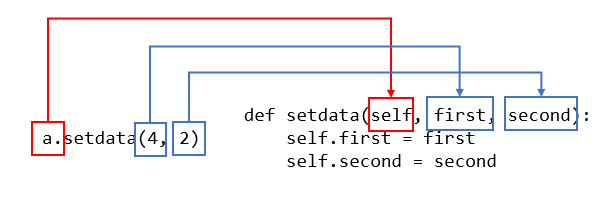
  - 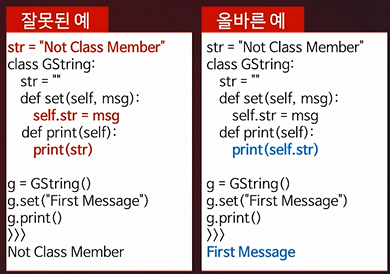
- 클래스를 정의할 때에는 class 라는 키워드를 사용.
- 클래스에는 멤버 변수를 초기화할 수 있고 멤버 메소드를 정의할 수 있다.
- 멤버 메소드는 def라는 키워드를 사용하고 첫 번째 매개변수(인자)는 예약되어 있는 자리여서 self라는 단어를 사용한다.


## 생성자와 소멸자 메소드

- 파이썬에서는 메모리 관리를 위해 생성자 메소드와 소멸자 메소드를 정의합니다.
- 생성자 메소드
  - 객체의 초기화 담당
  - 인스턴스 객체가 생성될 때 가장 먼저 호출
- 소멸자 메소드
  - 객체의 소멸을 담당
  - 인스턴스 객체의 레퍼런스 카운트가 0이 될 때 자동으로 호출
- 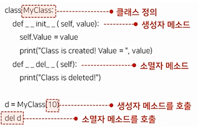
- 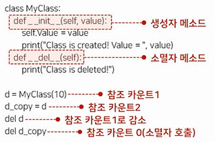


## 정적(static) 메소드 사용

- 인스턴스를 생성하지 않고 메소드를 호출할 수 있나요?
- 정적 메소드의 정의
  - 정적 메소드 또는 스태틱 메소드로 혼용
  - 클래스에서 직접 호출할 수 있는 메소드
  - 메소드를 정의할 때 인스턴스 객체를 참조하는 self라는 인자를 선언하지 않음
- 정적 메소드의 특징
  - 클래스 인스턴스에는 적용되지 않는 메소드
  - 클래스.메소드명 으로 호출 가능
  - 데코레이터 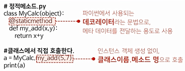


## private 멤버 사용

- 은폐, 캡슐화
- private 멤버 변수의 특징
  - 클래스의 내부 변수는 일반적으로 public 속성을 갖기 때문에 외부에서 마음대로 접근하거나 변경할 수 있음
  - 이름 변경
    - 외부에서 접근이 어렵도록 하는 파이썬의 특징
    - 외부에서 클래스 내부의 멤버 변수를 호출할 때, 원래 이름이 아닌 \_클래스명\_\_멤버변수로 변경됨.
      - ex) BankAccount라는 클래스를 account1이라는 인스턴스로 구현했을 때, 클래스의 private 멤버 변수인 \_\_balance 를 출력 해보자. print(account1.\_\_balance) 이런 식으로 일반적으로 접근하면 오류 떨어짐! 저런 변수 없다고 나옴. 접근하기 위해서는 print(account1.\_BankAccount\_\_balance) 이렇게 접근해서 출력해야 한다는 말!
- 식별자(예약어)
  - 키워드는 아니지만 private 멤버 변수로 사용하기 위해, 미리 정해진 용도로 사용하는 문자
  - _* : 모듈(파일) 안에서 _로 시작하는 식별자를 정의하면 다른 파일에서 접근할 수 없음. ex) _name
  - \_\_*\_\_ : 식별자의 앞뒤에 \_\_가 붙어 있는 식별자는 시스템에서 정의한 이름. ex) \_\_doc\_\_
  - \_\_* : 클래스 안에서 외부로 노출되지 않는 식별자로 인식. ex)\_\_name


## 상속과 다형성

- 상속
  - 부모 클래스의 모든 멤버를 자식에게 물려줄 수 있는 것
  - ex) 부모 클래스(일반화된 클래스) <- 자식 클래스(특정 기능 추가한 클래스)
  - 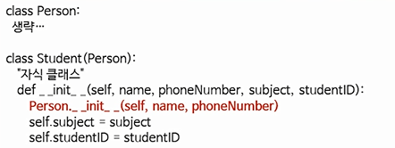
- 다형성
  - 상속받은 메소드의 바디를 덮어쓰기
  - 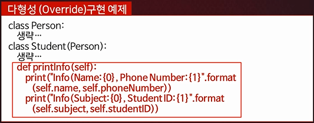
- 객체 내부의 값을 보고싶을 때는 객체.\_\_dict\_\_를 호출해서 출력하면 된다! dictionary 형태로 보여줌.


## 다중상속

- 다중상속
  - 2개 이상의 클래스를 동시에 상속받는 것을 의미
  - 파이썬에서 가능함!
- 다중상속의 이름 충돌(name conflict)
  - 상속 순서로 해결한다!
  - ex) 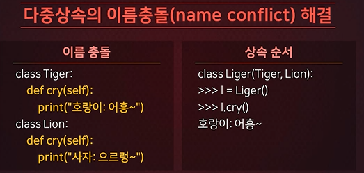


## 파이썬의 모듈 소개와 사용자 정의 모듈 작성하기

- 모듈
  - 여러 코드를 묶어 다른 곳에서 재사용할 수 있는 코드의 모음
  - 내장 모듈
    - 파이썬에서 기본적으로 제공되는 모듈
    - 문자열(string), 날짜(date), 시간(time), 수학(math), os, sys, sml, http, file 등 약 200개 정도의 다양한 모듈이 제공됨
    - dir(모듈명) : 모듈에서 쓸 수 있는 것들 볼 수 있음
  - 사용자 정의 모듈
    - 파이썬에서 기본적으로 제공되는 모듈 외 사용자가 직접 작성한 모듈
    - 필요시, 모듈 작성 및 제공 가능. 내가 만든 모듈을 다른 개발자에게 제공하거나 다른 개발자가 만든 모듈을 제공 받을 수 있음.


## 환경변수 등록, from절, import절 사용하기

- from 모듈명 import 어트리뷰트명 구문
  - from : 특정 모듈을 지정해서 메모리에 탑재할 때 사용하는 구문
  - import : 특정 함수를 지정해서 메모리에 탑재할 때 사용하는 구문.
    - 어트리뷰트 이름에 *을 써넣으면 \_로 시작하는 어트리뷰트를 제외하고 모든 어트리뷰트 사용 가능.
  - 어트리뷰트이름 으로 바로 활용 가능.
- import 모듈명 구문
  - 모듈이름.어트리뷰트이름 이런식으로 사용 가능.
- 모듈은 메모리에 한 번만 로딩. 참조하는 별칭은 여러 개 있을 수 있음. 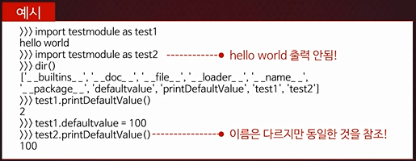


## 함수에서 에러가 발생하는 경우

- 


## try except로 예외 처리 하기

- 정의 : 실행시간에 에러가 발생하여 코드가 중단되는 것을 방지할 때 사용.
- 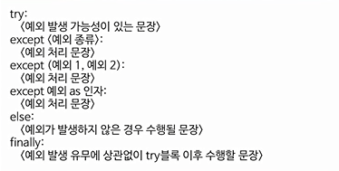


## 사용자 정의 예외 클래스 사용하기

- raise 구문 정의 : 사용자가 강제로 예외를 일으킬 때 사용하는 구문
- 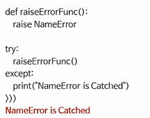
- 내장 예외만으로는 한계가 있기 때문에 사용자 정의 예외를 정의하여 사용하는 경우가 있는 것이다. 원하지 않는 결과가 나왔을 때 사용자에게 피드백을 받기 위해! 정의할 때 부모클래스로 Exception 클래스를 상속받아야 한다!
- 예외 클래스 정의 ex) 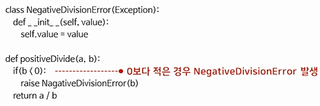
- e라는 인자 사용 ex) 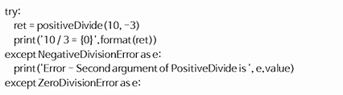
- 

