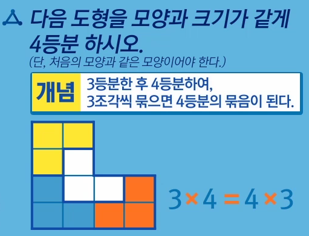
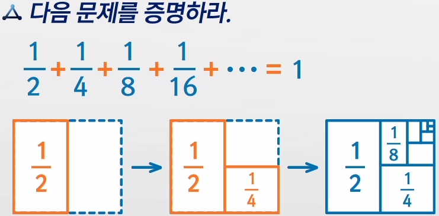
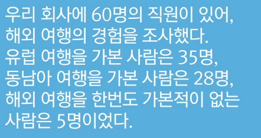
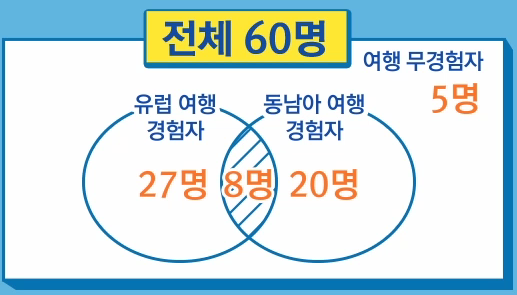
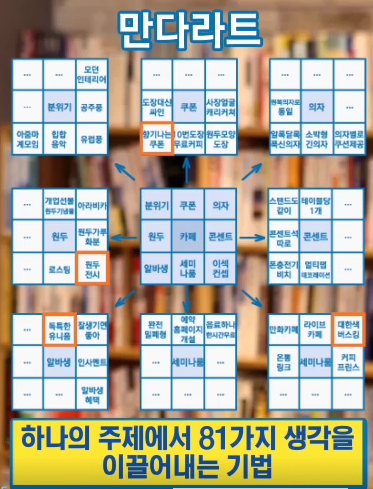
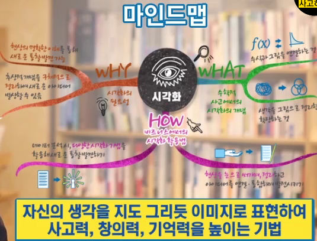
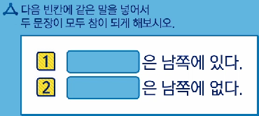

# 20181226 수학적 사고력 키우기1

## 1강. 4차 산업혁명 시대의 新창의적 사고를 만나다

- AI vs 인간
  - AI 우세 - 기억력, 신체적 강인성, 시력, 청력, 공간 지각력
  - 인간 우세 - 창의력, 설득, 협상, 말하기
- 창의력, 공감 등의 역량이 요구되는 직업일수록 AI가 대체하기 어렵다.
- FANG(Facebook, Amazon, Netflix, Google)
  - IT업계를 선도하는 기업
  - 수학적 사고를 바탕으로 창의적 성과를 내는 기업
  - 기업의 난제를 해결할 창의적 사고 방법, "수학"
- 수학
  - 사물이나 현상을 논리적으로 생각하고, 창의적인 문제 해결을 위해 다양한 방법으로 접근하는 사고 과정
  - 현상 추상화하기
  - 숨겨진 패턴 찾기
  - 개념 수립하기
  - 공식으로 증명하기
  - 확산적 발상(새로운 아이디어 탐색) 및 수렴적 판단(아이디어 검증 및 적용) 동시 활용
  - 따라서 수학은 창의적 사고의 과정
- 창의력 향상을 위한 수학적 사고(7가지 방법)
  - 증명하기
    - 통계의 오류에 빠지지 않음. 고정관념에서 벗어나 새로운 아이디어 생성
  - 패턴화하기
    - 문제의 발견 및 해결에 중요하게 활용
    - 패턴 파악, 미래 예측, 예측된 미래에 대응
  - 개념화하기
    - 현상을 추상화하여 개념 잡기, 개념 모방 및 검색, 새로운 아이디어 생성
  - 질문하기
    - 유연한 사고, 독창적인 아이디어에 대한 고민
  - 전환하기
    - 생각의 순서를 바꾸거나 관점을 전환함, 창조적 문제해결 방식 도출
  - 시각화하기
    - 다양한 생각을 입체적으로 조망하여 대상에 대한 이해가 쉽고 풍부해짐, 생각의 연결 및 제거 등의 조작이 원활해짐, 새로운 아이디어 생성
  - 패러독스
    - 불가능한 일임에도 불구하고 다시 한번 생각함, 창의적인 대안 마련, 양자택이의 마인드

## 2강. 핵심구조를 잡아 발전시키는 사고, "개념화"

- 미래형 인재에게 필요한 개념화 능력.
  - 새로운 비즈니스나 중요 문제 해결 등 예외적 업무를 해야하기 때문.
  - 원래는 관리자에게 특히 요구되는 역량이었지만 앞으로는 일반 임직원들도 갖춰야 할 것이다.
- 개념의 중요성을 인지한 스티브 잡스
  - "Simple"
  - 아이디어의 효율적인 발상
  - 복잡다단한 비즈니스 문제의 효율적인 해결
  - 애플의 혁신으로 이어짐.
- 개념화의 필요성과 개념
  - 쾨니히스베르크의 다리 문제
    - 오일러의 정리로 개념화 후 간단히 증명
  - 수학이란? 무질서한 존재에 질서를 세우고 구조를 잡는 것
  - 개념화 과정
    - 공통된 성질을 추출한 개념 -> 수학적인 정의 -> 새로운 정리 또는 법칙
    - 문제해결 및 아이디어 발상을 위한 시작점
  - 수학적 사고에서의 개념화(두가지)
    - 개념(concept)을 잡는 것
      - 새로운 것을 창조하는 일은 개념을 잡는 것에서 출발한다.
      - 왜? 개념을 잡아서 생각하면 더 다양한 아이디어를 얻어낼 수 있다.
        - ex) 정사각형 4등분하기 문제
      - 해석 및 분석을 위한 핵심 구조의 구축
        - 아이디어의 양과 질 향상
    - 개념을 활용하는 것
      - 모방하는 것
      - 어떤 문제를 개념화 해놓으면 유사한 다른 문제들도 쉽게 해결할 수 있음.
        - ex) 처음 도형 과 같은 모양으로 4조각 내기 문제.
        - 
        - 이런식으로 개념화해서 문제를 푼다면? 직관에 덜 의존할 수 있겠지
      - 아이디어도 마찬가지다. 아이디어의 개념화를 잘 해놓는다면? 다양한 분야에 아이디어를 적용할 수 있다.
- 비즈니스에서 유용하게 활용할 수 있는 개념화(햄버거 피클 이야기)
  - 문제 정의
    - 어떻게 하면 햄버거에서 피클이 빠져 나오지 않을까?
  - 개념 잡기
    - 타이어의 바퀴에 홈이 파져서 마찰력을 극대화한다는 개념
  - 개념 활용
    - 햄버거의 피클에도 지그재그로 홈을 파놓으면 마찰력이 높아져서 햄버거에서 잘 빠져나오지 않게 된다!
- 개념을 활용하여 아이디어 만들기(타 영역의 개념 모방하기)
  - 창의적인 아이디어를 만드는 대표적인 방법 중 하나는 모방
  - 자동차 경제 F1의 페라리 정비팀의 시스템 개념 -> 이를 모방하여 병원에서 활용하자 환자 응대 속도 20% 향상
  - 모방의 6단계
    - 정의하라
      - 해결하고자 하는 문제를 정확히 정의하라
    - 빌려라
      - 비슷한 문제를 안고 있는 곳에서 아이디어를 빌려라
    - 결합하라
      - 빌린 아이디어들을 서로 연결하고 결합하라
    - 숙성시켜라
      - 결합한 내용이 해결책이 되어 나타낼 때까지 숙성시켜라
    - 판단하라
      - 마련한 해결책의 강점과 약점을 파악하라
    - 끌어올려라
      - 해결하고자 하는 문제를 정확히 정의하라

## 3강. 다양한 방법으로 생각하는 사고, "전환"

- 생각의 관점, 방향, 패턴을 바꾸는 전환은 새로운 아이디어나 해결방식을 찾는 데 효과적이다!
  - ex) 미로찾기 할 때, 출발점에서 잘 안되면 출구에서 시작하면 잘 될 때 있음
- 수학적 사고에서의 전환
  - 다른 관점으로 접근해 발생할 수 있는 또 다른 결론을 만드는 기회를 만드는 것
  - ex) 수학자 파스칼, 판돈 배분 문제. 판돈이 걸린 게임을 중단했을 때, 중단한 시점까지의 결과로 배분하느냐 앞으로 이길 확률에 따라 배분하느냐. 기존의 방법은 중단한 시점까지의 결과로 배분하는 것이었지만, 관점을 전환함으로써 타당한 다른 결론을 이끌어 낼 수 있었다. 또, 확률의 발견과도 이어지게 됨.
- 순서대로 문제를 풀어낼 때도 있지만, 그게 잘안되면 반대로도 해보고, 확실히 아닌 것을 소거해보기도 하고 이런식으로 관점을 전환하면 문제 해결에 효과적임
- 비즈니스에서 실천할 수 있는 사고의 전환(두 가지)
  - 독창적인 아이디어를 위한 3Room 회의 기법 활용하기
    - 3개의 다른 관점(3Room)
    - 몽상가의 방, 현실가의 방, 비평가의 방
    - 한번에 하나의 방에 들어가서 방의 컨셉에 맞는 관점으로만 생각하는 것
    - 몽상가의 방
      - 상상하듯 생각하기
      - 현실적 문제는 접어두기
    - 현실가의 방
      - 몽상가의 방에서 나온 이야기들의 실현 가능성 검토하기
    - 비평가의 방
      - 무조건 꼬투리를 잡아 위험요소에 대비하기
    - 이를 통해 실행에 옮길 아이디어 도출!
    - 아이디어 확산 및 수렴을 경험하고 새로운 아이디어를 만들어 감
  - 그 문제에 대해 잘 모르는 다른 사람에게 아이디어를 묻기
    - 개인의 생각은 일정한 영역에 머무르는 경우가 많다
    - 새로운 아이디어는 내 생각이 머무르지 않는 영역에 있다
    - 문제에 대해 대화하고, 다른 접근 방식을 발견하며, 그를 통해 새로운 아이디어로 발전시키는 과정
    - 사소한 이야기가 불씨가 되어, 나의 아이디어를 깨운다!
- 퀴즈 : 100명의 테니스 토너먼트 시합. 총 열린 경기 수는?
  - 정답 : 99번. 모든 경기의 승과 패는 함께 올라간다. 누가 이기면 누가 지는 거니까. 그럼 패한 횟수를 세면 되겠다! 토너먼트기 때문에 99명은 탈락한거다. 탈락하는 사람은 1패씩 하고 탈락함. 따라서 총 경기 수는 99번이다.

## 4강. 좌뇌와 우뇌를 연결시키는 사고, "시각화"

- 데이터 시각화의 효과

  - 데이터의 직관적, 종합적 조망과 그 이면에 대한 분석이 가능하다.

- 학생들의 창의적인 생각을 유도하도록 활용되는 시각화

  - 학습 내용을 시각적 도식화 작업으로 요약, 정리하는 '비주얼 씽킹(Visual Thinking)'을 통해 학습 동기가 유발되고, 새로운 아이디어를 떠올리는 데 도움이 된다.

- 시각화의 필요성과 개념

  - 그림을 그려가며 생각하기

    - 문제를 명확히 바라보고, 해결방식을 찾는 방법

  - 수학적 사고에서의 시각화?

    - 수식과 그림 연결하기
      - 그림 정보를 수식으로 해석하기도 하고 수식 해석에 그림을 활용하기도 한다
      - ex) 피타고라스 정리, 직각삼각형에 대한 이해를 높이고 이를 활용한 문제를 풀 수 있도록 돕는다.
      - ex) 수식을 해석에 그림을 활용하는 경우
      - 
      - 그림을 활용하여 좌뇌와 우뇌를 모두 활용하면? 현상에 대한 풍부한 이해 가능

    - 생각을 그림으로 정리하여 확장시키기
      - 생각은 그림으로 그리면 명료해진다.
      - 
      - 
      - 시각화는 새로운 아이디어를 만들어 낼 수 있는 정리의 토대가 된다.

- 비즈니스 문제 해결과 새로운 아이디어 도출 시, 시각화의 활용

  - 데이터 분석 시, 숫자를 이미지로 표현하기
    - 방대한 데이터 속에서 원하는 정보를 얼마나 효율적이고, 보기 쉽게 뽑아내는가?
    - 기술적인 요소와 시각화를 통해 데이터를 요약하는 시각화 방법론
    - 이러한 과정 속에서 나열된 데이터를 통합적으로 바라보고, 데이터의 이면을 보며 새로운 통찰을 발견할 수 있음
  - 아이디어나 문제의 해결 방법을 찾을 때, 생각을 그려보기
    - 구체적 단어로 써보기
    - 이미지화하기
    - 도식화하기
    - 생각의 확장 및 숙성에 도움 줌
    - 
    - 

## 5강. 정답의 한계를 넘어서는 사고, "질문"

- 유대인의 토론 교육 '헤브루타'

  - 질문, 토론, 대화, 논쟁
  - 스스로 이해할 때까지 질문하는 유대인들
  - 질문하는 사람 -> 능동적인 사람

- 최초 인공지능에게 의뢰하고 질문을 주는 것은 인간의 영역

- 질문에 초점 맞추기

  - 능동적 사고
  - 생각의 폭과 깊이 확장
  - 새로운 발상

- 질문의 필요성과 개념

  - 수학적 사고에서의 질문(첫번째)
    - 새로운 발견 및 혁신의 시작점
    - 유클리드의 공리에 대한 질문. 삼각형 내각의 합이 180도 아니면 어떻게 되나?
    - 유클리드 기하학에서 비유클리드 기하학을 발견하다
    - 비유클리드 기하학의 발견으로 미시공간과 극대공간을 해석하는 이론 및 아인슈타인의 상대성 이론 정립
  - 수학적 사고에서의 질문(두번째)
    - 대상을 깊이 있게 이해할 수 있는 기회
    - 자유로운 질문이 생각의 폭과 깊이를 더함

- 공리 : 수학적 명제에 질문을 계속 더했을 때 더 이상 증명이 불가하여 근본적 사실로 판단되는 것

- > 좋은 질문 하나는 여러 겹의 답을 제시하고 새로운 연구 분야를 만들고 고질적인 생각을 변화시킬 수 있다. 반면, 답은 그 과정을 끝내 버린다. - 스튜어트 파이어 슈타인 -

- 비즈니스에서 질문 활용하기
  - 질문에 대한 관점 바꾸기
    - 질문의 반대말은? 암기다. 주체적인 생각 없이 무조건 받아들이는 것.
    - 질문할 때 주체적인 생각에 강조점을 두고 보다 능동적으로 생각을 만들어 보자.
  - 새로운 생각을 만드는 질문 방법을 적극 도입하기
    - 성급한 답 강요하지 않기
    - 사소한 질문들이 쌓여 질적인 변화를 유도함
    - 조급하게 답을 강요할 경우 대화가 단절되고 답을 찾기 어려워짐
    - 같은 내용이라도 다양하게 표현하기
    - 다양한 표현을 상대가 다르게 받아들임으로써 새로운 발상이 가능함
  - 사고의 새로운 지평을 여는 질문법 활용하기
    - 개방형 질문(왜, 만약, 어떻게 로 시작하는 질문)
      - 이번 프로젝트에서 잘된 점은 무엇일까요?
      - 창의적 사고를 독려하는 질문이다.
    - 폐쇄형 질문
      - 이번 프로젝트는 잘 진행된 것 같습니까?
    - 긍정적 분위기에서의 질문
      - 만약, 이게 기회라면? 어떻게 이 상황을 최대한 활용할 수 있을까?
      - 발전적 답을 유도하는 질문이다.
    - 부정적 분위기에서의 질문
      - 이런, 어떻게 하지?
- 주체적이고 능동적으로 생각하려는 마인드
- 긍정과 여유를 가지고 질문 과정에 임하는 태도

## 6강. 통계와 고정관념에 속지 않는 사고, "증명"

- 빅데이터 속 팩트를 찾아라

  - 사실 관계가 명확한가?
  - 상황을 고려하여 올바르게 도출된 결론인가?
  - 증명은 생각의 오류에서 벗어나 올바른 사고를 유도한다.
  - 잘못된 통계의 해석에 대한 무비판적 수용은 위험함
  - ex) 고속도로보다 집근처에서 사고가 더 많이 일어난다. 따라서 집근처가 고속도로보다 위험하다?
  - 빅데이터가 반드시 현명한 정보를 주는 것이 아님!
  - 논리적으로 분석, 해석 했는지? 통계의 해석 및 결과값이 상황을 고려하여 올바르게 도출되었는가?

- 증명의 필요성과 개념

  - 증명화 과정
    - 생각의 오류에서 벗어나 올바른 판단 및 사고의 전환을 유도함
    - 타인을 설득하고 생각을 실현하는 데 용이함
  - 수학적 사고에서의 증명
    - 직관적 생각 및 아이디어를 증명하여 확인하는 것
      - 가정에서 결론으로. 논리적 비약 없이
      - 증명을 통해 개념을 추상화하고, 연역적 사고가 정립되었다.
    - 고정관념을 발견하고, 질문을 통해 새로운 아이디어를 창출하는 것
      - 고정관념이나 경험에만 갇히기 않고, 보다 효과적인 새로운 아이디어 및 방법을 탐색하기 위해 증명을 활용하라
      - ex) 캔을 상자에 담을 때, 사각형 배열과 육각형 배열을 섞어서 담으면 더 많은 캔을 담을 수 있다!
  - 수학적 증명의 효과
    - 분석적, 논리적 사고가 중요하다는 것을 알려줌.
    - 구체적 데이터, 철저한 검증, 논리적 분석적 확인을 통해 사고의 전환을 이끌어 낼 수 있음.

- 비즈니스에서 증명 활용하기

  - 어떤 가정을 품고 있는가? 그 가정은 정당한가?

  - 무비판적으로 수용하는 것 확인하기.

    - > 세상에는 세 가지 거짓말이 있다. 새빨간 거짓말, 새하얀 거짓말, 그리고 통계다. - 벤자민 디즈레일 리

    - 통계에 속지 않는 TIP5

      1. 통계 숫자를 모은 사람들, 발표자들이 누구인지 파악하라
      2. 조사방법이 타당한가 물으라
      3. 숨긴 숫자는 없는가 물으라
      4. 내용이 뒤바뀐 것은 아닌가를 반드시 살펴보라
      5. 상식적으로 생각 가능한 이야기인지, 석연치 않은 부분들은 없는지를 따져보라

  - 제로베이스로 생각하기

    - > 기술은 아주 좋다. 하지만 체력이 약하다. - 거스 히딩크

    - 제로베이스에서의 생각은 새로운 발상 전환을 유도

- 직관적 생각 점검하기
- 고정 관념에 의문 제기하기

## 7강. 미래를 예측하는 사고, "패턴화"

- TESCO는 고객의 구매 패턴을 분석하여 고객 니즈를 파악함으로써 재고 효율화 및 양질의 서비스 제공

- IoT 기술을 통한 데이터 수집, 빅데이터 패턴 분석, 고객 니즈 및 현상 파악 미래 예측

- 패턴화의 필요성과 개념

  - 패턴 분석 -> 규칙 중심의 현상 이해 -> 미래 예측

  - 수학에서 활용하는 패턴화란 무엇인가?

    - 산술과 수론 : 수의 패턴
    - 기하학 : 도형의 패턴
    - 미적분 : 움직임의 패턴
    - 논리학 : 추론의 패턴
    - 확률 : 우연의 패턴
    - 위상기하학 : 위치의 패턴

    1. 관찰을 통해 패턴을 인식하는 것
       - 가우스 사례. 1부터 100까지 정수의 합 구하기
       - 무질서 안에서 패턴을 인식하여 규칙 중심으로 현상의 핵심을 추출하라
    2. 패턴 파악을 통해 미래를 예측하는 것
       - 보고 말하기 수열
       - 영상 압축 등 데이터 압축에도 사용.

- 비즈니스에 활용하는 패턴화

  - 패턴을 분석하여 고객 니즈 파악 및 미래 예측하기
    - amazon, 누가 언제 어떤 상품을 구매할 것인가? 맞춤형 상품 제안
  - 경영활동에 패턴 모방 활용하기
    - 패턴은 곧 규칙
    - 각 분야 리더의 패턴을 따르는 것은 성공률이 높은 규칙을 따르는 것
    - 성공한 기업을 떠올리며 질문하기
      - "그들이라면 이 일을 어떻게 할까?". 창의적 혁신적 아이디어 창출
      - ex) 페이스북이라면 어떻게 아이디어를 발상할까? 페이스북은 해커톤을 도입해서 해결할 것이다.
      - ex2) 구글이라면 어떻게 짧은 시간 안에 프로젝트를 완수할까? 일주일 간 기획부터 프로토타입 제작까지 끝내는 'SPRINT'를 도입할 것이다.
      - 이렇게 생각하는 것만으로 규칙 중심으로 생각이 옮겨 가기 때문에 아이디어 창출에 도움이 된다.

- 다양한 현상에 관심을 갖고 관찰하자.

## 8강. 양자택이 할 수 있는 사고, "패러독스"

- 새로운 가치를 창출하는 패러독스

  - 포털 사이트에서 정보와 광고는 양립할 수 없을까?
  - 구글, 이용자의 검색 정보에 의한 맞춤 광고 제공으로 양립 가능하게 만듦.
  - 사용자는 자신에게 유용한 정보와 연계된 광고이므로 거부감이 없음
  - 광고주는 충성도 높은 고객 대상의 광고에 높은 비용을 지불할 용의가 있음
  - 상반되는 요소를 조화 시켜 새로운 가치 창출

- 패러독스의 필요성과 개념

  - 역설(Paradox)
    - 언뜻 보면 일리가 있는 것처럼 생각되지만, 분명하게 모순되어 있거나 잘못된 결론을 이글거나 하는 논증이나 생각실험
  - 왜 패러독스가 창의적 사고에 도움이 될까?
    - 
    - 정답은? 지구의 반. 논리적으로 풀 수 없는 문제 처럼 보였지만.. 창의적인 대안을 찾을 수 밖에 없게 유도하는 효과가 있음
    - 패러독스의 핵심 : 기존의 상식, 고정 관념으로 불가능하다고 생각되던 것의 새로운 방법, 창의적인 대안을 찾는 것.
  - 패러독스는 모순되는 상황이라도 어떻게 해서든 되게 만들 수 있다는 도전을 하게 만듦.
  - para : 평행선. 옆길로 가야한다는 어원적 의미 있음.
  - 수학적 사고에서의 패러독스
    1. 불가능한 생각을 그럼에도 불구하고 다시 한번 생각해보는 일
    2. 양자택일이 아닌 양자택이
       - A형 논리(Aristoteles, Augustine, Aquinas) : 이분법적인 형식 논리(A이다 - A가 아니다, 선 - 악, 빛 - 어둠). 모든 문제를 해결하는 데는 한계가 있다. 서양 철학과 사상에 강력한 영향을 줌. 명쾌하게 구분하는 이분법적인 A형 논리.
       - E형 논리(Epimenides, Eublaides, Eckhart) : 이분법적 논리를 초월한 논리(A이면서 A가 아니다). 애매모호하고 불확실한 상황을 받아들이는 E형 논리. 새로운 생각, 남과 다른 시각. 빛의 이중성.

- 비즈니스에 패러독스적 사고법을 활용하기

  - 현실적, 상식적이지 않은 생각을 현실적 아이디어로 만들기

    - 이상한 생각 -> 획기적 아이디어
    - 이상한 생각을 현실적 아이디어로 만드는 3단계
      1. 획기적이지만 비현실적인 생각 던지기
      2. 그 생각의 장점과 흥미로운 점을 중심으로 생각하기
      3. 장점과 흥미로운 점을 살릴 수 있도록 생각을 변형시켜 아이디어 만들기

  - 창의성 발휘를 위해 or이 아니라 and를 고민하기

    > 통합적 사고란, 상반되는 두 아이디어 사이의 긴장을 건설적으로 이용하여, 양자택일 방식 대신, 두 아이디어의 요소를 모두 포함하면서 각 아이디어보다 뛰어난 새로운 아이디어를 만들어 창의적으로 긴장을 해소하는 능력 - 로저 마틴

    - 통합적인 사고를 하는 리더의 6가지 입장(로저 마틴)
      1. 기존 모델은 객관적인 현실을 반영하지 못한다. 그것은 현실에 대한 주관적인 구성물일 뿐이다.
      2. 상반되는 모델은 두려워할 대상이 아니라 적극적으로 활용해야할 대상이다.
      3. 기존 모델들은 완벽하지 않으며 더 나은 모델이 반드시 존재한다. 다만 아직 발견하지 못했을 뿐이다.
      4. 나에게는 더 나은 모델을 찾을 능력이 있다.
      5. 나는 필요한 복잡성을 피하지 않고 정면으로 승부할 수 있다.
      6. 스스로에게 더 나은 모델을 창조할 시간 여유를 준다.

- 