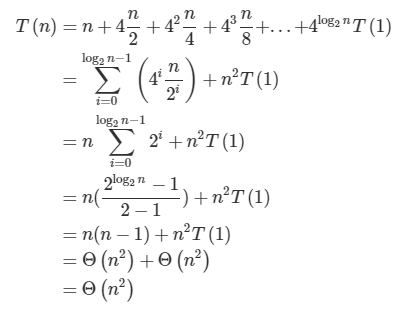

# 20190109 함수2

## 수업

- 이진탐색

- 복사

  - `a = 123`, `b = 123` 정수들은 그냥 이렇게 해도 각각의 값을 가짐
  - `a = [1,2,3]` `b = a` 하지만 이렇게 객체들을 `=`로 대입하면 얕은 복사가 된다.
  - 얕은 복사(shallow copy)
    - 그냥 서로 같은 객체를 가리키기만 하는 것
    - 하나 내용 바꾸면 같이 바꿔진다.
  - 깊은 복사(deep copy)
    - `import copy` 후, `copy.deepcopy()` 이용하면 된다.

- list, dict comprehension

  - comprehension : "이해력". 아래와 같은 거라고 보면됨.

  - ```python
    # 1
    even_list = [even for even in range(11) if even % 2 == 0]
    print(even_list)
    
    # 2
    cubic_list = [x ** 3 for x in range(1, 11)]
    print(cubic_list)
    
    # 3
    girls = ['jane', 'iu', 'mary']
    boys = ['justin', 'david', 'kim']
    
    pair = [(boy, girl) for boy in boys for girl in girls]
    print(pair)
    
    # 4
    pytha = [(x, y, z) for x in range(1, 50) for y in range(x, 50) for z in range(y, 50) if (x**2 + y**2 == z**2) ]
    print(pytha)
    
    # 5
    words = 'Life is too short, you need python'
    vowels = 'aeiouAEIOU'
    result = [x for x in words if x not in vowels]
    print(''.join(result))
    
    # 6
    dusts = {
        'seoul': 103,
        'kyungki': 79,
        'daejeon': 36,
        'beijing': 500
    }
    bad_dust = { city: 'bad' if dust > 80 else 'not bad' for city, dust in dusts.items()}
    print(bad_dust)
    ```

- map()

  - iterable한 객체의 원소들에 function을 적용한 후, 그 결과를 돌려준다.

  - 결과값을 map object 형태로 돌려주므로, 형변환이 필요하다.

  - (ex)

  - ```python
    # 1
    l = input('띄어쓰기로 숫자 입력: ')
    strings = l.split(' ')
    map_object = map(int, strings)
    r = list(map_object)
    print(r)
    
    # 2
    def cube(n):
        return n ** 3
    
    
    print(cube(3))
    
    n = [1, 2, 3]
    cubic_n = list(map(cube, n))
    
    print(cubic_n)
    
    # 3
    num = [1,2,3,4]
    r = ''.join(map(str ,num))
    print(r)
    
    # 4
    data = [10, 20, 30, 40]
    def make_list_html(n):
        return f'<li class="container list">{n}</li>'
    
    
    html_data = list(map(make_list_html, data))
    print(html_data)
    ```


## 수업 이외

- yield. 예제 같은 거로 정리해보기

- 재귀함수의 시간 복잡도? 재귀 함수가 더 좋은가?

  - 아니다. 시간 복잡도가 크다고 하심.

  - 그러나 재귀적으로 함수를 만드는 것이 깔끔하긴하다. 그리고 지금 우리가 만드는 것은 엄청 큰 계산량 아니니까 지금은 괜찮음.

  - 재귀함수의 시간 복잡도 계산하기

    알고리즘의 계산복잡도 함수가 재귀식으로 표현되는 대표적인 사례 가운데 하나가 **분할-정복(divide-and-conquer) 문제**입니다. 다음과 같이 풉니다. 우선 원래 문제를 부분문제로 쪼갭니다(divide). 부분 문제를 풉니다(conquer). 이를 합칩니다(merge). 원래 문제에 $n$개의 데이터가 있고, 이를 푸는 데 드는 시간복잡도를 $T(n)$이라고 할 때 $T(n)$은 다음과 같이 분해할 수 있습니다.

    $T(n)=T(divide)+T(conquer)+T(merge)$

    이를 **합병정렬(merge sort)**을 예시로 설명하겠습니다. 합병정렬 관련 자세한 내용은 [이곳](https://ratsgo.github.io/data%20structure&algorithm/2017/09/06/insmersort/)을 참고하시면 좋을 것 같습니다.

    $T(divide)$는 문제를 분할하는 데 걸리는 시간을 가리킵니다. 합병정렬을 예로 들면 원래 문제를 두 개로 나누기 위해 데이터를 반으로 자를 위치(인덱스) 하나만 고르면 되므로 $T(divide)=Θ(1)$입니다. (Big $Θ$ notation 관련해서는 [이곳](https://ratsgo.github.io/data%20structure&algorithm/2017/09/13/asymptotic/)을 참고하시면 좋을 것 같습니다)

    $T(conquer)$는 (분할한 문제의 수 * 하위문제를 푸는 데 걸리는 시간)을 의미합니다. 원래 문제를 절반씩 두 개로 나누었고, 각 하위문제는 $n/2$개의 데이터가 있으므로 $T(conquer)=2∗T(n/2)$가 될 것입니다.

    $T(merge)$는 하위문제를 합치는 데 걸리는 시간입니다. 합병정렬에서는 하위문제를 합치면서 정렬을 수행합니다. $n=8$일 때 다음 그림과 같습니다.

    [](https://imgur.com/mx0Hyvk)

    위 그림을 자세히 보면 하위 첫번째 array의 첫번째 요소(2)와 두번째 array의 첫번째 요소(1)을 비교해 sorted array의 첫번째 요소를 결정(1)합니다. 그 다음으로 첫번째 array의 첫번째 요소(2)와 두번째 array의 두번째 요소(2)를 비교해 sorted array의 두번째 요소를 결정(2)합니다. 이런 방식으로 merge를 모두 수행하는 데 총 $n=8$회의 연산을 수행하게 됩니다. 따라서 데이터 수가 $n$일 때 $T(merge)=Θ(n)$이 됩니다.

    이를 바탕으로 합병정렬의 시간복잡도를 다시 쓰면 다음과 같습니다.

    $$T(n)=Θ(1)+2⋅T(n/2)+Θ(n)$$

    하지만 위와 같은 재귀식 형태로는 해당 알고리즘의 시간복잡도를 정확히 알기가 어렵습니다. T(n)T(n)을 어렵게 구했지만 내부에 $T(n/2)$가 또 있어서 꼬리에 꼬리를 물고 $n$이 1이 될 때까지 식을 길게 늘여뜨려 써야하기 때문입니다. 이를 닫힌 형태로 구해보기 위해 다음 세 가지 방법을 씁니다.


    나는 여기서 일단은 한 가지 방법만을 기억해두려고 한다.


    **Iteration method**

    이 방법은 점화식을 무한히 풀어 헤쳐 모두 더하는 방식으로 구합니다. $T(n)=n+4T(n/2)$을 구해보겠습니다.

    $T(n)=n+4T(n/2)\\=n+4(n/2+4T(n/4))=n+4n/2+4T(n/4)\\=n+4(n/2+4(n/4+4T(n/8)))=n+4n/2+4^2n/4+4^3T(n/8)\\=...\\=n+4n/2+4^2n/4+4^3n/8+...+4^kT(n/2^k)$

    위 식에서 $n/2^k$가 1이 될 때까지 끝까지 반복해서 더합니다. 이 때 $k$는 $log_2⁡n$입니다. ($2^k=n$) 그런데 여기에서 로그의 성질에 의해 $4^(log_2⁡n)=2^(2log_2⁡n)=n^(2log_2⁡2)=n^2$이 되므로 다음이 성립합니다.

    

    수식 말고도 트리 구조를 활용해 직관적으로 구하는 방법도 있습니다. $T(n)=T(n/3)+T(2n/3)$을 구해보겠습니다. 다음 그림과 같습니다.

    [](https://imgur.com/K9WrTvy)

    우선 알고리즘이 한 개의 데이터를 처리하는 데 필요한 시간을 $c$라고 두면, $n$개 데이터를 처리하는 데 드는 시간복잡도는 $cn$입니다. 위 점화식은 한번 분기할 때마다 데이터를 각각 1/3, 2/3씩 나누게 됩니다.

    따라서 위 그림 트리를 $i$번 분기했을 때 말단 좌측 끝 노드의 처리 대상 데이터 수는 $n/3^i$가 됩니다. 이 말단 노드의 데이터 수가 1이 될 때까지 분기를 했을 경우 그 분기 횟수 $i$는 $log_3⁡n$이 됩니다. ($3^i=n$)

    마찬가지로 트리를 $j$번 분기했을 때 말단 우측 끝 노드의 데이터 수는 $n∗(2/3)j$가 됩니다. 이 말단 노드의 데이터 수가 1이 될 때까지 분기를 했을 경우 그 분기 횟수 $j$는 $log_(3/2)⁡n$이 됩니다. ($(3/2)^j=n$)

    점근 표기법(자세한 내용은 [이곳](https://ratsgo.github.io/data%20structure&algorithm/2017/09/13/asymptotic/) 참고)은 데이터 수 $n$에 대해 최고차항의 차수만 따집니다. 그런데 위 트리에서 각 층을 연산하는 데 $cn$, 분기 횟수는 최대 $log_(3/2⁡)n$이 되므로 이 알고리즘의 계산복잡도는 $Θ(nlog⁡n)$가 됩니다.

    이렇게 놓고 보면 재귀적으로 분기하는 함수에서 분기 횟수는 분기 비율의 역수를 밑으로 하고 데이터 수를 진수로 하는 로그값임을 알 수 있습니다. 하지만 Iteration method은 점화식이 수렴하지 않고 발산하는 형태일 경우 적용할 수 없습니다.

    출처 : https://ratsgo.github.io/data%20structure&algorithm/2017/09/11/recurrence/ [ratsgo's blog]

- 