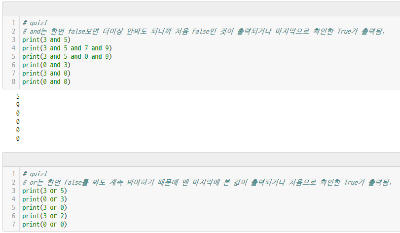
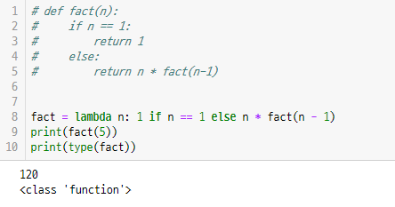
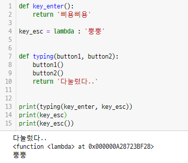

# 20190120 python 시험 관련 참고 사항

- 실수 비교

  - 

- int maxsize

  - 

- and, or

  - 

- scope

  - 
  - 

- lambda

  - 
  - 
  - 

- comprehension, 삼항연산자

  - 둘이 비슷하게 생겨서 문법 헷갈림.

  - 밑에서 1~5번은 comprehension 식 문법이 적용되고 6번은 삼항연산자 식 문법 적용. 즉, if만 쓰면 맨 뒤에 if를 쓰고, if/else 함께 쓰면 앞에 먼저 쓰고 for를 뒤에 쓴다.

  - ```python
    # 1
    even_list = [even for even in range(11) if even % 2 == 0]
    print(even_list)
    
    # 2
    cubic_list = [x ** 3 for x in range(1, 11)]
    print(cubic_list)
    
    # 3
    girls = ['jane', 'iu', 'mary']
    boys = ['justin', 'david', 'kim']
    
    pair = [(boy, girl) for boy in boys for girl in girls]
    print(pair)
    
    # 4
    pytha = [(x, y, z) for x in range(1, 50) for y in range(x, 50) for z in range(y, 50) if (x**2 + y**2 == z**2) ]
    print(pytha)
    
    # 5
    words = 'Life is too short, you need python'
    vowels = 'aeiouAEIOU'
    result = [x for x in words if x not in vowels]
    print(''.join(result))
    
    # 6
    dusts = {
        'seoul': 103,
        'kyungki': 79,
        'daejeon': 36,
        'beijing': 500
    }
    bad_dust = { city: 'bad' if dust > 80 else 'not bad' for city, dust in dusts.items()}
    print(bad_dust)
    ```

- map()
  - iterable한 객체의 원소들에 function을 적용한 후, 그 결과를 돌려준다.

  - 결과값을 map object 형태로 돌려주므로, 형변환이 필요하다.

  - (ex)

  - ```python
    # 1
    l = input('띄어쓰기로 숫자 입력: ')
    strings = l.split(' ')
    map_object = map(int, strings)
    r = list(map_object)
    print(r)
    
    # 2
    def cube(n):
        return n ** 3
    
    
    print(cube(3))
    
    n = [1, 2, 3]
    cubic_n = list(map(cube, n))
    
    print(cubic_n)
    
    # 3
    num = [1,2,3,4]
    r = ''.join(map(str ,num))
    print(r)
    
    # 4
    data = [10, 20, 30, 40]
    def make_list_html(n):
        return f'<li class="container list">{n}</li>'
    
    
    html_data = list(map(make_list_html, data))
    print(html_data)
    ```

- 실습문제 - chicken coupon

  > 치킨 쿠폰 3장을 모으면 한마리를 줍니다. 한마리를 시키면 한장을 줍니다. n 장이 있을 때, 몇 마리 까지 먹을 수 있을 까요?

  > ex) 10장 ==> 7장 + 1장 ==> 5 + 1 ==> 3 + 1 ==> 1 + 1

  - ```python
    def chicken(current_chicken, remain_coupon):
        if current_chicken == 1:
            return 1
        elif current_chicken == 2:
            return 2
        else:
            new_chicken, no_coupon_chicken = divmod(current_chicken + remain_coupon, 3)
            return chicken(new_chicken, no_coupon_chicken) + current_chicken
    ```

- 실습문제 - 개미수열(Look & Say)

  > 숫자를 세어서 몇 개인지 말해요

  ```
  n = 0
  [1]
  
  n = 1
  [1, 1]
  
  n = 2
  [1, 2]
  
  n = 3
  [1, 1, 2, 1]
  
  n = 4
  [1, 2, 2, 1, 1, 1]
  
  ...
  ```
  - ```python
    def look_and_say(n):
        if n == 0:
            return [1]
        else:
            now = look_and_say(n-1)
            length = len(now)
            result = []
            current = 1
            temp = 1
            
            for i in range(length):     
                if i == length-1:
                    result.append(current)
                    result.append(temp)
                    break
    
                elif now[i] == now[i+1]:
                    current = now[i+1]
                    temp += 1
                    
                elif now[i] != now[i+1]:
                    result.append(current)
                    result.append(temp)
                    current = now[i+1]
                    temp = 1
                 
            
            return result
    ```

  - ```python
    def look_and_say_teacher(n, remain=[1], result=[]):
        if n == 0:
            return remain
        
        look = remain[0]
        say = 0
        
        for index, number in enumerate(remain):
            if number == look:
                say += 1
                
            else:
                remain = remain[index:]
                break
                
        else:
            remain = []
            
            
        result = result + [look , say]
        if len(remain) == 0:
            return look_and_say_teacher(n-1, result, [])
        
        else:
            return look_and_say_teacher(n, remain, result)
    ```

- instance method, static method, class method

  - class method는 @classmethod, static method는 @staticmethod, instance method는 데코레이터 없이 쓰면된다.
  - instance method & class method
    - instance method는 self라는 인자를, class method는 cls라는 인자를 반드시 넘겨야 한다.
      - 따라서 얘네 둘은 instance, class가 각각 혼자 쓸 method인 경우 만들면 좋다.
  - static method
    - static method는 반드시 넘겨야 하는 인자가 없다
      - 따라서 얘는 instance, class 둘 모두 쓸 method인 경우 만들면 된다.
      - 따라서 static method에는 인자를 기본으로 넘겨야 하는 instance method나 class method와는 다른 역할을 하는 (예를 들면 단순 조회 같은) 기능을 구현하면 된다.
  - 근데 어떻게든 instance가 class method를 사용할 수 있고, 반대의 경우도 가능하다. 하지만 그렇게는 사용하지 않는 것이 좋다. 권장되는 방법 및 설계가 아니다.
  - 데코레이터 써놓는 이유는 명시적인 기능이 강하기 때문이다. 물론 다른 기능도 들어있지만. OOP하는 이유와 비슷한 것으로 이해함.
    - 왜 귀찮게 데코레이터 써가면서 method를 만드는 단계에서부터 명시해서 static, class, instance method를 나눠놔야 하나... 했는데 클래스를 만들다보니 이해됨.
    - java에서는 parameter로 this를 명시하지 않았기 때문에 헷갈렸음. 왜 굳이 데코레이터를 써야하나 생각했었는데, 파이썬에서는 instance method 만들기 위해서는 parameter로 self를 꼭 쓰도록 설계되어 있으니까(인스턴스는 기본 parameter로 self를 넘기고, 클래스는 기본 parameter로 cls를 넘기기 때문에) 반드시 method를 만들때부터 데코레이터로 정의해줘야 parameter 오류가 안생긴다.
  - instance는 그냥 class method 가져다 써도 문제 없는 것으로 보아서, instance는 instance method 쓸 때 self를 자동으로 넘기는 것처럼 class method를 쓸 때는 cls를 자동으로 넘기는 것으로 보인다. instance를 만드는 설계도가 class 인 것을 생각해보면 아주 어색한 것은 아닌 것 같다.

- ```python
  # 단순한 static method를 만들어보겠습니다.
  class Dog:
      num_of_dogs = 0
      birth_of_dogs = 0
      list_of_dogs = []
      
      def __init__(self, name, breed):
          self.name = name
          self.breed = breed
          Dog.num_of_dogs += 1
          Dog.birth_of_dogs += 1
          Dog.list_of_dogs.append(name)
          
      def __del__(self):
          Dog.num_of_dogs -= 1
          
      def bark(self):
          return '왈왈!'
      
      @staticmethod
      def info():
          return '이것은 개입니다!'
      
      @classmethod
      def birth(cls):
          return f'총 {cls.birth_of_dogs} 마리의 개가 태어났습니다. 총 {cls.num_of_dogs} 마리의 개가 있습니다.'
  ```

- ```python
  # 여기에 코드를 작성해주세요.
  class Stack:
      def __init__(self):
          self.items = []
          
      def empty(self):
          if len(self.items) == 0:
              return True
          else:
              return False
          
      def top(self):
          if self.empty():
              return None
          else:
              return self.items[-1]
      
      def pop(self):
          if self.empty():
              return None
          else:
              temp = self.items[-1]
              del self.items[-1]
              return temp
          
      def push(self, item):
          self.items.append(item)
  ```

- ```python
  # 사람과 사람을 같은지 비교하면, 이는 나이가 같은지 비교한 결과를 반환하도록 만들어봅시다.
  class Person:
      population = 0
      
      def __init__(self, name, age):
          self.name = name
          self.age = age
          Person.population += 1
          
      def greeting(self):
          print(f'{self.name} 입니다. 반갑습니다!')
          
      def __repr__(self):
          return f'< "name:" {self.name}, "age": {self.age} >'
      
      def __gt__(self, other):
          if self.age > other.age:
              return '오른쪽이 연장자'
          else:
              return '왼쪽이 연장자'
      
      def __add__(self, other):
          if isinstance(other.age, int):
              return self.age + other.age
          
          
  ```

- ```python
  class Person:
      def __init__(self, name, age, number, email):
          self.name = name
          self.age = age
          self.number = number
          self.email = email 
          
      def greeting(self):
          print(f'안녕, {self.name}')
          
  class Student(Person):
      def __init__(self, name, age, number, email, student_id):
          super().__init__(name, age, number, email)
          self.student_id = student_id
          
  p1 = Person('홍길동', 200, '0101231234', 'hong@gildong')
  s1 = Student('학생', 20, '12312312', 'student@naver.com', '190000')
  s1.greeting()
  ```

- ```python
  def guess_up_down_teacher(max_n):
      count = 0
      max_n, min_n = max_n + 1, 0
      print('숫자를 생각하세요..!')
      
      while 1:
          guess = (max_n + min_n) // 2
          print(guess)
          count += 1
          feedback = int(input('작으면 -1, 크면 1, 맞으면 0: '))
          
          if feedback == -1:
              max_n = guess
          elif feedback == 1:
              min_n = guess
          else:
              return count
  ```

- 