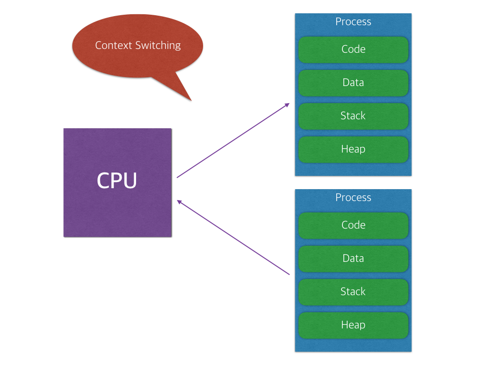

# 20190111 Flask 기초

## 수업

- flask
  - microframework
- flask 사용
  - variable routing
    - `@app.route('/hi/<string:name>')` 사용.
    - 라우팅 하드코딩 안해도 된다!
- `$ export FLASK_ENV='development'`
  - export: 쉘 변수를 환경 변수로 변경해주는 명령입니다.
  - FLASK_ENV='development' : 쉘 변수 입력
  - FLASK_ENV가 기본값으로 production으로 갖고 있기 때문에 이를 development로 바꾸고 이것을 환경 변수로 지정하는 것이다!
  - [참고] Bash는 쉘과 스크립트 언어의 성격을 모두 가지고 있습니다. 스크립트로 사용할 때, 쉘 프로그래밍 혹은 쉘 스크립팅이라고 합니다. 프로그래밍 요소가 있기 때문에 위와 같이 변수를 관리하는 명령이 있습니다. 환경 변수와 쉘 변수는 다른 데, 다른 언어에서는 쉽게 구분이 가능한 반면에, 쉘 프로그래밍을 하다 보면 이 두 가지의 사용 용법이 비슷하여 동일한 것으로 오해할 수 있습니다.
  - [참고] 유닉스는 "Small is beautiful"이라는 유닉스의 철학에 맞게 작은 프로그램들의 집합으로 구성된 시스템이며, 리눅스는 이를 모방하여 만들어, 별거아닌 것 같은 기능들도 모두 작은 프로그램으로 제공하며, 이러한 명령어들을 이용하여 쉘 프로그래밍을 할 수 있습니다.
  - [출처] https://hashcode.co.kr/questions/1893/%EB%A6%AC%EB%88%85%EC%8A%A4-%ED%99%98%EA%B2%BD%EB%B3%80%EC%88%98-%EC%84%A4%EC%A0%95%ED%95%A0-%EB%95%8C-env-set-export-declare
- ascii art archive
  - 아스키로 그린 그림 같은거 모아놓은 사이트
- codewars
- git clone 해올 때 그냥 다운로드 zip 으로 하면 .git 폴더가 없다.
- .gitignore
  - git으로 관리하고 싶지 않은 파일들 기록.
  - *.swp 이런식으로 기록하면 됨.
  - add로 stage로 올린 파일을 다시 내리고 싶을 때?
    - `$ git rm --cached dummy.txt`
  - 관리하는 폴더 내에 만들 수도 있지만, 홈 디렉토리(.gitconfig 있는 곳)에 만들 수도 있다. 방식은 좀 상이할 수 있으니 하려면 검색하고 해보자.
- `$ git checkout -b  help-page`
  - `-b` checkout 하면서 branch 만드는 옵션
- git branch를 따서 작업을 하는 도중에.. master가 변경 commit을 해서 branch와 conflict가 나면 merge할 때 맞게 수정해줘야 한다.
  - 자동으로 해줄 때도 있는데 복잡하면 직접 수정해야된다.
  - 그렇게 master로 merge한 후에 push 하면?? branch 정보가 없다.
  - remote repo에 branch를 보고 싶으면? branch도 따로 push 해야한다.
  - 주의해야할 점 : `git push -u origin [브랜치명]` 이렇게 해줘야 함.

## 수업 이외

- 모듈과 라이브러리
  - 모듈 : 동일한 목적의 함수나 변수 또는 클래스 들을 모아 놓은 파일.
  - 라이브러리 : 거의 같음
  - 차이점 : 모듈이 프로그램을 구성하는 작은 부품으로서의 로직을 의미한다면, 라이브러리는 자주 사용되는 로직을 재사용하기 편리하도록 잘 정리한 일련의 코드들의 집합을 의미한다고 할 수 있다.
  - [출처] https://opentutorials.org/course/743/4750
- git branch를 master로 merge한 이후 그 branch는 어떡하나?
  - 내 생각에 특별한 이유가 없다면 merge 이후에 삭제하고 다시 필요할 때 branch를 다시 따는 것이 좋을 것 같다.
  - 왜냐면 해당 branch를 살리려면 반대로 master를 해당 branch로 한번 더 merge해야되는데 복잡하게 그럴 바에 지우고 새로 깔끔하게 branch를 만드는 게 나으니까.
  - 내가 걱정하던 것은 merge 후 branch를 지우면 해당 branch의 이전 commit들(merge 이전 master에 없었기때문에 conflict가 났던 commit 들)이 없어지지 않을까 하는 것이었다. 하지만 실험 결과 commit은 없어지지 않고 branch만 없어졌다!
- 프로세스와 스레드
  - 간단한 정리 : 프로세스는 운영체제로부터 자원을 할당받는 작업의 단위이고 스레드는 프로세스가 할당받은 자원을 이용하는 실행의 단위이다.
  - 
  - 
  - 멀티태스킹 : 운영체제에서 여러 개의 프로세스를 동시에 실행하는 것
  - 어떤 작업을 하나 이상의 프로세스에서 병렬로 처리하는 것을 멀티프로세싱이라고 함.
    - 
    - 이런식으로 CPU같은 프로세서가 스케쥴링에 따라 돌면서 처리한다. 프로세스를 돌아가면서 처리하는 동안에 Context switching 과정을 거치게 되는데, 이 때 오버헤드(=어떤 명령어를 처리하는 데 소비되는 간접적, 추가적인 컴퓨터 자원)가 일어난다.
    - 프로세스는 각각 독립된 메모리 영역을 할당받았기 때문에, 프로세스 간 통신 비용이 멀티스레딩에 비해 더 높다.
    - 장점은 여러 개의 프로세스가 존재하기 때문에, 프로세스가 문제가 생겼을 때, 하나의 프로세스로 처리할 때보다 전체에 미치는 영향이 적다.
  - 하나의 프로세스 안에서 여러 개의 스레드로 나눠서 처리하는 것을 멀티스레딩이라고 함.
    - 위의 그림처럼, 각 스레드는 stack 영역만 따로 할당을 받고, 나머지 부분은 공유한다.
    - 따라서 멀티 프로세싱에서 발생하는 오버헤드를 해결할 수 있고, 공유되는 부분이 생겨서 처리 비용이 감소하는 장점이 있다.
    - 하지만 이에 따라, 스레드의 충돌 가능성이 높아져서 디버깅, 프로그래밍이 조금 까다로워질 수 있다.
    - 웹 서버는 대표적인 멀티 스레드 응용 프로그램이다.
  - 프로세스(Process)
    - **“컴퓨터에서 연속적으로 실행되고 있는 컴퓨터 프로그램”**
    - 메모리에 올라와 실행되고 있는 프로그램의 인스턴스(독립적인 개체)
    - 운영체제로부터 시스템 자원을 할당받는 작업의 단위
    - 즉, 동적인 개념으로는 실행된 프로그램을 의미한다.
    - [참고] 할당받는 시스템 자원의 예 : CPU 시간, 운영되기 위해 필요한 주소 공간, 독립된 메모리 영역
    - 최소 1개의 스레드 가지고 있음.
    - 한 프로세스가 다른 프로세스의 자원에 접근하려면 프로세스 간의 통신(IPC)을 사용해야 함.
  - 스레드(Thread)
    - **"프로세스 내에서 실행되는 여러 흐름의 단위"**
    - 프로세스가 할당받은 자원을 이용하는 실행의 단위
  - 자바의 프로세스와 스레드
    - Is there one JVM per Java application?
      - 그렇다. 그리고 각 JVM instance는 서로 독립적이다.
    - 일반 스레드와 거의 차이가 없으며, JVM이 운영체제의 역할을 한다.
    - 자바에는 프로세스가 존재하지 않고 스레드만 존재하며, 자바 스레드는 JVM에 의해 스케줄되는 실행 단위 코드 블록이다.
    - 자바에서 스레드 스케줄링은 전적으로 JVM에 의해 이루어진다.
    - 즉, 개발자는 자바 스레드로 작동할 스레드 코드를 작성하고, 스레드 코드가 생명을 가지고 실행을 시작하도록 JVM에 요청하는 일 뿐이다.
  - [출처] https://gmlwjd9405.github.io/2018/09/14/process-vs-thread.html
  - [출처] https://magi82.github.io/process-thread/
  - [출처] https://brunch.co.kr/@kd4/3
  - [출처] https://stackoverflow.com/questions/5947207/is-there-one-jvm-per-java-application/5947279
