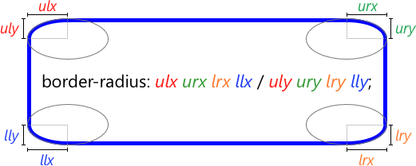

# 20190226 web 월말평가 관련

## HTML & CSS

### selector

- ```html
  <style>
      /* 전체 셀렉터 */
      * {
          color: red;
      }
      /* 모든 p 태그 요소를 선택 */
      p {
          color: red;
      }
      /* id 어트리뷰트 값이 p1인 요소를 선택 */
      #p1 {
          color: red;
      }
      /* class 어트리뷰트 값이 container인 모든 요소를 선택 */
      .container {
          color: red;
      }
      /* a 요소 중에 href 어트리뷰트를 갖는 모든 요소 */
      a[href] {
          color: red;
      }
      /* a 요소 중에 target 어트리뷰트의 값이 "_blank"인 모든 요소 */
      a[target="_blank"] {
          color: red;
      }
      /* h1 요소 중에 title 어트리뷰트 값에 "first"를 단어로 포함하는 요소 */
      h1[title~="first"] {
          color: red;
      }
      /* p 요소 중에 lang 어트리뷰트 값이 "en"과 일치하거나 "en-"로 시작하는 요소 */
      p[lang|="en"] {
          color: red;
      }
      /* a 요소 중에 href 어트리뷰트 값이 "https://"로 시작하는 요소 */
      a[href^="https://"] {
          color: red;
      }
      /* a 요소 중에 href 어트리뷰트 값이 ".html"로 끝나는 요소 */
      a[href$=".html"] {
          color: red;
      }
      /* div 요소 중에서 class 어트리뷰트 값에 "test"를 포함하는 요소 */
      div[class*="test"] {
          color: red;
      }
      /* div 요소 중에서 class 어트리뷰트 값에 "test"를 단어로 포함하는 요소 */
      div[class~="test"] {
          background-color: yellow;
      }
      /* div 요소의 후손요소 중 p 요소 */
      div p {
          color: red;
      }
      /* div 요소의 자식요소 중 p 요소 */
      div > p {
          color: red;
      }
      /* p 요소의 형제 요소 중에 p 요소 바로 뒤에 위치하는 ul 요소를 선택한다. */
      p + ul {
          color: red;
      }
      /* p 요소의 형제 요소 중에 p 요소 뒤에 위치하는 ul 요소를 모두 선택한다.*/
      p ~ ul {
          color: red;
      }
  </style>
  ```


### property

- width / height

  - width와 height 프로퍼티는 요소의 너비와 높이를 지정하기 위해 사용된다. 이때 지정되는 요소의 너비와 높이는 콘텐츠 영역을 대상으로 한다.
  - 만일 width와 height로 지정한 콘텐츠 영역보다 실제 콘텐츠가 크면 콘텐츠 영역을 넘치게 된다는 것에 유의하여야 한다.
  - overflow: hidden;을 지정하면 넘친 콘텐츠를 감출 수 있다.
  - width와 height 프로퍼티의 초기값은 auto로써 이것은 브라우저가 상황에 따라 적당한 width와 height 값을 계산할 것을 의미한다.
  - 요소 너비가 브라우저 너비보다 크면 가로 스크롤바가 만들어진다. 이 문제를 해결하기 위해서 max-width 프로퍼티를 사용할 수 있다.
    - max-width 프로퍼티를 사용하면 브라우저 너비가 요소의 너비보다 좁아질 때 자동으로 요소의 너비가 줄어든다.
    - min-width: 300px;의 경우 브라우저의 너비가 300px보다 작아져도 요소 너비는 지정 너비(300px)을 유지한다.

- border

  - `border` 프로퍼티는 `border-width`, `border-style`, `border-color`를 한번에 설정하기 위한 shorthand 프로퍼티이다.

  - ```html
    <style>
    	p.dotted { border-style: dotted; }
        p.mix    { border-style: dotted dashed solid double; }
        p.one {
            border-width: thin; /* 1px */
          }
        p.five {
            border-width: 2px 10px 4px 20px;
          }
        p.three {
            border-color: red green blue yellow;
          }
        .border-circle {
            border-radius: 50%;
          }
        .border-football {
            /* top-left & bottom-right | top-right & bottom-left */
            border-radius: 15px 75px;
        }
        .border-rounded {
            border-radius: 20px;
    
            /* 위 코드는 아래의 shorthand이다.
            border-top-left-radius:     20px;
            border-top-right-radius:    20px;
            border-bottom-right-radius: 20px;
            border-bottom-left-radius:  20px;
            */
    	}
        .border-rounded {
          border-radius: 50px 50px 0 0 / 25px 25px 0 0;
        }
        p {
          /* border-width border-style border-color */
          border: 5px solid red;
        }
    </style>
    ```

  - 

- box-sizing

  - `box-sizing` 프로퍼티는 width, height 프로퍼티의 대상 영역을 변경할 수 있다.

  - box-sizing 프로퍼티의 기본값은 content-box이다. 이는 width, height 프로퍼티의 대상 영역이 content 영역을 의미한다. box-sizing 프로퍼티의 값을 border-box로 지정하면 마진을 제외한 박스 모델 전체를 width, height 프로퍼티의 대상 영역으로 지정할 수 있어서 CSS Layout을 직관적으로 사용할 수 있게 한다.

  - ```html
    <style>
        .content-box {
            width: 600px;
            border: 10px solid;
            padding: 50px;
            margin: 50px;
            background-color: red;
        }
        .border-box {
            box-sizing: border-box;
            width: 600px;
            border: 10px solid;
            padding: 50px;
            margin: 50px;
            background-color: red;
        }
    </style>
    ```

- font & text

  - `font-family`

    - 폰트명은 따옴표로 감싸주며 폰트명이 한단어인 경우는 따옴표로 감싸주지 않아도 된다.

  - `font-style` 프로퍼티는 이탤릭체의 지정, `font-weight` 프로퍼티는 폰트 굵기 지정에 사용된다.

  - `line-height`

    - 텍스트의 높이를 지정한다. 텍스트 수직 정렬에도 응용되어 사용된다.

  - `letter-spacing`

    - 글자 사이의 간격을 지정한다.

  - `text-align`

    - 텍스트의 수평 정렬을 정의한다.
    - a요소에 중앙 정렬을 정의해도 적용되지 않는다. 이는 a 요소는 inline 요소이기 때문이다. inline 요소는 width 프로퍼티가 없으므로 중앙 개념이 존재하지 않는다. a 요소에 `display: block;`을 지정한다면 중앙 정렬이 가능할 것이다.

  - `text-decoration`

    - `text-decoration` 프로퍼티를 사용하여 링크 underline을 제거할 수 있다. 또는 텍스트에 underline, overline, line-through를 추가할 수도 있다.

  - `white-space`

    - 

    - | 프로퍼티값 | line break | space/tab   | wrapping(자동줄바꿈) |
      | ---------- | ---------- | ----------- | -------------------- |
      | normal     | 무시       | 1번만 반영  | O                    |
      | nowrap     | 무시       | 1번만 반영  | X                    |
      | pre        | 반영       | 그대로 반영 | X                    |
      | pre-wrap   | 반영       | 그대로 반영 | O                    |
      | pre-line   | 반영       | 1번만 반영  | O                    |

  - `text-overflow`

    - 부모 영역을 벗어난 wrapping(자동줄바꿈)이 되지 않은 텍스트의 처리 방법을 정의한다.
    - width 프로퍼티가 지정되어 있어야 한다. 이를 위해 필요할 경우 block 레벨 요소로 변경하여야 한다.

  - `word-wrap`

    - 한 단어의 길이가 길어서 부모 영역을 벗어난 텍스트의 처리 방법을 정의한다. link 등을 표기할 때(e.g. https://poiemaweb.com/css3-font-text) 그 길이가 매우 길어지는데 이 프로퍼티를 사용하지 않으면 부모 영역을 넘어가게 된다.

  - `word-break`

    - 한 단어의 길이가 길어서 부모 영역을 벗어난 텍스트의 처리 방법을 정의한다.

  - 코드 예시 쓰기 부터 시작하면 됨!!


## Bootstrap

### Layout(grid)


### Components


## Django

### Read(list, detail 페이지 관련)


### Delete


### DTL(Django Template Language)

