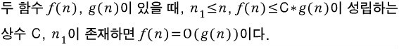
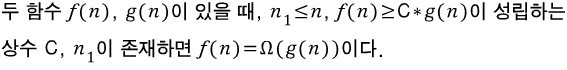

# 20190214 list

## 수업

### 개요

- APS(Algorithm Problem Solving)
- APS 기본 - 자료 구조
- APS 응용 - 알고리즘 설계
  - 최적화 문제(optimization problems)
    - 최대 혹은 최소가 되는 경우를 찾는다.
    - 최적해를 찾는 문제
    - 근데 해를 찾는 데 너무 오래 걸리면 효율성이 떨어짐.. 따라서 시간이 중요하다.
- 문제를 풀 때, 내장함수와 라이브러리 사용하지 않는 것이 좋다.
- 삼성 SW TEST
  - intermediate : 정확하게 답이 나오는 코드를 짜는 것이 중요하다. 맞기만 하면 됨.
  - advanced : 그리디 알고리즘 등을 사용하여 완전 탐색을 하지 않고 문제를 풀어내면 됨.

### 완전 검색을 효율적으로 하는 방법

- 그리디(제일 효율적인 방법! 적용하기 어렵다. 최적이라는 보장을 하기 어렵다는 말이다.)
- DP(Dynamic Programming)
- 백트래킹
- 분할 정복

### 시간 복잡도 계산

- Big-O notation

  - 대개 최악인 경우에서의 시간 복잡도. 제일 많이 씀.
  - 

- Big-Omega notation

  - 대개 최선인 경우에서의 시간 복잡도
  - 

- Big-Theta notation

  - 빅 세타는 빅 오와 빅 오메가의 공통부분입니다. 최소와 최악의 중간인 평균적인 복잡도.

  - 

- [출처] https://vaert.tistory.com/117 [Vaert Street]
- 시간 복잡도가 큰 문제들을 어려운 문제라고 부른다.

  - 실 세계의 많은 문제들은 아직 시간 복잡도가 크다.
    - 알고리즘을 통해 시간 복잡도를 낮춘다면 쉬운 문제가 되는 것이다.
  - 보통 최적화 문제가 시간 복잡도가 크다.
    - 따라서 코딩테스트에서 어려운 문제는 최적화 문제가 많다.
  - 많은 사람들은 현재 컴퓨터 구조로 쉽게 풀 수 없는 문제들이 있다고 생각한다.
    - 양자 컴퓨터 같은 것으로 해결 가능할 것으로 생각한다고 한다.

### 기타

- 최적화 문제 풀기
  - 처음 접근은 우선 완전 검색으로 접근!(Brute Force)
  - 처음부터 DP나 백트래킹 같은 좋은 방법을 뽑아내는 것은 어렵다.
    - 해당 방법을 공부하더라도, 제대로 이해하고 사용하기는 어려울 수 있다.
    - Brute Force에 일단 익숙해져야 이를 효율적으로 하는 방법들도 이해하기가 쉽다.
    - 처음에는 Brute Force를 마스터한다는 생각으로 공부하길.
    - 그러고 나서 효율적인 방향으로 리팩토링하자. 자료 구조라던가 로직이라던가..
- 넓은 의미의 파일
  - 데이터를 읽고 쓰는 채널
  - 유닉스에서 따로 연결 안해놔도 항상 연결 되어 있는 채널
    - stdin
      - standard input : keyboard
    - stdout
      - standard output : console (쉽게말하면 모니터)
    - stderr
      - standard error : console
  - redirection
    - 채널의 방향을 바꿔주는 기능.
    - ex) 키보드로 입력을 받아들일 것을 파일에 입력된 정보로 받아들이는 것.
- 

## 수업 이외

