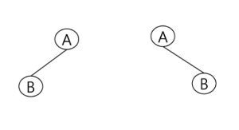

# 20190305 tree

## 수업

### tree

- LCA(Lowest Common Ancestor)
  - 최소 공통 조상 찾는 문제 많이 나옴
- 
  - 둘은 다른 것임. 왼쪽 자식 노드를 갖는 트리 vs 오른쪽 자식 노드를 갖는 트리
- 트리의 표현 - 연결 리스트
  - 일정한 구조의 단순 연결 리스트 노드를 사용하여 구현할 수  있다! (동적 할당 하고 싶을 때)
  - 파이썬에서는 배열의 크기를 늘려버리는 동적 할당이 편하지만, C 같은 언어에서는 그러기 어려우므로 연결 리스트 형식으로 트리를 구현하는 방식으로 동적 할당을 한다.
  - 동적 할당이 필요없다면 그냥 배열에 트리를 저장해서 써도 된다.
- 이진탐색트리
  - 탐색 작업을 효율적으로 하기 위한 구조!
- 

### 기타

## 수업 이외

