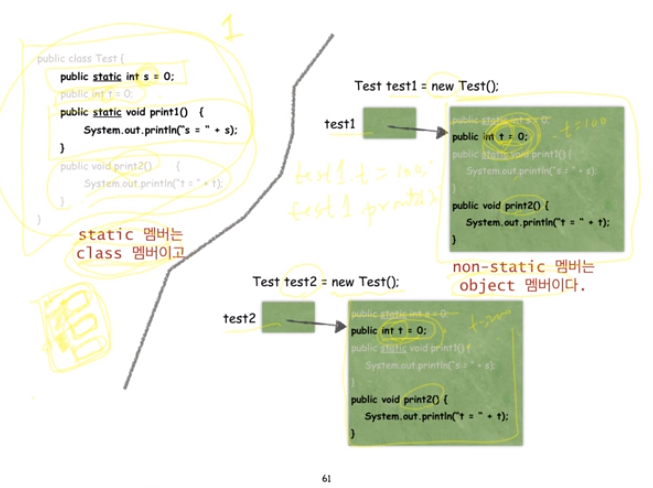

# static 그리고 public

## Java로 배우는 자료구조

### static

- 클래스는 타입이다. 집이 아니라 집의 설계도이다. 즉, 실체가 아니다.
- 따라서 클래스의 데이터 필드에 데이터를 저장할 수는 없고, 클래스의 멤버 메서드를 실행할 수도 없다. 왜냐하면 실체가 아니므로!!
- new 명령으로 해당 클래스 타입의 객체를 만든 후, 그 객체에 데이터를 저장하고, 그 객체의 멤버 메서드를 실행하는 것이다.
- 여기에는 하나의 예외가 존재하는데 그것이 static 멤버이다.
- static 멤버는 클래스 안에 실제로 존재하며 객체에는 존재하지 않는다!
- 
- 왜 main 메서드는 반드시 static이어야 하는가?
  - Java에서 프로그램이란 클래스들의 집합이다. 어떤 것이든 클래스 사용이 강제된다. 따라서 main 메서드도 클래스 안에 있어야한다. 그래서 main 메서드는 반드시 static으로 실체를 만들어 두어야 프로그램이 실행 가능하다.
- 왜 static 메서드에서 같은 클래스의 non-static 멤버를 액세스 할 수 없는가?
  - non-static은 object 멤버이기 때문에 new 예약어로 객체를 생성하기 전에는 실제로 존재하지 않기 때문이다. static 메서드는 이미 실제로 존재하는 메서드인데 non-static 같이 실제로 존재하지 않는 변수를 액세스해서는 안된다.
  - 그럼 왜 같은 클래스의 non-static 메서드에서는 non-static 멤버를 액세스 할 수 있나?
    - non-static 메서드 역시 아직 실체가 없는 설계도 상에 존재하는 메서드이기때문에 non-static 멤버를 액세스해도 문제 없다! 객체가 생성되었을 때 둘다 함께 실제로 만들어질 것들이기 때문에..
- 다른 클래스에 속한 static 멤버는 어떻게 액세스하는가?
  - 클래스이름.static멤버
- static 메서드/필드의 용도는?
  - mains 메서드
  - 상수 혹은 클래스 당 하나만 유지하고 있으면 되는 값(혹은 객체)
    - ex) Math.PI, System.out
  - 순수하게 기능만으로 정의되는 메서드. 대표적인 예로는 수학 함수들
    - ex) Math.abs(k), Math.sqrt(n), Math.min(a, b)

### 접근제어자(access modifier): public, private, default, protected

- 같은 클래스 안에서 접근제어자는 의미가 없음! 다른 클래스에서 접근할 때 의미가 달라지는 것임.
- public: 클래스 외부에서 접근이 가능하다.
- private: 클래스 내부에서만 접근이 가능하다.
- default: 동일 패키지에 있는 다른 클래스에서 접근 가능하다. 접근제어자 안쓰면 default임.
- protected: 동일 패키지의 다른 클래스와 다른 패키지의 하위클래스에서도 접근 가능하다. 즉, 다른 패키지에서는 상속받았을 때 접근 가능하다는 말이다.
- 그럼 이것을 왜 쓰는지?
  - 데이터 캡슐화
    - 모든 데이터 멤버를 private으로 만들고 필요한 경우에 public한 get/set 메서드를 제공한다.
    - 이렇게 하면 객체가 제공해주는 메서드를 통하지 않고서는 객체 내부의 데이터에 접근할 수가 없다.
    - 이것을 data encapsulation 혹은 information hiding이라고 부른다.
    - 데이터에 주위에 성을 쌓고, 성문을 만들어서 데이터의 입출력을 성문을 통해서만 하겠다는 개념이다.
    - 의도하지 않은 오류 같은 것을 줄이겠다는 생각이다.

