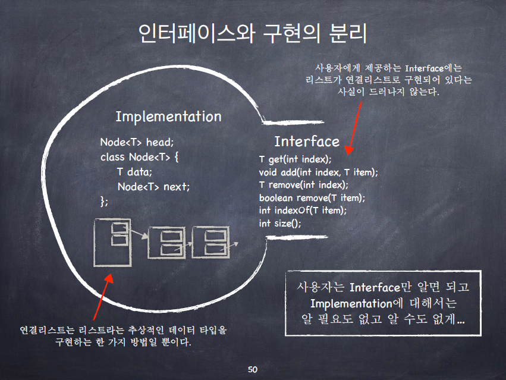
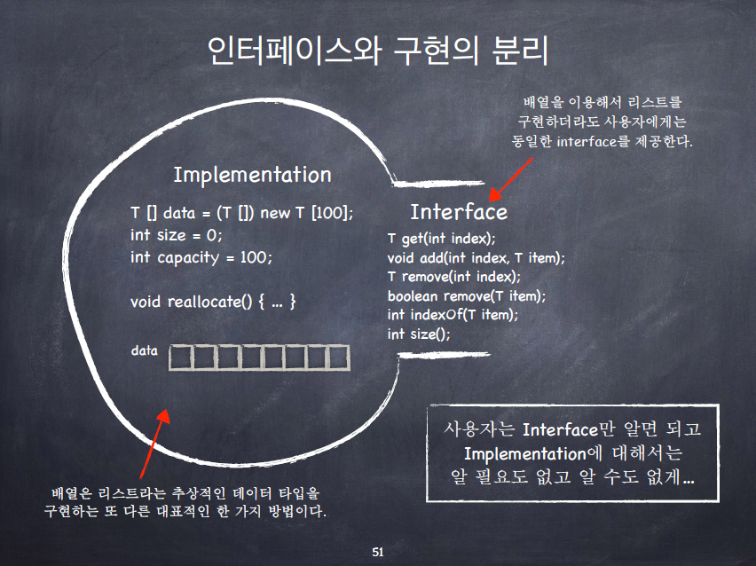
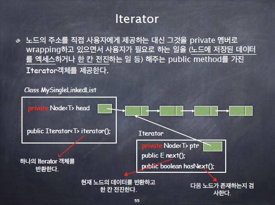

# 연결리스트와 iterator

## Java로 배우는 자료구조

### 객체 지향 프로그래밍

- 중요한 것: 인터페이스(Interface)와 구현(implementation)의 분리
  - Information Hiding
  - Data Encapsulation
  - Abstract Data Type
- 인터페이스와 구현의 분리
  - 연결 리스트는 "리스트"라는 추상적인 데이터 타입을 구현하는 한 가지 방법일 뿐이다. 가령 배열 혹은 ArrayList는 또 다른 구현 방법의 예이다.
  - 사용자는 리스트에 데이터를 삽입, 삭제, 검색할 수 있으면 된다. 그것의 구현에 대해서 세부적으로 알 필요는 없다.
    - 사용자가 필요로 하는 이런 기능들을 public method들로 제공한다. 이 public method들은 가능한 내부 구현과 독립적이어야 한다.
  - 인터페이스와 구현을 분리하면 코드의 모듈성(modularity)가 증가하며, 코드의 유지/보수, 코드의 재사용이 용이해진다.
  - 
  - 


### 연결리스트의 순회: Iterator의 필요성

- ```java
  // 이전에 했던 방식. head와 class Node의 멤버들이 모두 public으로 공개되어야 한다. 이것은 바람직하지 않다!
  Node p = aList.head;
  while (p!=null) {
      String str = p.data;
      // do something with str
      p = p.next;
  }
  ```

- public method 만으로 순회하려면 어떻게 해야할까?

  - ```java
    for (int i=0; i<terms.size(); i++) {
    			Term t = terms.get(i);
    			// do something with t
    }
    ```

  - 이런 식으로 순회해도 되긴하는데... 비효율적이다!

    - 리스트가 ArrayList로 구현되어 있다면.. 이렇게 해도 되지만 만약 리스트가 연결리스트로 구현되어 있다면? 계속 앞에서부터 i 번째 까지 찾아가야하므로 매우 비효율적임.

  - 따라서 이는 Iterator가 필요한 이유가 된다.


### iterator

- 노드의 주소를 직접 사용자에게 제공하는 대신 그것을 private 멤버로 wrapping 하고 있으면서 사용자가 필요로 하는 일을(노드에 저장된 데이터를 엑세스하거나 한 칸 전진하는 일 등) 해주는 public method를 가진 Iterator 객체를 제공한다.
- 
- 객체 안에 이전 Node의 주소값을 저장해놓고 한 칸씩 전진해나가는 것으로 앞에서 보았던 연결리스트 순회에서 생기는 비효율을 해결하는 것이다.
  - 그럼 왜 이전 Node의 값을 private로 설정해서 사용자에게 넘겨주지는 않는가?
    - 그것은 객체 지향 프로그래밍에 따라 인터페이스와 구현을 분리했기 때문이다. Node 객체를 private로 숨겨놓았기 때문에 순회할 때 이전 Node도 숨겨놓을 수 밖에 없다.


### 연결리스트에서의 Iterator

- Iterator는 개념적으로는 연결리스트의 노드와 노드 사이를 가리킨다.
  - 노드와 노드 사이를 가리킨다고 생각해야 next 노드라고 부르는 것이 자연스러워진다. iterator가 노드를 가리킨다고 가정하면.. next 노드라고 하면서 가리키고 있는 셈이 되기 때문에 개념적으로 좀 헷갈려짐.
  - 물론 iterator를 실제로 구현할 때는 현재 가리키고 있는 노드가 next임.
- 초기 상태의 iterator는 첫 번째 노드의 앞 위치를 가리킨다.
- next() 메서드는 한 칸 전진하면서 방금 지나친 노드의 데이터를 반환
- hasNext() 메서드는 다음 노드가 존재하면 true, 그렇지 않으면 false를 반환한다.
- remove() 메서드는 가장 최근에 next() 메서드로 반환한 노드를 삭제한다.
- 단방향 연결리스트로 Iterator를 구현해놓고 순회를 하면서 필요한 메소드들을 만들 수 있다! 하지만.. Iterator 만으로는 약간 매끄럽지 못한 부분들이 있다!
  - 대표적으로 이전 노드의 정보가 필요한 메소드를 만들어야 하는 경우가 있다.
  - addTerm 같은 메소드들..
  - 이럴 땐 4-4 강의에서 나오는 이중연결리스트로 ListIterator를 구현해서 써보자..!
  - 물론 Iterator만으로 이전 노드들을 저장해가면서 약간 복잡하게 코드를 짜면 가능은 하다.


### 예시) MySingleLinkedList의 수정

- Node 클래스를 MySingleLinkedList 클래스의 private inner 클래스로 만든다.
  - MySingleLinkedList 클래스의 외부에서는 Node 클래스를 사용할 수 없게 만든다.
- MySingleLinkedList 클래스의 사용자는 단지 add, get, remove, indexOf, size 등의 public 메서드와 iterator를 통해서만 연결리스트에 접근할 수 있게 만든다.
  - MySingleLinkedList 클래스의 사용자는 이 클래스의 내부 구현에 대해서 아무것도 알 필요가 없다! 심지어는 내부가 연결리스트로 구현되어 있는지 배열로 구현되어 있는지도 알 필요가 없다!
- 이것이 인터페이스와 구현의 분리이다. 객체지향 프로그래밍!

