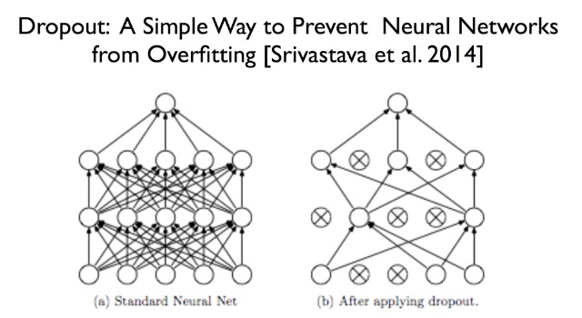
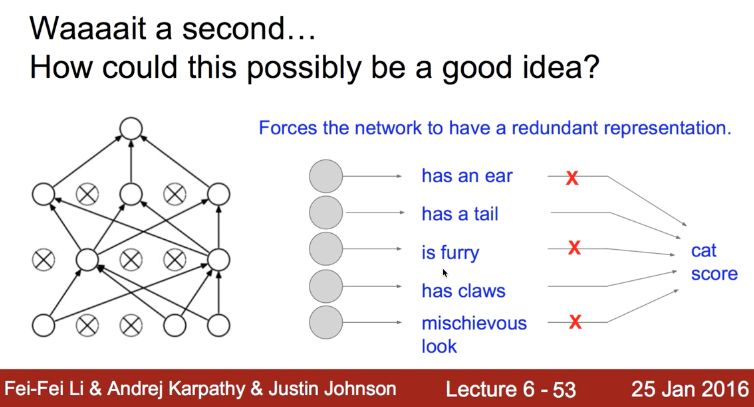
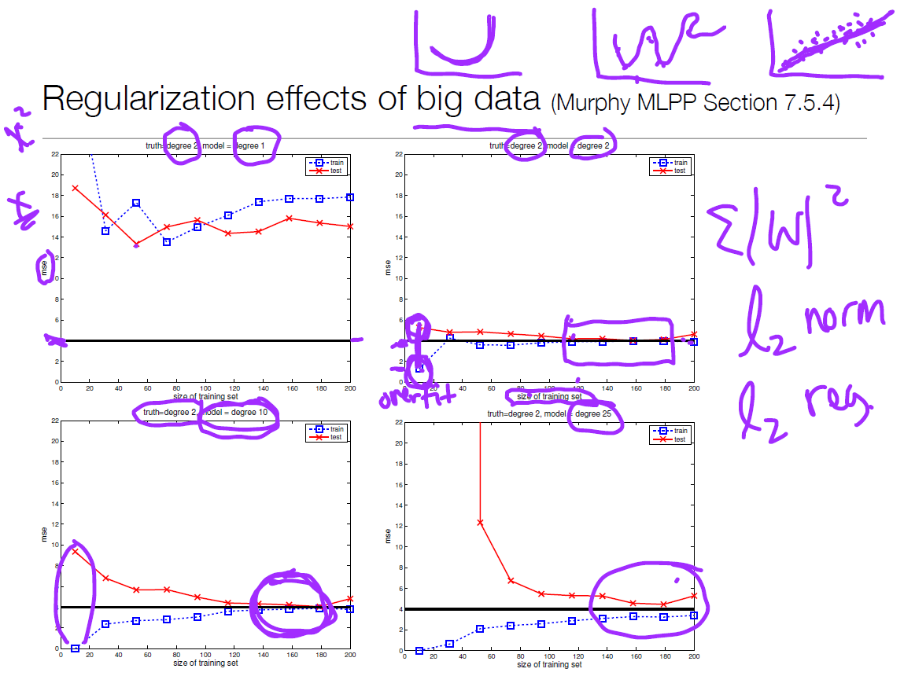
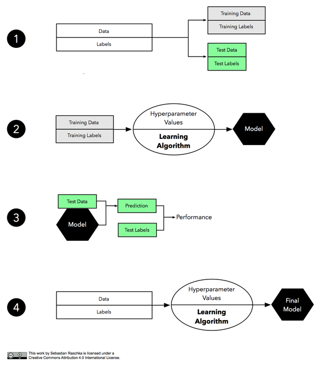
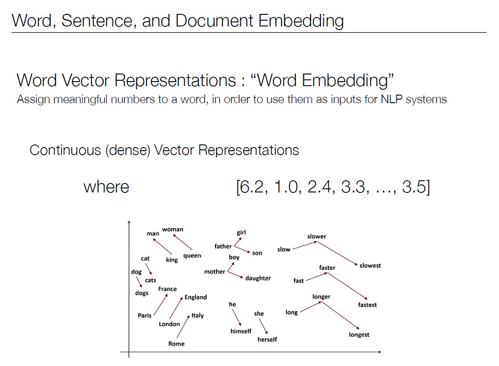
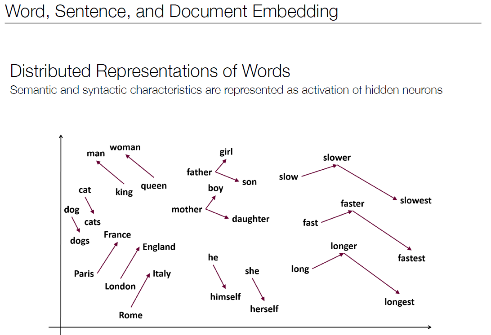
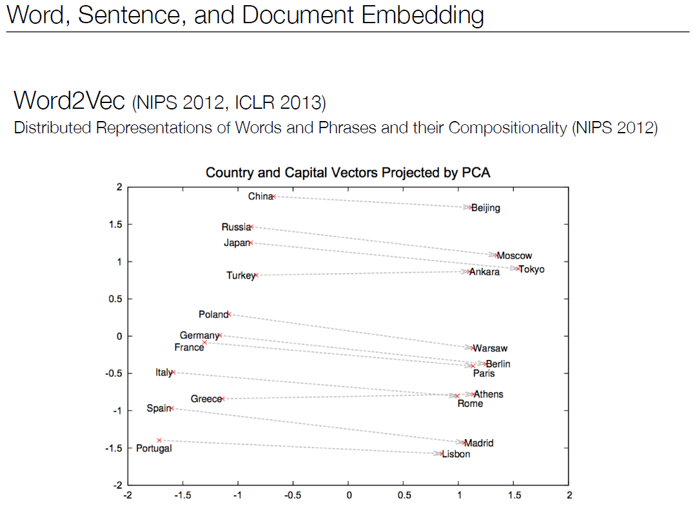
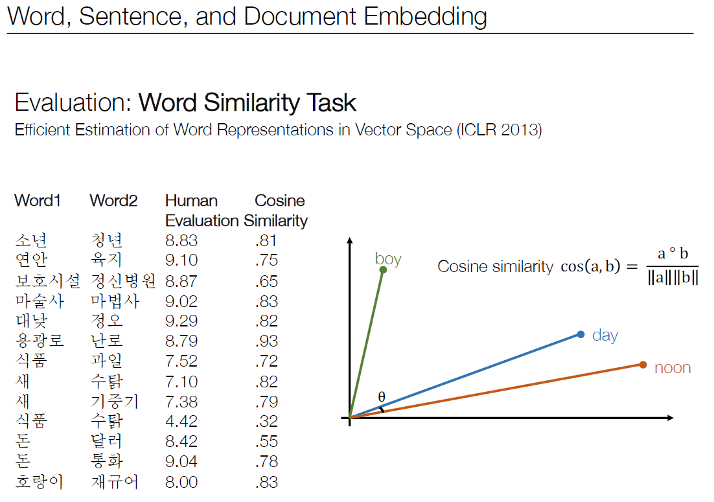
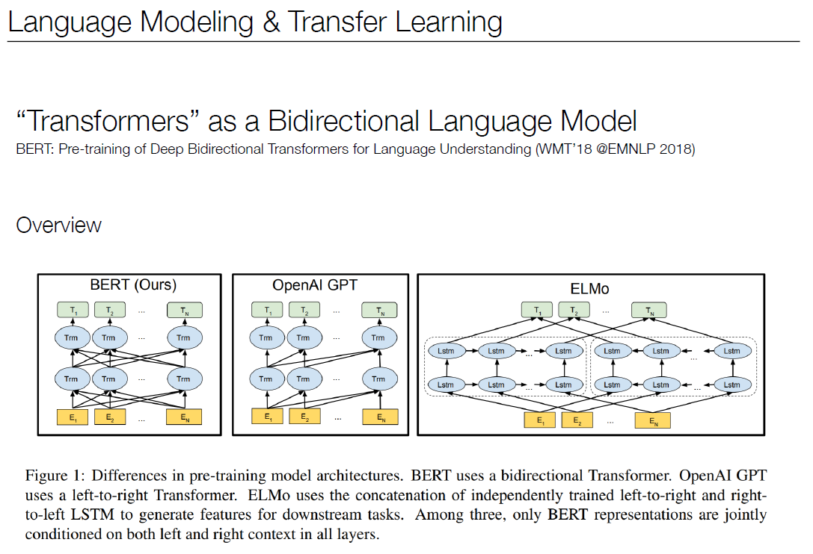

# 20190624 AI/ML 프로젝트 사전 과목

## 1장. Numpy 다루기 > AI/ML 소개 강의 영상

- Machine Learning is one way to analyze, understand, and predict Big Data.
- Machine Learning does not require structured data, while Data Mining Does.
- Machine Learning develops data-dependant solutions to the problems in Artificial Intelligence.
- Machine Learning is deeply rooted in, but expands the practical limitations of Statistics.
- decision tree - 비선형 supervised learning
- representation learning <==> neural network
  - Different Levels of Abstaction(Andrew Ng, Nature 2014)
  - Layer 별로 단계를 나눠서 사람 얼굴을 찾아내는 예시가 실린 논문
  - 예를 들어, Layer 1에서는 픽셀 별로 RGB를 구분 해내고, Layer 2에서는 이 색 정보를 이용해서 선을 찾아내고, Layer 3에서는 선 정보를 이용해서 눈, 코, 귀 등을 찾아내는 식임.
- dropout
  - 
  -   deep learning에서 overfitting을 줄이는 두 번째 방법으로 dropout이 있다. dropout을 사전에서 찾아보면 탈락, 낙오라고 되어 있다. 전체 weight을 계산에 참여시키는 것이 아니라 layer에 포함된 weight 중에서 일부만 참여시키는 것이다. 전혀 동작하지 않을 것 같지만, 굉장히 좋은 성능을 낸다.
  - 
  - 전문가들이 너무 많다고 가정하자. 귀만 판단하는 전문가, 꼬리만 판단하는 전문가 등등 너무 많은 weight이 있다면, 이들 중 일부만 사용해도 충분히 결과를 낼 수 있다. 오히려 이들 중에서 충분할 만큼의 전문가만 선출해서 반복적으로 결과를 낸다면, 오히려 균형 잡힌 훌륭한 결과가 나올 수도 있다.
    한국 속담에 딱 맞는 말이 있다. "사공이 많으면 배가 산으로 간다". 머신러닝을 공부하는 과정에서 많이 듣게 되는 용어가 균형(balance)일 수 있다. 여러 가지 방법 또는 시도를 통한 균형을 잡을 때, 좋은 성능이 난다고 알려져 있다.
  - 출처: <https://pythonkim.tistory.com/42> [파이쿵]
- one shot learning: 딥러닝에서 네트워크를 학습시킬 때, 매우 많은 트레이닝 데이터가 필요합니다. 이러한 단점을 극복하여 한 레이블 당 하나의 이미지만 있어도 분류할 수 있게 학습시키는게 one-shot learning입니다.
  - 출처: [https://jayhey.github.io/deep%20learning/2018/02/06/saimese_network/](https://jayhey.github.io/deep learning/2018/02/06/saimese_network/)

## 2장. Linear Regression 이해하기 > Linear Regression 강의 영상

- Residual Sum of Squares(RSS)
  - 예측된 값과 실제 y 값과의 차이가 적은 모델을 택해보겠다
  - 예측된 Y값과 실제 Y값의 차이를 줄이는 Weight(가중치)를 찾는 방법입니다.
- Ridge Regression
  - Linear Regression에 L2 regularization을 사용하는 방법으로 모델의 복잡도를 줄여서 좀 더 간단하고 부드러운 모델로 만들때 사용합니다.
  - **정규화 (Regularization):** W(weight)가 너무 큰 값들을 갖지 않도록 하여 모델의 복잡도를 낮추는 방법입니다. 
  - ridge: 산등성이, 산마루
  - overfitting 극복하기 위해 regularization 하는 방법.
  - weight가 너무 크면 좋지 않다. 다른 관측값이 들어왔을 때, 부정확해질 수 있기 때문이다.
  - 따라서 weight가 큰 요소에 대해 1보다 작은 람다 값을 곱해서 페널티를 준다!
- 
  - 데이터 갯수가 깡패다
  - 빨간선과 파란선의 차이가 많이 날 수록 overfitting 되었다는 뜻이다.(모델이 좋지 않다는 뜻) 그러나 데이터가 많아지면 이 모델로도 극복되는 모습을 볼 수 있다.

## 3장. Naive Bayes 이해하기 > Naive Bayes 강의 영상

- intuitive 모델
- **나이브베이즈 알고리즘(Naive Bayes Algorithm):** 확률 및 통계를 기반하는 베이즈 정리를 적용한 알고리즘입니다. 분류 문제의 가장 기본적인 알고리즘으로 간주됩니다.
- feature: 어떤 요소를 수로 표현해놓은 것. 그 이후 이 수에 대해 학습시킨다.
- **조건부확률표(CPT, Conditional Probability Table) :** 다른 변수와 관련된 단일 변수의 조건부 확률을 표시하기 위한 변수들의 집합입니다.
- **스무싱(Smoothing):** 통계 및 이미지 처리에서 데이터 세트를 매끄럽게 해주는 방법입니다. 노이즈나 급격한 구간에 대한 현상은 배제하고 데이터에서 중요한 패턴을 포착해여 근사 함수를 만들어줍니다.
- Bayes rule lets us do diagnostic queries with conditional probabilities
- The naive Bayes assumption takes all features to be independent given the class label
- We can build classfiers out of a naive Bayes model using training data
- Smoothing estimates is important in real systems
- ①Parameter란 무엇인가??
  - => Parameter는 모델 내부에서 확인이 가능한 변수라고 할 수 있다. 즉, 데이터를 통해서 산출이 가능한 값이다. Parameter의 특징은 다음과 같다.
    - ⓐ예측을 수행할 때, 모델에 의해 요구되어지는 값들이다.(R유저라면 바로 이해가 됐을 것이다. 그렇다! 바로 머신러닝 함수들 뒤에 입력되는 인자들! 그것이 Parameter다.)
    - ⓑParameter가 모델의 능력을 결정한다.
    - ⓒParameter는 측정되거나 데이터로부터 학습되어진다.
    - ⓓ주로 예측자에의해 수작업으로 측정되지 않는다.
    - ⓔ학습된 모델의 일부로 저장되어진다.
  - Parameter들은 머신러닝 알고리즘에 있어서 중요한 역할을 한다. 이것은 training(훈련 데이터)으로 부터 학습된 모델의 한 부분이라고 할 수 있다.
  - 모델의 parameter들은 알고리즘 최적화 과정에서 결정된다.
    - 통계학 관점 : 통계학에서는 가우시안과 같은 거리 측정을 이용해 변수들의 분포를 살펴볼 것이다. 가우시안에서 중요한 두 개의 parameter는 평균(mean)과 표준편차(standard deviation)다. 이것은 머신러닝에서 결정되는데, 특히 예측 모델이나 데이터에서 산출된다.
    - 프로그래밍 관점 : 프로그래밍에서는 아마도 parameter를 그냥 통과할 수 있다. 이 경우, parameter는 일정 범위를 가지는 함수라고 할 수 있다. 머신러닝에서는 특정 모델을 위해 사용하는 함수는 새로운 데이터를 예측하기 위해 parameter들을 요구할 것이다.
    - Parameter의 예는 다음과 같다.
      - 1.인공신경망에서의 가중치
      - 2.SVM(서포트 벡터 머신)에서의 서포트 벡터
      - 3.선형회귀나 로지스틱회귀분석에서의 결정계수.
  - 출처: <https://blog.naver.com/tjdudwo93/221067763334>

- ②Hyperparameter란 무엇인가?

  - => Hyperparameter는 모델에서 외적인 요소라고 할 수 있다. 즉, 데이터 분석을 통해 얻어지는 값이 아니다. Hyperparameter는 다음과 같은 특징을 가지고 있다.

    - ⓐ모델의 parameter값을 측정하기 위해 알고리즘 구현 과정에서 사용된다.
    - ⓑHyperparameter는 주로 알고리즘 사용자에 의해 정해진다.
    - ⓒ경험에 의해 정해지기도 한다. 즉, 알고리즘을 여러 번 수행해보면서 최적의 값을(어떻게 보면 최적의 범위)직감적으로 알게된다.
    - ⓓ예측 알고리즘 모델링의 문제점을 위해 조절된다.

  - 위의 특징들만 보더라도 Hyperparameter가 절대적으로 Best한 값은 존재하지 않는다는 것을 알 수 있다. 절대적 Best값은 존재하지 않지만, 모델링 경험으로 현 상황에서 Proper한 값은 찾아낼 수 있을 것이다. 이것을 가능하게 하는 것이 바로 Grid Search와 random Search다.

  - 내가 가장 아끼는 책이자 세계에서 유명한 Best seller인 "Applied Predictive Modeling"이란 책에 이런 말이 있다.

  - > "Many models have important parameters which cannot be directly estimated from the data. For example, in the K-nearest neighbor classification model … This type of model parameter is referred to as a tuning parameter because there is no analytical formula available to calculate an appropriate value."

  - Hyperparameter의 예는 다음과 같다.
    - 1.신경망 학습에서 learning rate(학습률)
    - 2.SVM(서포트 벡터 머신)에서의 코스트 값인 C.
    - 3.KNN에서의 K의 개수.
  - 출처: <https://blog.naver.com/tjdudwo93/221067763334>

- hold-out
  - 홀드아웃 방법은 아주 단순한 모델 평가 방법입니다. 레이블된 데이터셋을 훈련 세트와 테스트 세트 두 부분으로 나눕니다. 그런 다음 훈련 데이터에서 모델을 학습시키고 테스트 세트의 레이블을 예측합니다. 정확한 예측의 비율이 예측 정확도에 대한 추정치가 됩니다. 물론 예측하는 동안 테스트 레이블은 감추어져 있습니다. 우리는 같은 훈련 데이터셋으로 모델을 훈련하고 평가하고 싶지 않습니다(이를 재치환 평가(resubstitution evaluation)라고 부릅니다). 왜냐하면 과대적합(overfitting)으로 인해 편향이 매우 감소하기 때문입니다. 다른 말로하면 모델이 단순히 훈련 데이터를 모두 외워버린게 아닌지 또는 새로 처음 본 데이터에 잘 일반화 되었는지를 말할 수 없습니다.(다시말해 훈련 정확도와 테스트 정확도의 차이인 편향을 낙관적으로 추정하게 됩니다)
  - 출처: [https://tensorflow.blog/%eb%a8%b8%ec%8b%a0-%eb%9f%ac%eb%8b%9d%ec%9d%98-%eb%aa%a8%eb%8d%b8-%ed%8f%89%ea%b0%80%ec%99%80-%eb%aa%a8%eb%8d%b8-%ec%84%a0%ed%83%9d-%ec%95%8c%ea%b3%a0%eb%a6%ac%ec%a6%98-%ec%84%a0%ed%83%9d-1/](https://tensorflow.blog/머신-러닝의-모델-평가와-모델-선택-알고리즘-선택-1/)
- 
  - 출처: [https://tensorflow.blog/%eb%a8%b8%ec%8b%a0-%eb%9f%ac%eb%8b%9d%ec%9d%98-%eb%aa%a8%eb%8d%b8-%ed%8f%89%ea%b0%80%ec%99%80-%eb%aa%a8%eb%8d%b8-%ec%84%a0%ed%83%9d-%ec%95%8c%ea%b3%a0%eb%a6%ac%ec%a6%98-%ec%84%a0%ed%83%9d-1/](https://tensorflow.blog/머신-러닝의-모델-평가와-모델-선택-알고리즘-선택-1/)

## 4장. Neural Network 및 NLP 이해하기 > Deep Natural Language Processing 강의 영상

- 

  - 
  - 비슷한 느낌으로 변화하는 애들은 벡터 방향과 크기를 같게 표현한다는 말. 이 그림은 2차원으로 축소해서 보여주는 것. 실제로는 더 많은 dimension 으로 단어를 표현한다.

- Distributional Hypothesis

  - > "Words that occur in the same contexts tend to have similar meanings."

  -  문맥을 보면 어떤 단어가 올지 유추 가능하다는 말

  - ex) (puppy, kitten, husky, baby ...) is cute.

- Word2Vec: word vector를 실제로 구현하고 학습한 것 중에 제일 유명한 것

  - 

- word vector의 유사도를 어떻게 판단하나?

  - 내적을 활용해서 cosine similarity를 이용한다!
  - 

- 단순 word embedding은 문제점이 있다. 새로운 단어에 대응하는 것, 같은 어근에서 변형된 단어를 모두 다른 단어로 인식하는 것, 문맥을 고려하지 않는 것 등.

  - 그래서 subword information을 이용하는 등의 방법을 쓰기도 한다.
  - 요즘에는 ELMo, Bert를 쓴다고 한다(Contextualized Word Embedding)

- BERT는 **B**idirectional **E**ncoder **R**epresentations from **T**ransformers의 약자로 올 10월에 논문이 공개됐고, 11월에 오픈소스로 코드까지 공개된 구글의 새로운 Language Representation Model 이다.

- 

