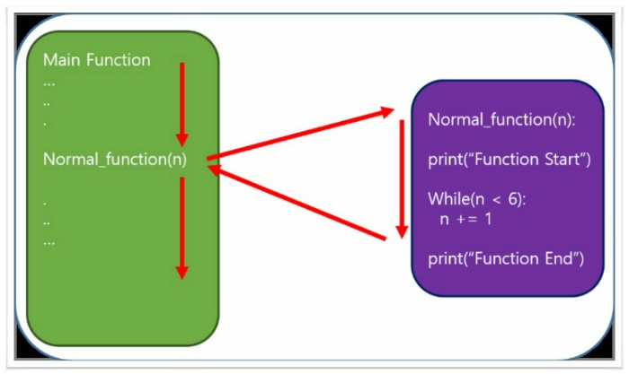
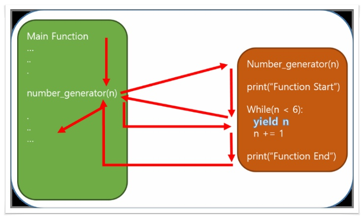

# 20190108

## 수업

- bash 명령어 단축 설정
  - home 위치에서, `$ touch .bashrc` 로 파일 생성!(bash run command)
  - vim으로 이 파일안에 들어가서 `$ alias 'jn'='jupyter notebook'` 입력! 띄어쓰기 이거랑 똑같이 해야함! 띄어서 쓰면 안됨!
- 컴퓨터 home 주소에 있는 `.gitconfig` 폴더는 global 옵션을 주는 곳이다.
- git is not github
  - 다른 remote repository 써도 됨!
- bash에서 `$ code`입력하면 vscode 바로 실행됨. `$ code .`입력하면 그 폴더에서 바로 실행!
- 


## 수업 이외

- 크롬 확장프로그램 만들기 알아보기

- 컴터끄기 전에 확인 창 만드는 프로그램

- 해시 함수 자세히 알아보기

  - 역 해시 함수도

- Big O notation log 의미

  - log 정의 : 지수함수의 역. 주어진 상수 b와 같게 만드는 주어진 상수 a의 지수.

  - 알고리즘 시간복잡도에 이게 왜나옴?

  - 지수 함수 관계가 등장하는 알고리즘이 있기때문이다. 이진 탐색(어떤 배열에서, 원하는 수를 찾기 위해 반씩 쪼개서 찾는 알고리즘)

  - $$
    이\, 알고리즘에서\, 다음과\, 같은\, 관계가\, 성립한다.\\
    
    2^0 = 1\\
    
    2^1 = 2\\
    
    2^2 = 4\\
    
    2^3 = 8\\
    
    2^4 = 16\\
    
    ...\\
    
    2^x = N\\
    $$

  - 인풋 자료 크기 N과 해결에 필요한 쪼개기 수 x는 이렇게 2를 밑으로 하는 로그 함수 관계이므로, 이진 탐색과 같은 알고리즘의 시간복잡도는 $logN$으로 표현된다.

- python의 반복문은 다른 언어와 다르다.

  - range를 사용한다.
  - for문이 다른 언어의 foreach와 비슷하다.
  - 과거 python2에서는 xrange라는 것이 있어서 range는 type이 list이고 xrange는 iterator object였다.
  - python3은 xrange없고 다 range로 씀.
  - 반복문 실행할 때 list를 써버리면 메모리가 꽉차버림. list는 메모리에 다 올리기 때문에.
  - 그래서 iterator를 쓰는 것이다.

- python의 yield 키워드

  - yield : 넘겨주다, 양도하다

  - 뜻 그대로 이런 역할을 하는 키워드이다.

  - 함수에서 return 대신에 쓰인다.

  - 이 때, 함수는 generator function이라고 부른다. 이에 대비하여 다른 함수들은 normal function이라고 부른다.

  - generator funtion은 그 return 값으로 iterator를 반환한다.

  - generator function은 실행 중 yield를 만날 경우, 이 함수는 그 상태로 정지되며, 반환 값을 호출한 쪽으로 전달한다. 이 함수는 다른 함수들과 다르게 이 상태로 유지된다. 그리고 호출이 끝날 때까지 왔다갔다 하며 실행된다.

  - 기본 예제

  - ```python
    #python 3 version source
    #yield generator test source
    #yield_Basic_Test.py
    
    
     
    def number_generator(n):
        print("Function Start")
        while n < 6:
            yield n
            n += 1
        print("Function End")
         
    if __name__ == "__main__":
        for i in number_generator(0):
            print(i)
    ```

  - ```python
    #결과
    Function
    0
    1
    2
    3
    4
    5
    Function End
    ```

  - normal function의 흐름

  - 

  - generator function의 흐름

  - 

  - 출처: https://kkamikoon.tistory.com/90 [컴퓨터를 다루다]

- 

