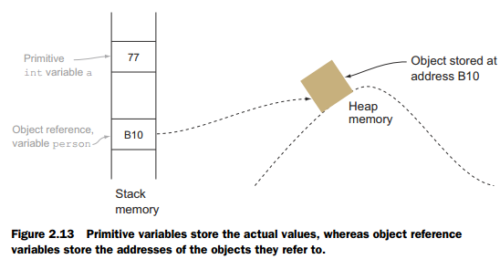
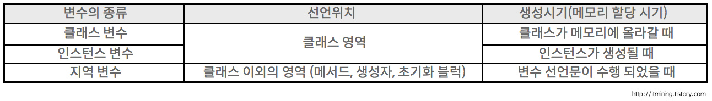
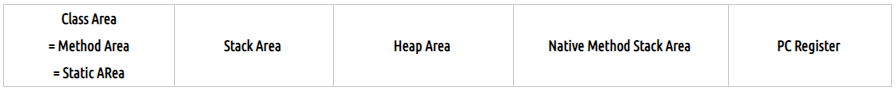
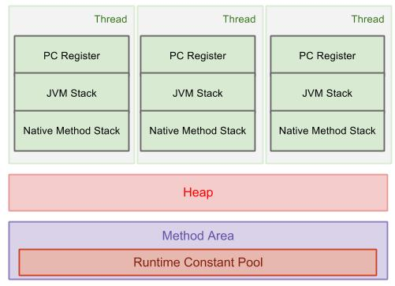

# 20190110 OOP

## 수업

- hangman
  - 필요한 부분들을 함수화 해서 사용하자!
- class와 객체(instance)
  - class : 개념
  - 객체(instance) : (컴퓨터 저장 공간에서 할당된) 실체
  - 객체와 instance는 다르다고 하셨지만 나중에 설명해주신다 함.
- OOP의 시작
  - 기존의 프로그래밍 언어로는 현실을 그대로 표현하기 어려웠음. 사람을 바꾸는 거 말고 프로그래밍 언어를 바꿔야 되지 않을까?
  - OOP는 현실 세계의 개념을 컴퓨터 안에 넣기 위해 시작되었고 OOP 언어들이 나오게 됨.
  - 자료 구조, 함수, 구조체로 이루어진 C 언어로는 어색함.
- method화 할 것과 그냥 단순히 함수화 할 것 따로임. class에 꼭 필요하거나 특수한 행동이라면 method화 하는 게 좋지만 안그러면 함수화 하는 것으로 충분할 것같다.


## 수업 이외

- UTF-8, UTF-8(BOM) 차이

  - BOM(Byte Order Mark)
  - 문서 앞 쪽에 mark를 남겨서 어떤 방식으로 인코딩되었는지 판별하기 위한 것.
  - 근데 UTF-8 에서는 필수 요건은 아니다. UTF-16, UTF-32 같은 경우에는 Big Endian, Little Endian과 같은 종류가 있어서 구분할 필요성이 있지만 UTF-8은 저런 Endian 구분이 없기 때문이다.
  - 문제가 되는 지점은 다음과 같다. 유닉스나 리눅스에서는 UTF-8에 BOM을 사용하지 않는데, 윈도우는 기본값으로 이 BOM을 남기기 때문에 인식이 잘 안되는 경우가 생긴다.
  - 따라서, 윈도우 환경에서 BOM 안남기는 것으로 편집기 설정을 잘 해두고 시작하는 것이 좋다.

- UTF- 8, UTF- 16, UTF-32 차이점

  -   UTF-16, UTF-8, UTF-32 공히 유니코드/ISO 10646이라는 문자 집합(모두 1048576자 + 65536자 - 2048자를 표현 가능)을 표현하는 방법입니다. 따라서, 어느 것을 써도 표현할 수 있는 글자의 수와 종류는 **완전히 동일**합니다. UTF-8은 글자에 따라 1, 2, 3, 4 바이트로 나타내는데 반해, UTF-16은 글자에 따라 2바이트 (Basicl ultilingual Plane이라고 불리우는 유니코드 첫 부분에 있는 약 65,536자 - 엄밀히 말하면 이보다 작습니다만-는 2바이트) 혹은 4바이트(나머지 약 100만 글자)로 나타냅니다. UTF-32는 모든 글자를 4바이트로 나타내고요. 
  -    HTML, XML 등 마크업 문서에서는 US-ASCII에 속하는 글자들이(UTF-8에서는 한 바이트지만, UTF-16에서는 2 바이트) 많이 쓰이기 때문에, UTF-8을 쓴 한글 마크업 파일과 UTF-16을 쓴 한글 마크업 파일 사이에 크기 차이가 많이 나지 않습니다. 물론, 전송량을 줄이는데 절대적으로 중요한 경우에는 조그만 차이도 중요할 수 있으므로 UTF-16을 쓰기로 결정할 수도 있습니다.
  -    대개 UTF-16이나 UTF-32는 OS 내부나 API, DB 등에서 유니코드 데이터를 다룰 때 많이 쓰고 (Java, Windows 32 API, Mac OS X 등이 UTF-16을 내부적으로 쓰고, glibc, Python은 UTF-32를 씁니다.), 외부와 소통을 할 때에는 US-ASCII와 호환성이 있다는 장점 때문에 UTF-8을 많이 씁니다.
  -   출처 : http://forums.mozilla.or.kr/viewtopic.php?t=5149

- 구조체란?

- java, python 자료형 class 문제? 정리하자
  - python에서 isclass하면 int도 클래스임.. 자바는 다른가?
  - 자바와는 다르다.
  - No. There is no distinction between primitive types and object/reference types like in Java. Everything is an object in Python. Lists, tuples, and dictionaries are objects. They are also containers. You can also call them data structures.
  - [출처] https://www.reddit.com/r/learnprogramming/comments/6anv76/python_primitive_data_types/

- python에서 class 없이 함수만들거나 할 때는 self 안썼는데.. class 안에 함수 만들 때는 항상 self가 들어가야 한다.
  - 걍 쉽게 생각하면.. 나 혼자 있을 때는 굳이 자기 자신을 가리키는 말이 필요 없었지만  class라는 개념을 들여오면서 등장인물이 많아지니까 자기 자신을 가리키는 말이 필요해져서 self를 쓰게 되었다 이렇게 이해하면 편할 듯.
  - 자바에서는 this를 굳이 명시하지는 않는 듯. 용도는 똑같은 거 같다.

- 클래스, 객체, 인스턴스의 개념 정리하기

  - 클래스 : Class is a “template” / “blueprint” that is used to create objects. Basically, a class will consists of field, static field, method, static method and constructor. 객체를 만드는 청사진 혹은 설계도.
  - 객체 : Real world objects shares 2 main characteristics, state and behavior. 상태와 동작을 가진 **실제 세계**의 물체.
  - 인스턴스 : An instance is a unique copy of a Class that representing an Object. When a new instance of a class is created, the JVM will allocate a room of memory for that class instance. 클래스라는 설계도로 객체를 메모리에 구현한 실체.
  - 헷갈림의 시작 : 클래스와 객체의 관계
    - OOP에서 object라는 용어의 추상적, 철학적 의미와 실제 구현물(JAVA, C++ 등..)에서의 object 용어의 헷갈림. + Everything is an object라는 말.
      - 자바에는 모든 클래스의 최상위 **클래스**인 Object라는 클래스가 있다. class라는 클래스도 Object 클래스를 상속받는다.
      - 따라서, JAVA에서는 객체가 클래스를 포함하는 개념이라는 글을 봤다. JAVA에서는 그렇게 구현되어 있다는 것이고 개념적인 얘기는 하지 않았는데 나는 개념적으로 클래스가 객체를 포함하는 개념이라는 말로 오해를 해버림.
      - 또한 Everything is an object라는 말이 이에 대한 근거라고 생각을 해버림.. 이 때의 object는 개념적, 철학적인 말인데. 그래서 클래스라는 **설계도** 역시 객체에 포함되니까 클래스도 객체다 라고 이해를 함. 지금 개념 정리를 한 입장에서, 이 생각은 틀린 말이 아니라고 생각하지만, 저 당시에는 일차원적으로만 생각했음. 클래스도 객체인데 클래스가 객체를 만드는 설계도라는 개념이 너무 이상했음. 근데 지금은 사실 저 말이 현실을 표현하는 것이라고 이해했음. 현실에서도 사람이라는 물질이, 혹은 기계라는 물질이 새로운 물질을 만들고, 또 다시 어떤 물질이 사람 혹은 기계도 만들고 이런식으로 서로 돌고 도니까. 저렇게 오해하는 과정에서 최초의 물질은 어디서 왔냐? 이런식의 생각까지 가버림. 빅뱅같은 거.
      - 이러한 OOP의 생각을 실제로 각자 다른 방식으로 구현한 것이 JAVA, C++, Smalltalk 등의 객체 지향 언어인 것이다.
      - 당연히 언어마다 약간씩 구현해놓은 것이 다르다.
      - JAVA에서는 primitive를 사용하는데, 어떤 언어에서는 그건 진짜 객체 지향이 아니라고 주장하면서 모든 자료형을 object 식으로 구현한다. ruby나 python이 그러하다. 하지만 모두 객체 지향적인 언어이다. 객체지향적인 철학, 생각이 담겨 있는 거니까! 그러한 생각을 언어마다 다르게 표현할 수 있는거니까. 
  - [출처] https://stackoverflow.com/questions/14752948/is-class-a-object-in-object-oriented-language 헷갈림의 시작
  - [출처 ]https://dzone.com/articles/is-everything-an-object 용어에 대해 내가 오해하고 있다는 것 깨달음.
  - [출처] https://www.geeksforgeeks.org/classes-objects-java/ 개념 정리
  - [출처] https://alfredjava.wordpress.com/2008/07/08/class-vs-object-vs-instance/ 개념 정리

- python 생성자(constructor), 초기화자(initializer), 할당자(allocator) 정리하자
  - Foo라는 class가 있다고 하면,
  - Foo() 는 생성자(constructor)???
  - [출처] https://stackoverflow.com/questions/6578487/init-as-a-constructor
  - [출처] https://suwoni-codelab.com/python%20%EA%B8%B0%EB%B3%B8/2018/03/08/Python-Basic-class/

- java에서 primitive type과 referrence type의 메모리 및 처리 차이점?
  - What's the difference between primitive and reference types?
    - Just as men and women are fundamentally different (according to John Gray, author of Men Are from Mars, Women Are from Venus), primitive variables and object reference variables differ from each other in multiple ways. **The basic difference is that primitive variables store the actual values, whereas reference variables store the addresses of the objects they refer to.** Let’s assume that a class Person is already defined. If you create an int variable a, and an object reference variable person, they will store their values in memory as shown in figure 2.13.
    - 
    - [출처] https://stackoverflow.com/questions/8790809/whats-the-difference-between-primitive-and-reference-types

- [자바] 선언 위치에 따른 변수의 종류(클래스 변수, 인스턴스 변수, 지역 변수) + 변수와 메모리 구조

  - ```java
    public class test {
        int iv; // 인스턴스 변수
        static int cv; // 클래스 변수
        void method() {
            int lv; // 지역 변수
        }
    }
    
    ```

  - 위의 그림에는 모두 3개의 int 형 변수가 선언되어 있는데, iv와 cv는 클래스 내부에 선언되어 있으므로 멤버 변수입니다. 그 중 cv는 static으로 선언되었으니 클래스 변수이고, iv는 인스턴스 변수입니다. lv는 메서드 내에 선언 되어 있으므로 지역 변수 입니다.

  - 

    - 클래스 변수
      - 클래스 변수는 인스턴스 변수에 static만 붙여주면 됩니다. 인스턴스 변수는 각각 고유한 값을 가지지만 클래스 변수는 모든 인스턴스가 공통된 값을 공유하게 됩니다. 한 클래스의 모든 인스턴스들이 공통적인 값을 가져야할 때 클래스 변수로 선언합니다. 클래스가 로딩될 때 생성되어(그러므로 메모리에 딱 한번만 올라갑니다.) 종료 될 때 까지 유지되는 클래스 변수는 public 을 붙이면 같은 프로그램 내에서 어디서든 접근할 수 있는 전역 변수가 됩니다. 또한 인스턴스 변수의 접근법과 다르게 인스턴스를 생성하지 않고 클래스이름.클래스변수명 을 통해서 접근할 수 있습니다.
    - 인스턴스 변수
      - 인스턴스 변수는 인스턴스가 생성될 때 생성됩니다. 그렇기 때문에 인스턴스 변수의 값을 읽어오거나 저장하려면 인스턴스를 먼저 생성해야합니다. 인스턴스 별로 다른 값을 가질 수 있으므로, 각각의 인스턴스마다 고유의 값을 가져야할 때는 인스턴스 변수로 선언합니다.
    - 지역 변수
      - 메서드 내에서 선언되며 메서드 내에서만 사용할 수 있는 변수입니다. 메서드가 실행될 때 메모리를 할당 받으며 메서드가 끝나면 소멸되어 사용할 수 없게 됩니다.

  - 메모리 구조

    - 

    - 

      - 자바 프로그램의 실행과정
        - 자바 프로그램은 main 메소드에서부터 시작한다. main()메서드가 실핼될 때 메모리에서는 어떤 일이 일어날까?
        - 일단 JRE는 프로그램 안에 main()메서드가 있는지 확인한다. main()메서드의 존재가 확인되면 JVM에 전원을 넣어 부팅하고 프로그램 실행을 위한 사전 준비에 들어간다. 부팅된 JVM은 목적 파일을 받아 그 목적 파일을 실행한다. JVM은 가장 먼저 java.lang 패키지를 스태틱 영역에 가져다 놓는다.
        - 다음으로 개발자가 작성한 모든 클래스(^)와 import package 역시 스태틱 영역에 가져다 놓는다.(loading) 사실 클래스와 클래스에서 import한 package들은 main() 메소드에서 클래스를 사용할 때( new 키워드를 통한 인스턴스 생성, static 메소드 호출 등) 스태틱 영역에 로드된다. 여기까지가 JVM이 수행하는 전처리 과정이다.
        - 그리고 main 메서드를 만났다. 이 main() 메서드가 실행되기 위해 스택 영역에 스택 프레임을 할당한다. 이 스택 프레임은 메서드를 구현하기 위해 작성한 여는 중괄호를 만날 때마다 하나씩 생기는 것이다. 그리고 넘겨져 들어온 인자를 저장하기 위해 스택 프레임 맨 밑에 확보한다. 그리고 메소드 구현부에 해당하는 작업을 모두 마치고 닫는 중괄호를 만나면 스택 프레임을 소멸시킨다.
        - main()메서드는 프로그램의 시작점이자 끝이다. main() 메서드가 끝이 나면 JVM을 종료하고 JRE자체도 운영체제 상의 메모리에서 사라진다.

      1. 메소드 영역(Method Area = Class Area = Static Area)
         - 클래스 파일의 바이트 코드가 로드되는 곳.
         - **클래스 멤버 변수**는 스태틱 영역에 위치한다. JVM에 의해 클래스가 로딩될 때 함께 로딩되며 한 번 자리를 잡으면 JVM이 종료될 때까지 고정된 상태로 위치한다. 멤버 변수 앞에 static keyword가 붙게 되면 클래스 멤버 속성이 된다.
         - *자바의 객체 멤버 메서드는 어디에 위치하는가?*
           - 객체 멤버 변수와는 달리 메서드는 한 번 로딩되면 인스턴스 모두가 공유하는 코드가 된다. 즉, 인스턴스에 따라 상태가 변화하지 않는다. 그렇기 때문에 static 영역에 로딩된다.
      2. 힙 영역(Heap Area)
         - **객체 멤버 변수(인스턴스 멤버 변수)**는 힙에 위치한다. 객체 멤버 변수들은 GC에 의해 메모리 회수가 이루어지기 전까지 객체와 함께 존재한다. 
      3. 스택 영역(Stack Area)
         - **지역 변수**는 스택 영역에서 일생을 보낸다. 스택 영역 안에서도 스택 프레임 안에 존재한다. 따라서 스택 프레임이 사라지면 함께 사라진다.

  - [출처] http://itmining.tistory.com/20

  - [출처] http://asfirstalways.tistory.com/329

  - [출처] https://www.programcreek.com/2013/04/jvm-run-time-data-areas/

- 내일 해야할 것 순서
  - 1. python 생성자 이슈 정리
    2. 구조체가 뭔지 정리