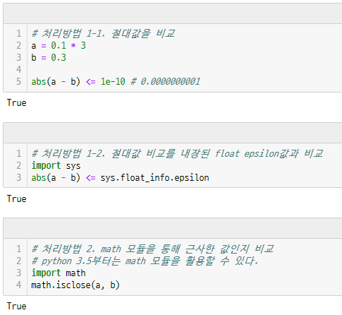
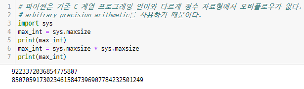
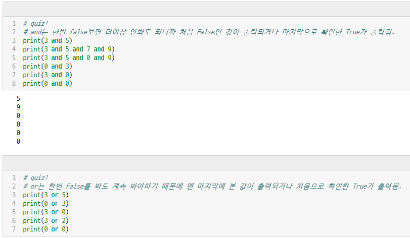
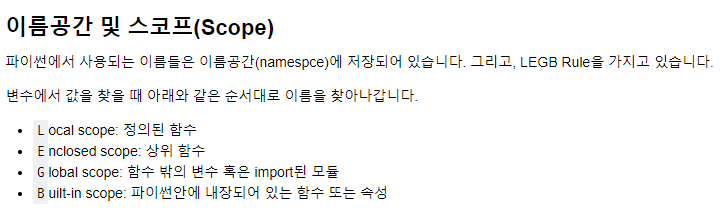
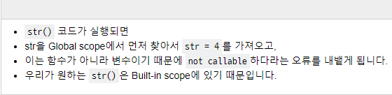
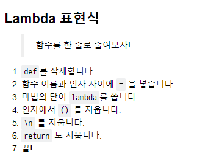
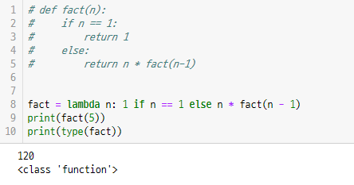
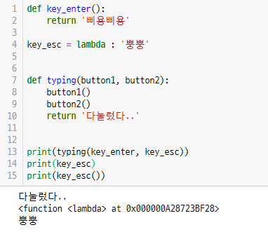

# 20190120 python 시험 관련 참고 사항

- 실수 비교

  - 

- int maxsize

  - 

- and, or

  - 

- scope

  - 
  - 

- lambda

  - 
  - 
  - 

- comprehension, 삼항연산자

  - 둘이 비슷하게 생겨서 문법 헷갈림.

  - 밑에서 1~5번은 comprehension 식 문법이 적용되고 6번은 삼항연산자 식 문법 적용. 즉, if만 쓰면 맨 뒤에 if를 쓰고, if/else 함께 쓰면 앞에 먼저 쓰고 for를 뒤에 쓴다.

  - ```python
    # 1
    even_list = [even for even in range(11) if even % 2 == 0]
    print(even_list)
    
    # 2
    cubic_list = [x ** 3 for x in range(1, 11)]
    print(cubic_list)
    
    # 3
    girls = ['jane', 'iu', 'mary']
    boys = ['justin', 'david', 'kim']
    
    pair = [(boy, girl) for boy in boys for girl in girls]
    print(pair)
    
    # 4
    pytha = [(x, y, z) for x in range(1, 50) for y in range(x, 50) for z in range(y, 50) if (x**2 + y**2 == z**2) ]
    print(pytha)
    
    # 5
    words = 'Life is too short, you need python'
    vowels = 'aeiouAEIOU'
    result = [x for x in words if x not in vowels]
    print(''.join(result))
    
    # 6
    dusts = {
        'seoul': 103,
        'kyungki': 79,
        'daejeon': 36,
        'beijing': 500
    }
    bad_dust = { city: 'bad' if dust > 80 else 'not bad' for city, dust in dusts.items()}
    print(bad_dust)
    ```

- map()
  - iterable한 객체의 원소들에 function을 적용한 후, 그 결과를 돌려준다.

  - 결과값을 map object 형태로 돌려주므로, 형변환이 필요하다.

  - (ex)

  - ```python
    # 1
    l = input('띄어쓰기로 숫자 입력: ')
    strings = l.split(' ')
    map_object = map(int, strings)
    r = list(map_object)
    print(r)
    
    # 2
    def cube(n):
        return n ** 3
    
    
    print(cube(3))
    
    n = [1, 2, 3]
    cubic_n = list(map(cube, n))
    
    print(cubic_n)
    
    # 3
    num = [1,2,3,4]
    r = ''.join(map(str ,num))
    print(r)
    
    # 4
    data = [10, 20, 30, 40]
    def make_list_html(n):
        return f'<li class="container list">{n}</li>'
    
    
    html_data = list(map(make_list_html, data))
    print(html_data)
    ```

- 