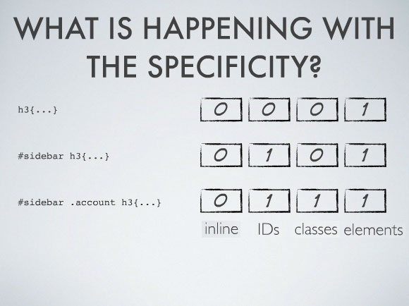

# 20190115 CSS와 Selector

## 수업

### python

- mutable 구분하는 쉬운 방법 : 메소드 중에 내부의 값을 바꿔주는 메소드가 있는가? 추가 및 삭제 같은 거. 그런거 없이 그냥 바꿔서 반환만 해주는 애들은 immutable.
- python 3.7 부터는 dictionary가 삽입 순서가 보존된다고 공식문서에 나옴. 3.6에는 공식문서에는 안써있지만 그렇게 행동함.
- 우리가 만드는 모든 변수들은 값을 잡고 있거나, 객체를 가리키는 것 두 가지이다.
  - python은 그래도 요즘 언어니까 객체를 가리키기만 해도.. 그 객체의 내용을 바로 주는 것이다. C 같은 언어에서는 객체의 주소값을 주면서 당신이 갖다 쓰세요 이런식임. 포인터.
- 1급 객체란?
  - 3가지 조건을 갖추면 1급 객체임.
    1. 변수나 데이타에 할당할 수 있어야 한다.
    2. 객체의 인자로 넘길 수 있어야 한다.
    3. 객체의 리턴 값으로 리턴할 수 있어야 한다.
  - python에서 함수는 1급 객체이다!
  - java에서 함수는 1급 객체가 아니다!
- lambda 함수 왜 씀?
  - 1회성으로 쓰는 경우에 익명으로 쓰려고. 편하게 한 줄로 쓰려고.
  - 물론 거기다 이름 붙이면 그냥 일반 함수처럼 됨.
- comprehension 을 쓰면 코드가 짧기도 하지만 속도도 빠르다!
- CSS에서 id 속성을 selector로 쓸 수 있지만.. 쓰지말자!  자바스크립트에서 많이 씀. 부트스트랩에서도 다 class로 select한다 하심.
- css 파일에서 우선 순위?
  - 
  - 또한, 같은 h3이어도 명시적일 수록 점수 높음
- 

## 수업 이외

- 포인터
  - 포인터(pointer)는 프로그래밍 언어에서 다른 변수, 혹은 그 변수의 메모리 공간주소를 가리키는 변수를 말한다. 포인터가 가리키는 값을 가져오는 것을 역참조라고 한다.
  - C, C++, 어셈블리 등 하위 레벨까지 제어할 수 있는 언어에서 주로 많이 쓰인다.
  - 포인터 연산 같은 것도 가능한데, 이를 장점으로 보는 언어에서는 포인터 개념을 사용하고 그게 아니라고 생각하는 언어들은 포인터를 사용하지 않는다. java에서는 포인터를 사용하지 않는 reference를 구현한 것이다.
  - 포인터를 사용하는 이유
    - 간결하고 효율적인 표현과 처리가 가능
    - 더 빠른 기계어 코드 생성
    - 복잡한 자료 구조(배열, 구조체 등)와 함수에 쉬운 접근
    - 포인터에 대한 호출(call by reference 구현)
  - 포인터 장점
    - 메모리 주소를 참조해서 다양한 자료형 변수들의 접근과 조작 용이
    - 동적 할당된 메모리 영역(힙 영역)에 접근과 조작 용이
    - 한 함수에서 다른 함수로 배열이나 문자열을 편리하게 보낼 수 있음
    - 복잡한 자료구조를 효율적으로 처리
    - 배열로 생성할 수 없는 데이터를 생성
    - 메모리 공간을 효율적 사용
    - call by reference에 의한 전역 변수의 사용을 억제
  - 포인터 단점
    - 포인터 변수는 주소를 직접적으로 컨트롤하기 때문에 예외 처리가 확실하지 않을 경우 예상치 못한 문제가 많이 발생. ( 널 포인트 같은 경우에 바로 접근할 경우 예외 발생)
    - 선언만 하고 초기화를 하지않을 경우 쓰레기 주소를 가리키고 있기 때문에 사용에 주의해야 함.
    - 포인터 변수는 주소를 직접 참조하기 때문에 의도하지않게 원본의 값이 수정 될 수 있다.
    - 오류를 범하기 쉽고 기교적인 프로그램이 되기 쉽다.
    - 프로그램의 이해와 버그 찾기가 어렵다.
    - 메모리 절대 번지 접근 시 시스템 오류를 초래한다.
  - [출처] 위키피디아
  - [출처] http://qqwwee.tistory.com/entry/%ED%8F%AC%EC%9D%B8%ED%84%B0%EB%A5%BC-%EC%82%AC%EC%9A%A9%ED%95%98%EB%8A%94-%EC%9D%B4%EC%9C%A0%EC%99%80-%EA%B7%B8-%EC%9E%A5%EC%A0%90
  - [출처] http://blog.hyomin.xyz/10
  - [출처] https://kldp.org/node/70013
- 덕타이핑
  - 컴퓨터 프로그래밍 분야에서 덕 타이핑(duck typing)은 동적 타이핑의 한 종류로, 객체의 변수 및 메소드의 집합이 객체의 타입을 결정하는 것을 말한다. 클래스 상속이나 인터페이스 구현으로 타입을 구분하는 대신, 덕 타이핑은 객체가 어떤 타입에 걸맞은 변수와 메소드를 지니면 객체를 해당 타입에 속하는 것으로 간주한다. “덕 타이핑”이라는 용어는 다음과 같이 표현될 수 있는 덕 테스트에서 유래했다. (덕은 영어로 오리를 의미한다.)
  - 만약 어떤 새가 오리처럼 걷고, 헤엄치고, 꽥꽥거리는 소리를 낸다면 나는 그 새를 오리라고 부를 것이다.
  - 파이썬처럼 타입을 명시적으로 표시하지 않는 타이핑 방법을 말한다.
  - 자바는 타입을 명시적으로 표시하여 컴파일시 오류를 검사한다.
- 자바 추상클래스(abstract class), 인터페이스(interface), 상속(extends), 구현(implements) 헷갈리는 부분 정리.
  - 비슷하다고 생각되는 원인
    - 추상클래스의 상속과 인터페이스의 구현이 둘다 뭔가 받아서 쓴다는 느낌을 줘서.
    - 추상클래스로도 자식클래스의 구현을 강제할 수 있고, 인터페이스로도 구현을 강제할 수 있어서.
    - 다중상속의 해결 방법 측면으로만 둘을 바라봐서.
  - 인터페이스의 핵심 : 어떠한 인터페이스를 구현한 객체에 대해서 동일한 동작을 보장한다. 구현할 컴포넌트의 표준을 정하는 것.
  - 추상클래스의 핵심 : 구체화 시킬 구현체를 추상화시키는 기법. 미완성 **클래스**. 추상 클래스를 상속받아서 그 기능을 확장시키는 것에 그 목적이 있는 것이다. 왜 미완성이냐?
  - 인터페이스가 다중 상속을 허용한 것이 아니다.(물론 가능하지만.) 추상클래스가 다중 상속을 제한하는 것이다. 다중 상속때문에 둘이 태어난 것이 아니라, 그냥 둘은 다른 목적을 가지고 태어난 다른 개념이다.
  - C++에서 다중상속을 허용한 이유는 언어가 개발자의 자율성을 강제하지 않게 하겠다는 철학임.
  - [출처] https://okky.kr/article/133632
  - [출처] http://itewbm.tistory.com/entry/%EC%B6%94%EC%83%81%ED%81%B4%EB%9E%98%EC%8A%A4abstract-class%EC%9D%98-%EC%A1%B4%EC%9E%AC-%EC%9D%B4%EC%9C%A0
