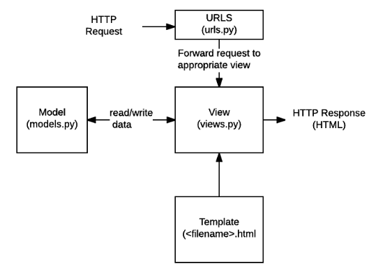

# 20190124 django

## 수업

- 

- urls.py를 app 별로 분리해서 관리하는 법
- html로 render 할 때, DTL (Django Template Language) 이용하는 방법(변수, for문, if문)
- templete 이 되는 html(base.html)을 만들어서 사용하는 방법. block을 설정해 놓고 상속받아서 사용!
- 

## 수업이외

