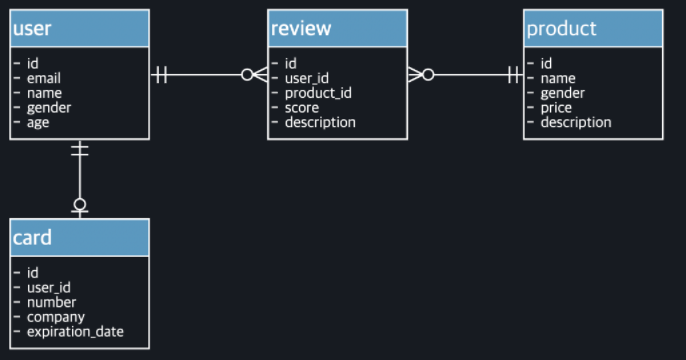
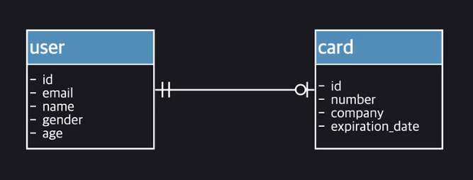
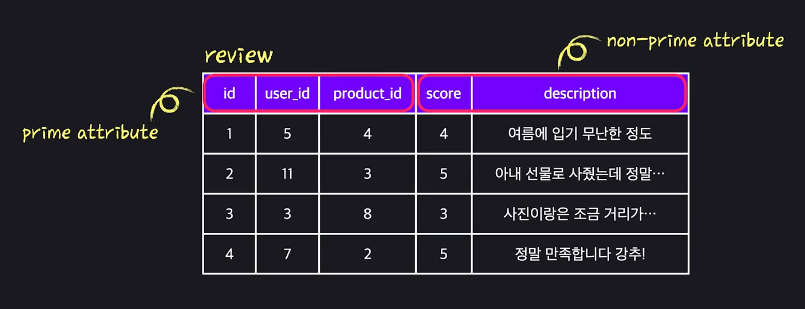
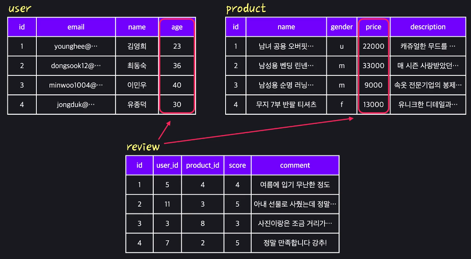

> 코드잇 개발자를 위한 SQL 데이터베이스 강의 중 다시 볼 내용을 정리한 문서
>
> https://www.codeit.kr/learn/courses/sql-database-for-developers/3136


[TOC]


# 1. SQL로 하는 데이터 분석

- 데이터 분석과 관련된 토픽이므로 대부분 조회(SELECT) 관련 내용이다


## 1.1. 데이터베이스 기본 개념

### 데이터베이스

- 일정한 체계 속에 저장된 데이터의 집합
- 보통 Table 단위로 저장됨


### DBMS

- DataBase Management System
- 사용자는 DBMS를 통해 DATABASE를 사용(조회, 저장 등)한다
- SQL이라는 언어로 DBMS를 조작할 수 있다. 결국 SQL로 DATABASE를 사용하는 것이다
  - SQL은 국제 표준이 있고, DBMS마다 이 표준을 준수하기는 하지만 100%는 아니다. 따라서 DBMS마다 약간씩 다를 수는 있다


### sys 데이터베이스

- 이번 강의에서는 MySQL을 사용하기로 했다. MySQL를 설치하면 기본적으로 sys라는 데이터베이스가 존재한다
- sys 데이터베이스는 MySQL의 성능 관련 정보들을 갖고 있는 데이터베이스이다


## 1.2. 테이블 생성하기

### Primary Key

- 테이블에서 특정 row 하나를 식별하는 역할
- 크게 Natural Key, Surrogate Key 두 개로 구분된다
  - Natural Key
    - 실제로 어떤 개체가 갖고 있는 속성을 Primary Key로 정하는 것
      ex) 주민등록번호, ISBN
  - Surrogate Key
    - Primary Key로 만들기 위해 인위적으로 컬럼을 새로 만들어서 쓰는 것
  - 상황마다 선택해서 쓰는데, 정답은 없다


## 1.3. 데이터 조회로 기본 다지기

### 조건식 예시

```sql
-- 예시 데이터 create query
-- 실제 수업에서는 member 테이블로 member-data.csv import 해서 했다

CREATE TABLE `member` (
  `id` int NOT NULL AUTO_INCREMENT,
  `email` text,
  `age` int DEFAULT NULL,
  `gender` text,
  `height` double DEFAULT NULL,
  `weight` double DEFAULT NULL,
  `birthday` date DEFAULT NULL,
  `sign_up_day` date DEFAULT NULL,
  `address` text,
  PRIMARY KEY (`id`)
) ENGINE=InnoDB DEFAULT CHARSET=utf8mb4 COLLATE=utf8mb4_0900_ai_ci;

INSERT INTO `member` (`id`, `email`, `age`, `gender`, `height`, `weight`, `birthday`, `sign_up_day`, `address`) VALUES 
(1,'codeit@naver.com',28,'m',178.2,70,'1992-01-03','2019-03-26','서울특별시 중구 삼일대로 343 103호'),
(2,'korin02@google.com',29,'m',165.7,67.3,'1992-08-13','2019-02-27','서울특별시 중구 세종대로 110 502호'),
(3,'cowboy@codeit.kr',31,'m',NULL,70.2,'1990-01-03','2019-01-05','경기도 고양시 일산서구 고양대로 633 204동 203호'),
(4,'get_flower@naver.com',-10,'f',183.5,72,'1975-03-12','2018-11-29',NULL),
(5,'taehos@hanmail.net',27,'m',181.3,70,'1992-09-02','2017-03-14','제주 제주시 문연로 6 102동 1105호'),(6,'iamstylish@naver.com',300,'f',172.2,NULL,'1989-01-03','2012-11-15','안드로메다 128행성'),(7,'captainGoGo03@koreauniv.com',28,'m',195.2,66,'1992-03-13','2014-03-18','전라남도 순천시 왕지3길 60 112동 107호'),(8,'sungsos@naver.com',36,'f',167.7,66.2,'1992-01-03','2017-03-20','경기도 부천시 평천로 679 101동 101호'),(9,'young05@naver.com',30,'m',180.2,70.4,'1991-02-13','2013-08-12','경기 오산시 세마문학로 50 111동 109호'),(10,'codeman_to@yonseit.com',111,'f',NULL,70.5,'1970-08-01','2017-02-20','경기 고양시 덕양구 충장로 118 112동 1103호'),(11,'programmer007@sumsung.com',27,'m',170.4,65.3,'1993-03-26','2014-01-22','경기 성남시 수정구 시민로 209 101동 1201호'),(12,'lovely_day@kaisty.com',-10,'f',162.7,69.4,'1995-10-11','2017-07-01','경기 화성시 봉담읍 동화새터길 55-39 203동 205호'),(13,'teddy@kakaot.com',41,'f',177.3,77.2,'1980-11-12','2016-08-03','인천 부평구 아트센터로 118 302동 602호'),(14,'pooh_man@naver.com',28,'m',182,NULL,'1993-12-21','2018-09-02','인천 미추홀구 송림로 194 602동 303호'),(15,'bicycle_go123@yahoot.com',24,'m',180,60.3,'1997-03-03','2019-12-01','서울 송파구 올림픽로 435 103동 501호'),(16,'all_round321@naver.com',26,'m',182.4,NULL,'1995-01-03','2019-11-23',NULL),(17,'nice_man@google.com',200,'m',180.8,NULL,'2003-01-03','2015-10-25','강원도 원주시 가곡로 50 101동 810호'),(18,'jw101@hanmail.net',0,'m',160.3,70,'1992-08-03','2017-09-23','강원도 춘천시 지석로 29 402동 321호'),(19,'cat_movie@lotte.com',-5,'f',180.2,NULL,'1989-01-03','2018-11-25','서울 양천구 오목로 354 110동 402호'),(20,'gogo_shopping@naver.com',32,'m',180.2,80.3,'1989-11-02','2015-01-23','서울 송파구 올림픽로35길 10 파크리오 301동 703호'),(21,'hello_hat@unista.com',26,'f',165.3,48.2,'1995-11-13','2018-12-23',NULL),(22,'new_coder@naver.com',-2,'f',180.7,70,'1976-08-03','2018-12-12','부산 연제구 양연로27번길 26 301동 701호'),(23,'zerotohundred@naver.com',20,'m',162,56,'2001-02-17','2015-07-20',NULL),(24,'xMan_series@naver.com',29,'m',173,65,'1992-01-03','2011-12-20','어린왕자에 나오는 B612');
```


```sql
SELECT * FROM copang_main.member WHERE age >= 27;
SELECT * FROM copang_main.member WHERE age BETWEEN 30 AND 39;
SELECT * FROM copang_main.member WHERE age NOT BETWEEN 30 AND 39;
SELECT * FROM copang_main.member WHERE gender != 'm';
SELECT * FROM copang_main.member WHERE gender <> 'm';

-- date 타입도 부등호, BETWEEN 사용 가능
SELECT * FROM copang_main.member WHERE sign_up_day > '2019-01-01';
SELECT * FROM copang_main.member WHERE sign_up_day BETWEEN '2018-01-01' AND '2018-12-31';

-- 문자열 패턴 매칭 조건 LIKE
SELECT * FROM copang_main.member WHERE address LIKE '서울%'  -- '서울'로 시작하는 임의의 길이 단어
SELECT * FROM copang_main.member WHERE email LIKE 'c______@%'  -- 'c'로 시작하고 뒤에 임의의 6글자가 있고 @가 나온 이후, 임의의 길이 단어를 검색
SELECT * FROM copang_main.test WHERE sentence LIKE BINARY '%g%'  -- BINARY 붙이면 utf8mb4_0900_ai_ci charset에서도 대소문자 구분 가능. ci <==> case-insensitive

SELECT * FROM copang_main.member WHERE age IN (20, 30);  -- 20이거나 30이어야 함
```


### DATE 타입 관련 함수 예시

```sql
SELECT * FROM copang_main.member WHERE YEAR(birthday) = '1992';
SELECT * FROM copang_main.member WHERE MONTH(sign_up_day) IN (6, 7, 8);
SELECT * FROM copang_main.member WHERE DAYOFMONTH(sign_up_day) BETWEEN 15 AND 31;

SELECT email, sign_up_day, DATEDIFF(sign_up_day, '2019-01-01') FROM copang_main.member;  -- 기준 날짜에서 며칠 차이 나는지 확인하는 함수
SELECT email, sign_up_day, CURDATE() DATEDIFF(sign_up_day, CURDATE()) FROM copang_main.member;  -- CURDATE(): 오늘 날짜 구하는 함수

SELECT email, sign_up_day, DATE_ADD(sign_up_day, INTERVAL 300 DAY) FROM copang_main.member;
SELECT email, sign_up_day, DATE_SUB(sign_up_day, INTERVAL 250 DAY) FROM copang_main.member;

SELECT email, sign_up_day, UNIX_TIMESTAMP(sign_up_day) FROM copang_main.member;
SELECT email, sign_up_day, FROM_UNIX_TIMESTAMP(UNIX_TIMESTAMP(sign_up_day)) FROM copang_main.member;
```


### AND, OR

- `WHERE id = 1 OR id = 2` 이렇게 다 적어줘야 한다. `WHERE id = 1 OR 2` 이렇게 적으면, `WHERE id = 1 OR TRUE` 이렇게 인식됨
- AND와 OR를 나란히 쓰면 AND가 우선 적용된다. 괄호를 씌우던가 순서를 잘 정의해야 한다


### 정렬(ORDER BY)

```sql
SELECT * FROM copang_main.member ORDER BY YEAR(sign_up_day) DESC, email ASC;  -- 앞 쪽에 적힌 기준으로 먼저 정렬한 후 그 다음 기준으로 정렬한다

SELECT * FROM FOR_TEST.ordering_test ORDER BY data ASC; -- data가 숫자형(int, double)인지 문자형(text)인지에 따라 정렬 방법이 다르다
/*
숫자형 일때는 19 27 120 230 으로 정렬되지만,
문자형 일때는 120 19 230 27 순으로 정렬된다.

아래처럼 하면 문자형 data여도 숫자형처럼 정렬할 수 있다
*/
SELECT * FROM FOR_TEST.ordering_test ORDER BY CAST(data AS signed) ASC;
SELECT * FROM FOR_TEST.ordering_test ORDER BY CAST(data AS decimal) ASC;

SELECT * FROM FOR_TEST.ordering_test ORDER BY CAST(data AS CHAR) ASC;  -- 반대로 이렇게 쓰면 숫자형 data를 문자 정렬하듯이 할 수 있다
```


### SQL 절 순서 문법

- https://dev.mysql.com/doc/refman/8.0/en/select.html


### 데이터 일부만 추려보기(LIMIT)

```sql
SELECT * FROM copang_main.member
ORDER BY sign_up_day DESC
LIMIT 10;  -- 앞에서부터 10개만 추려보기

SELECT * FROM copang_main.member
ORDER BY sign_up_day DESC
LIMIT 8, 2;  -- 9번째(index가 0부터 시작함)부터 2개만 추려보기


-- 두 번째 방식(LIMIT m, n)을 응용해서 pagination을 구현한다. 실무에서는 이렇게 간단하지는 않고 다양한 기법이 추가된다고 한다
SELECT * FROM db.search_result ~ ORDER BY registration_date DESC LIMIT 0, 10  -- 1페이지

SELECT * FROM db.search_result ~ ORDER BY registration_date DESC LIMIT 10, 10  -- 2페이지

SELECT * FROM db.search_result ~ ORDER BY registration_date DESC LIMIT 20, 10  -- 3페이지

SELECT * FROM db.search_result ~ ORDER BY registration_date DESC LIMIT 30, 10  -- 4페이지
```


## 1.4. 데이터 분석 단계로 나아가기

### 집계 함수(Aggregate Function)

- 특정 컬럼의 여러 row의 값들을 동시에 고려해서 실행되는 함수
- COUNT, MAX, MIN, AVG, SUM, STD 등
- NULL은 빼고 계산해준다


### 산술 함수(Mathematical Function)

- 특정 컬럼의 각 row의 값마다 실행되는 함수
- ABS, SQRT, CEIL(올림 함수), FLOOR, ROUND 등
  - https://dev.mysql.com/doc/refman/8.0/en/mathematical-functions.html


### NULL

```sql
-- NULL을 다른 문자로 바꿔서 조회하기
SELECT
	COALESCE(height, '###')  -- height가 NULL이면 ###을 출력해줌
	COALESCE(weight, '---')
	COALESCE(address, '@@@')
FROM copang_main.member;

SELECT * FROM copang_main.member WHERE address IS NULL;
SELECT * FROM copang_main.member WHERE address = NULL;  -- 이렇게 쓰면 안됨! NULL은 그냥 없는 거니까 등호로 비교할 수 있는 대상이 아님

SELECT *, height+3 FROM copang_main.member;  -- NULL인 경우 어떤 연산을 해도 그냥 NULL이다
```


### 컬럼 값 변환하여 보기

```sql
-- 단순 CASE 함수
SELECT email,
CASE age  -- 비교 대상이 먼저 나옴!
	WHEN 29 THEN '스물 아홉 살'
	WHEN 30 THEN '서른 살'
	ELSE age
END
FROM copang_main.member;

-- 검색 CASE 함수(비교 대상이 먼저 나오지 않는다)
SELECT
	email,
	CONCAT(height, 'cm', ', ', weight, 'kg') AS '키와 몸무게',  -- CONCAT(): 문자열 잇는 함수
	weight / ((height/100) * (height/100)) AS BMI,
CASE
	WHEN weight IS NULL OR height is NULL THEN '비만 여부 알 수 없음'
	WHEN weight / ((height/100) * (height/100)) >= 25 THEN '과체중 또는 비만'
	WHEN weight / ((height/100) * (height/100)) >= 18.5
		AND weight / ((height/100) * (height/100)) < 25
		THEN '정상'
	ELSE '저체중'
END
FROM copang_main.member;
```


### NULL 처리 함수 정리

- COALESCE
  - COALESCE(column, 'NULL대체표현')
  - COALESCE(column, 'NULL대체표현1', 'NULL대체표현2')
    - 'NULL대체표현1'도 NULL이면 'NULL대체표현2'로 넘어감
    - ex) COALESCE(height, weight * 2.3, 'N/A')
- IFNULL
  - MySQL에만 있는 함수. 파라미터 2개만 가능
  - IFNULL(column, 'NULL대체표현')
- IF
  - IF(조건문, 'true인 경우 리턴 값', 'false인 경우 리턴 값')
  - ex) IF(height IS NOT NULL, height, 'N/A')
- CASE ~ END
  - ex)
    CASE
        WHEN height IS NOT NULL THEN height
        ELSE 'N/A'
    END


### 고유 값만 보기

```sql
SELECT DISTINCT(SUBSTRING(address, 1, 2))  -- address 컬럼의 1번째 자리부터 2개 문자를 추출해서 고유값 조회 ex) 서울, 경기
FROM copang_main.member;
```


### 문자열 관련 함수들

- LENGTH
  - 문자열 길이 구해줌
- UPPER, LOWER
  - 모두 대문자 or 모두 소문자로 바꿔줌
- LPAD, RPAD
  - 왼쪽 or 오른쪽에 특정 문자를 채운다(PADDING)
  - ex) LPAD(age, 10, '0') : 총 10자리를 쓸건데 모자라면 왼쪽에 문자 '0'을 붙인다
- LTRIM, RTRIM
  - 왼쪽 or 오른쪽 공백 삭제
- TRIM
  - 양쪽 공백 삭제


### 그루핑해서 보기

- GROUP BY 절은 특정 컬럼을 대상으로 ROW들을 그룹지어 준다
  - 그냥 SELECT 하면 DISTINCT와 다를 바 없어보이지만, 집계 함수를 사용할 때는 다르다. 집계 함수의 대상이 각 GROUP이 되어서 여러 개의 결과가 나올 수 있다

- 

```sql
-- 기준 만들어서 그루핑하기, 여러 개 그루핑하기 예시
SELECT
	SUBSTRING(address, 1, 2) as region,
	COUNT(*)
FROM copang_main.member
GROUP BY
	SUBSTRING(address, 1, 2),
	gender;

-- 그룹에 조건 걸기
SELECT
	SUBSTRING(address, 1, 2) as region,
	COUNT(*)
FROM copang_main.member
GROUP BY
	SUBSTRING(address, 1, 2),
	gender
HAVING
	region = '서울'
	AND gender = 'm';
```


- WHERE vs HAVING
  - WHERE는 ROW들을 조회할 때 조건을 설정하는 구문
  - HAVING은 조회된 ROW들에 대해 그루핑했을 때 생성된 그룹들 중에서 다시 필터링 하는 구문
- GROUP BY 했을 때  SELECT 절에는 GROUP BY 뒤에서 사용한 컬럼들 혹은 집계 함수만 사용할 수 있다
  - 생각해보면 당연한 것일 수도 있는데, GROUP BY를 통해 GROUP 당 한 줄로 조회되기는 하지만 그 한 줄은 하나의 ROW 데이터가 아니다. 여러 ROW가 합쳐져 있는 것이므로 GROUP BY에 사용되지 않은 컬럼의 데이터 중 어떤 것을 가져와야할지 판단할 수가 없다
  - 하지만 집계 함수는 해당 GROUP의 특정 컬럼에 대해 집계를 하므로 SELECT 할 수 있다


### SELECT 문 작성 순서 및 실행 순서

- 작성 순서
  1. SELECT 
  2. FROM
  3. WHERE
  4. GROUP BY
  5. HAVING 
  6. ORDER BY
  7. LIMIT
- 실행 순서
  1. **FROM**
  2. **WHERE** 
  3. **GROUP BY**
  4. **HAVING** 
  5. **SELECT**
     - ∴ SELECT 순서가 WHERE 보다 뒤에 있기 때문에 SELECT에서 alias 해도 WHERE에서 alias를 인식 못하는 것. SELECT 보다 뒤에 있는 ORDER BY, LIMIT에서는 alias를 쓸 수 있다
  6. **ORDER BY**
  7. **LIMIT**
- 위의 실행 순서가 표준이기는 하지만, 모든 DBMS에서 표준을 지키지는 않는다. 예를들어 MySQL 같은 경우에는 HAVING 절을 실행하기 이전에 SELECT 절을 일부 평가한다. 이때문에 HAVING 절에서 SELECT 절에서 정의한 alias를 사용할 수 있다


### ROLLUP

- 말아 올리다. **그룹 별로 말아 올리다** <==> 그룹 총계
- 세부 그룹들을 좀더 큰 단위의 그룹으로 중간중간 합쳐주는 것
  - ∴ GROUP BY 절에 앞에 썼던 기준이 좀더 상위 그룹이 되므로 뒤에 썼던 기준의 총계를 구하는 것

```sql
-- 기본 롤업 예시
SELECT YEAR(birthday) AS b_year, YEAR(sign_up_day) AS s_year, gender, COUNT(*)
FROM copang_main.member
GROUP BY YEAR(birthday), YEAR(sign_up_day), gender WITH ROLLUP
ORDER BY b_year DESC, s_year DESC, gender DESC;
```


- 이런 식으로 ROLLUP 결과를 NULL 항목을 사용해서 표현함. 작은 그룹에서 큰 그룹으로 점진적으로 ROLLUP

```sql
-- NULL항목이 있을 때 롤업 예시
SELECT YEAR(sign_up_day) AS s_year, gender, SUBSTRING(address, 1, 2) AS region, COUNT(*)
FROM copang_main.member
GROUP BY YEAR(sign_up_day), gender, SUBSTRING(address, 1, 2) WITH ROLLUP
ORDER BY s_year DESC, gender DESC, region DESC, COUNT(*);
```


- region에 NULL이 있는 row가 있기 때문에, 위와 같이 ROLLUP에 의한 결과로 착각할 수 있는 row가 있다

```sql
-- NULL 항목에 대한 구분을 위하여 GROUPING 함수를 사용한 쿼리
SELECT YEAR(sign_up_day) AS s_year, gender, SUBSTRING(address, 1, 2) AS region, GROUPING(YEAR(sign_up_day)), GROUPING(gender), GROUPING(SUBSTRING(address, 1, 2)), COUNT(*)
FROM copang_main.member
GROUP BY YEAR(sign_up_day), gender, SUBSTRING(address, 1, 2) WITH ROLLUP
ORDER BY s_year DESC, gender DESC, region DESC, COUNT(*);
```


- GROUPING() : 그루핑 기준에서 고려하지 않은 부분 총계를 나타내는 경우 1을 리턴하는 함수
- GROUPING 함수를 사용하여 부분 총계를 나타내기 위해 컬럼에 NULL이 쓰인 것인지 실제 NULL인지 구분할 수 있다


## 1.5. 테이블 조인을 통한 깊이있는 데이터 분석

### Foreign Key

- 다른 테이블의 특정 row를 식별할 수 있게 해주는 컬럼
- 외래키를 가지고 그 키를 기본키로 사용하는 테이블에서 정보를 얻는다
  - 이 때, 외래키를 가진 쪽을 자식 테이블, 외래키에 대응되는 기본키를 가진 쪽을 부모 테이블이라고 한다
- foreign key 설정을 해두면 부모 테이블에 없는 기본키가 입력되는 것을 막아준다(에러를 내준다)


- 왼쪽 박스 부분에 foreign key 이름과 참조할 테이블을 지정한 후, 오른쪽 박스 부분에 foreign key로 사용할 컬럼과 참조할 컬럼을 선택해준다


### OUTER JOIN

- LEFT OUTER JOIN은 왼쪽 테이블을 기준으로 두 테이블을 합치는 것이고, RIGHT OUTER JOIN은 오른쪽 테이블을 기준으로 두 테이블을 합치는 것이다
- 기준이 된다는 말은 두 테이블을 합칠 때, 데이터를 모두 보존하면서 합친다는 말이다. 두 테이블을 합치다보면 JOIN 기준에 부합하지 않는 데이터도 생길 수 있다. 이 때, JOIN 기준에 부합하지 않더라도 기준이되는 테이블의 데이터는 모두 조회된다. 대신, 합쳐지는 상대 테이블의 정보는 없으므로 NULL로 표시된다

```sql
-- OUTER JOIN 예시
SELECT
	i.id,
	i.name,
	s.item_id,
	s.inventory_count
FROM item AS i RIGHT OUTER JOIN stock AS s  -- 테이블에도 alias를 쓸 수 있다
ON i.id = s.item_id;
```


### 컬럼 alias vs 테이블 alias

- 컬럼 alias는 실제로 조회할 때 그 alias로 보여지게 하기 위해 쓴다
- 테이블 alias는 SQL 문의 가독성을 높이기 위해 사용한다
- 테이블 alias를 한번 지정해주면, 반드시 alias를 사용해야 한다. 사용하지 않고 원래 테이블 이름을 사용하면 오류난다


### INNER JOIN

- OUTER JOIN과 다르게, 따로 기준이 되는 테이블이 없다. JOIN 기준에 대한 교집합 개념으로 테이블을 합치기 때문에 합치면서 NULL이 생기지 않는다
- foreign key는 참조되는 테이블에 없는 데이터가 입력되는 것을 막아준다. 따라서 foreign key를 가진 테이블을 기준으로 삼고 foreign key를 JOIN 기준으로 사용해서 OUTER JOIN을 하면 INNER JOIN과 결과가 같다(중간에 참조되는 테이블만 일부러 데이터를 삭제하지 않는 한).


### JOIN 기준

- JOIN을 할 때 보통 foreign key를 기준으로 하는 경우가 많다. 하지만 반드시 JOIN을 foreign key로만 해야하는 것은 아니다
- 따라서 상황에 따라 LEFT OUTER JOIN, RIGHT OUTER JOIN, INNER JOIN 결과가 다르게 나올 수 있다


- 위와 같은 경우 각 JOIN 결과가 모두 다르다


### 결합 연산 vs 집합 연산

- 결합 연산
  - 테이블을 가로로 합치는 것
  - ex) JOIN 연산
- 집합 연산
  - 테이블을 세로로 합치는 것. 따라서 집합 연산은 두 테이블의 컬럼 구조가 같아야 한다
  - 수학에서 집합 연산하는 개념임(교집합, 차집합, 합집합). 따라서 합집합했을 때 겹치는 row들도 하나의 row로 합쳐준다(cf: UNION ALL 절을 사용하면 중복 row 제거 없이 그대로 합쳐준다)
  - ex) INTERSECT, MINUS, UNION, UNION ALL
  - MySQL에서는 8.0 버전 기준으로 UNION만 가능하다. 대신 조인 연산을 사용해서 간접적으로 구현할 수 있다. cf) 오라클은 3가지 연산자를 모두 지원한다


### 같은 종류 테이블 연산

- 기준이 되는 두 컬럼의 이름이 같은 경우를 JOIN할 때는 ON 대신 USING 절을 사용할 수 있다
  - ex) `ON old.id = new.id` == `USING(id)`
- 같은 종류 테이블을 여러 방식으로 JOIN 하면서 차집합, 교집합을 구현할 수 있다

```sql
-- 차집합 구현. old집합 - new집합
SELECT
	old.id AS old_id,
	old.name AS old_name,
	new.id AS new_id,
	new.name AS new_name
FROM item AS old LEFT OUTER JOIN item_new AS new
ON old.id = new.id
WHERE new.id IS NULL;

-- 합집합. 두 테이블의 구조가 다를 때 컬럼 따로 빼는 식으로 맞춰서 할 수도 있음
SELECT id, nation, count FROM Summer_Olympic_Medal
UNION
SELECT id, nation, count FROM Winter_Olympic_Medal;

-- 결과가 같더라도 의미가 다르므로 이런 경우에는 UNION ALL로 그대로 합칠 수도 있다
SELECT id, nation, count FROM Summer_Olympic_Medal
UNION ALL
SELECT id, nation, count FROM Winter_Olympic_Medal;
```


### 서로 다른 3개의 테이블 조인 예시

```sql
SELECT
	i.name, i.id,
	r.item_id, r.star, r.comment, r.mem_id,
	m.id, m.email
FROM
	item AS i LEFT OUTER JOIN review AS r
		ON r.item_id = i.id
	LEFT OUTER JOIN member AS m
		ON r.mem_id = m.id;
```


- 하나의 상품에 여러 리뷰를 달 수 있는 1:n 관계이기 때문에, JOIN 결과 1에 해당하는 상품이 여러 번 중복해서 조회될 수 있다


### 기타 조인

```sql
/*
NATURAL JOIN
- ON 절을 사용하지 않는 INNER JOIN
- 두 테이블에서 같은 이름의 컬럼을 찾아서 자동으로 기준을 잡고 조인한다
*/
SELECT p.id, p.player_name, p.team_name, t.team_name, t.region
FROM player AS p NATURAL JOIN team AS t;

/*
CROSS JOIN
- 한 테이블의 하나의 row에 다른 테이블의 모든 row를 매칭하는 조인
- 조건을 사용하지 않으므로 두 테이블의 모든 row 쌍이 조합된다
- inner join을 조건 없이 사용해도 같은 결과를 얻는다
- 집합 이론 Cartesian Product와 같다
*/
SELECT * FROM member CROSS JOIN stock;

/*
SELF JOIN
- JOIN할 테이블을 자기 자신으로 삼는 것
- 하나의 테이블에서 통합해서 조회하고 싶은 경우 사용한다
- ex1) 같은 테이블 안에서 나이가 같은 조합을 알고 싶을 때
- ex2) 같은 테이블 안에 상사의 id가 적혀있는 경우, 상사의 이름도 조회하고 싶을 때
*/
SELECT *
FROM member AS m1 LEFT OUTER JOIN member AS m2
ON m1.age = m2.age;

SELECT *
FROM employee AS e1 LEFT OUTER JOIN employee AS e2
ON e1.boss = e2.id
LEFT OUTER JOIN employee AS e3
ON e2.boss = e3.id;

/*
FULL OUTER JOIN
- LEFT OUTER JOIN + RIGHT OUTER JOIN
- Oracle에서는 FULL OUTER JOIN 연산자가 내장되어 있지만, MySQL에서는 기존 연산자를 활용해야 한다
*/
SELECT *
FROM player AS p LEFT OUTER JOIN team AS t
ON p.team_name = t.team_name
UNION
SELECT *
FROM player AS p RIGHT OUTER JOIN team AS t
ON p.team_name = t.team_name;

/*
Non-Equi 조인
- ON 절에 부등호가 들어가는 조인
- 날짜나 수 기준 or != 기준이 필요한 경우에 쓰인다
*/
SELECT m.email, m.sign_up_day, i.name, i.registration_date
FROM copang_main.member AS m LEFT OUTER JOIN copang_main.item AS i
ON m.sign_up_day < i.registration_date
ORDER BY m.sign_up_day ASC;
```


## 1.6. 서브쿼리와 뷰를 활용한 유연한 데이터 분석

### 서브쿼리(== inner query)

- SQL 문 안에 부품처럼 들어있는 SELECT 문
- SELECT 절, WHERE 절, FROM 절, HAVING 절 등에서 사용할 수 있음
  - FROM 절에 서브쿼리 쓰려면 alias를 꼭 써줘야 함. 안쓰면 derived table에는 alias 붙이라고 error 냄
  - Oracle DBMS에서는 derived table을 inline view 라고 부르기도 함
- 일반적으로는 JOIN이 SUBQUERY보다 성능이 좋다. DB 엔진이 JOIN에 최적화가 더 잘되어 있다고 한다. 하지만 MySQL의 경우 5.6 버전에서 서브쿼리의 성능이 많이 향상되었다고 한다
- 서브쿼리와 조인이 비슷한 역할을 하는 경우가 있는데, 실행 순서를 생각해봤을 때 서브쿼리를 활용하면 가독성이 좀더 좋아지는 경우도 있다

```sql
-- 기본 예시
SELECT i.id, i.name, AVG(star) AS avg_star
FROM item AS i LEFT OUTER JOIN review AS r
ON r.item_id = i.id
GROUP BY i.id, i.name
HAVING avg_star < (SELECT AVG(star) FROM review)
ORDER BY avg_star DESC;

-- WHERE 절 사용 예시
SELECT * FROM item
WHERE id IN(
SELECT item_id
FROM review
GROUP BY item_id HAVING COUNT(*) >= 3
);

-- 서브쿼리를 써서 조인보다 가독성이 좋아진 경우
SELECT
	email,
	CONCAT(height, 'cm', ', ', weight, 'kg') AS '키와 몸무게',  -- CONCAT(): 문자열 잇는 함수
	weight / ((height/100) * (height/100)) AS BMI,
CASE
	WHEN weight IS NULL OR height is NULL THEN '비만 여부 알 수 없음'
	WHEN weight / ((height/100) * (height/100)) >= 25 THEN '과체중 또는 비만'
	WHEN weight / ((height/100) * (height/100)) >= 18.5
		AND weight / ((height/100) * (height/100)) < 25
		THEN '정상'
	ELSE '저체중'
END
FROM copang_main.member;

SELECT
	email,
	CONCAT(height, 'cm', ', ', weight, 'kg') AS '키와 몸무게',  -- CONCAT(): 문자열 잇는 함수
	BMI,
CASE
	WHEN weight IS NULL OR height is NULL THEN '비만 여부 알 수 없음'
	WHEN BMI >= 25 THEN '과체중 또는 비만'
	WHEN BMI >= 18.5
		AND BMI < 25
		THEN '정상'
	ELSE '저체중'
END
FROM
(SELECT *, weight / ((height/100) * (height/100)) AS BMI FROM copang_main.member) AS subquery_for_BMI;
```


### ANY(SOME), ALL

- 서브쿼리 앞에 IN 말고도 ANY(SOME), ALL을 붙여서 사용할 수도 있다
- 단어 뜻 그대로 서브쿼리 결과 중 하나라도 만족하는 경우 or 모두 만족해야 하는 경우를 나타낼 때 쓰인다

```sql
SELECT * FROM FOR_TEST.codeit_theater
	WHERE view_count > ANY(SELECT view_count FROM FOR_TEST.codeit_theater WHERE category = 'ACTION')
		AND category != 'ACTION'
		
SELECT * FROM FOR_TEST.codeit_theater
	WHERE view_count > SOME(SELECT view_count FROM FOR_TEST.codeit_theater WHERE category = 'ACTION')
		AND category != 'ACTION'
		
SELECT * FROM FOR_TEST.codeit_theater
	WHERE view_count > ALL(SELECT view_count FROM FOR_TEST.codeit_theater WHERE category = 'ACTION')
		AND category != 'ACTION'
```


### 서브 쿼리 종류 정리(리턴 형식에 따라)

- 단일 값을 리턴하는 서브쿼리(== 스칼라 서브쿼리)
  - `SELECT MAX(age) FROM member;`
- 하나의 column에 여러 row를 리턴하는 서브쿼리
  - 이런 서브쿼리는 IN, ANY(SOME), ALL 등의 키워드와 함께 사용한다
  - `SELECT SUBSTRING(address, 1, 2) FROM member;`
- 여러 column, 여러 row를 리턴하는 서브쿼리(마치 하나의 테이블 처럼)를 리턴하는 서브쿼리
  - derived table 이라고도 불림. 이러한 테이블에는 alias를 반드시 붙여줘야 한다는 규칙이 있다
  - `SELECT * FROM member;`


### 서브 쿼리 종류 정리(상관 관계에 따라)

- 비상관 서브쿼리
  - 앞에서 계속 봤던 서브쿼리
  - 서브쿼리만 따로 빼서 실행 가능한 서브쿼리
- 상관 서브쿼리
  - 서브쿼리가 outer query와 상관되어진 상태로 쓰여진 서브쿼리
  - 따로 실행 불가
  - EXIST, NOT EXIST 키워드와 함께 쓰이기도 한다

```sql
-- 상관 서브쿼리 예시. EXIST 사용
SELECT * FROM item
	WHERE EXISTS (SELECT * FROM review WHERE review.item_id = item.id);  -- 서브쿼리에 outer query에 있는 item 테이블을 사용했다
	
-- 상관 서브쿼리 예시. EXIST 사용 X
SELECT *,
(SELECT MIN(height)
FROM member AS m2 WHERE birthday IS NOT NULL AND height IS NOT NULL
AND YEAR(m1.birthday) = YEAR(m2.birthday)) AS min_height_in_the_year
FROM member AS m1
ORDER BY min_height_in_the_year ASC;
```


### 뷰(== 가상 테이블)

- 조인 등의 작업을 해서 만든 '결과 테이블'이 가상으로 저장된 형태
- 뷰를 사용하면 매번 긴 SQL을 입력해서 얻어내야하는 결과 테이블을 쉽게 재사용할 수 있다
- 뷰는 테이블 형식으로 보여지지만 실제 데이터가 물리적으로 컴퓨터에 저장되는 것은 아님
  - 요즘에는 자주 사용되는 뷰인 경우에는 따로 물리적으로 저장해놓는 기능도 있지만 원래 개념적으로 그런 것은 아니므로 넘어감
  - 뷰는 해당 뷰가 사용될 때마다 AS 이후의 SQL문을 그대그때 실행해주는 기능임
- 뷰의 장점
  1. 사용자에게 높은 편의성을 제공해줌
  2. 각 직무별 데이터 수요에 알맞은, 다양한 구조의 데이터 분석 기반을 구축해둘 수 있음
     - 같은 테이블을 다룰 경우에도 직무에 따라 상황에 따라 필요한 데이터가 다를 수 있다. 이 때, 회사 입장에서 기존의 데이터 구조를 건드리지 않고 효과적으로 각자에게 필요한 데이터 구조를 사용할 수 있다
  3. 데이터 보안에 좋음
     - 예를 들어 직원 테이블에 주민등록번호, 연봉 등 민감한 정보가 있더라도 데이터 분석가에게 이러한 컬럼이 없는 뷰를 제공하면 된다
     - 데이터 분석가에게는 보통 이렇게 뷰로 데이터가 제공되고, 필요한 정보가 있으면 따로 신청하도록 되어 있는 경우가 많다
     - 테이블에 아무나 접근할 수 없게 해서 보안 정책을 잘 유지할 수 있다

```sql
-- VIEW 만들기
CREATE VIEW three_tables_joined AS  -- 이 아래 있는 SQL 문의 결과를 VIEW로 저장하는 것
SELECT i.id, i.name, AVG(star) AS avg_star, COUNT(*) AS count_star
FROM item AS i LEFT OUTER JOIN review AS r ON r.item_id = i.id
	LEFT OUTER JOIN member AS m ON r.mem_id = m.id
WHERE m.gender = 'f'
GROUP BY i.id, i.name
HAVING COUNT(*) >= 2
ORDER BY AVG(star) DESC, COUNT(*) DESC;

-- VIEW 사용하기
-- VIEW를 사용하지 않았으면 three_talbes_joined가 언급된 부분에 실제 SQL문을 작성해서 서브쿼리 중첩으로 직접 해야하는 것
SELECT * FROM copang_main.three_tables_joined
WHERE avg_star = (
	SELECT MAX(avg_star) FROM copang_main.three_tables_joined
) AND count_star = (
	SELECT MAX(count_star) FROM copang_main.three_tables_joined
);
```


### 실무에서 첫 번째로 해야할 일

1. 어떤 데이터베이스들이 있는지 파악
   - `SHOW DATABASES;`
2. 각 데이터베이스 안에 어떤 테이블들이 있는지 파악
   - `SHOW FULL TABLES IN 데이터베이스이름;`
   - 한 데이터베이스 안에 있는 테이블과 뷰를 확인할 수 있다
3. 각 테이블의 컬럼 구조는 어떻게 되는지 파악
   - `DESCRIBE 테이블이름`
   - 테이블의 간단한 정보를 볼 수 있다. 컬럼의 이름, 데이터 타입, Not Null 유무, PK 여부 등
4. 테이블들 간의 Foreign Key 관계 파악
   - 각 DBMS 마다 SQL문을 작성해서 Foreign Key를 알아낼 수 있다
   - 그런데 실제로 Foreign Key 관계가 성립한다고 해도 관리자가 Foreign Key로 설정해 두지 않는 경우도 있다. 실수일 수도 있고, 성능 때문에 일부러 그런 것일 수도 있다. 따라서 이런 경우도 있다는 것을 염두에 두고 설계자의 설명을 듣거나 직접 데이터의 관계와 흐름을 파악해야 한다


# 2. SQL로 하는 데이터 관리

- 데이터 베이스의 데이터는 '저장' -> '조회' -> '갱신' -> '삭제' 단계를 거친다
- 앞선 토픽에서 조회 관련된 부분을 자세히 다뤘고 이번 토픽에서는 나머지 '저장', '갱신', '삭제' 관련 SQL을 다룬다


## 2.1. 데이터베이스와 테이블 구축

### 데이터베이스 생성

- `CREATE DATABASE course_rating;`
- `CREATE DATABASE IF NOT EXISTS course_rating;`
- `USE course_rating;`
  - 사용할 데이터베이스를 지정하는 SQL


### 테이블 생성 예시

```sql
CREATE TABLE `course_rating`.`student` (
  `id` INT NOT NULL AUTO_INCREMENT,
  `name` VARCHAR(20) NULL,
  `student_number` INT NULL,
  `major` VARCHAR(15) NULL,
  `email` VARCHAR(50) NULL,
  `phone` VARCHAR(15) NULL,
  `admission_date` DATE NULL,
  PRIMARY KEY (`id`));
```


### 백틱과 따옴표

- Esc 키 아래에 있는 \` 기호를 백틱(backtick)이라고 부른다
- DBMS에서는 데이터베이스, 테이블, 컬럼 등의 구성요소를 object(객체)라고 한다. object의 이름을 identifier(식별자)라고 하는데 MySQL에서 백틱은 해당 단어가 identifier라는 것을 표시하는 기호이다
- 홑따옴표나 쌍따옴표는 문자열이라는 것을 표시하기 위해서 쓴다


### 테이블에 row 추가하기 예시

```sql
INSERT INTO food_menu (menu, price, ingredient)
VALUES ('라볶이', 5000, '라면, 떡, 양파..');

-- 여러 개 한꺼번에
INSERT INTO food_menu (menu, price, ingredient) VALUES 
('라볶이', 5000, '라면, 떡, 양파..'), ('치즈김밥', 3000, '치즈, 김, 단무지..'), ('돈까스', 8000, '국내산 돼지고기, 양배추..'), ('오므라이스', 7000, '계란, 당근..');
```


### 테이블의 row 갱신하기 예시

```sql
UPDATE final_exam_result SET score = 100 WHERE id = 1;

-- 기존 값 기반으로 갱신하기
UPDATE final_exam_result SET score = score + 3;  -- WHERE 안 썼으므로 모든 row를 갱신한다
```


### 테이블의 row 삭제하기 예시

```sql
DELETE FROM student WHERE id = 4;  -- WHERE 안쓰면 모든 row가 삭제됨
```


### 물리 삭제 vs 논리 삭제

- 앞에서 했던 삭제는 물리 삭제 방식이다
- 논리 삭제는 `is_cancelled` 같은 컬럼을 따로 만들어 둬서 삭제 표시만 하는 것을 말한다. 따라서 삭제기는 하지만 SQL은 UPDATE를 사용해야 한다
  - ∴ 삭제를 해도 저장 용량은 줄어들지 않는다
- 데이터를 조회할 때 `SELECT * FROM xxx WHERE is_cancelled !='Y'; ` 이런 식으로 해야하기 때문에 번거로울 수 있지만, 다시 복구해야할 수도 있고 또 다양하게 활용할 수 있으므로 논리 삭제를 활용한다
- 데이터 보관 정책에 따라 논리 삭제 후 일정 기간이 지나면 물리 삭제를 한다던지 하는 경우도 있다


## 2.2. 테이블 다루기

### 테이블 컬럼 구조 변경

```sql
-- 컬럼 추가
ALTER TABLE student ADD gender CHAR(1) NULL;

-- 컬럼 이름 바꾸기
ALTER TABLE student
	RENAME COLUMN student_number TO registration_number;

-- 컬럼 삭제
ALTER TABLE student DROP COLUMN admission_date;

-- 컬럼 데이터 타입 변경
ALTER TABLE student MODIFY major INT;  -- 타입이 바꿔지지 않는 컬럼 있으면 error 내줌

-- 컬럼 속성 변경
ALTER TABLE student MODIFY name VARCHAR(35) NOT NULL;  -- 원래의 데이터 타입도 같이 써줘야 함. 동시에 바꿀 수도 있음
ALTER TABLE student MODIFY registration_number INT NOT NULL;
ALTER TABLE student MODIFY major INT NOT NULL DEFAULT 101;
```

- CHANGE로 RENAME COLUMN(이름 변경)과 MODIFY(컬럼 속성 변경) 동시에 할 수도 있음
  - `ALTER TABLE 테이블명 CHANGE 예전이름 새이름 새로운속성1 새로운속성2 ... `
- 아래 처럼 여러 작업 동시에 수행할 수도 있음

```sql
ALTER TABLE player_info
	RENAME COLUMN id TO registration_number,
	MODIFY name VARCHAR(20) NOT NULL,
	DROP COLUMN position,
	ADD height DOUBLE NOT NULL,
	ADD weight DOUBLE NOT NULL;
```


### DATETIME, TIMESTAMP 타입의 컬럼에 값 넣기

```sql
-- 1. NOW() 함수 활용하기
INSERT INTO post (title, content, upload_time, recent_modified_time)
VALUES ("xxxx", "yyyy", NOW(), NOW());

UPDATE post
	SET content = 'zzzz', recent_modified_time = NOW()
	WHERE id = 1;
	
-- 2. 컬럼 속성 활용하기
ALTER TABLE post
	MODIFY upload_time DATETIME DEFAULT CURRENT_TIMESTAMP,
	MODIFY recent_modified_time TIMESTAMP DEFAULT CURRENT_TIMESTAMP ON UPDATE CURRENT_TIMESTAMP;
```


### Primary Key와 Unique 속성의 차이

- Unique는 NULL을 허용할 수 있다


### CONSTRAINT(== 제약사항) 컬럼 속성

```sql
-- CONTSTRAINT 속성 만들기
ALTER TABLE student
	ADD CONSTRAINT st_rule CHECK (registration_number < 30000000);

-- CONTSTRAINT 속성 삭제
ALTER TABLE student DROP CONSTRAINT st_rule;

-- 제약사항 2개도 가능
ALTER TABLE student
	ADD CONSTRAINT st_rule
	CHECK (email LIKE '%@%' AND gender IN ('m', 'f'));
```


### 테이블 이름 변경, 복사본 만들기, 삭제 등 테이블 조작

```sql
-- 이름 변경
RENAME TABLE student TO undergraduate;

-- 테이블 복사
CREATE TABLE copy_of_undergraduate AS SELECT * from undergraduate;

-- 테이블 삭제
DROP TABLE copy_of_undergraduate;

-- 테이블 컬럼 구조만 복사하기
CREATE TABLE copy_of_undergraduate LIKE undergraduate;

-- 테이블 컬럼 구조만 복사한 후 나중에 데이터도 복사 하고 싶을 때
INSERT INTO copy_of_undergraduate SELECT * FROM undergraduate;  -- 전부 다 복사하기
INSERT INTO copy_of_undergraduate SELECT * FROM undergraduate WHERE major = 101;  -- 일부만 복사하기
```


### TRUNCATE

- 기존 테이블의 데이터를 전부 다 날리고 같은 테이블에서 다시 시작하고 싶을 때 쓴다
- `DELETE FROM 테이블명`과 실행 결과가 같다
  - 내부적으로 이루어지는 동작에 차이가 있다고 한다. 일단은 둘을 혼용해서 쓸 수 있다는 것을 기억하라고 함


## 2.3. Foreign Key 제대로 사용하기

### 참조 무결성

- Foreign Key가 있는 테이블을 자식 테이블(chile table) 혹은 참조하는 테이블(referencing table)이라 부름
- Foreign Key에 의해 참조당하는 테이블을 부모 테이블(parent table) 혹은 참조당하는 테이블(referencing table)이라 부름
- Foreign Key 설정 해놓으면, 자식 테이블에 Foreign Key 컬럼에 데이터를 추가할 때 부모 테이블에 해당 PK가 있는지 확인한다. 따라서 **참조 무결성(Referential Integrity)**를 지킬 수 있다


### Foreign Key 설정하기

```sql
-- 이미 생성된 테이블에 Foreign Key 설정하기
ALTER TABLE `course_rating`.`review`
ADD CONSTRAINT `fk_review_table`  -- 이름 안 정해도 되긴 하지만 어차피 MySQL이 알아서 짓는다
	FOREIGN KEY (`course_id`)
	REFERENCES `course_rating`.`course` (`id`)
	ON DELETE RESTRICT
	ON DELETE RESTRICT;
	
-- 테이블 생성하면서 Foreign Key 설정하기. 크게 다를 것은 없다
CREATE TABLE `review` (
	`id` int NOT NULL AUTO_INCREMENT,
    `course_id` int DEFAULT NULL,
    `star` int DEFAULT NULL,
    `comment` varchar(500) DEFAULT NULL,
    PRIMARY KEY (`id`),
    KEY `fk_review_table_idx` (`course_id`),
    CONSTRAINT `fk_review_table` FOREIGN KEY (`course_id`) REFERENCES `course_rating`.`course` (`id`) ON DELETE RESTRICT ON DELETE RESTRICT;
)
```


### 부모 테이블의 row가 삭제될 때의 정책

- 부모 테이블의 row가 삭제되면 자식 테이블의 참조 무결성이 깨지게 된다. 따라서 이런 상황에서 어떻게 대응할지 정책을 정해놓는 것이다
- RESTRICT 정책
  - 자신을 참조하고 있는 자식 테이블의 row가 있다면, 부모 테이블의 row 삭제 불가. 자식 테이블의 row를 먼저 지운 후 부모 테이블 row 삭제 가능
- CASCADE 정책
  - '폭포수처럼 떨어지다. 연쇄 작용을 일으키다'
  - 부모 테이블의 row를 삭제하면, 자신을 참조하고 있는 자식 테이블의 row도 함께 삭제
- SET NULL 정책
  - 부모 테이블의 row를 삭제하면, 자신을 참조하고 있는 자식 테이블을 삭제하지는 않고 Foreign Key 컬럼을 NULL로 만듦


### 부모 테이블의 row의 PK가 갱신될 때의 정책

- 갱신될 때도 삭제될 때 정책의 논리가 적용된다
  - RESTRICT는 갱신 못하게, CASCADE는 갱신된 id로 자식 테이블도 수정, SET NULL은 부모는 갱신되면서 자식 테이블 Foreign Key는 NULL로 바꾼다
- ON DELETE와 ON UPDATE를 통해 삭제될 때와 갱신될 때의 정책을 다르게 가져갈 수도 있다


### 논리적 Foreign Key vs 물리적 Foreign Key

- 논리적으로 Foreign Key 관계가 성립하면 논리적 Foreign Key라고 부른다
- 물리적 Foreign Key는 논리적 Foreign Key 관계를 DBMS에 실제로 Foreign Key로 설정해서 두 테이블의 참조 무결성을 보장할 수 있도록 만드는 것이다
- 데이터베이스를 여러 테이블로 설계하다보면 자연스럽게 논리적 Foreign Key가 생긴다. 하지만 아래와 같은 이유로 모든 논리적 Foreign Key를 물리적 Foreign Key로 만들지는 않는다
  1. 성능 문제
     - 물리적 Foreign Key가 설정된 경우, INSERT, UPDATE 문 등을 실행할 때 참조 무결성을 깨뜨리는 변화인지 검증해야하기 때문
     - 따라서 실무에서는 물리적 Foreign Key로 설정하지 않고 쓰다가, 참조 무결성을 어기는 데이터들을 정기적으로 확인해서 처리하는 방식을 택하기도 한다
  2. 이미 레거시 데이터의 참조 무결성이 깨진 경우
     - 실무에서는 그동안 쌓아왔던 데이터가 많을 텐데, 그런 상황에서 참조 무결성을 어기는 row들의 수가 많아서 함부로 삭제하기 어려운 경우가 있다. 데이터도 자산이고 이러한 현실적인 이유로 그냥 서비스를 운영하기도 한다
     - 하지만 참조 무결성이 확실하게 보장되어야 하는 서비스(ex: 은행, 학적 관리)에서는 이런 일이 생겨서는 안된다


### Foreign Key 삭제

```sql
-- 해당 테이블 만드는 SQL 출력
SHOW CREATE TABLE stock;
-- 결과
CREATE TABLE `stock` (
  `id` int NOT NULL AUTO_INCREMENT,
  `item_id` int DEFAULT NULL,
  `inventory_count` int DEFAULT NULL,
  PRIMARY KEY (`id`),
  KEY `fk_stock_item_idx` (`item_id`),
  CONSTRAINT `fk_stock_item` FOREIGN KEY (`item_id`) REFERENCES `item` (`id`)
) ENGINE=InnoDB AUTO_INCREMENT=19 DEFAULT CHARSET=utf8mb4 COLLATE=utf8mb4_0900_ai_ci

-- Foreign Key 확인 후 삭제
ALTER TABLE stock
	DROP FOREIGN KEY fk_stock_item;
```


### 스키마(Schema)

- 데이터베이스에 관한 모든 설계 사항
- 스키마를 짜는 것을 데이터베이스 모델링 혹은 데이터베이스 디자인이라고 함
- 개념적 스키마(Conceptual Schema) vs 물리적 스키마(Physical Schema)
  - 맨 처음 서술한 내용이 개념적 스키마임
  - 물리적 스키마는 데이터를 실제로 저장 장치에 어떤 방식으로 저장할지를 결정하는 스키마
    - 저장 스키마(Storage Schema) 혹은 내부 스키마(Internal Schema)로 불리기도 함
    - 일반 개발자나 사용자가 다룰 일은 거의 없고 DBMS를 만드는 개발자들이 다루는 개념이다
    - 따라서 이 부분에서 각 DBMS 만의 장단점, 특성이 드러난다
- DBMS마다 스키마라는 단어를 조금씩 다르게 사용하기도 한다. 실습에서 썼던 MySQL에서는 데이터베이스를 스키마라고 부른다. Oracle에서는 사용자가 만든 객체(테이블, 뷰 등)의 집합을 의미한다. 크게 보면 설계와 비슷한 의미로 사용되는 것으로 이해할 수 있을 것 같다


# 3. 데이터베이스 모델링

## 3.1. 데이터 모델링이란?

- 데이터를 "어떻게" 저장할지 계획하는 일
- 하나의 테이블에 몽땅 다 저장할 수도 있고 여러 테이블에 나눠서 읽을 때 합쳐서 읽도록 저장할 수도 있다
  - 개념적 구조를 정하는 것 -> **논리적 모델링**
- 컬럼의 이름, 데이터 타입, 제약 조건 등 여러 특성을 설정하는 것
  - 데이터베이스 구축에 필요한 것을 정하는 것 -> **물리적 모델링**
- 성능 좋고 쉽게 확장 가능한 데이터베이스를 만드는 것이 중요하다
- 모델링에 정답은 없지만 어느 정도 가이드 라인은 있다


### 데이터 요소

- 데이터 자체에는 주어진 구조나 형태가 없다. 우리가 이해하고 사용하기 쉽게 하기 위해서 데이터를 테이블 형태 등으로 만들어서 정리하는 것이다
- 데이터 요소에는 Entity, Attribute, Relationship, Constraint가 있다

- Entity(개체)
  - 저장하고 싶은 데이터의 대상
  - ex) 학생, 수업, 교수
  - 원래는 실제 대상 하나하나를 의미한다(row)
  - 대상 전체를 의미할 때는 Entity Type이라고 일반화해서 부른다. 하지만 테이블 전체를 얘기할 때도 그냥 Entity라고 부르기도 한다
- Attribute(속성)
  - Entity에 대해서 저장하려는 내용
  - ex) 학번, 이름, 성별, 입학년도 등
  - 쉽게 생각하면 테이블의 컬럼이라고 보면 됨
- Relationship(관계)
  - Entity들 사이 연결점
- Constraint(제약조건)
  - 데이터에 대한 규칙
  - ex) 학번은 겹치면 안된다, 수업에는 배당된 교수가 있어야 한다 등
- Entity, Attribute, Relationship, Constraint를 파악한 후 데이터베이스 구축 시 기반이 될 모델을 만든다


### Relational Model(관계형 모델)

- 데이터를 row와 column으로 이루어진 테이블로 표현하는 모델
- 여기서 말하는 Relatioinal은 테이블 요소인 Relationship에서 얘기하는 테이블 간의 연결 관계를 의미하는 게 아니다. 여기서의 Relation은 "테이블"을 의미하는 수학적 표현이다
- 가장 익숙하고 널리 사용되는 모델이다


- 데이터를 row와 column으로 정리하고 relationship은 foreign key로 따로 표현한다

- 이러한 형식이 편리하기는 한데, relationship을 보려면 foreign key를 따로 봐야하는 단점이 있다. 그리고 실제 데이터 모델링할 때는 row는 없어도 상관 없기 때문에 좀더 단순화가 가능하다


### ERM(Entity Relationship Model)

- Relational Model을 좀더 간략시키고, relationship을 foreign key 대신 선으로 표현하는 방식이다


- 이렇게 표현하면 row를 매번 표현해주지 않아도 되고, 선과 선의 끝에 있는 기호들을 통해 Entity의 관계를 좀더 자세히 표현할 수 있다
- 데이터 모델링할 때는 보통 Ralational 모델과 ERM을 같이 사용한다


### 데이터 모델 스펙트럼

- 데이터 모델은 얼마나 자세하게 표현되었는지에 따라 개념 모델, 논리 모델, 물리 모델 3 가지로 분류된다
- 개념 모델 -> 논리 모델 -> 물리 모델 순으로 구체적이다
- 어떤 목적으로 데이터 모델링을 하는 지에 따라 필요한 모델이 다를 수 있다. 예를 들어, 경영진이 새로운 기능을 추가하기 위해서 데이터를 파악 및 정리하고자 할 때는 개념 모델로 충분할 수 있다. 그리고 이 내용을 개발자나 DBA가 구체화 시킬 때는 논리 모델을 사용하고, 실제로 데이터베이스를 구축할 때는 물리 모델을 사용할 수 있다
- 개념 모델


- 논리 모델


- 물리 모델


### 좋은 데이터베이스란?

- 나쁜 데이터베이스의 주요 특징
  - 데이터 중복 저장, NULL이 많음
  - 연산 실행이 너무 오래 걸림
  - 원하는 정보를 찾을 수 없음
  - 틀린 데이터를 저장하고 있음
  - 새로운 데이터를 추가할 때 기존 구조를 바꿔야 함

- 나쁜 데이터베이스의 특징을 없애는 게 좋은 데이터베이스


## 3.2. 논리적 모델링1

### 비즈니스 룰

- 데이터 모델링은 Entity, Attribute, Relationship 파악부터 시작한다
  - 비즈니스 룰(사업 규칙) 정리를 먼저 진행한 후 이를 시작하면 된다
- 비즈니스 룰
  - 특정 조직이 운영되기 위해 따라야 하는 정책, 절차, 원칙들에 대한 간단명료한 설명
  - 간단명료하면서도 필요한 내용을 모두 담고 있어야 한다
  - ex)  
    유저는 상품을 주문할 수 있다.  
    동일한 주문 내역은 한 번의 배달로, 3일 안에 유저가 지정한 배송지에 전달돼야 한다. 불가능할 경우, 유저에게 최대한 빨리 알려줘야 한다.  
    유저는 상품에 대한 평가를 줄 수 있다. 평가는 두 종류의 데이터: 1~5 사이 자연수의 별점, 그리고 200자 이내 줄 글을 통해 할 수 있다.
- 위에서 예시로 든 비즈니스 룰의 단어(명사, 동사, 하나의 값으로 표현 가능한 명사)들을 이용해서 Entity, Attribute, Relationship을 정해나가면 된다
  - 일반적인 명사는 Entity로 동사는 Relationship으로 하나의 값으로 표현 가능한 명사는 Attribute로 후보를 정해놓는다
  - 물론 확정적인 모델은 아니고 초안으로 생각하면 된다
  - 또한, id나 foreign key 같은 것은 개발자가 추가적으로 Attribute로 만들어야 한다. 그리고 상황에 따라 Attribute로 두기보다는 따로 Entity를 만드는 것이 효율적일 수 있으므로 이런 것을 종합적으로 고려해야 한다
    - ex) address가 여러 개 필요한 경우, Attribute 보다는 하나의 Entity로 정해서 테이블로 만드는 게 더 효율적일 수 있다. Attibute로 정해버리면 address 갯 수에 따라 컬럼이 늘어나야하는데, NULL 값도 많아질 우려가 있고 나중에 조회할 때 여러 컬럼을 모두 조회해야하므로 비효율적일 수 있다


### 카디널리티(Cardinality)

- Entity type A와 B 사이에서 A Entity 한 개가 B Entity 몇 개와 연결될 수 있고, B Entity 한 개가 몇 개와 연결될 수 있는지 나타내는 개념이다
- 일대일, 일대다, 다대다 관계가 있다
- 카디널리티는 ERM에서 선 위에 기호로 표현된다
- 최대 카디널리티 표현 방법


- 최소 카디널리티 표현 방법


- 최소 최대 두 가지 카디널리티 표현 방법을 조합해서 4개로 표현할 수 있다


- 따라서 양 쪽의 조합 가능한 방법은 총 16 가지이다



- 위와 같이 ERM으로 표현할 수 있으며, ERD(Entity Relationship Diagram)이라고 표현하기도 한다
- 이렇게 만들어진 ERM을 보면 역으로 비즈니스 룰을 파악할 수도 있다. 비즈니스 룰을 파악한다는 것은 서비스에 대해 알 수 있다는 것이다. 따라서 ERM은 데이터베이스 구조를 만들어낼 때 뿐만 아니라, 기존 데이터베이스 및 서비스를 파악하는 데도 유용하다


### 일대일, 일대다 관계 모델링

- RDB에서 관계는 Foreign Key로 구체화한다. 따라서 Foreign Key를 만들어서 두 테이블이 관계를 맺을 수 있도록 해야하는데, 어떤 테이블에 Foreign Key를 두어서 관리해야할까?
- 일대일 관계에서는 NULL이 최대한 안나오도록 Foreign Key를 두면 된다. 즉 최소 카디널리티를 봤을 때, 관계에서 없어도 되는 쪽에 두어야 한다




- 만약 반대로 user 테이블에 `card_id` Foreign Key를 둔다면 어떻게 될까?


- 위와 같이 NULL이 발생할 수 있으므로 좋은 설계가 아니다

- 일대다 관계에서는 항상 **다** 쪽에 Foreign Key를 두면 된다


- 반대로 하면 어떤 일이 생길까?


- "다" 쪽의 데이터가 늘어날 때마다 "일" 쪽에 컬럼을 추가해야 한다. 테이블 구조를 바꾸는 것은 좋지 않다. NULL도 많아 진다


### 다대다 관계 모델링

- 다대다 관계에 있는 두 Entity는 테이블 두 개만으로 자연스럽게 표현할 수 없다


- 위와 같이 어떤 테이블에 Foreign Key를 두더라도 테이블 구조를 계속 바꿔줘야한다
- 따라서 이 문제를 해결하기 위해서 연결 테이블(Junction Table)을 사용한다
- 연결 테이블
  - 두 테이블의 Entity의 관계 자체를 테이블로 저장하는 개념
    - Entity 끼리 이어진 선 자체를 저장한다고 생각하면 된다
  - 다대다 관계를 두 개의 일대다 관계로 쪼개주는 개념이다
    - 따라서 연결 테이블이 "다"이므로 연결 테이블에 각 Foreign Key를 두면 된다


- 따라서 이전에 했던 비지니스 룰 기반 데이터 요소 파악에서 "동사"는 보통 Relationship으로 생각했었지만, 다대다 관계에서는 "동사"도 Entity 후보가 될 수 있다. 카디널리티를 잘 파악해야하는 이유이다


## 3.3. 논리적 모델링2 - 정규화

### 데이터베이스 이상 현상(anomaly)

- 데이터베이스에서 삽입, 업데이트, 삭제를 제대로 할 수 없게 되는 경우
- 데이터 모델링을 제대로 하지 않았기 때문에 발생한다


### 삽입 이상

- 새로운 데이터를 자연스럽게 저장할 수 없는 경우

- ex) 일부 컬럼에 대해서만 데이터를 저장하고 싶은데 이 경우에 다른 컬럼에 NULL을 넣어야만 하는 경우


### 업데이트 이상

- 데이터를 업데이트했을 때, 정확성을 지키기 어려워지는 경우


- 위와 같은 상황에서 정확성을 위해 다른 row도 데이터를 update 해줘야만 정확성이 성립한다


### 삭제 이상

- 원하는 데이터만 자연스럽게 삭제할 수 없는 경우
- ex) 삽입 이상의 반대 경우. 일부 컬럼에 대해서만 데이터를 삭제하고 싶은데 이 경우에 다른 컬럼의 정보도 함께 삭제해야 한다


- 위와 같은 상황에서 유저 정보를 지워버리면 회사 정보도 남아 있지 않게 된다


### 정규화(Normalization)

- 데이터베이스의 테이블이 잘 만들어졌는지 평가하고, 잘 만들지 못한 테이블을 고쳐나가는 과정
  - 데이터베이스에서 삽입, 업데이트, 삭제 이상을 없앨 수 있다
  - 새로운 종류의 데이터를 추가할 때 테이블 구조 수정을 많이 하지 않아도 된다
  - 데이터베이스 구조를 단순화해서 사용자가 더 쉽게 이해할 수 있다
- 테이블을 정규형(normal form)이라고 불리는 형태에 부합하게 만들어나감
  - 1NF, 2NF, 3NF...
  - 순서에 따라 규칙이 누적된다
  - 이외에도 상당히 많은 정규형이 있는데, 높은 정규형은 데이터베이스를 연구하는 사람 아니면 잘 볼일이 없다


- 데이터 모델을 만들고, 데이터베이스에 구현하기 전에 적용하면 좋다
  - 데이터베이스를 구축하고 나면 수정하기 어렵기 때문이다


### 1NF

- 테이블 안 모든 로우의 모든 컬럼 값들은 **나눌 수 없는 단일 값**이어야 한다


- 위와 같은 상황이 일어나지 않아야 한다는 말이다


- 이런 식으로 컬럼을 늘려서 1NF를 만족할 수 있지만, 이는 좋은 해결책이 아니다. NULL도 많아지고 향후에 컬럼을 더 늘려야 할 수도 있기 때문이다


- 따라서 앞에서 봤듯이 테이블을 하나 더 만들고 Foreign Key를 설정해서 해결하는 것이 더 좋다
- 하지만 항상 이렇게 테이블을 하나 더 만드는 것이 능사는 아니다. 위의 예시는 **서로 같은** 데이터가 한 컬럼에 여러 개 저장되어 있었지만, 갯 수가 어느정도 정해져 있고 **서로 다른** 데이터가 한 컬럼에 저장되어 있는 경우 그냥 컬럼만 분리하는 것이 더 나을 수도 있다


### 함수 종속성(Functional Dependency)

- x의 값에 따라서 y의 값이 결정될 때, y는 x에 함수 종속성이 있다고 한다


- 아래와 같이 두 가지 컬럼에 대해 함수 종속성이 있을 수도 있다


- 이행성
  - 함수 종속성이 이행적으로 발생할 수도 있다


### Candidate Key

- 하나의 로우를 특정 지을 수 있는 attribute들의 최소 집합


- Candidate Key는 여러 개가 나올 수 있다


- 위의 경우는 **최소** 집합 조건을 만족하지 않기 때문에 row를 특정 지을 수 있기는 하지만 Candidate Key는 아니다
- Candidate Key에 속한 Attribute를 prime attribute라 하고, 그 외의 Attribute는 non-prime attribute라고 한다




### 2NF

- 조건

  1. 1NF에 부합해야 한다

  2. 테이블에 candidate key의 일부분에 대해서만 함수 종속성이 있는 non-prime attribute가 없어야 한다


- 위와 같이 함수 종속성이 candidate key 전체에 대해서가 아니라 candidate key의 일부 요소만으로 함수 종속성이 생길 때 2NF 2번째 조건을 만족하지 않는 것이다



- 위와 같이 해당 non-prime attribute 컬럼을 분리해주면 2NF를 만족할 수 있다


### 3NF

- 조건
  1. 2NF에 부합해야 한다
  2. 테이블 안에 있는 모든 attribute들은 오직 primary key에 대해서만 함수 종속성이 있어야 한다(⇔ 테이블의 모든 attribute는 직접적으로 테이블 Entity에 대한 내용이어야만 한다 ⇔ 이행적 함수 종속성이 있으면 안된다)


- 위의 그림에서, 부분적인 함수 종속성이 있긴 하지만 non-prime attribute 안에서 생기는 함수 종속성이므로 2NF에는 부합한다


- 하지만 위와 같이 primary key에 대한 이행적 함수 종속성이 있는 것이므로, 3NF는 만족하지 않는다


- 위 처럼 Foreign Key 설정해서 컬럼을 다른 테이블로 분리하면 3NF를 만족할 수 있다


### 3NF 예시


- 위와 같은 테이블을 3NF를 만족하도록 바꾸면 아래와 같다. 각 NF에 맞도록 차례차례 바꾸면서 카디널리티도 고려해주어야 한다


- 보통 3NF까지 정규화를 하고 나면, 데이터 모델링 실수로 생기는 데이터베이스 이상 현상을 웬만하면 다 예방할 수 있다고 한다


### 비정규화

- 정규화를 해서 데이터베이스 이상 현상을 예방하는 것만이 좋지는 않다
- 정규화를 통해 데이터를 분리하면 그만큼 조회할 때 join 연산 횟수가 늘어나기 때문에 성능에 좋지 않기 때문이다
- 따라서 join으로 인한 성능 문제가 심각하거나, 테이블을 조회하는 용도로만 사용하는 경우에는 비정규화를 고려할 수 있다


## 3.4. 물리적 모델링

- 데이터베이스에 실제로 저장하는 내용에 최대한 가깝게 데이터 모델을 만드는 과정


### 네이밍

- 단수/복수 정하기
  - ex) user-users, review-reviews, product-products
  - 테이블 명으로 단수를 선호하는 사람들은 단수 단어가 복수 단어보다 일관성이 있어서 좋다고 한다. 일부 복수 단어는 불규칙하기 때문이다. ex) person-people
  - 테이블 명으로 복수를 선호하는 사람들은 여러 데이터가 모여 있는 테이블을 복수로 표현하는 것이 좀더 일반 영어 문법에 자연스럽다는 점이 좋다고 한다
  - 컬럼 이름은 보통 단수를 사용하는데, 컬럼의 값이 분리 불가능한 단일 값을 사용하는 것이 좋기 때문이다
- 대문자/띄어쓰기 정하기
  - 테이블이나 컬럼 이름을 정할 때 언더바를 사용할지 카멜 표기법을 사용할지 정해야 한다
- 줄임말 정하기
- 어떤 규칙을 정하는지보다 정해진 규칙을 잘 따르는 게 중요하다
  - 최악의 경우는 규칙들이 섞이는 것이다


### 데이터 타입

- 각 컬럼이 어떤 데이터를 저장하는지에 대한 내용
- 데이터베이스의 가장 기본적인 제약 사항(데이터 정확성을 지켜주는 역할)
- 데이터베이스의 용량이 클수록 느려진다. 따라서 똑같은 데이터를 저장하되, 용량을 적게 차지하도록 데이터 타입을 잘 정하는 것이 중요하다
  - ex) age 컬럼은 INTEGER 보다는 TINYINT를 쓰는 것이 좋다


### 인덱스

- 선형 탐색 vs 이진 탐색
  - 선형 탐색은 앞에서부터 하나씩 데이터를 찾는 방식
  - 데이터가 정렬되어 있을 때, 중간 값을 확인해나가는 방식으로 이진 탐색을 사용할 수 있다
- 원하는 조건의 row를 빨리 찾기 위해서 특정 컬럼 값들을 정렬해서 저장해 놓은 것을 인덱스라고 한다
- 테이블의 특정 컬럼에 대해 인덱스를 만들어 놓으면 이진 탐색으로 빠르게 원하는 값을 찾을 수 있다


- 위와 같이 email 컬럼에 대해 알파벳 순으로 정렬해놓고 해당 row가 있는 메모리 주소를 테이블로 저장해 놓으면, email에 대해 이진 탐색을 할 수 있다. 인덱스 테이블을 만들어 놓지 않았으면 user 테이블에서 선형 탐색을 해야하는데, 선형 탐색은 느리다
- 대신 인덱스 테이블을 따로 저장해 놓아야 하고, 정렬도 미리 해야하기 때문에 무조건 모든 컬럼에 대해 인덱스를 생성 해놓는 것이 좋지는 않다


### Clustered 인덱스 vs Non-Clustered 인덱스

- Clustered 인덱스
  - 테이블 자체를 특정 순서로 저장하는 인덱스
  - 조회 속도가 굉장히 빠르다
  - 인덱스를 하나 밖에 못 만든다
  - 인어 사전과 비슷한 개념이다. 알파벳 기준으로 순서를 정렬했다면, 한글로 탐색할 때는 선형 탐색을 해야 한다


- Non-Clustered 인덱스
  - 테이블 자체는 그대로 놔두고 다른 곳에 순서를 저장
  - 인덱스를 모든 컬럼에 대해서 만들 수 있다
  - Clustered 인덱스보다는 조금 느리다
  - 일반 책의 색인, 또는 인덱스와 비슷한 개념이다


### Composite 인덱스

- 인덱스는 하나의 컬럼으로만 만들 수 있지 않고, 여러 개의 컬럼을 합쳐서 만들 수도 있다


- 위와 같이 하나의 컬럼에 대해 각각 인덱스를 만들 수도 있고, 아래처럼 여러 컬럼을 합쳐서 만들 수도 있다


- 주의해야 하는 것은 위에 표시된 인덱스들은 전부 각각의 인덱스라는 것이다. 개별적인 인덱스를 조합만 해서 합친 인덱스가 아니다
  - 다만 Composite 인덱스를 사용할 때 많이 사용되는 컬럼을 앞 순서로 잡아놓으면, 인덱스에 필요한 저장 공간을 덜 사용할 수 있다
  - 예를 들어 위 예시에서 brand의 경우는 굳이 brand에 대한 인덱스, (brand, type)에 대한 인덱스를 따로 두지 않아도 괜찮은 것이다


### 인덱스 단점과 사용

- 인덱스는 특정 조건의 데이터 조회를 굉장히 빠르게 할 수 있다. 하지만 모든 컬럼과 모든 컬럼의 조합에 인덱스를 추가하지는 않는다. 단점은 아래와 같다

1. 성능 문제
   - 인덱스를 많이 만들면 용량을 그만큼 많이 차지하게 된다(Non-Clustered 인덱스)
   - 데이터베이스는 용량이 많아질수록 느려지므로 성능에 좋지 않다

2. 인덱스 업데이트 문제

   - 하나의 로우 값을 바꾸면, 해당 컬럼이 포함된 모든 인덱스를 수정해야 한다

   

   - 위와 같은 경우 user_email_idx에 있는 값도 수정해야되고, 다시 순서도 맞춰야 한다
   - 따라서 인덱스는 조회는 빠르게 할 수 있지만 삽입, 업데이트, 삭제는 오히려 느려진다는 단점이 있다
   - 따라서 인덱스를 추가하려는 테이블의 컬럼들이 얼마나 자주 삽입, 업데이트, 삭제되는지 파악 해야한다

- 인덱스 추가 기본 원칙
  - 모든 primary key에 대해서 인덱스를 만들어준다
  - 모든 foreign key에 대해서 인덱스를 만들어준다
  - 특정 조회 쿼리가 너무 느려지거나, 느려질 게 확실한 경우 조회에 사용되는 컬럼들에 대해서 인덱스를 만들어준다
- 인덱스를 만들어두면, 사용은 DBMS가 알아서 해당 컬럼이 조회될 때 인덱스를 사용한다


