> AWS SAA 시험을 준비하면서, 기억해둘 내용을 저장해 놓는 문서
>
> udemy 연습 테스트 및 해설 활용

[TOC]

# 연습 테스트 1

- Amazon Elastic Load Balancer는 하나의 리전에서만 실행되도록 설계되었다
- 전송 중 S3 데이터 보호 암호화 방법
  - 서버 측 암호화
    - 데이터 센터의 디스크에  저장하기 전에 객체를 암호화하고 객체를 다운로드 할 때 해독을 위해 Amazon S3에 요청하는 방식
    - Amazon S3 관리형 키를 사용한 서버 측 암호화(SSE-S3)
      - AWS에서 주기적으로 바뀌는 마스터 키를 사용해서 암호화
    - AWS Key Management Service에 저장된 고객 마스터 키(CMK)를 사용한 서버 측 암호화(SSE-KMS)
      - SSE-S3와 비슷하지만 추가 비용이 들고 별도의 권한 설정이 필요함
      - 사용 주체를 표시하는 감사 추적 기능 등 추가 기능을 사용할 수 있음
    - 고객 제공 키를 사용한 서버 측 암호화(SSE-C)
  - 클라이언트 측 암호화
    - 클라이언트 측 데이터를 암호화하여 암호화된 데이터를 Amazon S3에 업로드. 이 경우 사용자가 암호화 프로세스, 키 및 관련 도구를 관리해야 하는 방식
    - AWS Key Management Service에 저장된 고객 마스터 키(CMK)를 사용
    - 애플리케이션 내에 저장한 마스터 키를 사용
      - 객체를 업로드 할 때 Amazon S3 암호화 클라이언트에 클라이언트 측 마스터 키를 제공한다. 그리고 업로드 할 때 이 키를 사용하고, 어떤 키를 사용했는지 설명하는 내용을 메타데이터에 남긴다
- 네트워크 ACL(액세스 제어 목록)
  - 네트워크 ACL(액세스 제어 목록)은 1개 이상의 서브넷 내부와 외부의 트래픽을 제어하기 위한 방화벽 역할을 하는 VPC를 위한 선택적 보안 계층입니다. 보안 그룹과 비슷한 규칙으로 네트워크 ACL을 설정하여 VPC에 보안 계층을 더 추가할 수 있습니다
  - VPC에 있는 각 서브넷을 네트워크 ACL과 연결해야 한다. 명시적으로 연결하지 않으면, 기본 네트워크 ACL에 자동 연결됨
  - 네트워크 ACL을 여러 서브넷과 연결할 수 있다. 하지만 서브넷은 한 번에 하나의 네트워크 ACL에만 연결할 수 있다
  - 네트워크 ACL에는 별개의 인바운드 및 아웃바운드 규칙이 있다. 각 규칙은 트래픽을 허용하거나 거부할 수 있다
  - 네트워크 ACL은 상태 비저장이다. 즉, 허용되는 인바운드 트래픽에 대한 응답이라도 아웃바운드 트래픽에 대한 규칙을 따른다
    - 보안 그룹은 상태 저장이다
  - 네트워크 ACL 규칙은 규칙 번호에 따라 가장 **낮은** 규칙에서 높은 규칙까지 평가되며 규칙이 적용되는 트래픽이 있으면 즉시 실행된다
- Amazon EBS 볼륨
  - 인스턴스의 수명과는 독립적으로 유지될 수 있는 오프인스턴스 스토리지이다
  - 프로덕션 중에 실시간 구성 변경을 지원한다. 볼륨 유형, 크기, IOPS 용량 수정 가능
- CIDR 블록
  - 주소 자체를 의미하려면 xxx.xxx.xxx.xxx/32 로 해야함. xxx.xxx.xxx.xxx/0 으로 하면 안됨. 이거는 전체 네트워크를 의미한다고 함
  - 출처
    - https://seogineer.tistory.com/87
- AWS CloudWatch는 AWS 리소스를 위한 모니터링 도구이고, AWS CloudTrail은 AWS 계정의 거버넌스, 규정 준수, 운영 감사, 위험 감사를 지원하는 서비스이다. 이 과정에서 CloudWatch Logs와 통합해서 사용할 수 있다
- RAID 0 vs RAID 1
  - 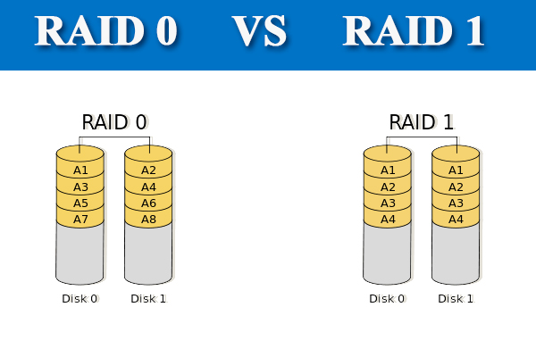
  - 따라서 읽기/쓰기 속도를 높이려면 RAID 0이 낫다
  - 출처
    - https://www.partitionwizard.com/partitionmanager/raid-0-vs-raid-1.html
- ACL vs 보안 그룹
  - 
  - 네트워크 ACL과 보안그룹은 방화벽과 같은 역할을 하며 인바운드 트래픽과 아웃바운드 트래픽 보안정책을 설정할 수 있다
  - 먼저 보안그룹은 Stateful(상태 저장) 한 방식으로 동작하는 보안 그룹은 모든 허용을 차단하도록 기본 설정되어있으며 필요한 설정은 허용해주어야 한다
  - 네트워크 ACL은 Stateless하게(상태 비저장) 작동하며 모든 트래픽을 기본 설정되어있기 때문에 불필요한 트래픽을 막도록 적용해야 한다
  - 서브넷 단위로 적용되며 리소스 별로는 설정할 수 없다. 네트워크 ACL과 보안 그룹이 충돌한다면 보안 그룹이 더 높은 우선순위를 갖는다
  - 출처
    - https://docs.aws.amazon.com/ko_kr/vpc/latest/userguide/VPC_Security.html
    - https://swiftymind.tistory.com/132
- AWS Snow Family
  - 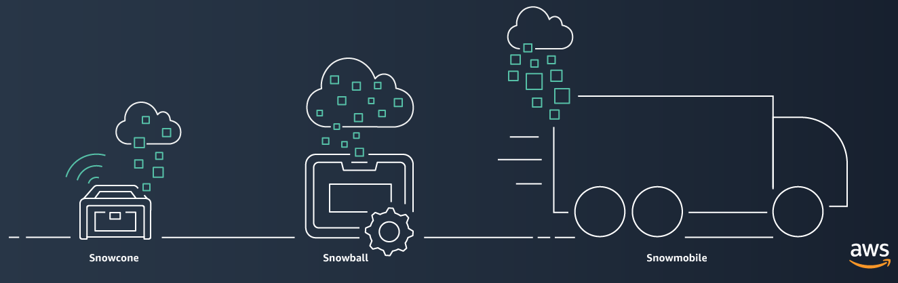
  - AWS Snow Family는 까다로운 비데이터 센터 환경 및 네트워크 연결이 일관되지 않은 위치에서 작업을 실행해야하는 고객을 지원한다
  - AWS와 일관된 엣지 컴퓨팅 디바이스
    - 네트워크 연결 없이도 직접 애플리케이션을 실행한다
    - 엣지에서 데이터를 처리하고 AWS로 데이터를 마이그레이션한다
  - snowcone < snowball < snowmobile
  - snowball에서 Glacier로 데이터를 직접 이동할 수는 없다. 먼저 S3를 거친 후 Glacier로 보내야 한다
- AMI
  - Amazon Machine Image
  - AMI는 리전 별로 관리된다. 따라서 다른 리전에서 사용하려면 복사를 먼저 한 후 사용해야 한다
  - AMI에는 네트워크 액세스 제어나 공유 기능이 없다

- VPC 피어링 vs VPC 서브넷 공유
  - VPC 피어링은 서로 다른 VPC 간에 통신이 가능하도록 만들어 주는 기능이다
    - 각 서브넷에 연결된 라우트 테이블을 적절하게 수정해줘야 한다
  - VPC 서브넷 공유는 말 그대로 다른 계정에게 VPC 서브넷을 공유해서 쓰도록 하는 것이다
    - 동일한 AWS Organization에 있는 계정에서만 공유할 수 있다
    - VPC 자체를 공유하지는 못한다. 서브넷을 공유하는 것이다
- AWS Organizations
  - 결제를 관리하고, 액세스, 규정 준수 및 보안을 제어하고 AWS 계정에서 리소스를 공유하는 일을 모두 중앙에서 손쉽게 처리할 수 있다
  - 계정 생성을 자동화하고, 비즈니스 요구를 반영하도록 계정 그룹을 생성하고, 거버넌스를 위해 이러한 그룹에 정책을 적용할 수 있다
    - 거버넌스: 일반적으로 과거의 일방적인 정부 주도적 경향에서 벗어나 정부, 기업, 비정부기구 등 다양한 행위자가 공동의 관심사에 대한 네트워크를 구축하여 문제를 해결하는 새로운 국정운영의 방식'을 말한다
    - 즉 각 부서가 역할에 따라 클라우드 운영을 함께 해나가는 방식을 의미하는 것으로 보인다
  - 계정에서 허용되는 서비스 및 작업을 제한할 수 있다. 서비스 제어 정책(SCP)을 사용하여 AWS identity and Access Management(IAM) 사용자 및 역할에 대한 권한 보호 계층을 적용할 수 있다
    - 예를 들어 조직 계정의 사용자가 허용되지 않는 리전에서 리소스를 실행하는 것을 제한하는 것 등
- 인터넷에서 데이터를 전송할 때 S3 데이터 전송 요금은 없다. S3TA(Transfer Acceleration)을 사용하는 경우에는 가속화된 전송에 대해서만 비용을 지불한다
  - S3에서 인터넷으로 전송할 때 요금을 지불한다. cf) 1GB/월은 0.00 USD
  - S3에서 동일한 버킷과 동일한 리전 내의 AWS 서비스로 전송된 데이터도 요금 x
  - CloudFront로 전송된 데이터도 요금 x
- Amazon S3 Standard-Infrequent Access(S3 Standard-IA)
  - S3 Standard-IA는 자주 액세스하지 않지만 필요할 때 빠르게 액세스해야 하는 데이터에 적합합니다
- Network load balancer(NLB) vs Application load balancer(ALB)
  - ALB
    - Layer7(HTTP/HTTPS traffic)
    - Application Load Balancer는 요청 수준(7계층)에서 작동하여 트래픽을 대상으로 라우팅합니다. HTTP 및 HTTPS 트래픽의 고급 로드 밸런싱에 이상적인 Application Load Balancer 장치는 마이크로 서비스 및 컨테이너 기반 애플리케이션을 비롯한 최신 애플리케이션 아키텍처를 제공하는 데 적합한 고급 요청 라우팅을 제공합니다. 하지만 Application Load Balancer는 지정된 사용 사례에서 언급된 짧은 지연 시간 및 높은 처리량 시나리오에 적합하지 않습니다
  - NLB
    - Layer4(TLS/TCP/UDP traffic)
    - 초당 수백만 개의 요청을 처리할 수 있습니다
  - ALB는 Layer7 계층 로드 밸런서이므로 HTTP 요청 헤더의 내용을 검사하여 요청을 라우팅할 위치를 결정한다. 따라서 ALB는 콘텐츠 기반 라우팅을 수행한다
  - NLB는 네트워크 및 TCP 계층 변수만을 기반으로 결정을 내리고 응용프로그램을 인식하지 않는다. 애플리케이션이 제대로 콘텐츠를 제공하는지 확인하지 않고, 단순히 ICMP 핑이나 TCP 핸드 셰이크가 정상적이면 정상이라고 판단한다. 반면에 ALB는 HTTP GET과 같은 방식으로 가용성을 확인한다
  - 로드 밸런서는 트래픽을 다른 AWS 리전으로 분산하지 않는다. 따라서 리전 단위로 로드 밸런싱하고 싶으면 Route 53을 사용해야한다
- AWS Trusted Advisor
  - AWS Trusted Advisor는 AWS 모범 사례에 따라 리소스를 프로비저닝하는 데 도움이 되도록 실시간 지침을 제공하는 온라인 도구입니다. Trusted Advisor는 AWS 인프라를 최적화하고 보안과 성능을 향상시키고 전체 비용을 절감하며 서비스 한도를 모니터링할 수 있습니다. 새 워크플로를 설정하든, 애플리케이션을 개발하든, 지속적인 개선의 목적으로 진행하든 상관없이, 정기적으로 Trusted Advisor에서 제시하는 권장 사항을 활용하면 솔루션을 최적으로 프로비저닝된 상태로 유지하는 데 도움이 됩니다
  - AWS Trusted Advisor는 AWS 환경을 분석하여 다음 5가지 카테고리의 모범 사례 권장 사항을 제공합니다.
    - 비용 최적화 : AWS Trusted Advisor는 미사용 및 유휴 리소스를 제거하거나 예약 용량을 약정하여 AWS에서 비용을 절감할 수 있습니다
    - 성능 : AWS Trusted Advisor는 서비스 한도를 점검하고 프로비저닝된 처리량을 활용하는지 확인하며 과다 사용되는 인스턴스를 모니터링함으로써 서비스 성능을 개선할 수 있습니다
    - 보안 : AWS Trusted Advisor는 결함을 없애고 다양한 AWS 보안 기능을 사용하며 권한을 점검하여 애플리케이션 보안을 개선할 수 있습니다
    - 내결함성 : AWS Trusted Advisor는 Auto Scaling, 상태 확인, 다중 AZ 및 백업 기능을 활용하여 AWS 애플리케이션의 가용성과 중복성을 향상시킬 수 있습니다
    - 서비스 한도 : AWS Trusted Advisor는 서비스 사용량이 서비스 한도의 80%를 넘는지 점검합니다. 값은 스냅샷을 기반으로 하므로 현재 사용량은 다를 수 있습니다. 한도 및 사용량에 변경 사항이 반영되는 데 최대 24시간이 걸릴 수 있습니다
- Amazon Inspector
  - Amazon Inspector는 AWS에 배포된 애플리케이션의 보안 및 규정 준수를 개선하는데 도움이 되는 자동 보안 평가 서비스입니다
- Amazon Simple Workflow Service(Amazon SWF)
  - Amazon Simple Workflow Service(Amazon SWF)는 분산 애플리케이션 구성 요소에서 작업을 쉽게 조정할 수 있도록 해주는 웹 서비스입니다. Amazon SWF를 사용하면 광범위한 사용 사례, 예를 들어 미디어 프로세싱, 웹 애플리케이션의 백 엔드, 비즈니스 프로세스 워크플로우, 분석 파이프라인 등에 대한 애플리케이션을 여러 작업의 조정으로 설계할 수 있습니다. 작업은 애플리케이션의 다양한 처리 단계의 호출을 의미하며 실행 코드, 웹 서비스 호출, 사람의 활동 및 스크립트 등을 통해 수행할 수 있습니다
- Elastic Network Adapter(ENA)
  - 향상된 네트워킹에서는 [지원되는 인스턴스 유형](https://docs.aws.amazon.com/ko_kr/AWSEC2/latest/UserGuide/enhanced-networking.html#supported_instances)에서 단일 루트 I/O 가상화(SR-IOV)를 사용하여 고성능 네트워킹 기능을 제공합니다. SR-IOV는 기존 가상 네트워크 인터페이스에 비해 높은 I/O 성능 및 낮은 CPU 사용률을 제공하는 디바이스 가상화 방법입니다. 향상된 네트워킹을 통해 대역폭과 PPS(Packet Per Second) 성능이 높아지고, 인스턴스 간 지연 시간이 지속적으로 낮아집니다
  - EFA는 추가 기능이 있는 ENA(Elastic Network Adapter)입니다. 따라서 추가적인 OS 우회 기능을 포함한 모든 ENA의 기능을 제공합니다. OS 우회는 HPC 및 기계 학습 애플리케이션이 네트워크 인터페이스 하드웨어와 직접 통신하도록 하는 액세스 모델로서 낮은 지연율과 신뢰성 높은 전송 기능을 제공합니다
  - 
  - Windows 인스턴스에서는 EFAs에서 제공하는 OS 우회 기능을 지원하지 않습니다. EFA를 Windows 인스턴스에 연결한 경우 인스턴스는 추가적인 EFA 기능이 없는 ENA(Elastic Network Adapter)로 작동합니다
- AWS ParallelCluster
  - AWS에서 고성능 컴퓨팅 (HPC) 클러스터를 쉽게 배포하고 관리 할 수 있는 오픈 소스 클러스터 관리 도구이다
- AWS Snowball Edge
  - AWS Snowball Edge 는 온보드 스토리지와 일부 AWS 기능을 위한 컴퓨팅 파워를 갖춘 일종의 Snowball 디바이스입니다. Snowball Edge는 로컬 프로세싱 및 에지 컴퓨팅 워크로드를 수행할 수 있으며 로컬 환경과 AWS 클라우드 간에 데이터를 전송할 수도 있습니다
  - 각 Snowball Edge 장치는 인터넷보다 빠른 속도로 데이터를 전송할 수 있습니다. 이 전송은 지역 운송업체를 통해 기기의 데이터를 운송하는 방식으로 이루어집니다. 이 기기는 견고하며 E Ink 배송 라벨이 부착되어 있습니다
  - Snowball 및 Snowball Edge는 서로 다른 두 개의 디바이스입니다. 두 디바이스를 통해 방대한 양의 데이터를 Amazon S3에 업로드하고 다운로드할 수 있습니다. 두 디바이스는 모두 동일한 작업 관리 API를 가지며 동일한 콘솔을 사용합니다. 그러나 두 디바이스의 하드웨어 사양, 일부 기능, 사용되는 전송 도구, 가격은 다릅니다
  - AWS Snowball 디바이스는 AWS Snowball Edge보다 저렴하지만 한 디바이스에 80TB의 데이터를 저장할 수 없습니다. 저장 용량은 Snowball 및 Snowball Edge에 사용 가능한 용량과 다릅니다. 80TB Snowball 어플라이언스 및 100TB Snowball Edge 어플라이언스에는 각각 72TB 및 83TB의 사용 가능한 용량만 있습니다. 따라서 하나의 AWS Snowball Edge 디바이스를 사용하는 것과 비교하여 2개의 Snowball 디바이스를 사용하면 비용이 많이 듭니다
- 연결 드레이닝(connection draining)
  - 기존 연결이 열려 있는 상태에서 Classic Load Balancer가 등록 취소 중이거나 비정상 상태인 인스턴스로의 요청 전송을 중지하도록 하려면 연결 드레이닝을 사용하십시오. 이렇게 하면 로드 밸런서가 등록 취소 중이거나 비정상 상태인 인스턴스로 진행 중인 요청을 완료합니다
  - 연결 드레이닝을 활성화하면 로드 밸런서가 인스턴스의 등록 취소를 보고하기 전에 연결을 유지할 수 있는 최대 시간을 지정할 수 있습니다. 최대 제한 시간 값의 범위는 1 ~ 3,600초입니다(기본은 300초). 최대 제한 시간에 도달하면 로드 밸런서는 등록 취소 중인 인스턴스로의 연결을 강제로 종료합니다
  - 진행 중인 요청이 처리되는 동안 로드 밸런서는 등록 취소 중인 인스턴스의 상태를 InService: Instance deregistration currently in progress로 보고합니다. 등록 취소 중인 인스턴스가 진행 중인 모든 요청의 처리를 완료하거나 최대 제한 시간에 도달하면 로드 밸런서는 인스턴스 상태를 OutOfService: Instance is not currently registered with the LoadBalancer로 보고합니다

# 연습 테스트 2

- S3 접두사 설정을 통해 트랜잭션 성능을 높일 수 있다

  - S3는 요청 성능에서 초당 수천 회의 트랜잭션을 쉽게 달성할 수 있는데, 이는 버킷 접두사 별로 적용된다
  - 예를 들어 접두사 10개를 만들어서 읽기를 병렬화하는 경우 읽기 성능을 초당 55,000개로 늘릴 수 있다
  - 이름에 따라, 날짜에 따라 버킷을 새로 만들어서 쓰는 것은 비효율적일 뿐만 아니라 불가능할 수도 있다. 버킷은 전역적이므로 이름이 중복되면 안되기 때문이다

- DynamoDB와 CloudFront는 Read Replica 기능이 없기 때문에 다중 AZ 배포로 실행 중이라고 할 수 없다

  - RDS와 Aurora는 Read Replica 기능이 있고, 비동기식 복제를 제공한다

- AWS Resource Access Manager(RAM)

  - AWS Resource Access Manager(RAM)는 고객에게 AWS 계정 또는 AWS Organizations 내에서 리소스를 공유할 수 있는 간단한 방법을 제공합니다. 많은 AWS 고객이 여러 AWS 계정을 사용하여 팀에 관리 및 결제 자율성을 제공합니다. 이러한 고객은 이제 중앙 집중식으로 리소스를 생성하고 RAM을 사용하여 여러 계정 간에 공유할 수 있으므로 다중 계정 전략의 이점을 유지하면서 고객의 운영 오버헤드는 줄일 수 있습니다. RAM을 사용하여 리소스를 공유하면 고객이 각 계정에서 중복 리소스를 만들지 않아도 되므로 비용을 절감할 수 있습니다. 공유 리소스의 소비는 AWS Identity and Access Management의 액세스 제어 정책과 AWS Organizations의 서비스 제어 정책에 의해 관리되므로 고객은 보안 및 거버넌스 제어에 대한 기존 투자를 활용할 수 있습니다
  - IAM을 사용하여 다른 AWS 계정에있는 리소스에 대한 액세스 권한을 위임 할 수 있습니다. 이 프로세스는 매우 번거롭고 회사의 모든 AWS 계정에 대한 계정 간 액세스를 수동으로 설정해야하기 때문에 많은 작업 오버 헤드가 필요합니다. 더 나은 솔루션은 AWS Resources Access Manager를 사용해서 IAM을 활용하는 것이다

- AWS Lambda는 함수를 실행하고 저장하는 데 사용할 수 있는 컴퓨팅 및 스토리지 리소스의 양을 제한합니다. 다음과 같은 리전당 할당량이 적용되며 이 할당량 증가 요청을 통해 이를 늘릴 수 있습니다

  | 리소스                                                       | 기본 할당량                                                  | 최대 한도 증가 |
  | :----------------------------------------------------------- | :----------------------------------------------------------- | :------------- |
  | 동시 실행                                                    | 1,000                                                        | 수십만         |
  | 함수 및 계층 스토리지(.zip 파일 아카이브)                    | 75 GB                                                        | TB             |
  | 함수 스토리지(컨테이너 이미지)                               | [Amazon ECR 서비스 할당량](https://docs.aws.amazon.com/AmazonECR/latest/userguide/service-quotas.html)을 참조하세요. |                |
  | [Virtual Private Cloud(VPC)별 탄력적 네트워크 인터페이스](https://docs.aws.amazon.com/ko_kr/lambda/latest/dg/configuration-vpc.html) **참고**이 할당량은 Amazon Elastic File System(Amazon EFS)과 같은 다른 서비스와 공유됩니다. [Amazon VPC 할당량](https://docs.aws.amazon.com/vpc/latest/userguide/amazon-vpc-limits.html)을 참조하세요. | 250                                                          | 수백           |

  - 함수 구성, 배포, 실행에도 할당량이 적용된다. 이는 변경할 수 없다. 대표적인 할당량은 아래와 같다
    - 메모리 할당: 128MB ~ 10,240 MB, 1MB씩 증분됨
    - 제한 시간: 900초 (15 minutes)
  
- AWS 네트워크 정리

  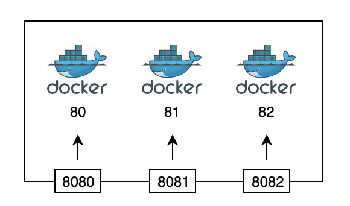

  - VPC

    - 사용자에게 제공하는 가상 네트워크 사설 망
    - 리전 단위로 설정한다

  - Subnet

    - VPC 내에서 더 작은 범위로 나눈 것
    - 리전 내 가용영역 단위로 설정한다
    - 인터넷 게이트웨이를 통해 public access가 가능하면 public subnet 아니라면 private subnet

  - Routing Table

    - 네트워크 이동에 대한 이정표
    - 서브넷 단위로 설정한다. custom route table을 설정하지 않으면 vpc 내 기본 라우팅 테이블을 따름
      - ex) Subnet에 존재하는 인스턴스에 요청을 보낼 때는 target을 local로 잡고, 인터넷으로 나가는 요청을 보낼 때에는 target을 인터넷 게이트웨이로 잡는다. vpn 영역으로 요청을 보낼 경우에는 Virtual private gateway로 잡는다

  - Internet Gateway

    - 인터넷과 연결해주는 중간 매개체
    - 라우팅 테이블에서 상위부터 매칭되는 IP에 대한 타깃을 찾고, 없으면 가장 마지막 igw ip를 찾게 하도록 설정한다
    - vpc와 연결가능한 internet gateway는 1개이고, internet gateway는 managed service로서 확장성, 가용성, 중복성을 보장하도록 설계 되었으며 ipv4와 ipv6모두 지원합니다

  - NAT Gateway

    - private subnet이 인터넷과 연결하기 위한 아웃바운드 instance
    - 따라서 public subnet에 존재하는 instance
    - private network가 외부에서 요청되는 인바운드는 필요 없더라도 인스턴스의 펌웨어나 혹은 주기적인 업데이트가 필요하여 아웃바운드 트래픽만 허용되야할 경우가 있다. 또한 WAS나 DB를 private subnet에 두는 경우가 있다. 이때 public subnet에서 동작하는 NAT 게이트웨이는 private subnet에서 외부로 요청하는 아웃바운드 트래픽을 받아 인터넷 게이트웨이와 연결한다
    - internet gateway와 마찬가지로 NAT gateway도 managed service입니다

    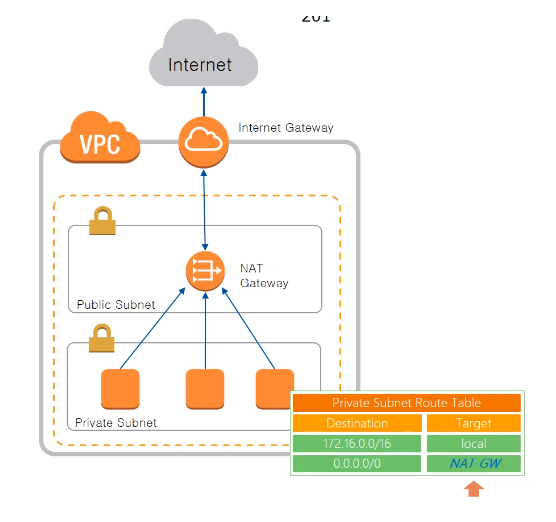

  - Elastic IP

    - Elastic IP를 통해서 Public subnet에 있는 인스턴스들에게 고정 public ip를 할당할 수 있습니다
    - ec2장애 발생 시에 다른 ec2 인스턴스로 연결이 가능하고, region당 기본 5개의 Elastic IP가 할당이 가능합니다. 하지만 이는 soft limit으로 열려있는 부분이라 case open을 하여 확장할 수 있습니다

    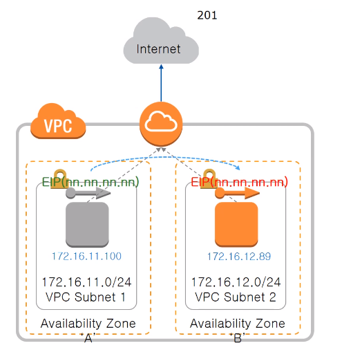

  - AWS Direct Connect

    - 전용회선을 연결하는 방법으로 aws와 직접 연결하는 방법이 아니라, DX location을 통해 aws와 연결하는 방식입니다. 국내에는 가산에 KINX, 평촌에 LG U+가 있습니다. DX location과 aws는 이미 연결이 되어있기 때문에 DX location까지만 전용회선을 구성하시면 됩니다

    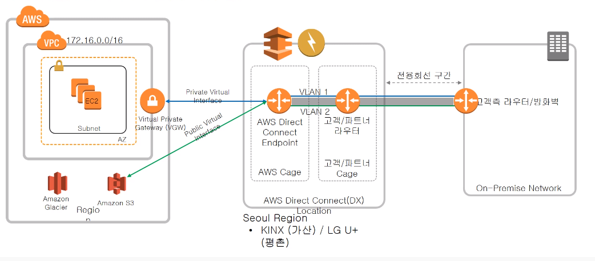

  - VPC Peering

    - VPC간의 연결을 지원해주는 VPC Peering에 대해서 알아보겠습니다. 완전히 격리된 vpc간에 네트워크 연결을 하는 옵션이고, 다른 account 뿐 아니라 다른 리전의 vpc도 연결이 가능합니다
    - vpc간에는 ip주소가 중복될 수 없고, routing table을 통해 통제가 가능하고, 단, transit routing은 제공되지 않습니다. 한 vpc에서 다른 vpc로 peering 요청을 하면 다른 vpc가 peering 승낙을 해야합니다. 그 후에 vpc routing table에 peering된 routing table 정보를 업데이트하면 vpc에 있는 리소스들이 연결이 가능해집니다

    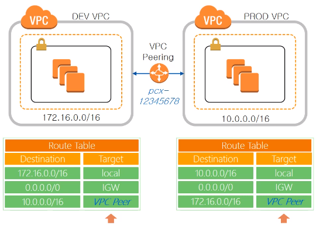

  - VPC Endpoints - Gateway Type

    - vpc 내에 있는 자원과 aws 서비스와의 연결을 위해 vpc endpoint를 사용할 수 있습니다. endpoint는 gateway type과 interface type으로 나눌 수 있습니다
    - Gateway type은 인터넷을 경유하지 않고, vpc 내에 있는 ec2 인스턴스와 S3, DynamoDB 를 연결할 수 있는 옵션입니다. VPC Endpoint 생성시 routing policy가 추가되어지고, routing table, VPC Endpoint policy, S3 bucket policy 등으로 접근 제어를 할 수 있습니다

    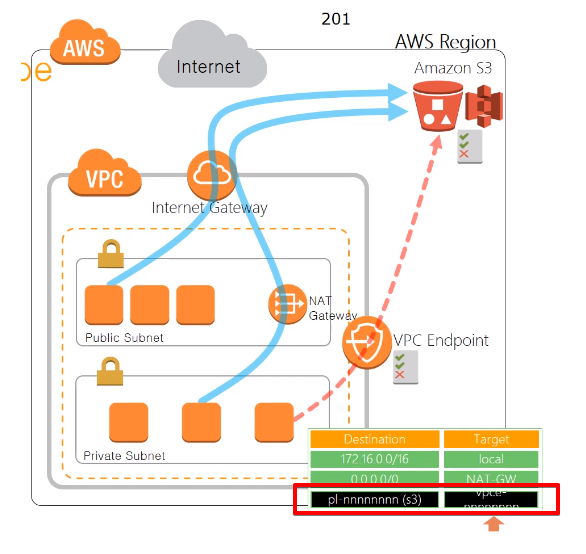

  - VPC Endpoints - Interface Type

    - VPC 내의 자원과 aws내의 자원을 private하게 연결할 수 있는 interface type입니다. private link를 통해서 vpc에서 다른 vpc로 접근하는 방법입니다

    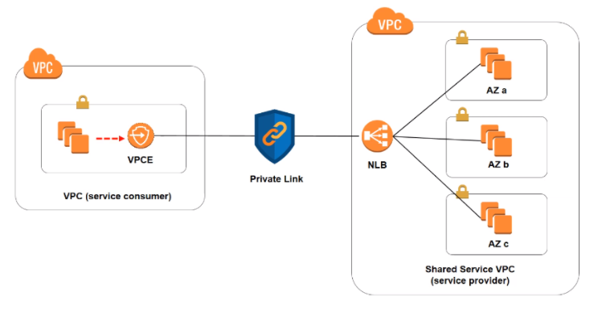

    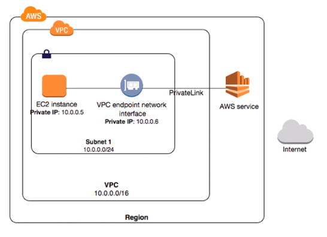

    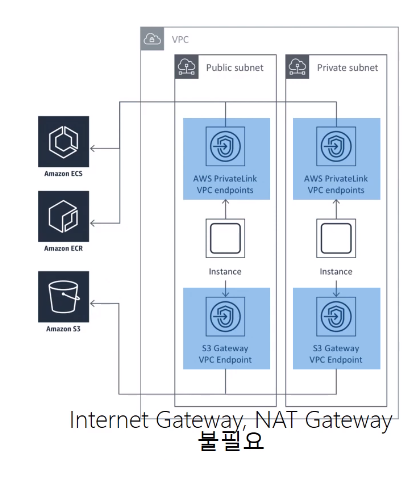

  - AWS Transit Gateway

    - AWS Transit Gateway는 중앙 허브를 통해 VPC와 온프레미스 네트워크를 연결합니다. 복잡한 피어링 관계를 제거하여 네트워크를 간소화합니다. 클라우드 라우터 역할을 하므로 새로운 연결을 한 번만 추가하면 됩니다
    - 글로벌 확장 시 리전 간 피어링을 사용하면 [AWS 글로벌 네트워크](https://aws.amazon.com/ko/about-aws/global-infrastructure/)에서 AWS Transit Gateway를 하나로 연결할 수 있습니다.. 데이터는 자동으로 암호화되고 퍼블릭 인터넷을 통하지 않습니다. 중앙 위치에 있으므로 [AWS Transit Gateway 네트워크 관리자](https://aws.amazon.com/ko/transit-gateway/network-manager/)를 사용하여 전체 네트워크를 보고 SD-WAN(소프트웨어 정의 광역 네트워크) 디바이스에 연결할 수 있습니다

    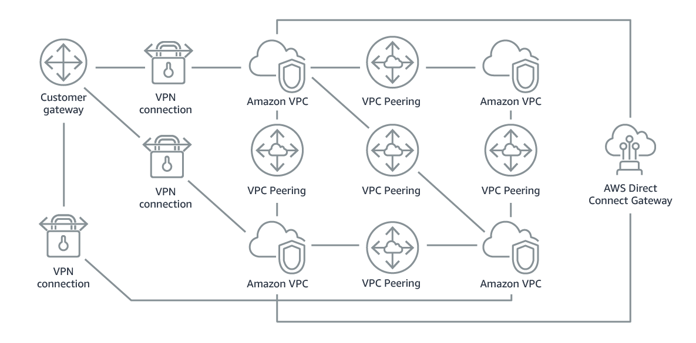

    - 위와 같이 VPC 피어링 및 VPN을 사용하여 복잡한 VPC 및 온프레미스 연결에서, 아래와 같이 네트워크 연결이 간편해질 수 있다

    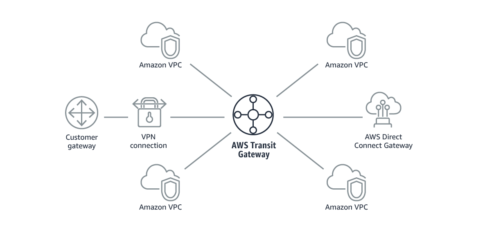

  - 출처

    - https://swiftymind.tistory.com/132
    - https://velog.io/@makeitcloud/AWS-AWS-Builders-online-Networking-%EC%A0%95%EB%A6%AC%ED%95%98%EA%B8%B0-1-Amazon-VPC-ELBDirect-ConnectVPN
    - https://aws.amazon.com/ko/transit-gateway/?whats-new-cards.sort-by=item.additionalFields.postDateTime&whats-new-cards.sort-order=desc

- Amazon SQS

  - 마이크로 서비스, 분산 시스템 및 서버리스 애플리케이션을 위한 완전관리형 메시지 대기열
  - SQS에서는 2가지 종류의 메시지 대기열을 제공합니다. 표준 대기열은 최대 처리량, 최선 노력 순서, 최소 1회 전달을 제공합니다. SQS FIFO 대기열은 메시지가 전송된 정확한 순서대로 정확히 한 번 처리되도록 설계되었습니다
  - Amazon SQS에서는 메시지 보존 기간을 1분에서 14일 사이의 값으로 구성할 수 있으며 기본값은 4일입니다
  - 단일 Amazon SQS 메시지 대기열에는 무제한의 메시지가 포함될 수 있습니다. 그러나 표준 큐의 이동 중 메시지 수는 120,000개, FIFO 큐의 경우 20,000개의 제한이 있습니다
    - Amazon SQS 메시지에는 다음과 같은 세 가지 기본 상태가 있습니다.
      1. 생산자가 대기열로 전송
      2. 소비자가 대기열에서 수신
      3. 대기열에서 삭제
    - 메시지는 다음과 같은 것으로 간주됩니다. 생성자가 대기열로 보내지만 소비자가 대기열에서 아직 수신하지 않은 경우(즉, 상태 1과 2 사이), 저장된 메시지 수에는 할당량이 없습니다. 소비자가 대기열에서 수신했지만 대기열에서 아직 삭제되지 않은 경우(즉, 상태 2와 3 사이), 이동 중인 메시지 수에는 할당량이 있습니다
  - 출처
    - https://aws.amazon.com/ko/sqs/
    - https://docs.aws.amazon.com/ko_kr/AWSSimpleQueueService/latest/SQSDeveloperGuide/sqs-visibility-timeout.html

- DynamoDB Accelerator(DAX)

  - DAX는 DynamoDB를 위한 가용성이 뛰어난 완전관리형 인 메모리 cache로서, 초당 요청 수가 몇 백만 개인 경우에도 몇 밀리초에서 몇 마이크로초까지 최대 10배의 성능을 제공합니다. 개발자가 캐시 무효화, 클러스터 관리 또는 데이터 집단을 관리할 필요 없이 DAX가 DynamoDB 테이블에 인 메모리 가속화를 추가하는 데 필요한 모든 작업을 수행합니다
  - DAX가 기존 DynamoDB API 호출과 호환되므로 애플리케이션 로직을 변경할 필요가 없습니다. AWS Management Console에서 클릭 몇 번 또는 AWS SDK를 사용하여 DAX를 활성화할 수 있습니다. DynamoDB에서와 마찬가지로 프로비저닝한 용량에 대해서만 비용을 지불하면 됩니다
  - AWS CLI를 사용하여 생성 된 DynamoDB 테이블에서는 기본적으로 Auto Scaling이 비활성화 되어 있습니다

- Amazon API Gateway

  - Amazon API Gateway는 어떤 규모에서든 개발자가 API를 손쉽게 게시, 유지 관리, 모니터링 및 보호할 수 있도록 지원하는 완전관리형 서비스입니다. AWS Management Console에서 몇 번의 클릭으로 애플리케이션이 백엔드 서비스(Amazon Elastic Compute Cloud(Amazon EC2), Amazon Elastic Container Service(Amazon ECS) 또는 AWS Elastic Beanstalk에서 실행되는 애플리케이션, AWS Lambda에서 실행되는 코드, 기타 웹 애플리케이션 등)의 데이터, 비즈니스 로직 또는 기능에 액세스할 수 있도록 "현관문" 역할을 하는 API를 생성할 수 있습니다
  - Amazon API Gateway는 트래픽 관리, 권한 부여 및 액세스 제어, 모니터링, API 버전 관리를 비롯해 최대 수십만 건의 동시 API 호출을 수락 및 처리하는 데 관련된 모든 작업을 처리합니다. Amazon API Gateway에는 최소 요금이나 시작 비용이 없습니다. HTTP API와 REST API의 경우 수신한 API 호출과 전송한 데이터 양에 대해서만 요금을 지불하면 됩니다. WebSocket API의 경우 전송하고 수신한 메시지와 사용자/디바이스가 WebSocket API에 연결한 시간에 대해서만 요금을 지불하면 됩니다

- CloudFront는 엣지 로케이션을 사용하여 사용자에게 더 빠르게 컨텐츠를 제공하지만 DynamoDB와 호환되지 않으므로 DynamoDB 테이블을 CloudFront와 통합 할 수 없습니다

- DNS에서 CNAME과 A 레코드의 차이

  - DNS는 Domain Name System의 약자로 naver.com 같은 문자열 주소를 IP 주소로 해석해주는 네트워크 서비스를 말한다. 예시는 아래와 같다

  | naver.com              | 192.168.0.1        |
  | ---------------------- | ------------------ |
  | dev.plusblog.co.kr     | 172,17.0.1         |
  | develop.plusblog.co.kr | dev.plusblog.co.kr |

  - 위 테이블에서 하나의 행(Row)를 '레코드(Record)'라고 하며, 저장되는 타입에 따라 A Record와 CNAME으로 구분할 수 있다
  - A 레코드(A Record)는 DNS에 저장되는 정보의 타입으로 도메인 주소와 서버의 IP 주소가 직접 매핑시키는 방법이다(위 테이블에서 1~2행)
  - CNAME은 Canonical Name의 약자로 도메인 주소를 또 다른 도메인 주소로 매핑 시키는 형태의 DNS 레코드 타입이다(위 테이블에서 3행)

- NAT 게이트웨이 vs NAT 인스턴스

  - 둘다 AWS에서 네트워크 주소 변환(Network Address Translation)에 쓰이는 디바이스이다
  - NAT 게이트웨이가 NAT 인스턴스보다 우수한 가용성 및 대역폭을 제공하므로 NAT 게이트웨이를 사용하는 것이 좋습니다. 또한 NAT 게이트웨이 서비스는 관리 작업이 필요하지 않은 관리형 서비스입니다. NAT 인스턴스는 NAT AMI에서 시작됩니다. 특별한 경우에 NAT 인스턴스를 사용하도록 선택할 수 있습니다
  - NAT 디바이스는 주소 변환과 포트 주소 변환(PAT)을 모두 담당합니다
  - NAT 인스턴스는 public subnet에 EC2 인스턴스를 만들어서 직접 NAT를 구현하는 것이다. 따라서 보안 그룹도 지정할 수도 있고, 접속 서버로도 사용할 수 있다

  | 속성                | NAT 게이트웨이                                               | NAT 인스턴스                                                 |
  | :------------------ | :----------------------------------------------------------- | :----------------------------------------------------------- |
  | 가용성              | 고가용성. 각 가용 영역의 NAT 게이트웨이는 중복적으로 구현됩니다. 각 가용 영역에 하나의 NAT 게이트웨이를 만들어 아키텍처가 영역에 종속되지 않도록 합니다. | 스크립트를 사용하여 인스턴스 간의 장애 조치를 관리합니다.    |
  | 대역폭              | 최대 45Gbps까지 확장할 수 있습니다.                          | 인스턴스 유형의 대역폭에 따라 다릅니다.                      |
  | 유지 관리           | AWS에서 관리합니다. 유지 관리 작업을 수행할 필요가 없습니다. | 사용자가 관리합니다(예: 인스턴스에 소프트웨어 업데이트 또는 운영 체제 패치 설치). |
  | 성능                | 소프트웨어가 NAT 트래픽 처리에 최적화되어 있습니다.          | NAT를 수행하도록 구성된 일반 Amazon Linux AMI입니다.         |
  | 비용                | 사용하는 NAT 게이트웨이 수, 사용 기간, NAT 게이트웨이를 통해 보내는 데이터의 양에 따라 요금이 청구됩니다. | 사용하는 NAT 인스턴스 수, 사용 기간, 인스턴스 유형과 크기에 따라 요금이 청구됩니다. |
  | 유형 및 크기        | 균일하게 제공되므로, 유형 또는 크기를 결정할 필요가 없습니다. | 예상 워크로드에 따라 적합한 인스턴스 유형과 크기를 선택합니다. |
  | 퍼블릭 IP 주소      | 생성할 때 NAT 게이트웨이와 연결할 탄력적 IP 주소를 선택합니다. | 탄력적 IP 주소 또는 퍼블릭 IP 주소를 NAT 인스턴스와 함께 사용합니다. 새 탄력적 IP 주소를 인스턴스와 연결하여 언제든지 퍼블릭 IP 주소를 변경할 수 있습니다. |
  | 프라이빗 IP 주소    | 게이트웨이를 만들 때 서브넷의 IP 주소 범위에서 자동으로 선택됩니다. | 인스턴스를 시작할 때 서브넷의 IP 주소 범위에서 특정 프라이빗 IP 주소를 할당합니다. |
  | 보안 그룹           | NAT 게이트웨이와 연결할 수 없습니다. 보안 그룹을 NAT 게이트웨이 뒤의 리소스와 연결하여 인바운드 및 아웃바운드 트래픽을 제어할 수 있습니다. | NAT 인스턴스 뒤의 리소스 및 NAT 인스턴스와 연결하여 인바운드 및 아웃바운드 트래픽을 제어합니다. |
  | 네트워크 ACL        | 네트워크 ACL을 사용하여 NAT 게이트웨이가 위치하고 있는 서브넷에서 보내고 받는 트래픽을 제어합니다. | 네트워크 ACL을 사용하여 NAT 인스턴스가 위치하고 있는 서브넷에서 보내고 받는 트래픽을 제어합니다. |
  | 흐름 로그           | 흐름 로그를 사용하여 트래픽을 캡처합니다.                    | 흐름 로그를 사용하여 트래픽을 캡처합니다.                    |
  | 포트 전달           | 지원하지 않음.                                               | 포트 전달을 지원하려면 구성을 수동으로 사용자 지정합니다.    |
  | 접속 서버           | 지원하지 않음.                                               | 접속 서버로 사용합니다.                                      |
  | 트래픽 지표         | [NAT 게이트웨이에 대한 CloudWatch 지표](https://docs.aws.amazon.com/ko_kr/vpc/latest/userguide/vpc-nat-gateway-cloudwatch.html)를 확인합니다. | 인스턴스에 대한 CloudWatch 지표를 확인합니다.                |
  | 제한 시간 초과 동작 | 연결 제한 시간이 초과하면 NAT 게이트웨이는 연결을 계속하려고 하는 NAT 게이트웨이 뒤의 리소스로 RST 패킷을 반환합니다(FIN 패킷을 보내지 않음). | 연결 제한 시간이 초과하면 NAT 인스턴스는 NAT 인스턴스 뒤의 리소스로 FIN 패킷을 전송하여 연결을 닫습니다. |
  | IP 조각화           | UDP 프로토콜에서 IP 조각화된 패킷의 전달을 지원합니다.TCP 및 ICMP 프로토콜에 대해서는 조각화를 지원하지 않습니다. 이러한 프로토콜의 조각화된 패킷은 삭제됩니다. | UDP, TCP 및 ICMP 프로토콜에 대해 IP 조각화된 패킷의 재수집을 지원합니다. |

  - 출처
    - https://docs.aws.amazon.com/ko_kr/vpc/latest/userguide/vpc-nat-comparison.html
    - https://blog.2dal.com/2018/12/31/nat-gateway-to-nat-instance/

- VPC 피어링 장점

  - AWS는 VPC의 기존 인프라를 사용하여 VPC 피어링 연결을 생성합니다. 이는 게이트웨이도, VPN 연결도 아니며 물리적 하드웨어 각각에 의존하지 않습니다. 그러므로 통신 또는 대역폭 병목에 대한 단일 지점 장애가 없습니다
  - VPC 피어링 연결의 VPC가 동일한 리전 내에 있는 경우 VPC 피어링 연결 내에서의 데이터 전송에 대한 요금은 가용 영역에서의 데이터 전송 요금과 동일합니다. VPC가 다른 리전에 있는 경우 리전 간 데이터 전송 비용이 적용됩니다

- IAM 정책 vs IAM 역할

  - IAM 정의
    - AWS 자격 및 접근 관리(AWS Identity and Access Management, IAM)는 는 당신의 사용자들이 AWS 리소스에 대하여 가지는 접근 권한을 안전하게 제어할 수 있도록 도와주는 웹 서비스입니다. IAM을 사용하여 누가 AWS 리소스를 이용할 수 있는지(인증:Authentication), 그리고 사용자가 접근 가능한 리소스를 어떤 방식으로 이용할 수 있는지(권한 부여:Authorization)를 제어합니다
  - IAM 사용자
    - AWS 계정을 처음 생성하면 루트 사용자가 됩니다. 계정을 만들때 사용한 전자 메일 주소와 암호를 루트 계정 자격 증명(credentials)이라고합니다. 이를 사용해 AWS 관리 콘솔에 로그인할 수 있습니다. 그렇게 하면 결제 정보에 대한 접근 및 비밀번호 변경 기능을 포함하여 AWS 계정의 모든 리소스에 대한 무제한 접근 권한을 갖게 됩니다
    - 이 수준의 접근 권한을 가지고 정기적으로 계정에 액세스하는 것은 좋지 않지만, 당신이 계정을 사용하는 유일한 사람인 경우 문제가 되지 않습니다. 그러나 다른 사람이 AWS 계정에 접근하고 관리해야할 경우, 루트 자격 증명을 제공하지 말아야 합니다. 대신, 별도의 IAM 사용자를 생성하는 것이 좋습니다
    - IAM 사용자는 AWS 관리 콘솔에 로그인하기 위한 이름, 비밀번호 및 API 또는 CLI와 함께 사용할 수 있는 최대 2개의 액세스 키로 구성됩니다. 기본적으로 사용자는 계정의 그 어떤 서비스 항목에도 접근할 수 없습니다. 여러분이 직접 정책을 작성하고 사용자에게 해당 정책을 첨부하여 권한을 부여해야합니다. 하나 이상의 정책을 부여하여 해당 사용자의 접근 범위를 제한할 수 있습니다
  - IAM 정책
    - IAM 정책(Policy)은 AWS 리소스에서 수행할 수 있는 작업을 정의하는 규칙 또는 규칙들의 집합입니다
    - 정책 부여 방법
      1. 관리되는 정책 첨부하기. AWS는 *AmazonS3ReadOnlyAccess*와 같은 사전 정의된 정책 목록을 제공합니다
      2. 인라인 정책을 첨부하기. 인라인 정책은 여러분이 직접 손으로 작성한 사용자 지정 정책입니다
      3. 적절한 권한 정책이 첨부된 그룹에 사용자를 추가하기
      4. 기존 IAM 사용자의 권한을 복제하기
  - IAM 역할
    - IAM 역할은 권한 정책이 부여된 자격(Identity)으로, 권한 정책은 어떤 자격을 가졌을 때 AWS 상에서 수행할 수 있는 작업의 범위를 정헤줍니다. 이런 점에서 IAM 역할은 사용자와 아주 유사합니다. 하지만 역할은 자격 증명(암호 또는 접근 키)을 갖지 않는다는 차이점을 갖습니다. 역할은 한 사용자에 고유하게 연결되는 것이 아니라, 해당 역할을 필요로 하는 사용자에 의하여 사용될 수 있습니다
    - IAM 역할은 사용자 혹은 AWS 리소스에 적용된다
      - 이 경우 사용자 혹은 AWS 리소스는 특정 IAM 역할에 대한 정책 집합을 부여받게 됩니다. 이 기능은 사용자 혹은 AWS 리소스가 조직에서 여러 개의 “모자”를 쓰고 있는 경우에 유용합니다. 어떤 특정한 역할을 수행하기 위해 이러한 역할을 한 번만 만들면 되기 때문에 훨씬 수월하며 이러한 역할을 수행하려는 다른 사용자 혹은 AWS 리소스에 다시 사용할 수 있습니다

- EC2 인스턴스와 볼륨

  - 인스턴스를 시작하면 인스턴스 부팅에 사용된 이미지가 루트 디바이스 볼륨에 저장됩니다. Amazon EC2가 출시되었던 시점에서는 Amazon EC2 인스턴스 스토어가 모든 AMI를 지원했으므로 AMI에서 시작한 인스턴스의 루트 디바이스는 Amazon S3에 저장된 템플릿으로부터 생성된 인스턴스 스토어 볼륨이었습니다. Amazon EBS가 출시된 후에는 Amazon EBS의 지원을 받는 AMI가 도입되었습니다. 따라서 AMI에서 시작한 인스턴스의 루트 디바이스는 Amazon EBS 스냅샷으로부터 생성된 Amazon EBS 볼륨입니다
  - 사용자는 Amazon EC2 인스턴스 스토어가 지원하는 AMI와 Amazon EBS에서 지원하는 AMI 중에서 선택할 수 있습니다. 시작 속도가 더 빠르고 영구 스토리지를 사용하는 Amazon EBS 지원 AMI를 사용하는 것이 좋습니다
  - 인스턴스 스토어를 루트 디바이스로 사용하는 인스턴스는 하나 이상의 인스턴스 스토어 볼륨을 자동으로 사용할 수 있으며, 이러한 볼륨 중 하나가 루트 디바이스 볼륨 역할을 합니다. 인스턴스가 시작되면 인스턴스를 부팅하는 데 사용된 이미지가 루트 볼륨으로 복사됩니다. 인스턴스 유형에 따라 다른 인스턴스 스토어 볼륨을 사용할 수도 있습니다
  - 인스턴스 스토어 볼륨의 모든 데이터는 인스턴스가 실행되는 동안 유지되지만, 인스턴스가 종료되거나(인스턴스 스토어 지원 인스턴스는 중지 작업을 지원하지 않음) 장애가 발생하면(예: 기본 드라이브에 문제가 있는 경우) 데이터가 삭제됩니다

  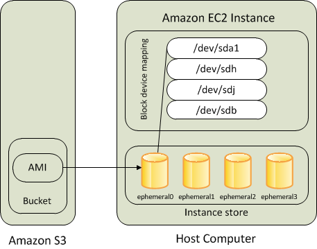

  - 인스턴스 스토어가 지원하는 인스턴스는 종료되거나 장애가 발생할 경우 복원이 불가능합니다. Amazon EC2 인스턴스 스토어가 지원하는 인스턴스를 사용하려는 경우 여러 가용 영역의 인스턴스 스토어로 데이터를 분산하는 것이 좋습니다. 또한 인스턴스 스토어 볼륨의 중요한 데이터를 정기적으로 영구 스토리지로 백업해야 합니다
  - 인스턴스 스토어 지원 AMI 또는 Amazon EBS 지원하는 AMI에서 인스턴스를 시작할 수 있습니다. AMI 설명에는 AMI의 유형이 포함되며, 설명 중간에 루트 디바이스가 ebs(Amazon EBS 지원) 또는 instance store(인스턴스 스토어 지원)로 언급됩니다. 각 AMI 유형별로 수행할 수 있는 작업이나 기능이 달라지기 때문에 이 차이점을 아는 것이 중요합니다
  - Amazon EBS를 루트 디바이스로 사용하는 인스턴스에는 자동으로 Amazon EBS 볼륨이 연결됩니다. Amazon EBS 지원 인스턴스를 시작하면 사용하는 AMI가 참조하는 각 Amazon EBS 스냅샷에 대한 Amazon EBS 볼륨이 생성됩니다. 인스턴스 유형에 따라 다른 Amazon EBS 볼륨이나 인스턴스 스토어 볼륨을 사용할 수도 있습니다

  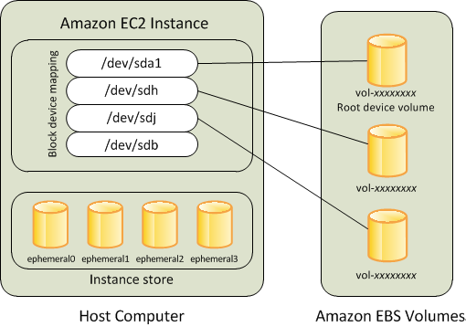

  - Amazon EBS 지원 인스턴스는 중지한 후 다시 시작해도 연결된 볼륨에 저장된 데이터에 아무런 영향이 없습니다. Amazon EBS 지원 인스턴스가 중지 상태일 때 다양한 인스턴스 및 볼륨 관련 작업을 수행할 수 있습니다. 예를 들어 인스턴스의 속성을 수정하거나, 인스턴스의 크기를 변경하거나, 사용하는 커널을 업데이트하거나, 디버깅 등의 목적으로 루트 볼륨을 실행 중인 다른 인스턴스에 연결할 수 있습니다
  - **기본적으로 Amazon EBS에서 지원하는 AMI의 루트 볼륨은 인스턴스 종료 시 삭제**됩니다. **인스턴스가 종료된 후에도 볼륨이 지속되도록 기본 동작을 변경**할 수 있습니다

- Amazon Kinesis Data Streams

  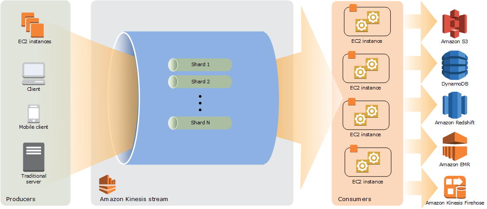

  - Amazon Kinesis Data Streams를 사용하여 대규모 데이터 레코드 스트림을 실시간으로 수집하고 처리할 수 있습니다. Kinesis Data Streams 애플리케이션이라고 알려진 데이터 처리 애플리케이션을 생성할 수 있습니다. 일반적인 Kinesis Data Streams 애플리케이션은 데이터가 기록될 때 데이터 스트림에서 데이터를 읽습니다. 이러한 애플리케이션은 Kinesis Client Library를 사용하며 Amazon EC2 인스턴스에서 실행될 수 있습니다. 처리된 레코드를 대시보드로 보내거나, 알림을 생성하는 데 사용하거나, 요금 및 광고 전략을 동적으로 변경하거나, 다른 여러 AWS 제품에 데이터를 보낼 수 있습니다
  - 위 다이어그램은 Kinesis Data Streams의 상위 수준 아키텍처를 보여줍니다. 생산자가 계속해서 Kinesis Data Streams에 데이터를 푸시하고 소비자가 실시간으로 데이터를 처리합니다. 소비자(예: Amazon EC2에서 실행하는 사용자 지정 애플리케이션 또는 Amazon Kinesis Data Firehose 전송 스트림)는 Amazon DynamoDB, Amazon Redshift 또는 Amazon S3와 같은 AWS 서비스를 사용하여 결과를 저장할 수 있습니다

- VPC 엔드 포인트을 사용하면 인터넷 게이트웨이, NAT 장치, VPN 연결 또는 AWS Direct Connect 연결 없이도 AWS PrivateLink로 구동되는 지원되는 AWS 서비스 및 VPC 엔드 포인트 서비스에 VPC를 프라이빗으로 연결할 수 있습니다. VPC의 인스턴스에는 서비스의 리소스와 통신하는 데 퍼블릭 IP 주소가 필요하지 않으며 VPC와 다른 서비스 간의 트래픽이 Amazon 네트워크를 떠나지 않습니다

- ALB (Application Load Balancer)는 요청 수준 (계층 7)에서 작동하고 트래픽을 대상 (EC2 인스턴스, 컨테이너, IP 주소 및 Lambda)으로 라우팅합니다. HTTP 및 HTTPS 트래픽의 고급 로드 밸런싱에 이상적인 Application Load Balancer는 마이크로 서비스 및 컨테이너 기반 애플리케이션을 포함한 최신 애플리케이션 아키텍처를 제공하는 고급 요청 라우팅을 제공합니다. ALB는 계층 7 인 HTTP 트래픽만 지원하지만 SSH 프로토콜은 TCP를 기반으로 하며 계층 4입니다. 따라서 Application Load Balancer가 작동하지 않습니다

  - 따라서 회사에서 AWS 솔루션을 일부 활용하는 상황이고 IT 보안에 신경을 써야하는 상황이라면, VPC 환경에 접속 호스트로 Linux 인스턴스를 만들어서 인터넷 노출 없이(이 부분 설명은 없지만 Virtual Private Gateway를 통해 VPN이든 AWS Direct Connect이든 활용하는 것을 말하는 것 같다. VPC Endpoint는 AWS 네트워크 안에서만 활용하므로, 이 경우에는 VPC Endpoint를 활용하는 것은 아니다) SSH 연결을 활용할 수 있다. 이 SSH 연결을 통해 VPC 내 다른 인스턴스로 액세스할 수 있기 때문이다. 따라서, 이 경우에는 ALB가 아니라 NLB를 사용해야 한다

- AWS Database Migration Service

  - AWS Database Migration Service는 데이터베이스를 AWS로 빠르고 안전하게 마이그레이션할 수 있도록 지원합니다. 마이그레이션하는 동안 소스 데이터베이스가 변함없이 운영되어 해당 데이터베이스를 사용하는 애플리케이션의 가동 중지 시간을 최소화할 수 있습니다. AWS Database Migration Service를 사용하면 가장 널리 사용되는 상용 및 오픈 소스 데이터베이스로(부터) 데이터를 마이그레이션할 수 있습니다
  - AWS Database Migration Service는 Oracle에서 Oracle로의 마이그레이션과 같은 동종 마이그레이션뿐 아니라 Oracle 또는 Microsoft SQL Server에서 Amazon Aurora로의 마이그레이션과 같은 이기종 데이터베이스 플랫폼 간의 마이그레이션도 지원합니다
  - 이기종 데이터베이스 마이그레이션에서는 소스와 대상의 데이터베이스 엔진이 다릅니다(예: Oracle에서 Amazon Aurora로, Oracle에서 PostgreSQL로, Microsoft SQL Server에서 MySQL로 마이그레이션 등). 소스와 대상 데이터베이스의 스키마 구조, 데이터 유형 및 데이터베이스 코드가 상당히 다르므로, 데이터 마이그레이션을 시작하기 전에 스키마와 코드 변환이 필요합니다
  - 이로 인해 이기종 마이그레이션은 2단계 프로세스가 됩니다. 먼저 AWS Schema Conversion Tool을 사용하여 소스의 스키마와 코드를 대상 데이터베이스의 스키마와 코드에 맞게 변환한 후, AWS Database Migration Service를 사용하여 소스 데이터베이스에서 대상 데이터베이스로 데이터를 마이그레이션합니다. 모든 필요한 데이터 유형 변환은 마이그레이션이 진행되는 동안 AWS Database Migration Service에서 자동으로 처리합니다. 소스 데이터베이스는 AWS 외부의 자체 온프레미스에 있거나, Amazon EC2 인스턴스에서 구동되거나, Amazon RDS 기반 데이터베이스가 될 수 있습니다. 대상 데이터베이스는 Amazon EC2 또는 Amazon RDS 기반 데이터베이스가 될 수 있습니다

- Amazon ElastiCache

  - Amazon ElastiCache를 사용하면 널리 사용되는 오픈 소스 호환 인 메모리 데이터 스토어를 클라우드에서 원활하게 설정, 실행 및 크기 조정할 수 있습니다. 처리량이 많고 지연 시간이 짧은 인 메모리 데이터 스토어에서 데이터를 검색하여 데이터 집약적 앱을 구축하거나 기존 데이터베이스 성능을 강화합니다. Amazon ElastiCache는 캐싱, 세션 스토어, 게이밍, 지리공간 서비스, 실시간 분석 및 대기열과 같은 실시간 사용 사례에 많이 선택됩니다
  - Amazon ElastiCache는 밀리초 미만의 응답 시간을 필요로 하는 가장 까다로운 애플리케이션을 위한 완전관리형 Redis 및 Memcached를 제공합니다
  - 웹 애플리케이션에서 사용자 세션을 관리하는 방법에는 쿠키 전용에서 서버 로컬 캐싱을 포함한 분산 키/값 데이터베이스에 이르기까지 여러 가지가 있습니다. 특정 요청에 응답하여 웹 서버에 세션 데이터를 저장하면 데이터에 액세스할 때 네트워크 지연 시간이 발생하지 않으므로 편리해 보일 수 있습니다. 주요 단점은 각 사용자가 하나의 서버와만 상호 작용할 수 있도록 요청을 신중하게 라우팅해야 한다는 것입니다. 또 다른 단점은 서버가 다운되면 모든 세션 데이터도 사라진다는 것입니다. 분산된 인 메모리 키/값 데이터베이스는 네트워크 지연 시간이 짧아 비용이 적게 들기 때문에 이 두 가지 문제를 모두 해결할 수 있습니다. 대개는 쿠키에 모든 세션 데이터를 저장하는 것으로 충분하며, 중요한 데이터를 저장하려면 서버 측 세션을 사용하는 것이 좋습니다
  - 인 메모리 데이터 스토어로서 Memcached는 지속성이 중요하지 않은 경우 인터넷 규모 애플리케이션을 위한 세션 데이터를 저장하고 관리하는 애플리케이션 개발자들 사이에서 널리 사용됩니다. Memcached는 사용자 프로필, 자격 증명 및 세션 상태와 같은 세션 데이터를 관리하는 데 필요한 1밀리초 미만의 지연 시간과 규모를 제공하도록 설계되었습니다

- Amazon Simple Workflow Service(SWF) vs AWS Step Functions

  - 둘다 워크 플로우를 조정한다는 점에서 공통점이 있지만 AWS Step Functions는 **서버리스** 오케스트레이션이 가능하다는 점이 다르다
  - 워크 플로는 응용 프로그램에서 일반적으로 사용되는 패러다임입니다. 기본적으로 분산 된 구성 요소에서 비동기 작업을 조정하는 데 사용됩니다
  - AWS Step Functions를 사용하면 여러 AWS 서비스를 서버리스 워크플로로 조정하여 앱을 신속하게 빌드 및 업데이트할 수 있습니다. 또한 AWS Lambda, AWS Fargate 및 Amazon SageMaker와 같은 서비스를 기능이 풍부한 애플리케이션에 하나로 결합하는 워크플로를 설계하고 실행할 수 있습니다. 워크플로는 일련의 단계로 이루어져 있으며, 한 단계의 출력이 다음 단계의 입력이 됩니다. Step Functions를 사용하면 워크플로가 이해하기 쉽고 다른 사람에게 설명하기 쉬우며 변경하기 쉬운 상태 시스템 다이어그램으로 변환되므로 애플리케이션 개발을 훨씬 쉽고 직관적으로 수행할 수 있습니다. Step Functions가 자동으로 각 단계를 트리거 및 추적하고 오류가 발생할 경우 재시도하므로 애플리케이션이 의도한 대로 올바르게 실행됩니다. Step Functions를 사용하면 기계 학습 모델 교육, 보고서 생성, IT 자동화와 같이 장기 실행되는 워크플로를 만들 수 있습니다. 또한, IoT 데이터 수집, 스트리밍 데이터 처리와 같이 단기간에 대량을 처리하는 워크플로도 빌드할 수 있습니다
  - Step Functions는 사용자 정의 워크 플로 단계를 기반으로 여러 AWS Lambda 함수 또는 기타 AWS 리소스를 조정합니다. 클라우드의 워크 플로우 상태는 물론 각 단계의 입력 및 출력을 기반으로하는 흐름 조건을 추적합니다. Step Functions는 또한 모든 워크 플로 단계에 대해 오류 처리, 병렬 또는 순차 분기, 일정 및 재시도 동작을 정의하는 데 도움이됩니다
  - Step Functions는 관리 형 서비스이므로 사용자는 워크 플로 관리 또는 작업 자체를 위해 인프라를 배포하거나 유지 관리 할 필요가 없습니다. 또한 워크 플로 관리를 Lambda 함수를 활용해서 할 수 있으므로 러닝 커브가 SWF에 비해 낮다
  - SWF는 서버리스가 아니고 EC2 instance, on-premises server, 다른 클라우드 인프라를 활용해서 워크 플로를 조정한다. 또한 현재는 Java만 지원 프레임 워크로 남아 있어서 유연하지 않다
  - 출처
    - https://searchaws.techtarget.com/tip/Step-Functions-outshines-SWF-for-most-AWS-workflows
    - https://medium.com/avmconsulting-blog/building-workflows-with-amazon-simple-workflow-service-vs-step-functions-83fdeac35555
    - https://aws.amazon.com/ko/step-functions/faqs/

- AWS Key Management Service(AWS KMS)

  - AWS Key Management Service(AWS KMS)에서 고객 마스터 키(CMK)를 삭제하는 것은 안전하지 않으며 위험할 수 있습니다. 이렇게 하면 CMK와 연결된 키 구성 요소와 모든 메타데이터를 삭제되고, 이 작업은 되돌릴 수 없습니다. CMK가 삭제된 후에는 해당 CMK로 암호화된 데이터를 더 이상 해독할 수 없습니다. 즉 데이터를 복구할 수 없게 됩니다. 더 이상 사용할 필요가 없다고 확신하는 경우에만 CMK를 삭제해야 합니다. 확실하지 않은 경우에는 삭제하는 대신 CMK를 비활성화하는 방법을 고려하십시오. 비활성화한 CMK는 나중에 다시 사용해야 할 때 재활성화할 수 있지만 삭제한 CMK는 복구할 수 없습니다
  - CMK를 삭제하는 것은 안전하지 않으며 위험할 수 있기 때문에 AWS KMS는 대기 기간을 적용합니다. AWS KMS에서 CMK를 삭제하려면 키 삭제를 예약합니다. 대기 기간을 최소 7일에서 최대 30일까지 설정할 수 있습니다. 기본 대기 기간은 30일입니다

- AWS Kinesis 서비스

  - Kinesis Data Streams, Kinesis Data Firehose, Kinesis Data Analytics 기능으로 구성된 실시간 데이터 스트림 수집, 처리 및 분석 서비스
  
  | 구분                                  | Data Streams                                                 | Data Firehose                                                | Data Analytics                                               | Video Streams                                                |
  | ------------------------------------- | ------------------------------------------------------------ | ------------------------------------------------------------ | ------------------------------------------------------------ | ------------------------------------------------------------ |
  | short definition                      | 확장 가능하고 내구성있는 실시간 데이터 스트리밍 서비스입니다. | 스트리밍 데이터를 캡처, 변환 및 데이터 레이크, 데이터 저장소 및 분석 서비스로 전달합니다. | Apache Flink를 사용하여 스트리밍 데이터를 실시간으로 변환하고 분석합니다. | 분석, 기계 학습, 재생 및 기타 처리를 위해 연결된 디바이스에서 AWS로 비디오를 스트리밍합니다. |
  | Data sources                          | Kinesis API를 호출하여 데이터를 전송할 수있는 모든 데이터 원본 (서버, 모바일 장치, IoT 장치 등). | Kinesis API를 호출하여 데이터를 전송할 수있는 모든 데이터 원본 (서버, 모바일 장치, IoT 장치 등). | Amazon MSK, Amazon Kinesis Data Streams, 서버, 모바일 장치, IoT 장치 등 | Kinesis Video Streams SDK를 지원하는 모든 스트리밍 디바이스. |
  | Data consumers(여기에 차이가 좀 있음) | Kinesis 데이터 분석, Amazon EMR, Amazon EC2, AWS Lambda      | Amazon S3, Amazon Redshift, Amazon Elasticsearch Service, 일반 HTTP 엔드 포인트, Datadog, New Relic, MongoDB 및 Splunk | 분석 결과는 다른 Kinesis 스트림, Kinesis Data Firehose 전송 스트림 또는 Lambda 함수로 전송 될 수 있습니다. | Amazon Rekognition, Amazon SageMaker, MxNet, TensorFlow, HLS 기반 미디어 재생, 사용자 지정 미디어 처리 애플리케이션 |
  | Use cases                             | – 로그 및 이벤트 데이터 수집 – 실시간 분석 – 모바일 데이터 캡처 – 게임 데이터 피드 | – IoT 분석 – 클릭 스트림 분석 – 로그 분석 – 보안 모니터링 | – 스트리밍 ETL – 실시간 분석 – 상태 저장 이벤트 처리 | – 스마트 기술 – 비디오 관련 AI / ML – 비디오 처리  |
  - Amazon Kinesis Data Streams를 사용하면 특수 요구에 맞춰 스트리밍 데이터를 처리 또는 분석하는 사용자 지정 애플리케이션을 구축할 수 있습니다. 수십 만개의 소스에서 클릭 스트림, 애플리케이션 로그, 소셜 미디어와 같은 다양한 유형의 데이터를 Amazon Kinesis 데이터 스트림에 지속적으로 추가할 수 있습니다. 그러면 몇 초 안에 Amazon Kinesis 애플리케이션에서는 스트림의 해당 데이터를 읽고 처리할 수 있습니다
  - Amazon Kinesis Data Streams에서는 향상된 팬아웃이라는 기능을 사용하는 소비자를 만들 수 있습니다. 이 기능을 사용하면 소비자가 샤드당 1초에 최대 2MB 데이터의 처리량으로 스트림으로부터 레코드를 수신할 수 있습니다. 이 처리량은 전용이므로, 향상된 팬아웃을 사용하는 소비자는 스트림으로부터 데이터를 수신하는 다른 소비자와 경쟁할 필요가 없습니다. Kinesis Data Streams는 향상된 팬아웃을 사용하는 소비자에게 스트림의 데이터 레코드를 푸시합니다. 따라서 이러한 소비자는 데이터를 폴링할 필요가 없습니다
    - 스트림당 최대 20명의 소비자를 등록하여 향상된 팬아웃을 사용할 수 있습니다
  - 다음 다이어그램은 향상된 팬아웃 아키텍처를 보여 줍니다. Amazon Kinesis Client Library(KCL) 버전 2.0 이상을 사용하여 소비자를 빌드하는 경우 KCL은 향상된 팬아웃을 사용하여 스트림의 모든 샤드로부터 데이터를 수신하도록 소비자를 설정합니다. API를 사용하여 향상된 팬아웃을 사용하는 소비자를 빌드하는 경우에는 개별 샤드를 구독할 수 있습니다
  
  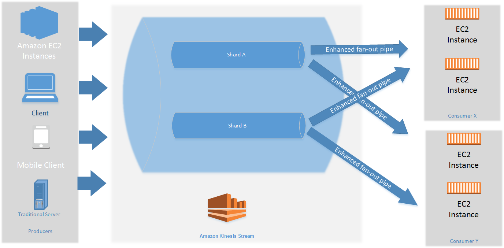
  
  - 이 다이어그램은 다음을 보여 줍니다
    - 두 개의 샤드를 포함하는 스트림
    - 향상된 팬아웃을 사용하여 소비자 X 스트림과 소비자 Y 스트림으로부터 데이터를 수신하는 소비자 2개. 각 소비자는 스트림의 모든 샤드와 모든 레코드를 구독합니다. KCL 버전 2.0 이상을 사용하여 소비자를 빌드하는 경우, KCL은 이러한 소비자를 스트림의 모든 샤드에 자동으로 등록합니다. 반면에 API를 사용하여 소비자를 빌드하는 경우에는 개별 샤드를 구독할 수 있습니다
    - 소비자가 스트림으로부터 데이터를 수신하기 위해 사용하는 향상된 팬아웃 파이프를 나타내는 화살표. 향상된 팬아웃 파이프는 다른 파이프 또는 총 소비자 수와 상관없이 샤드당 최대 2MB/sec의 데이터를 제공합니다
  
  - 출처
    - https://tutorialsdojo.com/amazon-kinesis-data-streams-vs-data-firehose-vs-data-analytics-vs-video-streams/
    - https://ap-northeast-2.console.aws.amazon.com/kinesis/home?region=ap-northeast-2#/home
    - https://aws.amazon.com/ko/kinesis/
  
- AWS Cognito

  - Amazon Cognito 는 웹 및 모바일 앱에 대한 인증, 권한 부여 및 사용자 관리를 제공합니다. 사용자는 사용자 이름과 암호를 사용하여 직접 로그인하거나 Facebook, Amazon, Google 또는 Apple 같은 타사를 통해 로그인할 수 있습니다
  - Amazon Cognito의 두 가지 주요 구성 요소는 사용자 풀과 자격 증명 풀입니다. 사용자 풀은 앱 사용자의 가입 및 로그인 옵션을 제공하는 사용자 디렉터리입니다. 자격 증명 풀을 통해 기타 AWS 서비스에 대한 사용자 액세스 권한을 부여할 수 있습니다. 자격 증명 풀과 사용자 풀을 별도로 또는 함께 사용할 수 있습니다

  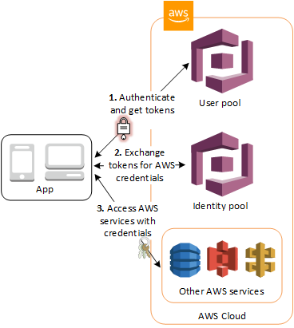

  - 출처
    - https://docs.aws.amazon.com/ko_kr/cognito/latest/developerguide/what-is-amazon-cognito.html

- AWS SSO

  - AWS SSO는 여러 AWS 계정 및 비즈니스 애플리케이션에 대한 액세스를 중앙에서 손쉽게 관리하고 사용자에게 Single Sign-On 액세스를 제공하여 할당된 모든 계정 및 애플리케이션을 한 곳에서 액세스하도록 할 수 있는 AWS 서비스입니다. AWS SSO를 사용하면 AWS Organizations의 모든 내 계정에 대한 SSO 액세스와 사용자 권한을 중앙에서 손쉽게 관리할 수 있습니다. AWS SSO로 AWS SSO의 자격 증명 저장소에서 사용자 자격 증명을 생성 및 관리하거나 Microsoft Active Directory, Okta Universal Directory 및 Azure AD(Azure Active Directory)를 비롯한 기존 자격 증명 소스에 쉽게 연결할 수 있습니다
  - 사용자 지정 스크립트 작성이나 범용 SSO 솔루션에 대한 투자 없이 직원들에게 AWS 계정 및 비즈니스 클라우드 애플리케이션에 대한 액세스 권한을 부여하여 빠르게 생산성을 발휘하도록 지원하려면 AWS SSO가 필요합니다. SSO 액세스 설정 및 관리에 따르는 복잡성과 비용을 줄이기 위해서도 AWS SSO가 필요합니다. AWS SSO는 직원들이 AWS SSO 사용자 포털에서 AWS 계정과 애플리케이션에 액세스할 수 있는 곳으로, 이러한 애플리케이션이 어디서 구축 또는 호스팅되었는지는 문제가 되지 않습니다
  - AWS SSO는 관리하는 AWS 계정과 비즈니스 애플리케이션이 많고, 이러한 클라우드 서비스에 대한 사용자 액세스를 중앙에서 관리하려 하며, 새로운 암호를 외울 필요 없이 이러한 계정과 애플리케이션에 액세스할 수 있는 단일 위치를 직원들에게 제공하려는 관리자를 위한 솔루션입니다
  - 출처
    - https://aws.amazon.com/ko/single-sign-on/faqs/

- AWS Security Token Service(AWS STS)

  - AWS Security Token Service(AWS STS)를 사용하면 AWS 리소스에 대한 액세스를 제어할 수 있는 임시 보안 자격 증명을 생성하여 신뢰받는 사용자에게 제공할 수 있습니다. 임시 보안 자격 증명은 다음과 같은 차이점을 제외하고는 IAM 사용자가 사용할 수 있는 장기 액세스 키 자격 증명과 거의 동일한 효력을 지닙니다
  - 임시 보안 자격 증명은 그 이름이 암시하듯 *단기적*입니다. 이 자격 증명은 몇 분에서 몇 시간까지 지속되도록 구성할 수 있습니다. 자격 증명이 만료된 후 AWS는 더는 그 자격 증명을 인식하지 못하거나 그 자격 증명을 사용한 API 요청으로부터 이루어지는 어떤 종류의 액세스도 허용하지 않습니다
  - 임시 보안 자격 증명은 사용자와 함께 저장되지 않지만 동적으로 생성되어 요청시 사용자에게 제공됩니다. 임시 보안 자격 증명이 만료되었을 때(심지어는 만료 전이라도) 사용자는 새 자격 증명을 요청할 수 있습니다. 단, 자격 증명을 요청하는 해당 사용자에게 그렇게 할 수 있는 권한이 있어야 합니다
  - 애플리케이션으로 장기 AWS 보안 자격 증명을 배포 또는 포함할 필요가 없습니다
  - 임시 보안 자격 증명은 수명이 제한되어 있어서, 더 이상 필요하지 않을 때 교체하거나 명시적으로 취소할 필요가 없습니다. 임시 보안 자격 증명이 만료된 후에는 다시 사용할 수 없습니다. 그 자격 증명에 대해 유효 기간을 최대 한계까지 지정할 수 있습니다
  - 출처
    - https://docs.aws.amazon.com/ko_kr/IAM/latest/UserGuide/id_credentials_temp.html

- Auto Scaling 그룹과 ELB

  - Auto Scaling 그룹의 기본 상태 검사는 EC2 상태 확인만 해당합니다. 한 인스턴스에서 이러한 상태 검사에 실패할 경우 Auto Scaling 그룹은 해당 인스턴스를 비정상으로 간주하여 교체합니다
  - 하나 이상의 대상 그룹(Application Load Balancer 및 Network Load Balancer), 하나 이상의 로드 밸런서(Classic Load Balancer) 또는 둘 다를 Auto Scaling 그룹에 연결할 수 있습니다. 그러나 기본적으로 그룹은 인스턴스를 비정상으로 간주하지 않고 Elastic Load Balancing(ELB) 상태 확인에 실패할 경우 인스턴스를 교체합니다
  - ELB 상태 확인을 사용하도록 Auto Scaling 그룹을 구성하면 EC2 상태 확인 또는 ELB 상태 확인에 실패할 경우 인스턴스를 비정상으로 간주합니다. 여러 로드 밸런서 대상 그룹 또는 Classic Load Balancer를 그룹에 연결할 경우 인스턴스를 정상으로 간주하려면 모두 해당 인스턴스가 정상이라고 보고해야 합니다. 그 중 하나가 인스턴스를 비정상으로 보고하면 다른 곳에서 정상으로 보고하더라도 Auto Scaling 그룹은 인스턴스를 교체합니다

- Amazon S3 수명 주기

  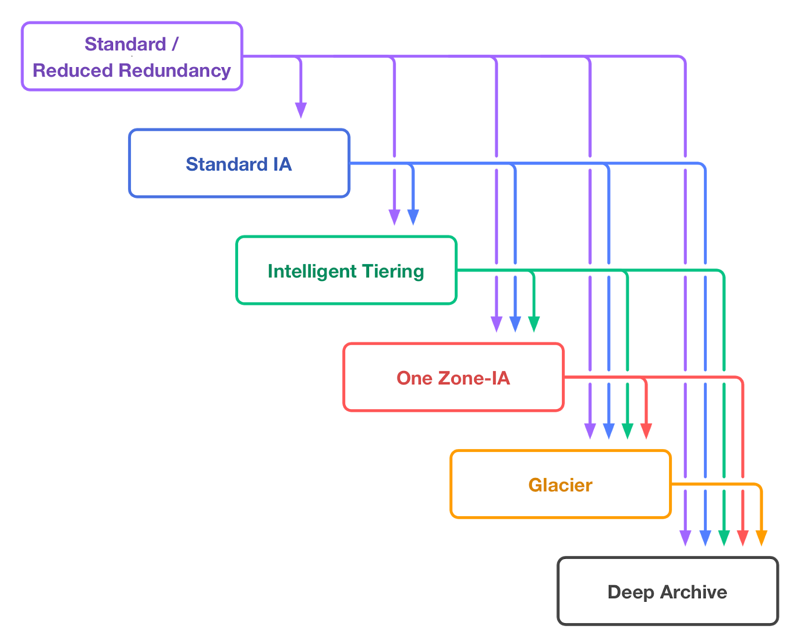

  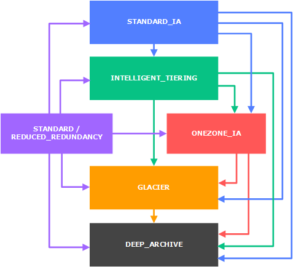

- AWS CloudTrail 이벤트

  - CloudTrail의 이벤트는 AWS 계정의 활동 기록입니다. 이 활동은 CloudTrail에서 모니터링할 수 있는 사용자, 역할 또는 서비스가 수행하는 작업일 수 있습니다. CloudTrail 이벤트는 AWS Management Console, AWS SDK, 명령줄 도구 및 기타 AWS 서비스를 통해 수행된 API 및 비 API 계정 활동 기록을 모두 제공합니다. CloudTrail에 기록할 수 있는 이벤트에는 관리 이벤트와 데이터 이벤트의 두 가지 유형이 있습니다. 기본적으로 추적에서는 로그 관리 이벤트를 기록하지만 데이터 이벤트는 기록하지 않습니다
    - 데이터 이벤트는 S3, DynamoDB 등과 같은 곳에 저장된 데이터 CRUD 관련 API 활동 기록을 의미하는 것으로 보인다
  - 트레일은 모든 리전 또는 단일 리전에 적용할 수 있습니다. 작업 중인 AWS 파티션의 모든 리전에 적용되는 추적을 만드는 것이 가장 좋습니다. 이 설정은 CloudTrail 콘솔에서 추적을 생성할 때의 기본 설정입니다
  - 대부분의 서비스의 경우 작업이 발생한 영역에 이벤트가 기록됩니다. AWS IAM(Identity and Access Management), AWS STS, Amazon CloudFront, Route 53 등과 같은 글로벌 서비스의 경우 글로벌 서비스를 포함하는 모든 트레일에 이벤트가 제공되며 미국 동부(N.Virginia) 리전에서 발생한 것으로 기록됩니다
  - 이 시나리오에서는 모든 리전에서 모든 AWS 리소스의 모든 활동을 추적할 수 있는 안전하고 지속적인 로깅 솔루션이 필요합니다. CloudTrail은 다중 리전 추적이 활성화된 이 사례에 사용할 수 있지만, IAM, CloudFront, AWS WAF, Route 53 등과 같은 글로벌 서비스에는 적용되지 않습니다. 요구 사항을 충족하려면 AWS CLI 명령에 `--include-global-service-events` 매개 변수를 추가해야 합니다

- AWS Config

  - AWS Config는 AWS 리소스 구성을 측정, 감사 및 평가할 수 있는 서비스입니다. Config는 AWS 리소스 구성을 지속적으로 모니터링 및 기록하고, 원하는 구성을 기준으로 기록된 구성을 자동으로 평가해 줍니다. Config를 사용하면 AWS 리소스 간 구성 및 관계 변화를 검토하고, 자세한 리소스 구성 기록을 분석하고, 내부 지침에 지정되어 있는 구성을 기준으로 전반적인 규정 준수 여부를 확인할 수 있습니다. 이에 따라 규정 준수 감사, 보안 분석, 변경 관리 및 운영 문제 해결 작업을 간소화할 수 있습니다. 아키텍처 모범 사례에 대한 의견은 제공하지 않습니다

- AWS Systems Manager

  - AWS Systems Manager는 AWS 인프라에 대한 가시성과 제어를 제공합니다. Systems Manager는 통합된 사용자 인터페이스를 제공하므로 여러 AWS 서비스의 운영 데이터를 보고 AWS 리소스 전체에서 운영 작업을 자동화할 수 있습니다. Systems Manager를 사용하면 Amazon EC2 인스턴스, Amazon S3 버킷 또는 Amazon RDS 인스턴스와 같은 리소스를 애플리케이션별로 그룹화하고, 모니터링과 문제 해결을 위해 운영 데이터를 보고, 리소스 그룹에 조치를 취할 수 있습니다. Systems Manager는 리소스 및 애플리케이션 관리를 간소화하고, 운영 문제를 탐지 및 해결하는 시간을 단축하며, 인프라를 대규모로 안전하게 운영 및 관리할 수 있게 해줍니다. 아키텍처 모범 사례에 대한 피드백을 제공하지 않습니다

- Amazon S3 일관성

  - Amazon S3은 모든 리전의 덮어쓰기 PUT 및 DELETE에 대한 최종 일관성을 제공합니다
  - 단일 키에 대한 업데이트는 원자성입니다. 예를 들어 기존 키에 대해 PUT할 경우 이후의 읽기가 기존 데이터 또는 업데이트된 데이터를 반환할 수 있지만 절대로 손상된 데이터 또는 부분 데이터를 반환하지 않습니다
  - Amazon S3에서는 AWS 데이터 센터 내의 여러 서버로 데이터를 복제함으로써 고가용성을 구현합니다. PUT 요청이 성공하면 데이터가 안전하게 저장됩니다. 그러나 변경 사항에 대한 정보를 Amazon S3로 복제해야 하는데 이 작업에는 일정 시간이 걸릴 수 있으므로 다음 동작을 관찰할 수 있습니다
    - 프로세스가 Amazon S3로 새 객체를 쓰고 해당 버킷 내에 바로 키를 나열합니다. 변경 사항이 완전히 전파될 때까지 객체가 목록에 나타나지 않을 수 있습니다
    - 프로세스가 기존 객체를 대체하고 바로 읽기를 시도합니다. 변경 사항이 완전히 전파될 때까지 Amazon S3에서 이전 데이터를 반환할 수 있습니다
    - 프로세스가 기존 객체를 삭제하고 바로 읽기를 시도합니다. 삭제가 완전히 전파될 때까지 Amazon S3에서 삭제된 데이터를 반환할 수 있습니다
    - 프로세스가 기존 객체를 삭제하고 해당 버킷 내에 바로 키를 나열합니다. 삭제가 완전히 전파될 때까지 Amazon S3에서 삭제된 객체를 나열할 수 있습니다
  - Amazon S3는 현재 동시 업데이트에 대한 객체 잠금을 지원하지 않습니다. 두 PUT 요청을 동시에 같은 키에 대해 실행할 경우 타임스탬프가 최신인 요청이 우선 적용됩니다. 이것이 문제가 되는 경우 객체 잠금 메커니즘을 애플리케이션에 구축해 넣어야 합니다

- CloudFront에서 프라이빗 콘텐츠 안전하게 제공하기

  - 인터넷을 통해 콘텐츠를 배포하는 많은 기업에서는 유료 사용자 등 일부 사용자용으로 제작된 각종 문서, 비즈니스 데이터, 미디어 스트림 또는 콘텐츠에 대한 액세스를 제한하고자 합니다. CloudFront를 통해 이러한 프라이빗 콘텐츠를 안전하게 제공하려면 다음과 같이 하십시오
    - 사용자가 특별한 CloudFront 서명된 URL 또는 서명된 쿠키를 사용하여 프라이빗 콘텐츠에 액세스하도록 합니다
    - 사용자가 오리진 서버에서 직접 콘텐츠에 액세스하는 URL(예: Amazon S3 또는 프라이빗 HTTP 서버)이 아닌 CloudFront URL을 사용하여 콘텐츠에 액세스해야 합니다. 반드시 CloudFront URL을 사용해야 하는 것은 아니지만, 서명된 URL 또는 서명된 쿠키에 지정한 제약 조건을 사용자가 우회하지 못하도록 하려면 사용하는 것이 좋습니다
  - 사용자가 CloudFront를 통해 액세스할 수는 있지만 Amazon S3 URL을 사용하여 직접 액세스할 수는 없도록 Amazon S3 버킷의 콘텐츠를 선택적으로 보호할 수 있습니다. 이렇게 하면 CloudFront를 우회하고 Amazon S3 URL을 사용하여 액세스 제한 콘텐츠에 접근하는 사람을 막을 수 있습니다. 서명된 URL을 사용하기 위해 꼭 필요한 단계는 아니지만 이렇게 하는 것이 좋습니다. 사용자가 CloudFront URL을 통해 콘텐츠에 액세스하도록 요구하려면 다음 작업을 수행합니다
    - 원본 액세스 ID라는 특수 CloudFront 사용자를 만들어 CloudFront 배포와 연결합니다
    - 버킷의 파일을 읽을 수 있는 원본 액세스 ID 권한을 부여합니다
    - 나머지 모든 사람으로부터 Amazon S3 URL로 파일을 읽을 수 있는 권한을 제거합니다

- S3 Glacier Select

  - S3 Glacier Select로 간단한 구조화 쿼리 언어(SQL) 문을 S3 Glacier의 데이터에서 직접 사용하여 필터링 작업을 수행할 수 있습니다. S3 Glacier 아카이브 객체에 대해 SQL 쿼리를 제공하면 S3 Glacier Select가 쿼리를 실행하고 출력 결과를 Amazon S3에 작성합니다. S3 Glacier Select를 사용하면 Amazon S3 같이 더 자주 사용하는 계층으로 데이터를 복원할 필요 없이 S3 Glacier에 저장된 데이터에서 쿼리 및 사용자 지정 분석을 실행할 수 있습니다
  - 작업을 시작할 때 다음 중 한 가지를 지정하여 액세스 시간과 비용 요건을 기준으로 아카이브를 가져올 수 있습니다
    - 신속 — 아카이브의 하위 집합에 대한 긴급 요청이 간헐적으로 필요한 경우 신속 가져오기를 통해 빠르게 데이터에 액세스할 수 있습니다. 매우 큰 아카이브(250MB+)를 제외한 모든 경우, 신속 가져오기를 사용하여 액세스된 데이터는 일반적으로 1~5분 안에 사용할 수 있게 됩니다. 프로비저닝된 용량을 통해 필요할 때 신속 검색에 대한 검색 용량이 보장됩니다
    - 표준 — 표준 가져오기를 사용하면 몇 시간 내에 아카이브에 액세스할 수 있습니다. 표준 검색은 보통 3~5시간 안에 완료됩니다. 검색 요청 시 검색 옵션을 지정하지 않을 경우 기본 옵션이 됩니다
    - 벌크 — 벌크 가져오기는 S3 Glacier에서 가장 저렴한 가져오기 옵션으로서 심지어 페타바이트 규모의 대용량 데이터까지도 1일 동안 가져올 때 사용할 수 있습니다. 벌크 검색은 보통 5~12시간 안에 완료됩니다
  - 프로비저닝된 용량 구입을 통해 필요할 때 신속 검색에 대한 검색 용량이 보장됩니다. 각 용량 단위로 5분마다 신속 검색 3회를 수행할 수 있고, 최대 150MB/s의 검색 처리량이 제공됩니다

- Amazon EMR

  - Amazon EMR은 [Apache Spark](https://aws.amazon.com/ko/emr/features/spark/), [Apache Hive](https://aws.amazon.com/ko/emr/features/hive/), [Apache HBase](https://aws.amazon.com/ko/emr/features/hbase/), [Apache Flink](https://aws.amazon.com/blogs/big-data/use-apache-flink-on-amazon-emr/), [Apache Hudi](https://aws.amazon.com/ko/emr/features/hudi/) 및 [Presto](https://aws.amazon.com/ko/emr/features/presto/)와 같은 오픈 소스 도구를 사용하여 방대한 양의 데이터를 처리하기 위한 업계 최고의 클라우드 빅 데이터 플랫폼입니다. Amazon EMR은 프로비저닝 용량 및 클러스터 조정 등의 시간이 소요되는 작업을 자동화하여 빅데이터 환경을 쉽게 설치, 운영, 확장하게 해줍니다. EMR을 사용하면 기존 온프레미스 솔루션의 [50%도 안 되는 비용](https://pages.awscloud.com/Gated-IDC-The-Economic-Benefits-of-Migrating-Apache-Spark-and-Hadoop-to-Amazon-EMR.html)으로 표준 Apache Spark보다 [3배 이상 빠르게](https://aws.amazon.com/blogs/big-data/amazon-emr-introduces-emr-runtime-for-apache-spark/) 페타바이트 규모의 분석을 실행할 수 있습니다. Amazon EC2 instance, Amazon Elastic Kubernetes Service (EKS) cluster, 또는 AWS Outposts 기반 EMR에서 워크로드를 실행할 수 있습니다
  - Amazon EMR을 통해 로그 분석을 자동으로 제공 할 수 있으며, 이는 맞춤형 로그 분석 애플리케이션을 구축하고 EC2에서 호스팅하는 것보다 경제적입니다

- AWS Outposts

  - AWS Outposts는 일관된 하이브리드 환경을 위해 동일한 AWS 인프라, AWS 서비스, API 및 도구를 모든 데이터 센터, 코로케이션 공간, 온프레미스 시설에 제공하는 완전관리형 서비스입니다. AWS Outposts는 온프레미스 시스템에 대한 빠른 액세스, 로컬 데이터 처리, 데이터 레지던시, 로컬 시스템과 상호 종속된 애플리케이션 마이그레이션이 필요한 워크로드에 이상적입니다
  - AWS 컴퓨팅, 스토리지, 데이터베이스 및 기타 서비스는 Outposts에서 로컬로 실행되며, 리전에서 제공되는 모든 AWS 서비스에 액세스하여 익숙한 AWS 서비스 및 도구를 사용해서 온프레미스 애플리케이션을 구축, 관리 및 확장할 수 있습니다
  - AWS Outposts의 VMware 변형도 곧 제공될 예정입니다. VMware Cloud on AWS Outposts는 온프레미스 AWS Outposts 인프라에서 실행되는 완전관리형 VMware 소프트웨어 정의 데이터 센터(SDDC)를 제공합니다
  - AWS Outposts는 AWS에서 완전히 관리하고 지원합니다. Outpost는 AWS에서 제공, 설치, 모니터링, 패치 및 업데이트합니다. Outposts를 사용하면 IT 인프라 관리에 필요한 시간, 리소스, 운영 위험 및 유지 관리와 관련된 가동 중단 시간을 줄일 수 있습니다

# 연습 테스트 3

- Amazon EFS

  - Amazon EFS는 Amazon 클라우드에서 파일 스토리지를 간편하게 설정하고 확장하고 비용을 최적화할 수 있도록 지원하는 완전관리형 서비스입니다. 파일 시스템 인터페이스(표준 운영 체제 파일 I/O API 사용)를 통해 Amazon EC2 인스턴스에 액세스할 수 있고, 전체 파일 시스템 액세스 시맨틱(강력한 일관성, 파일 잠금 등)을 지원하는 파일 시스템을 AWS Management Console에서 클릭 몇 번으로 생성할 수 있습니다
  - Amazon EFS 파일 시스템은 스토리지를 프로비저닝할 필요 없이 자동으로 기가바이트에서 페타바이트 규모의 데이터로 확장될 수 있습니다. 수십 개, 수백 개 또는 수천 개의 Amazon EC2 인스턴스에서 동시에 Amazon EFS 파일 시스템에 액세스할 수 있으며, Amazon EFS는 각 Amazon EC2 인스턴스에 일관된 성능을 제공합니다. Amazon EFS는 높은 가용성과 뛰어난 내구성을 갖추도록 설계되었습니다
  - Amazon EFS는 AZ(가용 영역) 내부와 여러 AZ에 걸쳐 데이터를 저장하여 높은 수준의 가용성과 내구성을 제공하는 리전별 서비스입니다. Amazon EC2 인스턴스는 여러 AZ, 리전 및 VPC에서 파일 시스템에 액세스할 수 있는 반면, 온프레미스 서버는 AWS Direct Connect 또는 AWS VPN을 사용하여 액세스할 수 있습니다

- SQS 대기열 제한 시간 초과

  - 제한 시간 초과는 Amazon SQS가 메시지를 소비하는 다른 구성 요소에서 메시지를 수신 및 처리하지 못하도록 하는 기간입니다
  - 소비자가 대기열에서 메시지를 수신하고 처리하면 메시지는 계속 대기열에 있습니다. Amazon SQS는 메시지를 자동으로 삭제하지 않습니다. Amazon SQS는 분산 시스템이므로 소비자가 메시지를 실제로 받는지 보장할 수 없습니다(예를 들어, 연결 문제 또는 소비자 애플리케이션 문제로 인해). 또한, 소비자는 메시지를 수신하고 처리한 후 대기열에서 이 메시지를 삭제해야 합니다
  - 메시지를 수신한 직후에는 메시지가 대기열에 그대로 있습니다. 다른 소비자가 메시지를 다시 처리할 수 없도록 하기 위해 Amazon SQS에서는 다른 소비자가 Amazon SQS에서 메시지를 수신 및 처리할 수 없는 기간인 제한 시간 초과를 설정합니다. 메시지의 기본 제한 시간은 30초입니다. 최소값은은 0초입니다. 최대는 12시간입니다

  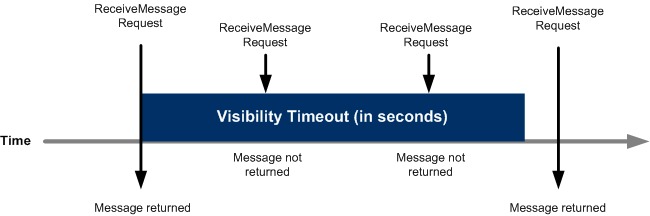

- Amazon FSx for Windows File Server

  - Amazon FSx for Windows File Server는 업계 표준 SMB(서버 메시지 블록) 프로토콜을 통해 액세스 가능한 고도로 안정적이고 확장 가능한 완전관리형 파일 스토리지 서비스를 제공합니다. Windows Server에 구축되며 사용자 할당량, 최종 사용자 파일 복원 및 Microsoft Active Directory(AD) 통합과 같은 광범위한 관리 기능을 제공합니다. 단일 AZ 및 다중 AZ 배포 옵션, 완전관리형 백업 및 유휴 및 전송 중 데이터 암호를 제공합니다. SSD 및 HDD 스토리지 옵션을 사용하여 워크로드 요구 사항의 비용 및 성능을 최적화할 수 있습니다. 또한 언제든지 파일 시스템의 스토리지 크기를 조정하고 처리 성능을 변경할 수 있습니다. Amazon FSx 파일 스토리지는 AWS 또는 온프레미스에서 실행되는 Windows, Linux 및 MacOS 컴퓨팅 인스턴스 및 디바이스에서 액세스할 수 있습니다

- AWS Storage Gateway

  - AWS Storage Gateway는 온프레미스 소프트웨어 어플라이언스를 클라우드 기반 스토리지에 연결하여 데이터 보안 기능으로 온프레미스 IT 환경과 AWS 스토리지 인프라 사이에 원활한 통합이 이루어지도록 지원합니다. 이 서비스를 사용하면 AWS 클라우드에 데이터를 저장하여 데이터 보안 유지에 도움이 되는 확장 가능하면서 비용 효율적인 스토리지를 구현할 수 있습니다
  - AWS Storage Gateway는 다음과 같이 파일 기반, 볼륨 기반 및 테이프 기반 스토리지 솔루션을 제공합니다
    - 파일 게이트웨이는 Amazon Simple Storage Service(Amazon S3)에 대한 파일 인터페이스를 지원하고 서비스와 가상 소프트웨어 어플라이언스를 결합합니다. 이 조합을 사용하면 NFS(Network File System) 및 SMB(Server Message Block) 같은 업계 표준 파일 프로토콜을 사용하여 Amazon S3에서 객체를 저장하고 검색할 수 있습니다. 소프트웨어 어플라이언스 또는 게이트웨이는 VMware ESXi 또는 Microsoft Hyper-V 또는 Linux 커널 기반 가상 머신(KVM) 하이퍼바이저에서 실행 중인 가상 머신(VM)으로 온프레미스 환경에 배포됩니다. 이 게이트웨이를 통해 파일 또는 파일 공유 탑재 지점으로 S3 내 객체에 액세스할 수 있습니다. 파일 게이트웨이를 통해 다음 작업을 할 수 있습니다
      - NFS 버전 3 또는 4.1 프로토콜을 사용하여 파일을 직접 저장하고 가져올 수 있습니다
      - SMB 파일 시스템 버전 2 및 3 프로토콜을 사용하여 파일을 직접 저장하고 가져올 수 있습니다
      - 어떤 AWS 클라우드 애플리케이션 또는 서비스에서도 Amazon S3에 있는 데이터에 직접 액세스할 수 있습니다
      - 수명 주기 정책, 교차 리전 복제 및 버전 관리를 통해 Amazon S3 데이터를 직접 관리할 수 있습니다. 파일 게이트웨이는 S3의 파일 시스템 탑재 지점이라고 할 수 있습니다

- NAT 게이트웨이와 NAT 인스턴스는 IPv4에만 적용되고 IPv6에는 적용되지 않는다

- 외부 전용 인터넷 게이트웨이

  - 그냥 인터넷 게이트웨이와는 다르다
    - 인터넷 게이트웨이는 아웃바운드 전용으로 사용할 수 없다
  - 외부 전용 인터넷 게이트웨이는 수평 확장되고 가용성이 높은 중복 VPC 구성 요소로서, VPC의 인스턴스에서 인터넷으로 IPv6을 통한 아웃바운드 통신을 가능케 하되 인터넷에서 해당 인스턴스와의 IPv6 연결을 시작하지 못하게 할 수 있습니다
  - 외부 전용 인터넷 게이트웨이는 IPv6 트래픽에만 사용됩니다. IPv4를 통한 아웃바운드 전용 인터넷 통신을 사용하려면 NAT 게이트웨이를 사용해야한다
  - 외부 전용 인터넷 게이트웨이는 상태 저장 방식으로서, 서브넷의 인스턴스에서 인터넷 또는 기타 AWS 서비스로 트래픽을 전달한 다음, 다시 인스턴스로 응답을 보냅니다

- 탄력적 IP 주소(EIP)

  - 탄력적 IP 주소는 동적 클라우드 컴퓨팅을 위해 고안된 정적 IPv4 주소입니다. 탄력적 IP 주소는 AWS 계정과 연결됩니다. 탄력적 IP 주소를 사용하면 주소를 계정의 다른 인스턴스에 신속하게 다시 매핑하여 인스턴스나 소프트웨어의 오류를 마스킹할 수 있습니다
  - 탄력적 IP 주소는 인터넷에서 연결 가능한 퍼블릭 IPv4 주소입니다. 인스턴스에 퍼블릭 IPv4 주소가 없는 경우 탄력적 IP 주소를 인스턴스에 연결하여 인터넷 통신을 활성화할 수 있습니다. 예를 들어 로컬 컴퓨터에서 인스턴스에 연결할 수 있습니다
  - 현재는 IPv6에 대한 탄력적 IP 주소를 지원하지 않습니다
  - 다음 모든 조건에 해당하는 경우에는 탄력적 IP 주소에 대한 비용이 발생하지 않습니다
    - 탄력적 IP 주소가 EC2 인스턴스에 연결되어 있습니다
    - 탄력적 IP 주소가 연결된 인스턴스가 실행 중입니다
    - 인스턴스에 연결된 탄력적인 IP 주소가 하나뿐입니다

- EC2 상태별 비용 청구

  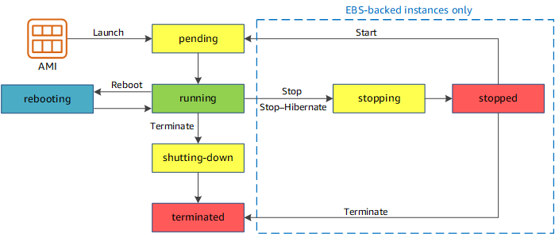

  - pending : 인스턴스는 running 상태로 될 준비를 하고 있습니다. 인스턴스를 처음 시작하거나 stopped 상태의 인스턴스를 다시 시작하면 pending 상태가 됩니다. (인스턴스 사용 요금 : 미청구)
  - running : 인스턴스를 실행하고 사용할 준비가 되었습니다. (인스턴스 사용 요금 : 청구)
  - stopping : 인스턴스가 중지 또는 중지-최대 절전 모드로 전환할 준비를 하고 있습니다. (인스턴스 사용 요금 : 중지 준비 중인 경우 미청구, 최대 절전 모드로 전환 준비 중인 경우 청구)
  - stopped : 인스턴스가 종료되고 사용이 불가합니다. 언제든지 인스턴스를 다시 시작할 수 있습니다. (인스턴스 사용 요금 : 미청구)
  - shutting-down : 인스턴스가 종료할 준비를 하고 있습니다. (인스턴스 사용 요금 : 미청구)
  - terminated : 인스턴스가 영구적으로 삭제되었으며 시작할 수 없습니다. (인스턴스 사용 요금 : 미청구)

- 인스턴스 메타데이터 검색

  - 실행 중인 인스턴스에서 인스턴스 메타데이터를 사용할 수 있기 때문에 Amazon EC2 콘솔 또는 AWS CLI를 사용할 필요가 없습니다. 이는 인스턴스에서 실행할 스크립트를 작성할 때 유용합니다. 예를 들어, 사용자는 인스턴스 메타데이터에서 인스턴스의 로컬 IP 주소에 액세스하여 외부 애플리케이션과의 연결을 관리할 수 있습니다
  - 실행 중인 인스턴스 내에 있는 인스턴스 메타데이터의 모든 범주를 보려면 다음 URI를 사용하십시오
    - http://169.254.169.254/latest/meta-data/
      - IP 주소 169.254.169.254는 링크-로컬 주소이며 인스턴스에서만 유효합니다
    - 또한 URL을 통해 인스턴스의 퍼블릭 IP를 얻을 수 있습니다
      - http://169.254.169.254/latest/meta-data/public-ipv4

- SSL/TLS 인증서 가져오기

  - 다른 인증 기관의 인증서를 받았을 경우 ACM으로 가져오거나 IAM 인증서 스토어에 업로드합니다
    - ACM(권장. AWS Certificate Manager)
      - ACM에서 ACM 콘솔을 사용하거나 프로그래밍 방식으로 타사 인증서를 가져올 수 있습니다
      - AWS Certificate Manager(ACM)에서 제공한 SSL/TLS 인증서를 요청하는 외에도 AWS 외부에서 취득한 인증서를 가져올 수 있습니다. 이는 타사 발행자로부터 인증서를 이미 취득했거나 ACM에서 제공한 인증서가 요구 사항을 충족하지 않기 때문일 수 있습니다
    - IAM 인증서 스토어(권장하지 않음)
      - 해당 리전에서 ACM을 사용할 수 없으면 AWS CLI 명령을 사용하여 서드 파티 인증서를 IAM 인증서 스토어에 업로드합니다

- Amazon S3 데이터 보호

  - 데이터 보호란 전송 중(Amazon S3 안팎으로 데이터가 이동 중) 및 유휴(Amazon S3 데이터 센터의 디스크에 데이터가 저장된 동안) 데이터를 보호하는 것을 말합니다. SSL/TLS(Secure Socket Layer/Transport Layer Security)를 사용하거나 클라이언트 측 암호화를 사용하여 전송 중인 데이터를 보호할 수 있습니다. Amazon S3에서 유휴 데이터를 보호하는 다음과 같은 옵션이 있습니다

  1. 서버 측 암호화 – 데이터 센터의 디스크에 저장하기 전에 객체를 암호화하고 객체를 다운로드할 때 이를 해독하도록 Amazon S3에 요청합니다

  2. 클라이언트 측 암호화 – 클라이언트 측 데이터를 암호화하여 암호화된 데이터를 Amazon S3에 업로드합니다. 이 경우 사용자가 암호화 프로세스, 암호화 키 및 관련 도구를 관리합니다

- 23번부터 ㄱㄱ