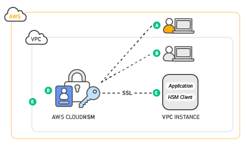
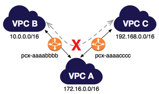

AWS SAA 시험을 준비하면서, 기억해둘 내용을 저장해 놓는 문서

> udemy 연습 테스트 및 해설 활용

[TOC]

# 연습 테스트 1

- Amazon Elastic Load Balancer는 하나의 리전에서만 실행되도록 설계되었다
- 전송 중 S3 데이터 보호 암호화 방법
  - 서버 측 암호화(SSE, Server Side Encryption)
    - 데이터 센터의 디스크에  저장하기 전에 객체를 암호화하고 객체를 다운로드 할 때 해독을 위해 Amazon S3에 요청하는 방식
    - Amazon S3 관리형 키를 사용한 서버 측 암호화(SSE-S3)
      - AWS에서 주기적으로 바뀌는 마스터 키를 사용해서 암호화
    - AWS Key Management Service에 저장된 고객 마스터 키(CMK)를 사용한 서버 측 암호화(SSE-KMS)
      - SSE-S3와 비슷하지만 추가 비용이 들고 별도의 권한 설정이 필요함
      - 사용 주체를 표시하는 감사 추적 기능 등 추가 기능을 사용할 수 있음
    - 고객 제공 키를 사용한 서버 측 암호화(SSE-C)
  - 클라이언트 측 암호화(CSE, Client Side Encryption)
    - 클라이언트 측 데이터를 암호화하여 암호화된 데이터를 Amazon S3에 업로드. 이 경우 사용자가 암호화 프로세스, 키 및 관련 도구를 관리해야 하는 방식
    - AWS Key Management Service에 저장된 고객 마스터 키(CMK)를 사용
    - 애플리케이션 내에 저장한 마스터 키를 사용
      - 객체를 업로드 할 때 Amazon S3 암호화 클라이언트에 클라이언트 측 마스터 키를 제공한다. 그리고 업로드 할 때 이 키를 사용하고, 어떤 키를 사용했는지 설명하는 내용을 메타데이터에 남긴다
- 네트워크 ACL(액세스 제어 목록)
  - 네트워크 ACL(액세스 제어 목록)은 1개 이상의 서브넷 내부와 외부의 트래픽을 제어하기 위한 방화벽 역할을 하는 VPC를 위한 선택적 보안 계층입니다. 보안 그룹과 비슷한 규칙으로 네트워크 ACL을 설정하여 VPC에 보안 계층을 더 추가할 수 있습니다
  - VPC에 있는 각 서브넷을 네트워크 ACL과 연결해야 한다. 명시적으로 연결하지 않으면, 기본 네트워크 ACL에 자동 연결됨
  - 네트워크 ACL을 여러 서브넷과 연결할 수 있다. 하지만 서브넷은 한 번에 하나의 네트워크 ACL에만 연결할 수 있다
  - 네트워크 ACL에는 별개의 인바운드 및 아웃바운드 규칙이 있다. 각 규칙은 트래픽을 허용하거나 거부할 수 있다
  - 네트워크 ACL은 상태 비저장이다. 즉, 허용되는 인바운드 트래픽에 대한 응답이라도 아웃바운드 트래픽에 대한 규칙을 따른다
    - 보안 그룹은 상태 저장이다
  - 네트워크 ACL 규칙은 규칙 번호에 따라 가장 **낮은** 규칙에서 높은 규칙까지 평가되며 규칙이 적용되는 트래픽이 있으면 즉시 실행된다
- Amazon EBS 볼륨
  - 인스턴스의 수명과는 독립적으로 유지될 수 있는 오프인스턴스 스토리지이다
  - 프로덕션 중에 실시간 구성 변경을 지원한다. 볼륨 유형, 크기, IOPS 용량 수정 가능
- CIDR 블록
  - 주소 자체를 의미하려면 xxx.xxx.xxx.xxx/32 로 해야함. xxx.xxx.xxx.xxx/0 으로 하면 안됨. 이거는 전체 네트워크를 의미한다고 함
  - 출처
    - https://seogineer.tistory.com/87
- AWS CloudWatch는 AWS 리소스를 위한 모니터링 도구이고, AWS CloudTrail은 AWS 계정의 거버넌스, 규정 준수, 운영 감사, 위험 감사를 지원하는 서비스이다. 이 과정에서 CloudWatch Logs와 통합해서 사용할 수 있다
- RAID 0 vs RAID 1
  - 
  - 따라서 읽기/쓰기 속도를 높이려면 RAID 0이 낫다
  - 출처
    - https://www.partitionwizard.com/partitionmanager/raid-0-vs-raid-1.html
- ACL vs 보안 그룹
  - 
  - 네트워크 ACL과 보안그룹은 방화벽과 같은 역할을 하며 인바운드 트래픽과 아웃바운드 트래픽 보안정책을 설정할 수 있다
  - 먼저 보안그룹은 Stateful(상태 저장) 한 방식으로 동작하는 보안 그룹은 모든 허용을 차단하도록 기본 설정되어있으며 필요한 설정은 허용해주어야 한다
  - 네트워크 ACL은 Stateless하게(상태 비저장) 작동하며 모든 트래픽을 기본 설정되어있기 때문에 불필요한 트래픽을 막도록 적용해야 한다
  - 서브넷 단위로 적용되며 리소스 별로는 설정할 수 없다. 네트워크 ACL과 보안 그룹이 충돌한다면 보안 그룹이 더 높은 우선순위를 갖는다
  - 출처
    - https://docs.aws.amazon.com/ko_kr/vpc/latest/userguide/VPC_Security.html
    - https://swiftymind.tistory.com/132
- AWS Snow Family
  - 
  - AWS Snow Family는 까다로운 비데이터 센터 환경 및 네트워크 연결이 일관되지 않은 위치에서 작업을 실행해야하는 고객을 지원한다
  - AWS와 일관된 엣지 컴퓨팅 디바이스
    - 네트워크 연결 없이도 직접 애플리케이션을 실행한다
    - 엣지에서 데이터를 처리하고 AWS로 데이터를 마이그레이션한다
  - snowcone < snowball < snowmobile
  - snowball에서 Glacier로 데이터를 직접 이동할 수는 없다. 먼저 S3를 거친 후 Glacier로 보내야 한다
- AMI
  - Amazon Machine Image
  - AMI는 리전 별로 관리된다. 따라서 다른 리전에서 사용하려면 복사를 먼저 한 후 사용해야 한다
  - AMI에는 네트워크 액세스 제어나 공유 기능이 없다

- VPC 피어링 vs VPC 서브넷 공유
  - VPC 피어링은 서로 다른 VPC 간에 통신이 가능하도록 만들어 주는 기능이다
    - 각 서브넷에 연결된 라우트 테이블을 적절하게 수정해줘야 한다
    - VPC 피어링은 중앙에서 관리되는 VPC를 지원하지 않습니다. 또한 AWS 소유자 계정은 VPC 자체를 다른 AWS 계정과 공유할 수 없습니다
  - VPC 서브넷 공유는 말 그대로 다른 계정에게 VPC 서브넷을 공유해서 쓰도록 하는 것이다
    - 동일한 AWS Organization에 있는 계정에서만 공유할 수 있다
    - VPC 자체를 공유하지는 못한다. 서브넷을 공유하는 것이다
    - 여러 개의 서브넷을 공유할 수도 있다
    - VPC 공유를 사용하면 여러 AWS 계정에서 Amazon EC2 인스턴스, Amazon Relational Database Service(RDS) 데이터베이스, Amazon Redshift 클러스터, AWS Lambda 함수 등과 같은 애플리케이션 리소스를 공유되는 **중앙 관리형** Amazon Virtual Private Cloud(VPC)에 생성할 수 있습니다. 이 모델에서 VPC(소유자)를 소유하는 계정은 AWS Organizations의 동일한 조직에 속한 다른 계정(참여자)과 한 개 또는 여러 개의 서브넷을 공유합니다. 서브넷을 공유한 후 참여자는 공유된 서브넷의 해당 애플리케이션 리소스를 보고, 생성하고, 수정하고, 삭제할 수 있습니다. 참여자는 다른 참여자 또는 VPC 소유자에 속한 리소스를 보거나 수정하거나 삭제할 수 없습니다
    - Amazon VPC를 공유하여 높은 상호 연결성을 필요로 하고 동일한 신뢰 경계 내에 있는 애플리케이션에 대해 VPC 내의 암시적 라우팅을 활용할 수 있습니다. 이렇게 하면 생성 및 관리하는 VPC 수가 줄어들고 청구 및 액세스 제어에 별도의 계정을 사용할 수 있습니다. AWS PrivateLink, AWS Transit Gateway, Amazon VPC 피어링 등의 연결 기능을 통해 공유된 Amazon VPC를 상호 연결하여 네트워크 토폴로지를 단순화할 수 있습니다
- AWS Organizations
  - 결제를 관리하고, 액세스, 규정 준수 및 보안을 제어하고 AWS 계정에서 리소스를 공유하는 일을 모두 중앙에서 손쉽게 처리할 수 있다
  - 계정 생성을 자동화하고, 비즈니스 요구를 반영하도록 계정 그룹을 생성하고, 거버넌스를 위해 이러한 그룹에 정책을 적용할 수 있다
    - 거버넌스: 일반적으로 과거의 일방적인 정부 주도적 경향에서 벗어나 정부, 기업, 비정부기구 등 다양한 행위자가 공동의 관심사에 대한 네트워크를 구축하여 문제를 해결하는 새로운 국정운영의 방식'을 말한다
    - 즉 각 부서가 역할에 따라 클라우드 운영을 함께 해나가는 방식을 의미하는 것으로 보인다
  - 계정에서 허용되는 서비스 및 작업을 제한할 수 있다. 서비스 제어 정책(SCP)을 사용하여 AWS identity and Access Management(IAM) 사용자 및 역할에 대한 권한 보호 계층을 적용할 수 있다
    - 예를 들어 조직 계정의 사용자가 허용되지 않는 리전에서 리소스를 실행하는 것을 제한하는 것 등
- 인터넷에서 데이터를 전송할 때 S3 데이터 전송 요금은 없다. S3TA(Transfer Acceleration)을 사용하는 경우에는 가속화된 전송에 대해서만 비용을 지불한다
  - S3에서 인터넷으로 전송할 때 요금을 지불한다. cf) 1GB/월은 0.00 USD
  - S3에서 버킷과 동일한 리전 내의 AWS 서비스로 전송된 데이터도 요금 x
  - CloudFront로 전송된 데이터도 요금 x
- Amazon S3 Standard-Infrequent Access(S3 Standard-IA)
  - S3 Standard-IA는 자주 액세스하지 않지만 필요할 때 빠르게 액세스해야 하는 데이터에 적합합니다
- Network load balancer(NLB) vs Application load balancer(ALB)
  - ALB
    - Layer7(HTTP/HTTPS traffic)
    - Application Load Balancer는 요청 수준(7계층)에서 작동하여 트래픽을 대상으로 라우팅합니다. HTTP 및 HTTPS 트래픽의 고급 로드 밸런싱에 이상적인 Application Load Balancer 장치는 마이크로 서비스 및 컨테이너 기반 애플리케이션을 비롯한 최신 애플리케이션 아키텍처를 제공하는 데 적합한 고급 요청 라우팅을 제공합니다. 하지만 Application Load Balancer는 지정된 사용 사례에서 언급된 짧은 지연 시간 및 높은 처리량 시나리오에 적합하지 않습니다
  - NLB
    - Layer4(TLS/TCP/UDP traffic)
    - 초당 수백만 개의 요청을 처리할 수 있습니다
  - ALB는 Layer7 계층 로드 밸런서이므로 HTTP 요청 헤더의 내용을 검사하여 요청을 라우팅할 위치를 결정한다. 따라서 ALB는 콘텐츠 기반 라우팅을 수행한다
  - NLB는 네트워크 및 TCP 계층 변수만을 기반으로 결정을 내리고 응용프로그램을 인식하지 않는다. 애플리케이션이 제대로 콘텐츠를 제공하는지 확인하지 않고, 단순히 ICMP 핑이나 TCP 핸드 셰이크가 정상적이면 정상이라고 판단한다. 반면에 ALB는 HTTP GET과 같은 방식으로 가용성을 확인한다
  - 로드 밸런서는 트래픽을 다른 AWS 리전으로 분산하지 않는다. 따라서 리전 단위로 로드 밸런싱하고 싶으면 Route 53을 사용해야한다
- AWS Trusted Advisor
  - AWS Trusted Advisor는 AWS 모범 사례에 따라 리소스를 프로비저닝하는 데 도움이 되도록 실시간 지침을 제공하는 온라인 도구입니다. Trusted Advisor는 AWS 인프라를 최적화하고 보안과 성능을 향상시키고 전체 비용을 절감하며 서비스 한도를 모니터링할 수 있습니다. 새 워크플로를 설정하든, 애플리케이션을 개발하든, 지속적인 개선의 목적으로 진행하든 상관없이, 정기적으로 Trusted Advisor에서 제시하는 권장 사항을 활용하면 솔루션을 최적으로 프로비저닝된 상태로 유지하는 데 도움이 됩니다
  - AWS Trusted Advisor는 AWS 환경을 분석하여 다음 5가지 카테고리의 모범 사례 권장 사항을 제공합니다.
    - 비용 최적화: AWS Trusted Advisor는 미사용 및 유휴 리소스를 제거하거나 예약 용량을 약정하여 AWS에서 비용을 절감할 수 있습니다
    - 성능: AWS Trusted Advisor는 서비스 한도를 점검하고 프로비저닝된 처리량을 활용하는지 확인하며 과다 사용되는 인스턴스를 모니터링함으로써 서비스 성능을 개선할 수 있습니다
    - 보안: AWS Trusted Advisor는 결함을 없애고 다양한 AWS 보안 기능을 사용하며 권한을 점검하여 애플리케이션 보안을 개선할 수 있습니다
    - 내결함성: AWS Trusted Advisor는 Auto Scaling, 상태 확인, 다중 AZ 및 백업 기능을 활용하여 AWS 애플리케이션의 가용성과 중복성을 향상시킬 수 있습니다
    - 서비스 한도: AWS Trusted Advisor는 서비스 사용량이 서비스 한도의 80%를 넘는지 점검합니다. 값은 스냅샷을 기반으로 하므로 현재 사용량은 다를 수 있습니다. 한도 및 사용량에 변경 사항이 반영되는 데 최대 24시간이 걸릴 수 있습니다
- Amazon Inspector
  - Amazon Inspector는 AWS에 배포된 애플리케이션의 보안 및 규정 준수를 개선하는데 도움이 되는 자동 보안 평가 서비스입니다
- Amazon Simple Workflow Service(Amazon SWF)
  - Amazon Simple Workflow Service(Amazon SWF)는 분산 애플리케이션 구성 요소에서 작업을 쉽게 조정할 수 있도록 해주는 웹 서비스입니다. Amazon SWF를 사용하면 광범위한 사용 사례, 예를 들어 미디어 프로세싱, 웹 애플리케이션의 백 엔드, 비즈니스 프로세스 워크플로우, 분석 파이프라인 등에 대한 애플리케이션을 여러 작업의 조정으로 설계할 수 있습니다. 작업은 애플리케이션의 다양한 처리 단계의 호출을 의미하며 실행 코드, 웹 서비스 호출, 사람의 활동 및 스크립트 등을 통해 수행할 수 있습니다
- Elastic Network Adapter(ENA)
  - 향상된 네트워킹에서는 [지원되는 인스턴스 유형](https://docs.aws.amazon.com/ko_kr/AWSEC2/latest/UserGuide/enhanced-networking.html#supported_instances)에서 단일 루트 I/O 가상화(SR-IOV)를 사용하여 고성능 네트워킹 기능을 제공합니다. SR-IOV는 기존 가상 네트워크 인터페이스에 비해 높은 I/O 성능 및 낮은 CPU 사용률을 제공하는 디바이스 가상화 방법입니다. 향상된 네트워킹을 통해 대역폭과 PPS(Packet Per Second) 성능이 높아지고, 인스턴스 간 지연 시간이 지속적으로 낮아집니다
  - EFA는 추가 기능이 있는 ENA(Elastic Network Adapter)입니다. 따라서 추가적인 OS 우회 기능을 포함한 모든 ENA의 기능을 제공합니다. OS 우회는 HPC 및 기계 학습 애플리케이션이 네트워크 인터페이스 하드웨어와 직접 통신하도록 하는 액세스 모델로서 낮은 지연율과 신뢰성 높은 전송 기능을 제공합니다
  - 
  - Windows 인스턴스에서는 EFAs에서 제공하는 OS 우회 기능을 지원하지 않습니다. EFA를 Windows 인스턴스에 연결한 경우 인스턴스는 추가적인 EFA 기능이 없는 ENA(Elastic Network Adapter)로 작동합니다
- AWS ParallelCluster
  - AWS에서 고성능 컴퓨팅 (HPC) 클러스터를 쉽게 배포하고 관리 할 수 있는 오픈 소스 클러스터 관리 도구이다
- AWS Snowball Edge
  - AWS Snowball Edge 는 온보드 스토리지와 일부 AWS 기능을 위한 컴퓨팅 파워를 갖춘 일종의 Snowball 디바이스입니다. Snowball Edge는 로컬 프로세싱 및 에지 컴퓨팅 워크로드를 수행할 수 있으며 로컬 환경과 AWS 클라우드 간에 데이터를 전송할 수도 있습니다
  - 각 Snowball Edge 장치는 인터넷보다 빠른 속도로 데이터를 전송할 수 있습니다. 이 전송은 지역 운송업체를 통해 기기의 데이터를 운송하는 방식으로 이루어집니다. 이 기기는 견고하며 E Ink 배송 라벨이 부착되어 있습니다
  - Snowball 및 Snowball Edge는 서로 다른 두 개의 디바이스입니다. 두 디바이스를 통해 방대한 양의 데이터를 Amazon S3에 업로드하고 다운로드할 수 있습니다. 두 디바이스는 모두 동일한 작업 관리 API를 가지며 동일한 콘솔을 사용합니다. 그러나 두 디바이스의 하드웨어 사양, 일부 기능, 사용되는 전송 도구, 가격은 다릅니다
  - AWS Snowball 디바이스는 AWS Snowball Edge보다 저렴하지만 한 디바이스에 80TB의 데이터를 저장할 수 없습니다. 저장 용량은 Snowball 및 Snowball Edge에 사용 가능한 용량과 다릅니다. 80TB Snowball 어플라이언스 및 100TB Snowball Edge 어플라이언스에는 각각 72TB 및 83TB의 사용 가능한 용량만 있습니다. 따라서 하나의 AWS Snowball Edge 디바이스를 사용하는 것과 비교하여 2개의 Snowball 디바이스를 사용하면 비용이 많이 듭니다
- 연결 드레이닝(connection draining)
  - 기존 연결이 열려 있는 상태에서 Classic Load Balancer가 등록 취소 중이거나 비정상 상태인 인스턴스로의 요청 전송을 중지하도록 하려면 연결 드레이닝을 사용하십시오. 이렇게 하면 로드 밸런서가 등록 취소 중이거나 비정상 상태인 인스턴스로 진행 중인 요청을 완료합니다
  - 연결 드레이닝을 활성화하면 로드 밸런서가 인스턴스의 등록 취소를 보고하기 전에 연결을 유지할 수 있는 최대 시간을 지정할 수 있습니다. 최대 제한 시간 값의 범위는 1 ~ 3,600초입니다(기본은 300초). 최대 제한 시간에 도달하면 로드 밸런서는 등록 취소 중인 인스턴스로의 연결을 강제로 종료합니다
  - 진행 중인 요청이 처리되는 동안 로드 밸런서는 등록 취소 중인 인스턴스의 상태를 InService: Instance deregistration currently in progress로 보고합니다. 등록 취소 중인 인스턴스가 진행 중인 모든 요청의 처리를 완료하거나 최대 제한 시간에 도달하면 로드 밸런서는 인스턴스 상태를 OutOfService: Instance is not currently registered with the LoadBalancer로 보고합니다

# 연습 테스트 2

- S3 접두사 설정을 통해 트랜잭션 성능을 높일 수 있다

  - S3는 요청 성능에서 초당 수천 회의 트랜잭션을 쉽게 달성할 수 있는데, 이는 버킷 접두사 별로 적용된다
  - 예를 들어 접두사 10개를 만들어서 읽기를 병렬화하는 경우 읽기 성능을 초당 55,000개로 늘릴 수 있다
  - 이름에 따라, 날짜에 따라 버킷을 새로 만들어서 쓰는 것은 비효율적일 뿐만 아니라 불가능할 수도 있다. S3는 리전별 서비스이지만 버킷 이름은 전역적이므로 이름이 중복되면 안되기 때문이다

- DynamoDB와 CloudFront는 Read Replica 기능이 없기 때문에 다중 AZ 배포로 실행 중이라고 할 수 없다

  - RDS와 Aurora는 Read Replica 기능이 있고, 비동기식 복제를 제공한다

- AWS Resource Access Manager(RAM)

  - AWS Resource Access Manager(RAM)는 고객에게 AWS 계정 또는 AWS Organizations 내에서 리소스를 공유할 수 있는 간단한 방법을 제공합니다. 많은 AWS 고객이 여러 AWS 계정을 사용하여 팀에 관리 및 결제 자율성을 제공합니다. 이러한 고객은 이제 중앙 집중식으로 리소스를 생성하고 RAM을 사용하여 여러 계정 간에 공유할 수 있으므로 다중 계정 전략의 이점을 유지하면서 고객의 운영 오버헤드는 줄일 수 있습니다. RAM을 사용하여 리소스를 공유하면 고객이 각 계정에서 중복 리소스를 만들지 않아도 되므로 비용을 절감할 수 있습니다. 공유 리소스의 소비는 AWS Identity and Access Management의 액세스 제어 정책과 AWS Organizations의 서비스 제어 정책에 의해 관리되므로 고객은 보안 및 거버넌스 제어에 대한 기존 투자를 활용할 수 있습니다
  - IAM을 사용하여 다른 AWS 계정에있는 리소스에 대한 액세스 권한을 위임 할 수 있습니다. 이 프로세스는 매우 번거롭고 회사의 모든 AWS 계정에 대한 계정 간 액세스를 수동으로 설정해야하기 때문에 많은 작업 오버 헤드가 필요합니다. 더 나은 솔루션은 AWS Resources Access Manager를 사용해서 IAM을 활용하는 것이다

- AWS Lambda는 함수를 실행하고 저장하는 데 사용할 수 있는 컴퓨팅 및 스토리지 리소스의 양을 제한합니다. 다음과 같은 리전당 할당량이 적용되며 이 할당량 증가 요청을 통해 이를 늘릴 수 있습니다

  | 리소스                                                       | 기본 할당량                                                  | 최대 한도 증가 |
  | :----------------------------------------------------------- | :----------------------------------------------------------- | :------------- |
  | 동시 실행                                                    | 1,000                                                        | 수십만         |
  | 함수 및 계층 스토리지(.zip 파일 아카이브)                    | 75 GB                                                        | TB             |
  | 함수 스토리지(컨테이너 이미지)                               | [Amazon ECR 서비스 할당량](https://docs.aws.amazon.com/AmazonECR/latest/userguide/service-quotas.html)을 참조하세요. |                |
  | [Virtual Private Cloud(VPC)별 탄력적 네트워크 인터페이스](https://docs.aws.amazon.com/ko_kr/lambda/latest/dg/configuration-vpc.html) **참고**이 할당량은 Amazon Elastic File System(Amazon EFS)과 같은 다른 서비스와 공유됩니다. [Amazon VPC 할당량](https://docs.aws.amazon.com/vpc/latest/userguide/amazon-vpc-limits.html)을 참조하세요. | 250                                                          | 수백           |

  - 함수 구성, 배포, 실행에도 할당량이 적용된다. 이는 변경할 수 없다. 대표적인 할당량은 아래와 같다
    - 메모리 할당: 128MB ~ 10,240 MB, 1MB씩 증분됨
    - 제한 시간: 900초 (15 minutes)
  
- AWS 네트워크 정리

  

  - VPC

    - 사용자에게 제공하는 가상 네트워크 사설 망
    - 리전 단위로 설정한다

  - Subnet

    - VPC 내에서 더 작은 범위로 나눈 것
    - 리전 내 가용영역 단위로 설정한다
    - 인터넷 게이트웨이를 통해 public access가 가능하면 public subnet 아니라면 private subnet

  - Routing Table

    - 네트워크 이동에 대한 이정표
    - 서브넷 단위로 설정한다. custom route table을 설정하지 않으면 vpc 내 기본 라우팅 테이블을 따름
      - ex) Subnet에 존재하는 인스턴스에 요청을 보낼 때는 target을 local로 잡고, 인터넷으로 나가는 요청을 보낼 때에는 target을 인터넷 게이트웨이로 잡는다. vpn 영역으로 요청을 보낼 경우에는 Virtual private gateway로 잡는다

  - Internet Gateway

    - 인터넷과 연결해주는 중간 매개체
    - 라우팅 테이블에서 상위부터 매칭되는 IP에 대한 타깃을 찾고, 없으면 가장 마지막 igw ip를 찾게 하도록 설정한다
    - vpc와 연결가능한 internet gateway는 1개이고, internet gateway는 managed service로서 확장성, 가용성, 중복성을 보장하도록 설계 되었으며 ipv4와 ipv6모두 지원합니다

  - NAT Gateway

    - private subnet이 인터넷과 연결하기 위한 아웃바운드 instance
    - 따라서 public subnet에 존재하는 instance
    - private network가 외부에서 요청되는 인바운드는 필요 없더라도 인스턴스의 펌웨어나 혹은 주기적인 업데이트가 필요하여 아웃바운드 트래픽만 허용되야할 경우가 있다. 또한 WAS나 DB를 private subnet에 두는 경우가 있다. 이때 public subnet에서 동작하는 NAT 게이트웨이는 private subnet에서 외부로 요청하는 아웃바운드 트래픽을 받아 인터넷 게이트웨이와 연결한다
    - internet gateway와 마찬가지로 NAT gateway도 managed service입니다

    

  - Elastic IP

    - Elastic IP를 통해서 Public subnet에 있는 인스턴스들에게 고정 public ip를 할당할 수 있습니다
    - ec2장애 발생 시에 다른 ec2 인스턴스로 연결이 가능하고, region당 기본 5개의 Elastic IP가 할당이 가능합니다. 하지만 이는 soft limit으로 열려있는 부분이라 case open을 하여 확장할 수 있습니다

    

  - AWS Direct Connect

    - 전용회선을 연결하는 방법으로 aws와 직접 연결하는 방법이 아니라, DX location을 통해 aws와 연결하는 방식입니다. 국내에는 가산에 KINX, 평촌에 LG U+가 있습니다. DX location과 aws는 이미 연결이 되어있기 때문에 DX location까지만 전용회선을 구성하시면 됩니다

    

  - VPC Peering

    - VPC간의 연결을 지원해주는 VPC Peering에 대해서 알아보겠습니다. 완전히 격리된 vpc간에 네트워크 연결을 하는 옵션이고, 다른 account 뿐 아니라 다른 리전의 vpc도 연결이 가능합니다
    - vpc간에는 ip주소가 중복될 수 없고, routing table을 통해 통제가 가능하고, 단, transit routing은 제공되지 않습니다. 한 vpc에서 다른 vpc로 peering 요청을 하면 다른 vpc가 peering 승낙을 해야합니다. 그 후에 vpc routing table에 peering된 routing table 정보를 업데이트하면 vpc에 있는 리소스들이 연결이 가능해집니다

    

  - VPC Endpoints - Gateway Type

    - vpc 내에 있는 자원과 aws 서비스와의 연결을 위해 vpc endpoint를 사용할 수 있습니다. endpoint는 gateway type과 interface type으로 나눌 수 있습니다
    - Gateway type은 인터넷을 경유하지 않고, vpc 내에 있는 ec2 인스턴스와 S3, DynamoDB 를 연결할 수 있는 옵션입니다. VPC Endpoint 생성시 routing policy가 추가되어지고, routing table, VPC Endpoint policy, S3 bucket policy 등으로 접근 제어를 할 수 있습니다

    

  - VPC Endpoints - Interface Type

    - VPC 내의 자원과 aws내의 자원을 private하게 연결할 수 있는 interface type입니다. private link를 통해서 vpc에서 다른 vpc로 접근하는 방법입니다

    

    

    

  - AWS Transit Gateway

    - AWS Transit Gateway는 중앙 허브를 통해 VPC와 온프레미스 네트워크를 연결합니다. 복잡한 피어링 관계를 제거하여 네트워크를 간소화합니다. 클라우드 라우터 역할을 하므로 새로운 연결을 한 번만 추가하면 됩니다
    - 글로벌 확장 시 리전 간 피어링을 사용하면 [AWS 글로벌 네트워크](https://aws.amazon.com/ko/about-aws/global-infrastructure/)에서 AWS Transit Gateway를 하나로 연결할 수 있습니다.. 데이터는 자동으로 암호화되고 퍼블릭 인터넷을 통하지 않습니다. 중앙 위치에 있으므로 [AWS Transit Gateway 네트워크 관리자](https://aws.amazon.com/ko/transit-gateway/network-manager/)를 사용하여 전체 네트워크를 보고 SD-WAN(소프트웨어 정의 광역 네트워크) 디바이스에 연결할 수 있습니다

    

    - 위와 같이 VPC 피어링 및 VPN을 사용하여 복잡한 VPC 및 온프레미스 연결에서, 아래와 같이 네트워크 연결이 간편해질 수 있다

    

  - 출처

    - https://swiftymind.tistory.com/132
    - https://velog.io/@makeitcloud/AWS-AWS-Builders-online-Networking-%EC%A0%95%EB%A6%AC%ED%95%98%EA%B8%B0-1-Amazon-VPC-ELBDirect-ConnectVPN
    - https://aws.amazon.com/ko/transit-gateway/?whats-new-cards.sort-by=item.additionalFields.postDateTime&whats-new-cards.sort-order=desc

- Amazon SQS

  - 마이크로 서비스, 분산 시스템 및 서버리스 애플리케이션을 위한 완전관리형 메시지 대기열
  - SQS에서는 2가지 종류의 메시지 대기열을 제공합니다. 표준 대기열은 최대 처리량, 최선 노력 순서, 최소 1회 전달을 제공합니다. SQS FIFO 대기열은 메시지가 전송된 정확한 순서대로 정확히 한 번 처리되도록 설계되었습니다
  - Amazon SQS에서는 메시지 보존 기간을 1분에서 14일 사이의 값으로 구성할 수 있으며 기본값은 4일입니다
  - 단일 Amazon SQS 메시지 대기열에는 무제한의 메시지가 포함될 수 있습니다. 그러나 표준 큐의 이동 중 메시지 수는 120,000개, FIFO 큐의 경우 20,000개의 제한이 있습니다
    - Amazon SQS 메시지에는 다음과 같은 세 가지 기본 상태가 있습니다.
      1. 생산자가 대기열로 전송
      2. 소비자가 대기열에서 수신
      3. 대기열에서 삭제
    - 메시지는 다음과 같은 것으로 간주됩니다. 생성자가 대기열로 보내지만 소비자가 대기열에서 아직 수신하지 않은 경우(즉, 상태 1과 2 사이), 저장된 메시지 수에는 할당량이 없습니다. 소비자가 대기열에서 수신했지만 대기열에서 아직 삭제되지 않은 경우(즉, 상태 2와 3 사이), 이동 중인 메시지 수에는 할당량이 있습니다
  - SQS 대기열의 개별 항목에 우선순위를 설정할 수 없다. 하지만 대기열을 여러 개로 분리한 후, 애플리케이션에서 우선 순위 로직을 짜는 방식으로 우선 순위를 적용할 수는 있다
  - FIFO 대기열 vs 표준 대기열 스펙
    - FIFO 대기열
      - 높은 처리량: 기본적으로 FIFO 대기열은 초당 최대 300개의 메시지(초당 300개의 전송, 수신 또는 삭제 작업)를 지원합니다. 작업당 최대 10개 메시지를 일괄 처리할 경우, FIFO 대기열은 초당 3000개의 메시지까지 지원할 수 있습니다. 한도 증가를 요청하려면 지원 요청을 제출하십시오
      - 정확히 한 번 처리: 메시지가 한 번 전달되고 소비자가 이를 처리 및 삭제할 때까지 유지됩니다. 중복 메시지는 대기열에 올라가지 않습니다
      - 선입선출 전달: 메시지가 전송되고 수신되는 순서가 엄격하게 지켜집니다
    - 표준 대기열
      - 무제한 처리량: 표준 대기열은 API 작업당 거의 무제한의 초당 트랜잭션(TPS)을 지원합니다
      - 최소한 한 번 전달: 메시지가 최소한 한 번 전달되고, 가끔 2개 이상의 메시지 복사본이 전달될 수 있습니다
      - 최선 노력 순서: 가끔 메시지가 전송된 순서와 다르게 전달될 수 있습니다
  - Amazon SQS는 다른 대기열(소스 대기열)이 처리(소비)하지 못한 메시지를 보낼 수 있는 배달 못한 편지 대기열을 지원합니다
    - 배달 못한 편지 대기열은 문제가 있는 메시지를 구분하여 처리가 실패한 이유를 확인할 수 있으므로 애플리케이션 또는 메시징 시스템을 디버깅하는 데 유용합니다
    - 생성자 또는 소비자 애플리케이션 내부의 오류 상태 또는 애플리케이션 코드에 문제를 발생시키는 예기치 않은 상태 변경 등의 다양한 문제로 인해 메시지를 처리할 수 없는 경우가 있습니다. 예를 들어 사용자가 특정 제품 ID에 웹 주문을 하는데 해당 제품 ID가 삭제된 경우, 웹 스토어의 코드가 실패하고 오류가 표시되며 해당 주문 요청이 포함된 메시지가 배달 못한 편지 대기열로 전송됩니다
    - 배달 못한 편지 대기열의 주된 용도는 메시지 전송 실패를 처리하는 것입니다. 제대로 처리하지 못한 메시지를 구분하여 배달 못한 편지 대기열에 격리한 다음, 처리에 실패한 이유를 확인할 수 있습니다
  - 출처
    - https://aws.amazon.com/ko/sqs/
    - https://docs.aws.amazon.com/ko_kr/AWSSimpleQueueService/latest/SQSDeveloperGuide/sqs-visibility-timeout.html

- DynamoDB Accelerator(DAX)

  - DAX는 DynamoDB를 위한 가용성이 뛰어난 완전관리형 인 메모리 cache로서, 초당 요청 수가 몇 백만 개인 경우에도 몇 밀리초에서 몇 마이크로초까지 최대 10배의 성능을 제공합니다. 개발자가 캐시 무효화, 클러스터 관리 또는 데이터 집단을 관리할 필요 없이 DAX가 DynamoDB 테이블에 인 메모리 가속화를 추가하는 데 필요한 모든 작업을 수행합니다
  - DAX가 기존 DynamoDB API 호출과 호환되므로 애플리케이션 로직을 변경할 필요가 없습니다. AWS Management Console에서 클릭 몇 번 또는 AWS SDK를 사용하여 DAX를 활성화할 수 있습니다. DynamoDB에서와 마찬가지로 프로비저닝한 용량에 대해서만 비용을 지불하면 됩니다
  - AWS CLI를 사용하여 생성 된 DynamoDB 테이블에서는 기본적으로 Auto Scaling이 비활성화 되어 있습니다
  - Amazon DynamoDB는 어떤 규모에서도 10밀리초 미만의 성능을 제공하는 키-값 및 문서 데이터베이스이지만 인 메모리 데이터베이스는 아닙니다

- Amazon API Gateway

  - Amazon API Gateway는 어떤 규모에서든 개발자가 API를 손쉽게 게시, 유지 관리, 모니터링 및 보호할 수 있도록 지원하는 완전관리형 서비스입니다. AWS Management Console에서 몇 번의 클릭으로 애플리케이션이 백엔드 서비스(Amazon Elastic Compute Cloud(Amazon EC2), Amazon Elastic Container Service(Amazon ECS) 또는 AWS Elastic Beanstalk에서 실행되는 애플리케이션, AWS Lambda에서 실행되는 코드, 기타 웹 애플리케이션 등)의 데이터, 비즈니스 로직 또는 기능에 액세스할 수 있도록 "현관문" 역할을 하는 API를 생성할 수 있습니다
  - Amazon API Gateway는 트래픽 관리, 권한 부여 및 액세스 제어, 모니터링, API 버전 관리를 비롯해 최대 수십만 건의 동시 API 호출을 수락 및 처리하는 데 관련된 모든 작업을 처리합니다. Amazon API Gateway에는 최소 요금이나 시작 비용이 없습니다. HTTP API와 REST API의 경우 수신한 API 호출과 전송한 데이터 양에 대해서만 요금을 지불하면 됩니다. WebSocket API의 경우 전송하고 수신한 메시지와 사용자/디바이스가 WebSocket API에 연결한 시간에 대해서만 요금을 지불하면 됩니다
  - API Gateway는 최대 수십 만 개의 동시 API 호출을 수락하고 처리하는 데 관련된 모든 작업을 처리합니다. 여기에는 트래픽 관리, 권한 부여 및 액세스 제어, 모니터링, API 버전 관리가 포함됩니다
  - API Gateway은 다음과 같은 RESTful API를 생성합니다
    -  HTTP 기반
    - 상태 비저장 클라이언트-서버 통신을 활성화합니다
    - 표준 HTTP 메서드(예: GET, POST, PUT, PATCH, DELETE)를 구현합니다
  - API Gateway는 다음과 같은 WebSocket API를 생성합니다
    - 클라이언트와 서버 간에 상태를 저장하는 전이중 통신을 지원하는 WebSocket 프로토콜 준수
    - 수신 메시지를 메시지 콘텐츠에 따라 라우팅
  - Amazon API Gateway는 다음과 같은 기능을 제공합니다
    - 상태 저장(WebSocket) 및 상태 비저장(HTTP 및 REST) API에 대한 지원
    - 강력하고 유연한 인증 메커니즘(예: AWS Identity and Access Management 정책, Lambda 권한 부여자 함수, Amazon Cognito 사용자 풀 등)
    - API를 게시하기 위한 개발자 포털
    - 변경 사항을 안전하게 롤아웃하기 위한 Canary 릴리스 배포
    - API 사용 및 API 변경에 대한 CloudTrail 로깅 및 모니터링
    - 경보 설정 기능을 포함한 CloudWatch 액세스 로깅 및 실행 로깅
    - AWS CloudFormation 템플릿을 사용하여 API 생성을 활성화할 수 있는 기능
    - 사용자 지정 도메인 이름 지원
    - 일반적인 웹 익스플로잇으로부터 API를 보호하기 위해 AWS WAF와 통합
    - 성능 지연 시간 파악 및 학습을 위해 AWS X-Ray와 통합

- CloudFront는 엣지 로케이션을 사용하여 사용자에게 더 빠르게 컨텐츠를 제공하지만 DynamoDB와 호환되지 않으므로 DynamoDB 테이블을 CloudFront와 통합 할 수 없습니다

- DNS에서 CNAME과 A 레코드의 차이

  - DNS는 Domain Name System의 약자로 naver.com 같은 문자열 주소를 IP 주소로 해석해주는 네트워크 서비스를 말한다. 예시는 아래와 같다

  | naver.com              | 192.168.0.1        |
  | ---------------------- | ------------------ |
  | dev.plusblog.co.kr     | 172,17.0.1         |
  | develop.plusblog.co.kr | dev.plusblog.co.kr |

  - 위 테이블에서 하나의 행(Row)를 '레코드(Record)'라고 하며, 저장되는 타입에 따라 A Record와 CNAME으로 구분할 수 있다
  - A 레코드(A Record)는 DNS에 저장되는 정보의 타입으로 도메인 주소와 서버의 IP 주소가 직접 매핑시키는 방법이다(위 테이블에서 1~2행)
  - CNAME은 Canonical Name의 약자로 도메인 주소를 또 다른 도메인 주소로 매핑 시키는 형태의 DNS 레코드 타입이다(위 테이블에서 3행)

- NAT 게이트웨이 vs NAT 인스턴스

  - 둘다 AWS에서 네트워크 주소 변환(Network Address Translation)에 쓰이는 디바이스이다
  - NAT 게이트웨이가 NAT 인스턴스보다 우수한 가용성 및 대역폭을 제공하므로 NAT 게이트웨이를 사용하는 것이 좋습니다. 또한 NAT 게이트웨이 서비스는 관리 작업이 필요하지 않은 관리형 서비스입니다. NAT 인스턴스는 NAT AMI에서 시작됩니다. 특별한 경우에 NAT 인스턴스를 사용하도록 선택할 수 있습니다
  - NAT 디바이스는 주소 변환과 포트 주소 변환(PAT)을 모두 담당합니다
  - NAT 인스턴스는 public subnet에 EC2 인스턴스를 만들어서 직접 NAT를 구현하는 것이다. 따라서 보안 그룹도 지정할 수도 있고, 접속 서버로도 사용할 수 있다

  | 속성                | NAT 게이트웨이                                               | NAT 인스턴스                                                 |
  | :------------------ | :----------------------------------------------------------- | :----------------------------------------------------------- |
  | 가용성              | 고가용성. 각 가용 영역의 NAT 게이트웨이는 중복적으로 구현됩니다. 각 가용 영역에 하나의 NAT 게이트웨이를 만들어 아키텍처가 영역에 종속되지 않도록 합니다. | 스크립트를 사용하여 인스턴스 간의 장애 조치를 관리합니다.    |
  | 대역폭              | 최대 45Gbps까지 확장할 수 있습니다.                          | 인스턴스 유형의 대역폭에 따라 다릅니다.                      |
  | 유지 관리           | AWS에서 관리합니다. 유지 관리 작업을 수행할 필요가 없습니다. | 사용자가 관리합니다(예: 인스턴스에 소프트웨어 업데이트 또는 운영 체제 패치 설치). |
  | 성능                | 소프트웨어가 NAT 트래픽 처리에 최적화되어 있습니다.          | NAT를 수행하도록 구성된 일반 Amazon Linux AMI입니다.         |
  | 비용                | 사용하는 NAT 게이트웨이 수, 사용 기간, NAT 게이트웨이를 통해 보내는 데이터의 양에 따라 요금이 청구됩니다. | 사용하는 NAT 인스턴스 수, 사용 기간, 인스턴스 유형과 크기에 따라 요금이 청구됩니다. |
  | 유형 및 크기        | 균일하게 제공되므로, 유형 또는 크기를 결정할 필요가 없습니다. | 예상 워크로드에 따라 적합한 인스턴스 유형과 크기를 선택합니다. |
  | 퍼블릭 IP 주소      | 생성할 때 NAT 게이트웨이와 연결할 탄력적 IP 주소를 선택합니다. | 탄력적 IP 주소 또는 퍼블릭 IP 주소를 NAT 인스턴스와 함께 사용합니다. 새 탄력적 IP 주소를 인스턴스와 연결하여 언제든지 퍼블릭 IP 주소를 변경할 수 있습니다. |
  | 프라이빗 IP 주소    | 게이트웨이를 만들 때 서브넷의 IP 주소 범위에서 자동으로 선택됩니다. | 인스턴스를 시작할 때 서브넷의 IP 주소 범위에서 특정 프라이빗 IP 주소를 할당합니다. |
  | 보안 그룹           | NAT 게이트웨이와 연결할 수 없습니다. 보안 그룹을 NAT 게이트웨이 뒤의 리소스와 연결하여 인바운드 및 아웃바운드 트래픽을 제어할 수 있습니다. | NAT 인스턴스 뒤의 리소스 및 NAT 인스턴스와 연결하여 인바운드 및 아웃바운드 트래픽을 제어합니다. |
  | 네트워크 ACL        | 네트워크 ACL을 사용하여 NAT 게이트웨이가 위치하고 있는 서브넷에서 보내고 받는 트래픽을 제어합니다. | 네트워크 ACL을 사용하여 NAT 인스턴스가 위치하고 있는 서브넷에서 보내고 받는 트래픽을 제어합니다. |
  | 흐름 로그           | 흐름 로그를 사용하여 트래픽을 캡처합니다.                    | 흐름 로그를 사용하여 트래픽을 캡처합니다.                    |
  | 포트 전달           | 지원하지 않음.                                               | 포트 전달을 지원하려면 구성을 수동으로 사용자 지정합니다.    |
  | 접속 서버           | 지원하지 않음.                                               | 접속 서버로 사용합니다.                                      |
  | 트래픽 지표         | [NAT 게이트웨이에 대한 CloudWatch 지표](https://docs.aws.amazon.com/ko_kr/vpc/latest/userguide/vpc-nat-gateway-cloudwatch.html)를 확인합니다. | 인스턴스에 대한 CloudWatch 지표를 확인합니다.                |
  | 제한 시간 초과 동작 | 연결 제한 시간이 초과하면 NAT 게이트웨이는 연결을 계속하려고 하는 NAT 게이트웨이 뒤의 리소스로 RST 패킷을 반환합니다(FIN 패킷을 보내지 않음). | 연결 제한 시간이 초과하면 NAT 인스턴스는 NAT 인스턴스 뒤의 리소스로 FIN 패킷을 전송하여 연결을 닫습니다. |
  | IP 조각화           | UDP 프로토콜에서 IP 조각화된 패킷의 전달을 지원합니다.TCP 및 ICMP 프로토콜에 대해서는 조각화를 지원하지 않습니다. 이러한 프로토콜의 조각화된 패킷은 삭제됩니다. | UDP, TCP 및 ICMP 프로토콜에 대해 IP 조각화된 패킷의 재수집을 지원합니다. |

  - 출처
    - https://docs.aws.amazon.com/ko_kr/vpc/latest/userguide/vpc-nat-comparison.html
    - https://blog.2dal.com/2018/12/31/nat-gateway-to-nat-instance/

- VPC 피어링 장점

  - AWS는 VPC의 기존 인프라를 사용하여 VPC 피어링 연결을 생성합니다. 이는 게이트웨이도, VPN 연결도 아니며 물리적 하드웨어 각각에 의존하지 않습니다. 그러므로 통신 또는 대역폭 병목에 대한 단일 지점 장애가 없습니다
  - VPC 피어링 연결의 VPC가 동일한 리전 내에 있는 경우 VPC 피어링 연결 내에서의 데이터 전송에 대한 요금은 가용 영역에서의 데이터 전송 요금과 동일합니다. VPC가 다른 리전에 있는 경우 리전 간 데이터 전송 비용이 적용됩니다

- IAM 정책 vs IAM 역할

  - IAM 정의
    - AWS 자격 및 접근 관리(AWS Identity and Access Management, IAM)는 는 당신의 사용자들이 AWS 리소스에 대하여 가지는 접근 권한을 안전하게 제어할 수 있도록 도와주는 웹 서비스입니다. IAM을 사용하여 누가 AWS 리소스를 이용할 수 있는지(인증:Authentication), 그리고 사용자가 접근 가능한 리소스를 어떤 방식으로 이용할 수 있는지(권한 부여:Authorization)를 제어합니다
  - IAM 사용자
    - AWS 계정을 처음 생성하면 루트 사용자가 됩니다. 계정을 만들때 사용한 전자 메일 주소와 암호를 루트 계정 자격 증명(credentials)이라고합니다. 이를 사용해 AWS 관리 콘솔에 로그인할 수 있습니다. 그렇게 하면 결제 정보에 대한 접근 및 비밀번호 변경 기능을 포함하여 AWS 계정의 모든 리소스에 대한 무제한 접근 권한을 갖게 됩니다
    - 이 수준의 접근 권한을 가지고 정기적으로 계정에 액세스하는 것은 좋지 않지만, 당신이 계정을 사용하는 유일한 사람인 경우 문제가 되지 않습니다. 그러나 다른 사람이 AWS 계정에 접근하고 관리해야할 경우, 루트 자격 증명을 제공하지 말아야 합니다. 대신, 별도의 IAM 사용자를 생성하는 것이 좋습니다
    - IAM 사용자는 AWS 관리 콘솔에 로그인하기 위한 이름, 비밀번호 및 API 또는 CLI와 함께 사용할 수 있는 최대 2개의 액세스 키로 구성됩니다. 기본적으로 사용자는 계정의 그 어떤 서비스 항목에도 접근할 수 없습니다. 여러분이 직접 정책을 작성하고 사용자에게 해당 정책을 첨부하여 권한을 부여해야합니다. 하나 이상의 정책을 부여하여 해당 사용자의 접근 범위를 제한할 수 있습니다
  - IAM 정책
    - IAM 정책(Policy)은 AWS 리소스에서 수행할 수 있는 작업을 정의하는 규칙 또는 규칙들의 집합입니다
    - 정책 부여 방법
      1. 관리되는 정책 첨부하기. AWS는 *AmazonS3ReadOnlyAccess*와 같은 사전 정의된 정책 목록을 제공합니다
      2. 인라인 정책을 첨부하기. 인라인 정책은 여러분이 직접 손으로 작성한 사용자 지정 정책입니다
      3. 적절한 권한 정책이 첨부된 그룹에 사용자를 추가하기
      4. 기존 IAM 사용자의 권한을 복제하기
  - IAM 역할
    - IAM 역할은 권한 정책이 부여된 자격(Identity)으로, 권한 정책은 어떤 자격을 가졌을 때 AWS 상에서 수행할 수 있는 작업의 범위를 정헤줍니다. 이런 점에서 IAM 역할은 사용자와 아주 유사합니다. 하지만 역할은 자격 증명(암호 또는 접근 키)을 갖지 않는다는 차이점을 갖습니다. 역할은 한 사용자에 고유하게 연결되는 것이 아니라, 해당 역할을 필요로 하는 사용자에 의하여 사용될 수 있습니다
    - IAM 역할은 사용자 혹은 AWS 리소스에 적용된다
      - 이 경우 사용자 혹은 AWS 리소스는 특정 IAM 역할에 대한 정책 집합을 부여받게 됩니다. 이 기능은 사용자 혹은 AWS 리소스가 조직에서 여러 개의 “모자”를 쓰고 있는 경우에 유용합니다. 어떤 특정한 역할을 수행하기 위해 이러한 역할을 한 번만 만들면 되기 때문에 훨씬 수월하며 이러한 역할을 수행하려는 다른 사용자 혹은 AWS 리소스에 다시 사용할 수 있습니다
    - IAM 역할은 특정 권한을 가진 계정에 생성할 수 있는 IAM 자격 증명입니다. AWS에서 자격 증명이 할 수 있는 것과 없는 것을 결정하는 권한 정책을 갖춘 AWS 자격 증명이라는 점에서, IAM 역할은 IAM 사용자와 유사합니다. 그러나 역할은 한 사람과만 연관되지 않고 그 역할이 필요한 사람이면 누구든지 맡을 수 있도록 고안되었습니다. 또한 역할에는 그와 연관된 암호 또는 액세스 키와 같은 표준 장기 자격 증명이 없습니다. 그 대신, 역할을 수임하면 역할 세션을 위한 임시 보안 자격 증명을 제공합니다
    - IAM은 모든 리전에서 사용할 수 있는 글로벌 서비스이므로 기존 IAM 역할을 새 리전의 인스턴스에 할당하기만 하면 됩니다
    - 개발 환경을 프로덕션 환경과 분리하는 등, 리소스에 대한 액세스를 제어 또는 관리하려면 여러 AWS 계정이 필요할 수도 있습니다. 하지만 간혹 한 계정의 사용자가 다른 계정의 리소스에 액세스해야 하는 경우도 있습니다. 예를 들어, 개발 환경의 사용자가 업데이트를 수행하기 위해 프로덕션 환경에 액세스해야 할 수도 있습니다. 따라서 사용자가 각 계정마다 자격 증명을 갖고 있어야 하지만, 여러 계정의 여러 자격 증명을 관리하자면 자격 증명 관리가 어려워집니다. IAM 역할을 사용하면 이를 간소화할 수 있습니다

- EC2 인스턴스와 볼륨

  - 인스턴스를 시작하면 인스턴스 부팅에 사용된 이미지가 루트 디바이스 볼륨에 저장됩니다. Amazon EC2가 출시되었던 시점에서는 Amazon EC2 인스턴스 스토어가 모든 AMI를 지원했으므로 AMI에서 시작한 인스턴스의 루트 디바이스는 Amazon S3에 저장된 템플릿으로부터 생성된 인스턴스 스토어 볼륨이었습니다. Amazon EBS가 출시된 후에는 Amazon EBS의 지원을 받는 AMI가 도입되었습니다. 따라서 AMI에서 시작한 인스턴스의 루트 디바이스는 Amazon EBS 스냅샷으로부터 생성된 Amazon EBS 볼륨입니다
  - 사용자는 Amazon EC2 인스턴스 스토어가 지원하는 AMI와 Amazon EBS에서 지원하는 AMI 중에서 선택할 수 있습니다. 시작 속도가 더 빠르고 영구 스토리지를 사용하는 Amazon EBS 지원 AMI를 사용하는 것이 좋습니다
  - 인스턴스 스토어를 루트 디바이스로 사용하는 인스턴스는 하나 이상의 인스턴스 스토어 볼륨을 자동으로 사용할 수 있으며, 이러한 볼륨 중 하나가 루트 디바이스 볼륨 역할을 합니다. 인스턴스가 시작되면 인스턴스를 부팅하는 데 사용된 이미지가 루트 볼륨으로 복사됩니다. 인스턴스 유형에 따라 다른 인스턴스 스토어 볼륨을 사용할 수도 있습니다
  - 인스턴스 스토어 볼륨의 모든 데이터는 인스턴스가 실행되는 동안 유지되지만, 인스턴스가 종료되거나(인스턴스 스토어 지원 인스턴스는 중지 작업을 지원하지 않음) 장애가 발생하면(예: 기본 드라이브에 문제가 있는 경우) 데이터가 삭제됩니다

  

  - 인스턴스 스토어가 지원하는 인스턴스는 종료되거나 장애가 발생할 경우 복원이 불가능합니다. Amazon EC2 인스턴스 스토어가 지원하는 인스턴스를 사용하려는 경우 여러 가용 영역의 인스턴스 스토어로 데이터를 분산하는 것이 좋습니다. 또한 인스턴스 스토어 볼륨의 중요한 데이터를 정기적으로 영구 스토리지로 백업해야 합니다
  - 인스턴스 스토어 지원 AMI 또는 Amazon EBS 지원하는 AMI에서 인스턴스를 시작할 수 있습니다. AMI 설명에는 AMI의 유형이 포함되며, 설명 중간에 루트 디바이스가 ebs(Amazon EBS 지원) 또는 instance store(인스턴스 스토어 지원)로 언급됩니다. 각 AMI 유형별로 수행할 수 있는 작업이나 기능이 달라지기 때문에 이 차이점을 아는 것이 중요합니다
  - Amazon EBS를 루트 디바이스로 사용하는 인스턴스에는 자동으로 Amazon EBS 볼륨이 연결됩니다. Amazon EBS 지원 인스턴스를 시작하면 사용하는 AMI가 참조하는 각 Amazon EBS 스냅샷에 대한 Amazon EBS 볼륨이 생성됩니다. 인스턴스 유형에 따라 다른 Amazon EBS 볼륨이나 인스턴스 스토어 볼륨을 사용할 수도 있습니다

  

  - Amazon EBS 지원 인스턴스는 중지한 후 다시 시작해도 연결된 볼륨에 저장된 데이터에 아무런 영향이 없습니다. Amazon EBS 지원 인스턴스가 중지 상태일 때 다양한 인스턴스 및 볼륨 관련 작업을 수행할 수 있습니다. 예를 들어 인스턴스의 속성을 수정하거나, 인스턴스의 크기를 변경하거나, 사용하는 커널을 업데이트하거나, 디버깅 등의 목적으로 루트 볼륨을 실행 중인 다른 인스턴스에 연결할 수 있습니다
  - **기본적으로 Amazon EBS에서 지원하는 AMI의 루트 볼륨은 인스턴스 종료 시 삭제**됩니다. **인스턴스가 종료된 후에도 볼륨이 지속되도록 기본 동작을 변경**할 수 있습니다

- Amazon Kinesis Data Streams

  

  - Amazon Kinesis Data Streams를 사용하여 대규모 데이터 레코드 스트림을 실시간으로 수집하고 처리할 수 있습니다. Kinesis Data Streams 애플리케이션이라고 알려진 데이터 처리 애플리케이션을 생성할 수 있습니다. 일반적인 Kinesis Data Streams 애플리케이션은 데이터가 기록될 때 데이터 스트림에서 데이터를 읽습니다. 이러한 애플리케이션은 Kinesis Client Library를 사용하며 Amazon EC2 인스턴스에서 실행될 수 있습니다. 처리된 레코드를 대시보드로 보내거나, 알림을 생성하는 데 사용하거나, 요금 및 광고 전략을 동적으로 변경하거나, 다른 여러 AWS 제품에 데이터를 보낼 수 있습니다
  - 위 다이어그램은 Kinesis Data Streams의 상위 수준 아키텍처를 보여줍니다. 생산자가 계속해서 Kinesis Data Streams에 데이터를 푸시하고 소비자가 실시간으로 데이터를 처리합니다. 소비자(예: Amazon EC2에서 실행하는 사용자 지정 애플리케이션 또는 Amazon Kinesis Data Firehose 전송 스트림)는 Amazon DynamoDB, Amazon Redshift 또는 Amazon S3와 같은 AWS 서비스를 사용하여 결과를 저장할 수 있습니다

- VPC 엔드 포인트을 사용하면 인터넷 게이트웨이, NAT 장치, VPN 연결 또는 AWS Direct Connect 연결 없이도 AWS PrivateLink로 구동되는 지원되는 AWS 서비스 및 VPC 엔드 포인트 서비스에 VPC를 프라이빗으로 연결할 수 있습니다. VPC의 인스턴스에는 서비스의 리소스와 통신하는 데 퍼블릭 IP 주소가 필요하지 않으며 VPC와 다른 서비스 간의 트래픽이 Amazon 네트워크를 떠나지 않습니다

- ALB (Application Load Balancer)는 요청 수준 (계층 7)에서 작동하고 트래픽을 대상 (EC2 인스턴스, 컨테이너, IP 주소 및 Lambda)으로 라우팅합니다. HTTP 및 HTTPS 트래픽의 고급 로드 밸런싱에 이상적인 Application Load Balancer는 마이크로 서비스 및 컨테이너 기반 애플리케이션을 포함한 최신 애플리케이션 아키텍처를 제공하는 고급 요청 라우팅을 제공합니다. ALB는 계층 7 인 HTTP 트래픽만 지원하지만 SSH 프로토콜은 TCP를 기반으로 하며 계층 4입니다. 따라서 Application Load Balancer가 작동하지 않습니다

  - 따라서 회사에서 AWS 솔루션을 일부 활용하는 상황이고 IT 보안에 신경을 써야하는 상황이라면, VPC 환경에 접속 호스트로 Linux 인스턴스를 만들어서 인터넷 노출 없이(이 부분 설명은 없지만 Virtual Private Gateway를 통해 VPN이든 AWS Direct Connect이든 활용하는 것을 말하는 것 같다. VPC Endpoint는 AWS 네트워크 안에서만 활용하므로, 이 경우에는 VPC Endpoint를 활용하는 것은 아니다) SSH 연결을 활용할 수 있다. 이 SSH 연결을 통해 VPC 내 다른 인스턴스로 액세스할 수 있기 때문이다. 따라서, 이 경우에는 ALB가 아니라 NLB를 사용해야 한다

- AWS Database Migration Service

  - AWS Database Migration Service는 데이터베이스를 AWS로 빠르고 안전하게 마이그레이션할 수 있도록 지원합니다. 마이그레이션하는 동안 소스 데이터베이스가 변함없이 운영되어 해당 데이터베이스를 사용하는 애플리케이션의 가동 중지 시간을 최소화할 수 있습니다. AWS Database Migration Service를 사용하면 가장 널리 사용되는 상용 및 오픈 소스 데이터베이스로(부터) 데이터를 마이그레이션할 수 있습니다
  - AWS Database Migration Service는 Oracle에서 Oracle로의 마이그레이션과 같은 동종 마이그레이션뿐 아니라 Oracle 또는 Microsoft SQL Server에서 Amazon Aurora로의 마이그레이션과 같은 이기종 데이터베이스 플랫폼 간의 마이그레이션도 지원합니다
  - 이기종 데이터베이스 마이그레이션에서는 소스와 대상의 데이터베이스 엔진이 다릅니다(예: Oracle에서 Amazon Aurora로, Oracle에서 PostgreSQL로, Microsoft SQL Server에서 MySQL로 마이그레이션 등). 소스와 대상 데이터베이스의 스키마 구조, 데이터 유형 및 데이터베이스 코드가 상당히 다르므로, 데이터 마이그레이션을 시작하기 전에 스키마와 코드 변환이 필요합니다
  - 이로 인해 이기종 마이그레이션은 2단계 프로세스가 됩니다. 먼저 AWS Schema Conversion Tool을 사용하여 소스의 스키마와 코드를 대상 데이터베이스의 스키마와 코드에 맞게 변환한 후, AWS Database Migration Service를 사용하여 소스 데이터베이스에서 대상 데이터베이스로 데이터를 마이그레이션합니다. 모든 필요한 데이터 유형 변환은 마이그레이션이 진행되는 동안 AWS Database Migration Service에서 자동으로 처리합니다. 소스 데이터베이스는 AWS 외부의 자체 온프레미스에 있거나, Amazon EC2 인스턴스에서 구동되거나, Amazon RDS 기반 데이터베이스가 될 수 있습니다. 대상 데이터베이스는 Amazon EC2 또는 Amazon RDS 기반 데이터베이스가 될 수 있습니다

- Amazon ElastiCache

  - Amazon ElastiCache를 사용하면 널리 사용되는 오픈 소스 호환 인 메모리 데이터 스토어를 클라우드에서 원활하게 설정, 실행 및 크기 조정할 수 있습니다. 처리량이 많고 지연 시간이 짧은 인 메모리 데이터 스토어에서 데이터를 검색하여 데이터 집약적 앱을 구축하거나 기존 데이터베이스 성능을 강화합니다. Amazon ElastiCache는 캐싱, 세션 스토어, 게이밍, 지리공간 서비스, 실시간 분석 및 대기열과 같은 실시간 사용 사례에 많이 선택됩니다
  - Amazon ElastiCache는 밀리초 미만의 응답 시간을 필요로 하는 가장 까다로운 애플리케이션을 위한 완전관리형 Redis 및 Memcached를 제공합니다
  - 웹 애플리케이션에서 사용자 세션을 관리하는 방법에는 쿠키 전용에서 서버 로컬 캐싱을 포함한 분산 키/값 데이터베이스에 이르기까지 여러 가지가 있습니다. 특정 요청에 응답하여 웹 서버에 세션 데이터를 저장하면 데이터에 액세스할 때 네트워크 지연 시간이 발생하지 않으므로 편리해 보일 수 있습니다. 주요 단점은 각 사용자가 하나의 서버와만 상호 작용할 수 있도록 요청을 신중하게 라우팅해야 한다는 것입니다. 또 다른 단점은 서버가 다운되면 모든 세션 데이터도 사라진다는 것입니다. 분산된 인 메모리 키/값 데이터베이스는 네트워크 지연 시간이 짧아 비용이 적게 들기 때문에 이 두 가지 문제를 모두 해결할 수 있습니다. 대개는 쿠키에 모든 세션 데이터를 저장하는 것으로 충분하며, 중요한 데이터를 저장하려면 서버 측 세션을 사용하는 것이 좋습니다
  - 인 메모리 데이터 스토어로서 Memcached는 지속성이 중요하지 않은 경우 인터넷 규모 애플리케이션을 위한 세션 데이터를 저장하고 관리하는 애플리케이션 개발자들 사이에서 널리 사용됩니다. Memcached는 사용자 프로필, 자격 증명 및 세션 상태와 같은 세션 데이터를 관리하는 데 필요한 1밀리초 미만의 지연 시간과 규모를 제공하도록 설계되었습니다
  - 메모리 내 캐시를 제공하여 밀리초에서 마이크로초까지 또는 초당 수백만 번의 요청으로 최대 10배 향상된 성능을 제공합니다 -> X
    - 이 옵션은 ElastiCache가 아닌 DAX(Amazon DynamoDB Accelerator)가 기능을 설명합니다. DAX(Amazon DynamoDB Accelerator)는 DynamoDB를 위한 완전히 관리되고 가용성이 높은 메모리 내 캐시입니다. Amazon ElastiCache는 DAX와 같은 초당 수백만 건의 요청은 말할 것도 없고 밀리초에서 마이크로초로 성능 향상을 제공할 수 없습니다

- Amazon Simple Workflow Service(SWF) vs AWS Step Functions

  - 둘다 워크 플로우를 조정한다는 점에서 공통점이 있지만 AWS Step Functions는 **서버리스** 오케스트레이션이 가능하다는 점이 다르다
  - 워크 플로는 응용 프로그램에서 일반적으로 사용되는 패러다임입니다. 기본적으로 분산 된 구성 요소에서 비동기 작업을 조정하는 데 사용됩니다
  - AWS Step Functions를 사용하면 여러 AWS 서비스를 서버리스 워크플로로 조정하여 앱을 신속하게 빌드 및 업데이트할 수 있습니다. 또한 AWS Lambda, AWS Fargate 및 Amazon SageMaker와 같은 서비스를 기능이 풍부한 애플리케이션에 하나로 결합하는 워크플로를 설계하고 실행할 수 있습니다. 워크플로는 일련의 단계로 이루어져 있으며, 한 단계의 출력이 다음 단계의 입력이 됩니다. Step Functions를 사용하면 워크플로가 이해하기 쉽고 다른 사람에게 설명하기 쉬우며 변경하기 쉬운 상태 시스템 다이어그램으로 변환되므로 애플리케이션 개발을 훨씬 쉽고 직관적으로 수행할 수 있습니다. Step Functions가 자동으로 각 단계를 트리거 및 추적하고 오류가 발생할 경우 재시도하므로 애플리케이션이 의도한 대로 올바르게 실행됩니다. Step Functions를 사용하면 기계 학습 모델 교육, 보고서 생성, IT 자동화와 같이 장기 실행되는 워크플로를 만들 수 있습니다. 또한, IoT 데이터 수집, 스트리밍 데이터 처리와 같이 단기간에 대량을 처리하는 워크플로도 빌드할 수 있습니다
  - Step Functions는 사용자 정의 워크 플로 단계를 기반으로 여러 AWS Lambda 함수 또는 기타 AWS 리소스를 조정합니다. 클라우드의 워크 플로우 상태는 물론 각 단계의 입력 및 출력을 기반으로하는 흐름 조건을 추적합니다. Step Functions는 또한 모든 워크 플로 단계에 대해 오류 처리, 병렬 또는 순차 분기, 일정 및 재시도 동작을 정의하는 데 도움이됩니다
  - Step Functions는 관리 형 서비스이므로 사용자는 워크 플로 관리 또는 작업 자체를 위해 인프라를 배포하거나 유지 관리 할 필요가 없습니다. 또한 워크 플로 관리를 Lambda 함수를 활용해서 할 수 있으므로 러닝 커브가 SWF에 비해 낮다
  - SWF는 서버리스가 아니고 EC2 instance, on-premises server, 다른 클라우드 인프라를 활용해서 워크 플로를 조정한다. 또한 현재는 Java만 지원 프레임 워크로 남아 있어서 유연하지 않다
  - 출처
    - https://searchaws.techtarget.com/tip/Step-Functions-outshines-SWF-for-most-AWS-workflows
    - https://medium.com/avmconsulting-blog/building-workflows-with-amazon-simple-workflow-service-vs-step-functions-83fdeac35555
    - https://aws.amazon.com/ko/step-functions/faqs/

- AWS Key Management Service(AWS KMS)

  - AWS Key Management Service(AWS KMS)에서 고객 마스터 키(CMK)를 삭제하는 것은 안전하지 않으며 위험할 수 있습니다. 이렇게 하면 CMK와 연결된 키 구성 요소와 모든 메타데이터를 삭제되고, 이 작업은 되돌릴 수 없습니다. CMK가 삭제된 후에는 해당 CMK로 암호화된 데이터를 더 이상 해독할 수 없습니다. 즉 데이터를 복구할 수 없게 됩니다. 더 이상 사용할 필요가 없다고 확신하는 경우에만 CMK를 삭제해야 합니다. 확실하지 않은 경우에는 삭제하는 대신 CMK를 비활성화하는 방법을 고려하십시오. 비활성화한 CMK는 나중에 다시 사용해야 할 때 재활성화할 수 있지만 삭제한 CMK는 복구할 수 없습니다
  - CMK를 삭제하는 것은 안전하지 않으며 위험할 수 있기 때문에 AWS KMS는 대기 기간을 적용합니다. AWS KMS에서 CMK를 삭제하려면 키 삭제를 예약합니다. 대기 기간을 최소 7일에서 최대 30일까지 설정할 수 있습니다. 기본 대기 기간은 30일입니다

- AWS Kinesis 서비스

  - Kinesis Data Streams, Kinesis Data Firehose, Kinesis Data Analytics 기능으로 구성된 실시간 데이터 스트림 수집, 처리 및 분석 서비스
  
  | 구분                                  | Data Streams                                                 | Data Firehose                                                | Data Analytics                                               | Video Streams                                                |
  | ------------------------------------- | ------------------------------------------------------------ | ------------------------------------------------------------ | ------------------------------------------------------------ | ------------------------------------------------------------ |
  | short definition                      | 확장 가능하고 내구성있는 실시간 데이터 스트리밍 서비스입니다. | 스트리밍 데이터를 캡처, 변환 및 데이터 레이크, 데이터 저장소 및 분석 서비스로 전달합니다. | Apache Flink를 사용하여 스트리밍 데이터를 실시간으로 변환하고 분석합니다. | 분석, 기계 학습, 재생 및 기타 처리를 위해 연결된 디바이스에서 AWS로 비디오를 스트리밍합니다. |
  | Data sources                          | Kinesis API를 호출하여 데이터를 전송할 수있는 모든 데이터 원본 (서버, 모바일 장치, IoT 장치 등). | Kinesis API를 호출하여 데이터를 전송할 수있는 모든 데이터 원본 (서버, 모바일 장치, IoT 장치 등). | Amazon MSK, Amazon Kinesis Data Streams, 서버, 모바일 장치, IoT 장치 등 | Kinesis Video Streams SDK를 지원하는 모든 스트리밍 디바이스. |
  | Data consumers(여기에 차이가 좀 있음) | Kinesis 데이터 분석, Amazon EMR, Amazon EC2, AWS Lambda      | Amazon S3, Amazon Redshift, Amazon Elasticsearch Service, 일반 HTTP 엔드 포인트, Datadog, New Relic, MongoDB 및 Splunk | 분석 결과는 다른 Kinesis 스트림, Kinesis Data Firehose 전송 스트림 또는 Lambda 함수로 전송 될 수 있습니다. | Amazon Rekognition, Amazon SageMaker, MxNet, TensorFlow, HLS 기반 미디어 재생, 사용자 지정 미디어 처리 애플리케이션 |
  | Use cases                             | – 로그 및 이벤트 데이터 수집 – 실시간 분석 – 모바일 데이터 캡처 – 게임 데이터 피드 | – IoT 분석 – 클릭 스트림 분석 – 로그 분석 – 보안 모니터링 | – 스트리밍 ETL – 실시간 분석 – 상태 저장 이벤트 처리 | – 스마트 기술 – 비디오 관련 AI / ML – 비디오 처리  |
  - Amazon Kinesis Data Streams를 사용하면 특수 요구에 맞춰 스트리밍 데이터를 처리 또는 분석하는 사용자 지정 애플리케이션을 구축할 수 있습니다. 수십 만개의 소스에서 클릭 스트림, 애플리케이션 로그, 소셜 미디어와 같은 다양한 유형의 데이터를 Amazon Kinesis 데이터 스트림에 지속적으로 추가할 수 있습니다. 그러면 몇 초 안에 Amazon Kinesis 애플리케이션에서는 스트림의 해당 데이터를 읽고 처리할 수 있습니다
  - Amazon Kinesis Data Streams에서는 향상된 팬아웃이라는 기능을 사용하는 소비자를 만들 수 있습니다. 이 기능을 사용하면 소비자가 샤드당 1초에 최대 2MB 데이터의 처리량으로 스트림으로부터 레코드를 수신할 수 있습니다. 이 처리량은 전용이므로, 향상된 팬아웃을 사용하는 소비자는 스트림으로부터 데이터를 수신하는 다른 소비자와 경쟁할 필요가 없습니다. Kinesis Data Streams는 향상된 팬아웃을 사용하는 소비자에게 스트림의 데이터 레코드를 푸시합니다. 따라서 이러한 소비자는 데이터를 폴링할 필요가 없습니다
    - 스트림당 최대 20명의 소비자를 등록하여 향상된 팬아웃을 사용할 수 있습니다
  - 다음 다이어그램은 향상된 팬아웃 아키텍처를 보여 줍니다. Amazon Kinesis Client Library(KCL) 버전 2.0 이상을 사용하여 소비자를 빌드하는 경우 KCL은 향상된 팬아웃을 사용하여 스트림의 모든 샤드로부터 데이터를 수신하도록 소비자를 설정합니다. API를 사용하여 향상된 팬아웃을 사용하는 소비자를 빌드하는 경우에는 개별 샤드를 구독할 수 있습니다
  
  
  
  - 이 다이어그램은 다음을 보여 줍니다
    - 두 개의 샤드를 포함하는 스트림
    - 향상된 팬아웃을 사용하여 소비자 X 스트림과 소비자 Y 스트림으로부터 데이터를 수신하는 소비자 2개. 각 소비자는 스트림의 모든 샤드와 모든 레코드를 구독합니다. KCL 버전 2.0 이상을 사용하여 소비자를 빌드하는 경우, KCL은 이러한 소비자를 스트림의 모든 샤드에 자동으로 등록합니다. 반면에 API를 사용하여 소비자를 빌드하는 경우에는 개별 샤드를 구독할 수 있습니다
    - 소비자가 스트림으로부터 데이터를 수신하기 위해 사용하는 향상된 팬아웃 파이프를 나타내는 화살표. 향상된 팬아웃 파이프는 다른 파이프 또는 총 소비자 수와 상관없이 샤드당 최대 2MB/sec의 데이터를 제공합니다
  
  - 출처
    - https://tutorialsdojo.com/amazon-kinesis-data-streams-vs-data-firehose-vs-data-analytics-vs-video-streams/
    - https://ap-northeast-2.console.aws.amazon.com/kinesis/home?region=ap-northeast-2#/home
    - https://aws.amazon.com/ko/kinesis/
  
- AWS Cognito

  - Amazon Cognito 는 웹 및 모바일 앱에 대한 인증, 권한 부여 및 사용자 관리를 제공합니다. 사용자는 사용자 이름과 암호를 사용하여 직접 로그인하거나 Facebook, Amazon, Google 또는 Apple 같은 타사를 통해 로그인할 수 있습니다
  - Amazon Cognito의 두 가지 주요 구성 요소는 사용자 풀과 자격 증명 풀입니다. 사용자 풀은 앱 사용자의 가입 및 로그인 옵션을 제공하는 사용자 디렉터리입니다. 자격 증명 풀을 통해 기타 AWS 서비스에 대한 사용자 액세스 권한을 부여할 수 있습니다. 자격 증명 풀과 사용자 풀을 별도로 또는 함께 사용할 수 있습니다

  

  - 출처
    - https://docs.aws.amazon.com/ko_kr/cognito/latest/developerguide/what-is-amazon-cognito.html

- AWS SSO

  - AWS SSO는 여러 AWS 계정 및 비즈니스 애플리케이션에 대한 액세스를 중앙에서 손쉽게 관리하고 사용자에게 Single Sign-On 액세스를 제공하여 할당된 모든 계정 및 애플리케이션을 한 곳에서 액세스하도록 할 수 있는 AWS 서비스입니다. AWS SSO를 사용하면 AWS Organizations의 모든 내 계정에 대한 SSO 액세스와 사용자 권한을 중앙에서 손쉽게 관리할 수 있습니다. AWS SSO로 AWS SSO의 자격 증명 저장소에서 사용자 자격 증명을 생성 및 관리하거나 Microsoft Active Directory, Okta Universal Directory 및 Azure AD(Azure Active Directory)를 비롯한 기존 자격 증명 소스에 쉽게 연결할 수 있습니다
  - 사용자 지정 스크립트 작성이나 범용 SSO 솔루션에 대한 투자 없이 직원들에게 AWS 계정 및 비즈니스 클라우드 애플리케이션에 대한 액세스 권한을 부여하여 빠르게 생산성을 발휘하도록 지원하려면 AWS SSO가 필요합니다. SSO 액세스 설정 및 관리에 따르는 복잡성과 비용을 줄이기 위해서도 AWS SSO가 필요합니다. AWS SSO는 직원들이 AWS SSO 사용자 포털에서 AWS 계정과 애플리케이션에 액세스할 수 있는 곳으로, 이러한 애플리케이션이 어디서 구축 또는 호스팅되었는지는 문제가 되지 않습니다
  - AWS SSO는 관리하는 AWS 계정과 비즈니스 애플리케이션이 많고, 이러한 클라우드 서비스에 대한 사용자 액세스를 중앙에서 관리하려 하며, 새로운 암호를 외울 필요 없이 이러한 계정과 애플리케이션에 액세스할 수 있는 단일 위치를 직원들에게 제공하려는 관리자를 위한 솔루션입니다
  - 출처
    - https://aws.amazon.com/ko/single-sign-on/faqs/

- AWS Security Token Service(AWS STS)

  - AWS Security Token Service(AWS STS)를 사용하면 AWS 리소스에 대한 액세스를 제어할 수 있는 임시 보안 자격 증명을 생성하여 신뢰받는 사용자에게 제공할 수 있습니다. 임시 보안 자격 증명은 다음과 같은 차이점을 제외하고는 IAM 사용자가 사용할 수 있는 장기 액세스 키 자격 증명과 거의 동일한 효력을 지닙니다
  - 임시 보안 자격 증명은 그 이름이 암시하듯 *단기적*입니다. 이 자격 증명은 몇 분에서 몇 시간까지 지속되도록 구성할 수 있습니다. 자격 증명이 만료된 후 AWS는 더는 그 자격 증명을 인식하지 못하거나 그 자격 증명을 사용한 API 요청으로부터 이루어지는 어떤 종류의 액세스도 허용하지 않습니다
  - 임시 보안 자격 증명은 사용자와 함께 저장되지 않지만 동적으로 생성되어 요청시 사용자에게 제공됩니다. 임시 보안 자격 증명이 만료되었을 때(심지어는 만료 전이라도) 사용자는 새 자격 증명을 요청할 수 있습니다. 단, 자격 증명을 요청하는 해당 사용자에게 그렇게 할 수 있는 권한이 있어야 합니다
  - 애플리케이션으로 장기 AWS 보안 자격 증명을 배포 또는 포함할 필요가 없습니다
  - 임시 보안 자격 증명은 수명이 제한되어 있어서, 더 이상 필요하지 않을 때 교체하거나 명시적으로 취소할 필요가 없습니다. 임시 보안 자격 증명이 만료된 후에는 다시 사용할 수 없습니다. 그 자격 증명에 대해 유효 기간을 최대 한계까지 지정할 수 있습니다
  - 출처
    - https://docs.aws.amazon.com/ko_kr/IAM/latest/UserGuide/id_credentials_temp.html

- Auto Scaling 그룹과 ELB

  - Auto Scaling 그룹의 기본 상태 검사는 EC2 상태 확인만 해당합니다. 한 인스턴스에서 이러한 상태 검사에 실패할 경우 Auto Scaling 그룹은 해당 인스턴스를 비정상으로 간주하여 교체합니다
  - 하나 이상의 대상 그룹(Application Load Balancer 및 Network Load Balancer), 하나 이상의 로드 밸런서(Classic Load Balancer) 또는 둘 다를 Auto Scaling 그룹에 연결할 수 있습니다. 그러나 기본적으로 그룹은 인스턴스를 비정상으로 간주하지 않고 Elastic Load Balancing(ELB) 상태 확인에 실패할 경우 인스턴스를 교체합니다
  - ELB 상태 확인을 사용하도록 Auto Scaling 그룹을 구성하면 EC2 상태 확인 또는 ELB 상태 확인에 실패할 경우 인스턴스를 비정상으로 간주합니다. 여러 로드 밸런서 대상 그룹 또는 Classic Load Balancer를 그룹에 연결할 경우 인스턴스를 정상으로 간주하려면 모두 해당 인스턴스가 정상이라고 보고해야 합니다. 그 중 하나가 인스턴스를 비정상으로 보고하면 다른 곳에서 정상으로 보고하더라도 Auto Scaling 그룹은 인스턴스를 교체합니다

- Amazon S3 수명 주기

  

  

- AWS CloudTrail 이벤트

  - CloudTrail의 이벤트는 AWS 계정의 활동 기록입니다. 이 활동은 CloudTrail에서 모니터링할 수 있는 사용자, 역할 또는 서비스가 수행하는 작업일 수 있습니다. CloudTrail 이벤트는 AWS Management Console, AWS SDK, 명령줄 도구 및 기타 AWS 서비스를 통해 수행된 API 및 비 API 계정 활동 기록을 모두 제공합니다. CloudTrail에 기록할 수 있는 이벤트에는 관리 이벤트와 데이터 이벤트의 두 가지 유형이 있습니다. 기본적으로 추적에서는 로그 관리 이벤트를 기록하지만 데이터 이벤트는 기록하지 않습니다
    - 데이터 이벤트는 S3, DynamoDB 등과 같은 곳에 저장된 데이터 CRUD 관련 API 활동 기록을 의미하는 것으로 보인다
  - 트레일은 모든 리전 또는 단일 리전에 적용할 수 있습니다. 작업 중인 AWS 파티션의 모든 리전에 적용되는 추적을 만드는 것이 가장 좋습니다. 이 설정은 CloudTrail 콘솔에서 추적을 생성할 때의 기본 설정입니다
  - 대부분의 서비스의 경우 작업이 발생한 영역에 이벤트가 기록됩니다. AWS IAM(Identity and Access Management), AWS STS, Amazon CloudFront, Route 53 등과 같은 글로벌 서비스의 경우 글로벌 서비스를 포함하는 모든 트레일에 이벤트가 제공되며 미국 동부(N.Virginia) 리전에서 발생한 것으로 기록됩니다
  - 이 시나리오에서는 모든 리전에서 모든 AWS 리소스의 모든 활동을 추적할 수 있는 안전하고 지속적인 로깅 솔루션이 필요합니다. CloudTrail은 다중 리전 추적이 활성화된 이 사례에 사용할 수 있지만, IAM, CloudFront, AWS WAF, Route 53 등과 같은 글로벌 서비스에는 적용되지 않습니다. 요구 사항을 충족하려면 AWS CLI 명령에 `--include-global-service-events` 매개 변수를 추가해야 합니다

- AWS Config

  - AWS Config는 AWS 리소스 구성을 측정, 감사 및 평가할 수 있는 서비스입니다. Config는 AWS 리소스 구성을 지속적으로 모니터링 및 기록하고, 원하는 구성을 기준으로 기록된 구성을 자동으로 평가해 줍니다. Config를 사용하면 AWS 리소스 간 구성 및 관계 변화를 검토하고, 자세한 리소스 구성 기록을 분석하고, 내부 지침에 지정되어 있는 구성을 기준으로 전반적인 규정 준수 여부를 확인할 수 있습니다. 이에 따라 규정 준수 감사, 보안 분석, 변경 관리 및 운영 문제 해결 작업을 간소화할 수 있습니다. 아키텍처 모범 사례에 대한 의견은 제공하지 않습니다
  - AWS Config를 사용하면 리소스 구성 기록에 액세스할 수 있습니다. 구성 변경을 일으킨 AWS CloudTrail 이벤트와 구성 변경 사항을 연결할 수 있습니다. 이 정보를 통해 ‘변경한 사용자’, ‘변경한 IP 주소’ 등의 세부 정보에서 AWS 리소스와 관련 리소스에 대한 변경 결과에 이르기까지 전체적으로 파악할 수 있습니다. 이 정보를 사용하여 시간 경과에 따라 감사 및 규정 준수 평가에 도움이 되는 보고서를 생성할 수 있습니다
  - Config 규칙 및 적합성 팩은 리소스가 고객이 지정한 구성 규칙을 준수하는지에 관한 정보를 제공합니다. 규칙 구성 방법에 따라 주기적으로 Config 규칙에 대해 리소스 구성을 평가하거나 구성 변경이 감지될 때 리소스 구성을 평가합니다. 리소스가 규칙을 준수하도록 보장하거나 사용자가 규칙에 위반되는 작업을 하지 못하도록 차단하지는 않습니다. 그러나 각 Config 규칙에 대해 적절한 수정 조치를 구성하여 규정 미준수 리소스를 다시 준수하도록 하는 데 사용할 수 있습니다

- AWS Systems Manager

  - AWS Systems Manager는 AWS 인프라에 대한 가시성과 제어를 제공합니다. Systems Manager는 통합된 사용자 인터페이스를 제공하므로 여러 AWS 서비스의 운영 데이터를 보고 AWS 리소스 전체에서 운영 작업을 자동화할 수 있습니다. Systems Manager를 사용하면 Amazon EC2 인스턴스, Amazon S3 버킷 또는 Amazon RDS 인스턴스와 같은 리소스를 애플리케이션별로 그룹화하고, 모니터링과 문제 해결을 위해 운영 데이터를 보고, 리소스 그룹에 조치를 취할 수 있습니다. Systems Manager는 리소스 및 애플리케이션 관리를 간소화하고, 운영 문제를 탐지 및 해결하는 시간을 단축하며, 인프라를 대규모로 안전하게 운영 및 관리할 수 있게 해줍니다. 아키텍처 모범 사례에 대한 피드백을 제공하지 않습니다

- Amazon S3 일관성

  - Amazon S3은 모든 리전의 덮어쓰기 PUT 및 DELETE에 대한 최종 일관성을 제공합니다
  - 단일 키에 대한 업데이트는 원자성입니다. 예를 들어 기존 키에 대해 PUT할 경우 이후의 읽기가 기존 데이터 또는 업데이트된 데이터를 반환할 수 있지만 절대로 손상된 데이터 또는 부분 데이터를 반환하지 않습니다
  - Amazon S3에서는 AWS 데이터 센터 내의 여러 서버로 데이터를 복제함으로써 고가용성을 구현합니다. PUT 요청이 성공하면 데이터가 안전하게 저장됩니다. 그러나 변경 사항에 대한 정보를 Amazon S3로 복제해야 하는데 이 작업에는 일정 시간이 걸릴 수 있으므로 다음 동작을 관찰할 수 있습니다
    - 프로세스가 Amazon S3로 새 객체를 쓰고 해당 버킷 내에 바로 키를 나열합니다. 변경 사항이 완전히 전파될 때까지 객체가 목록에 나타나지 않을 수 있습니다
    - 프로세스가 기존 객체를 대체하고 바로 읽기를 시도합니다. 변경 사항이 완전히 전파될 때까지 Amazon S3에서 이전 데이터를 반환할 수 있습니다
    - 프로세스가 기존 객체를 삭제하고 바로 읽기를 시도합니다. 삭제가 완전히 전파될 때까지 Amazon S3에서 삭제된 데이터를 반환할 수 있습니다
    - 프로세스가 기존 객체를 삭제하고 해당 버킷 내에 바로 키를 나열합니다. 삭제가 완전히 전파될 때까지 Amazon S3에서 삭제된 객체를 나열할 수 있습니다
  - Amazon S3는 현재 동시 업데이트에 대한 객체 잠금을 지원하지 않습니다. 두 PUT 요청을 동시에 같은 키에 대해 실행할 경우 타임스탬프가 최신인 요청이 우선 적용됩니다. 이것이 문제가 되는 경우 객체 잠금 메커니즘을 애플리케이션에 구축해 넣어야 합니다

- CloudFront에서 프라이빗 콘텐츠 안전하게 제공하기

  - 인터넷을 통해 콘텐츠를 배포하는 많은 기업에서는 유료 사용자 등 일부 사용자용으로 제작된 각종 문서, 비즈니스 데이터, 미디어 스트림 또는 콘텐츠에 대한 액세스를 제한하고자 합니다. CloudFront를 통해 이러한 프라이빗 콘텐츠를 안전하게 제공하려면 다음과 같이 하십시오
    - 사용자가 특별한 CloudFront 서명된 URL 또는 서명된 쿠키를 사용하여 프라이빗 콘텐츠에 액세스하도록 합니다
    - 사용자가 오리진 서버에서 직접 콘텐츠에 액세스하는 URL(예: Amazon S3 또는 프라이빗 HTTP 서버)이 아닌 CloudFront URL을 사용하여 콘텐츠에 액세스해야 합니다. 반드시 CloudFront URL을 사용해야 하는 것은 아니지만, 서명된 URL 또는 서명된 쿠키에 지정한 제약 조건을 사용자가 우회하지 못하도록 하려면 사용하는 것이 좋습니다
  - 사용자가 CloudFront를 통해 액세스할 수는 있지만 Amazon S3 URL을 사용하여 직접 액세스할 수는 없도록 Amazon S3 버킷의 콘텐츠를 선택적으로 보호할 수 있습니다. 이렇게 하면 CloudFront를 우회하고 Amazon S3 URL을 사용하여 액세스 제한 콘텐츠에 접근하는 사람을 막을 수 있습니다. 서명된 URL을 사용하기 위해 꼭 필요한 단계는 아니지만 이렇게 하는 것이 좋습니다. 사용자가 CloudFront URL을 통해 콘텐츠에 액세스하도록 요구하려면 다음 작업을 수행합니다
    - 원본 액세스 ID라는 특수 CloudFront 사용자를 만들어 CloudFront 배포와 연결합니다
    - 버킷의 파일을 읽을 수 있는 원본 액세스 ID 권한을 부여합니다
    - 나머지 모든 사람으로부터 Amazon S3 URL로 파일을 읽을 수 있는 권한을 제거합니다

- S3 Glacier Select

  - S3 Glacier Select로 간단한 구조화 쿼리 언어(SQL) 문을 S3 Glacier의 데이터에서 직접 사용하여 필터링 작업을 수행할 수 있습니다. S3 Glacier 아카이브 객체에 대해 SQL 쿼리를 제공하면 S3 Glacier Select가 쿼리를 실행하고 출력 결과를 Amazon S3에 작성합니다. S3 Glacier Select를 사용하면 Amazon S3 같이 더 자주 사용하는 계층으로 데이터를 복원할 필요 없이 S3 Glacier에 저장된 데이터에서 쿼리 및 사용자 지정 분석을 실행할 수 있습니다
  - 작업을 시작할 때 다음 중 한 가지를 지정하여 액세스 시간과 비용 요건을 기준으로 아카이브를 가져올 수 있습니다
    - 신속 — 아카이브의 하위 집합에 대한 긴급 요청이 간헐적으로 필요한 경우 신속 가져오기를 통해 빠르게 데이터에 액세스할 수 있습니다. 매우 큰 아카이브(250MB+)를 제외한 모든 경우, 신속 가져오기를 사용하여 액세스된 데이터는 일반적으로 1~5분 안에 사용할 수 있게 됩니다. 프로비저닝된 용량을 통해 필요할 때 신속 검색에 대한 검색 용량이 보장됩니다
    - 표준 — 표준 가져오기를 사용하면 몇 시간 내에 아카이브에 액세스할 수 있습니다. 표준 검색은 보통 3~5시간 안에 완료됩니다. 검색 요청 시 검색 옵션을 지정하지 않을 경우 기본 옵션이 됩니다
    - 벌크 — 벌크 가져오기는 S3 Glacier에서 가장 저렴한 가져오기 옵션으로서 심지어 페타바이트 규모의 대용량 데이터까지도 1일 동안 가져올 때 사용할 수 있습니다. 벌크 검색은 보통 5~12시간 안에 완료됩니다
  - 프로비저닝된 용량 구입을 통해 필요할 때 신속 검색에 대한 검색 용량이 보장됩니다. 각 용량 단위로 5분마다 신속 검색 3회를 수행할 수 있고, 최대 150MB/s의 검색 처리량이 제공됩니다

- Amazon EMR

  - Amazon EMR은 [Apache Spark](https://aws.amazon.com/ko/emr/features/spark/), [Apache Hive](https://aws.amazon.com/ko/emr/features/hive/), [Apache HBase](https://aws.amazon.com/ko/emr/features/hbase/), [Apache Flink](https://aws.amazon.com/blogs/big-data/use-apache-flink-on-amazon-emr/), [Apache Hudi](https://aws.amazon.com/ko/emr/features/hudi/) 및 [Presto](https://aws.amazon.com/ko/emr/features/presto/)와 같은 오픈 소스 도구를 사용하여 방대한 양의 데이터를 처리하기 위한 업계 최고의 클라우드 빅 데이터 플랫폼입니다. Amazon EMR은 프로비저닝 용량 및 클러스터 조정 등의 시간이 소요되는 작업을 자동화하여 빅데이터 환경을 쉽게 설치, 운영, 확장하게 해줍니다. EMR을 사용하면 기존 온프레미스 솔루션의 [50%도 안 되는 비용](https://pages.awscloud.com/Gated-IDC-The-Economic-Benefits-of-Migrating-Apache-Spark-and-Hadoop-to-Amazon-EMR.html)으로 표준 Apache Spark보다 [3배 이상 빠르게](https://aws.amazon.com/blogs/big-data/amazon-emr-introduces-emr-runtime-for-apache-spark/) 페타바이트 규모의 분석을 실행할 수 있습니다. Amazon EC2 instance, Amazon Elastic Kubernetes Service (EKS) cluster, 또는 AWS Outposts 기반 EMR에서 워크로드를 실행할 수 있습니다
  - Amazon EMR을 통해 로그 분석을 자동으로 제공 할 수 있으며, 이는 맞춤형 로그 분석 애플리케이션을 구축하고 EC2에서 호스팅하는 것보다 경제적입니다
  - Kinesis Data Firehose와는 다르게, EMR 클러스터를 사용하면 기본 인프라를 관리할 수도 있다

- AWS Outposts

  - AWS Outposts는 일관된 하이브리드 환경을 위해 동일한 AWS 인프라, AWS 서비스, API 및 도구를 모든 데이터 센터, 코로케이션 공간, 온프레미스 시설에 제공하는 완전관리형 서비스입니다. AWS Outposts는 온프레미스 시스템에 대한 빠른 액세스, 로컬 데이터 처리, 데이터 레지던시, 로컬 시스템과 상호 종속된 애플리케이션 마이그레이션이 필요한 워크로드에 이상적입니다
  - AWS 컴퓨팅, 스토리지, 데이터베이스 및 기타 서비스는 Outposts에서 로컬로 실행되며, 리전에서 제공되는 모든 AWS 서비스에 액세스하여 익숙한 AWS 서비스 및 도구를 사용해서 온프레미스 애플리케이션을 구축, 관리 및 확장할 수 있습니다
  - AWS Outposts의 VMware 변형도 곧 제공될 예정입니다. VMware Cloud on AWS Outposts는 온프레미스 AWS Outposts 인프라에서 실행되는 완전관리형 VMware 소프트웨어 정의 데이터 센터(SDDC)를 제공합니다
  - AWS Outposts는 AWS에서 완전히 관리하고 지원합니다. Outpost는 AWS에서 제공, 설치, 모니터링, 패치 및 업데이트합니다. Outposts를 사용하면 IT 인프라 관리에 필요한 시간, 리소스, 운영 위험 및 유지 관리와 관련된 가동 중단 시간을 줄일 수 있습니다

# 연습 테스트 3

- Amazon EFS

  - Amazon EFS는 Amazon 클라우드에서 파일 스토리지를 간편하게 설정하고 확장하고 비용을 최적화할 수 있도록 지원하는 완전관리형 서비스입니다. 파일 시스템 인터페이스(표준 운영 체제 파일 I/O API 사용)를 통해 Amazon EC2 인스턴스에 액세스할 수 있고, 전체 파일 시스템 액세스 시맨틱(강력한 일관성, 파일 잠금 등)을 지원하는 파일 시스템을 AWS Management Console에서 클릭 몇 번으로 생성할 수 있습니다
  - Amazon EFS 파일 시스템은 스토리지를 프로비저닝할 필요 없이 자동으로 기가바이트에서 페타바이트 규모의 데이터로 확장될 수 있습니다. 수십 개, 수백 개 또는 수천 개의 Amazon EC2 인스턴스에서 동시에 Amazon EFS 파일 시스템에 액세스할 수 있으며, Amazon EFS는 각 Amazon EC2 인스턴스에 일관된 성능을 제공합니다. Amazon EFS는 높은 가용성과 뛰어난 내구성을 갖추도록 설계되었습니다
  - Amazon EFS는 AZ(가용 영역) 내부와 여러 AZ에 걸쳐 데이터를 저장하여 높은 수준의 가용성과 내구성을 제공하는 리전별 서비스입니다. Amazon EC2 인스턴스는 여러 AZ, 리전 및 VPC에서 파일 시스템에 액세스할 수 있는 반면, 온프레미스 서버는 AWS Direct Connect 또는 AWS VPN을 사용하여 액세스할 수 있습니다
  - Amazon EFS는 Amazon EC2용 모든 Linux 기반 AMI와 호환됩니다. EFS는 POSIX와 호환 되지만 S3는 POSIX와 호환되지 않습니다
  - Amazon EFS는 Standard 및 Infrequent Access 스토리지 클래스를 제공합니다. Standard 스토리지 클래스는 활성 파일 시스템 워크로드를 위해 설계된 것으로, 매월 사용하는 파일 시스템 스토리지에 대해서만 비용을 지불하면 됩니다. EFS Infrequent Access(EFS IA)는 매일 액세스하지 않는 파일에 비용 최적화된 경제적인 스토리지 클래스입니다. EFS IA 스토리지 클래스에 저장된 데이터는 Standard 스토리지 클래스보다 85% 비용이 적게 들며, 파일을 읽거나 쓸 때마다 요금을 지불하면 됩니다. EFS 파일 시스템은 두 스토리지 클래스 모두에서 데이터를 투명하게 처리합니다

- SQS 대기열 제한 시간 초과

  - 제한 시간 초과는 Amazon SQS가 메시지를 소비하는 다른 구성 요소에서 메시지를 수신 및 처리하지 못하도록 하는 기간입니다
  - 소비자가 대기열에서 메시지를 수신하고 처리하면 메시지는 계속 대기열에 있습니다. Amazon SQS는 메시지를 자동으로 삭제하지 않습니다. Amazon SQS는 분산 시스템이므로 소비자가 메시지를 실제로 받는지 보장할 수 없습니다(예를 들어, 연결 문제 또는 소비자 애플리케이션 문제로 인해). 또한, 소비자는 메시지를 수신하고 처리한 후 대기열에서 이 메시지를 삭제해야 합니다
  - 메시지를 수신한 직후에는 메시지가 대기열에 그대로 있습니다. 다른 소비자가 메시지를 다시 처리할 수 없도록 하기 위해 Amazon SQS에서는 다른 소비자가 Amazon SQS에서 메시지를 수신 및 처리할 수 없는 기간인 제한 시간 초과를 설정합니다. 메시지의 기본 제한 시간은 30초입니다. 최소값은은 0초입니다. 최대는 12시간입니다

  

- Amazon FSx for Windows File Server

  - Amazon FSx for Windows File Server는 업계 표준 SMB(서버 메시지 블록) 프로토콜을 통해 액세스 가능한 고도로 안정적이고 확장 가능한 완전관리형 파일 스토리지 서비스를 제공합니다. Windows Server에 구축되며 사용자 할당량, 최종 사용자 파일 복원 및 Microsoft Active Directory(AD) 통합과 같은 광범위한 관리 기능을 제공합니다. 단일 AZ 및 다중 AZ 배포 옵션, 완전관리형 백업 및 유휴 및 전송 중 데이터 암호를 제공합니다. SSD 및 HDD 스토리지 옵션을 사용하여 워크로드 요구 사항의 비용 및 성능을 최적화할 수 있습니다. 또한 언제든지 파일 시스템의 스토리지 크기를 조정하고 처리 성능을 변경할 수 있습니다. Amazon FSx 파일 스토리지는 AWS 또는 온프레미스에서 실행되는 Windows, Linux 및 MacOS 컴퓨팅 인스턴스 및 디바이스에서 액세스할 수 있습니다

- AWS Storage Gateway

  - AWS Storage Gateway는 온프레미스 소프트웨어 어플라이언스를 클라우드 기반 스토리지에 연결하여 데이터 보안 기능으로 온프레미스 IT 환경과 AWS 스토리지 인프라 사이에 원활한 통합이 이루어지도록 지원합니다. 이 서비스를 사용하면 AWS 클라우드에 데이터를 저장하여 데이터 보안 유지에 도움이 되는 확장 가능하면서 비용 효율적인 스토리지를 구현할 수 있습니다
  - AWS Storage Gateway는 다음과 같이 파일 기반, 볼륨 기반 및 테이프 기반 스토리지 솔루션을 제공합니다
    - 파일 게이트웨이는 Amazon Simple Storage Service(Amazon S3)에 대한 파일 인터페이스를 지원하고 서비스와 가상 소프트웨어 어플라이언스를 결합합니다. 이 조합을 사용하면 NFS(Network File System) 및 SMB(Server Message Block) 같은 업계 표준 파일 프로토콜을 사용하여 Amazon S3에서 객체를 저장하고 검색할 수 있습니다. 소프트웨어 어플라이언스 또는 게이트웨이는 VMware ESXi 또는 Microsoft Hyper-V 또는 Linux 커널 기반 가상 머신(KVM) 하이퍼바이저에서 실행 중인 가상 머신(VM)으로 온프레미스 환경에 배포됩니다. 이 게이트웨이를 통해 파일 또는 파일 공유 탑재 지점으로 S3 내 객체에 액세스할 수 있습니다. 파일 게이트웨이를 통해 다음 작업을 할 수 있습니다
      - NFS 버전 3 또는 4.1 프로토콜을 사용하여 파일을 직접 저장하고 가져올 수 있습니다
      - SMB 파일 시스템 버전 2 및 3 프로토콜을 사용하여 파일을 직접 저장하고 가져올 수 있습니다
      - 어떤 AWS 클라우드 애플리케이션 또는 서비스에서도 Amazon S3에 있는 데이터에 직접 액세스할 수 있습니다
      - 수명 주기 정책, 교차 리전 복제 및 버전 관리를 통해 Amazon S3 데이터를 직접 관리할 수 있습니다. 파일 게이트웨이는 S3의 파일 시스템 탑재 지점이라고 할 수 있습니다
      
      
      
    - 볼륨 게이트웨이는 온프레미스 애플리케이션 서버에서 iSCSI(Internet Small Computer System Interface) 장치로 탑재할 수 있도록 클라우드 기반 스토리지 볼륨을 제공합니다
    
      - 볼륨 게이트웨이는 VMware ESXi, KVM 또는 Microsoft Hyper-V 하이퍼바이저에서 실행되는 VM으로 온프레미스 환경에 배포됩니다
      - 이 게이트웨이가 지원하는 볼륨 구성은 아래와 같습니다
        - 캐싱 볼륨 – 데이터는 Amazon Simple Storage Service(Amazon S3)에 저장하고 자주 액세스하는 데이터 하위 집합의 사본은 로컬에 저장합니다. 캐싱 볼륨을 통해 기본 스토리지 비용이 상당 부분 절감되고 온프레미스 스토리지를 확장할 필요성이 최소화됩니다. 자주 액세스하는 데이터에 액세스할 때는 지연 시간이 짧아지는 효과도 있습니다
        - 저장 볼륨 – 전체 데이터 세트에 대한 지연 시간이 낮은 액세스가 필요한 경우 먼저 모든 데이터를 로컬로 저장하도록 온프레미스 게이트웨이를 구성합니다. 그런 다음 이 데이터의 특정 시점 스냅샷을 Amazon S3에 비동기식으로 백업합니다. 이렇게 구성하면 내구성과 경제성이 좋은 오프사이트 백업 방식으로 로컬 데이터 센터나 Amazon Elastic Compute Cloud(Amazon EC2)로 복구할 수 있습니다. 예를 들어 재해 복구를 위해 교체 용량이 필요한 경우, 백업을 Amazon EC2로 복구할 수 있습니다

- NAT 게이트웨이와 NAT 인스턴스는 IPv4에만 적용되고 IPv6에는 적용되지 않는다

- 외부 전용 인터넷 게이트웨이

  - 그냥 인터넷 게이트웨이와는 다르다
    - 인터넷 게이트웨이는 아웃바운드 전용으로 사용할 수 없다
  - 외부 전용 인터넷 게이트웨이는 수평 확장되고 가용성이 높은 중복 VPC 구성 요소로서, VPC의 인스턴스에서 인터넷으로 IPv6을 통한 아웃바운드 통신을 가능케 하되 인터넷에서 해당 인스턴스와의 IPv6 연결을 시작하지 못하게 할 수 있습니다
  - 외부 전용 인터넷 게이트웨이는 IPv6 트래픽에만 사용됩니다. IPv4를 통한 아웃바운드 전용 인터넷 통신을 사용하려면 NAT 게이트웨이를 사용해야한다
  - 외부 전용 인터넷 게이트웨이는 상태 저장 방식으로서, 서브넷의 인스턴스에서 인터넷 또는 기타 AWS 서비스로 트래픽을 전달한 다음, 다시 인스턴스로 응답을 보냅니다

- 탄력적 IP 주소(EIP)

  - 탄력적 IP 주소는 동적 클라우드 컴퓨팅을 위해 고안된 정적 IPv4 주소입니다. 탄력적 IP 주소는 AWS 계정과 연결됩니다. 탄력적 IP 주소를 사용하면 주소를 계정의 다른 인스턴스에 신속하게 다시 매핑하여 인스턴스나 소프트웨어의 오류를 마스킹할 수 있습니다
  - 탄력적 IP 주소는 인터넷에서 연결 가능한 퍼블릭 IPv4 주소입니다. 인스턴스에 퍼블릭 IPv4 주소가 없는 경우 탄력적 IP 주소를 인스턴스에 연결하여 인터넷 통신을 활성화할 수 있습니다. 예를 들어 로컬 컴퓨터에서 인스턴스에 연결할 수 있습니다
  - 현재는 IPv6에 대한 탄력적 IP 주소를 지원하지 않습니다
  - 다음 모든 조건에 해당하는 경우에는 탄력적 IP 주소에 대한 비용이 발생하지 않습니다
    - 탄력적 IP 주소가 EC2 인스턴스에 연결되어 있습니다
    - 탄력적 IP 주소가 연결된 인스턴스가 실행 중입니다
    - 인스턴스에 연결된 탄력적인 IP 주소가 하나뿐입니다

- EC2 상태별 비용 청구

  

  - pending : 인스턴스는 running 상태로 될 준비를 하고 있습니다. 인스턴스를 처음 시작하거나 stopped 상태의 인스턴스를 다시 시작하면 pending 상태가 됩니다. (인스턴스 사용 요금 : 미청구)
  - running : 인스턴스를 실행하고 사용할 준비가 되었습니다. (인스턴스 사용 요금 : 청구)
  - stopping : 인스턴스가 중지 또는 중지-최대 절전 모드로 전환할 준비를 하고 있습니다. (인스턴스 사용 요금 : 중지 준비 중인 경우 미청구, 최대 절전 모드로 전환 준비 중인 경우 청구)
  - stopped : 인스턴스가 종료되고 사용이 불가합니다. 언제든지 인스턴스를 다시 시작할 수 있습니다. (인스턴스 사용 요금 : 미청구)
  - shutting-down : 인스턴스가 종료할 준비를 하고 있습니다. (인스턴스 사용 요금 : 미청구)
  - terminated : 인스턴스가 영구적으로 삭제되었으며 시작할 수 없습니다. (인스턴스 사용 요금 : 미청구)

- 인스턴스 메타데이터 검색

  - 실행 중인 인스턴스에서 인스턴스 메타데이터를 사용할 수 있기 때문에 Amazon EC2 콘솔 또는 AWS CLI를 사용할 필요가 없습니다. 이는 인스턴스에서 실행할 스크립트를 작성할 때 유용합니다. 예를 들어, 사용자는 인스턴스 메타데이터에서 인스턴스의 로컬 IP 주소에 액세스하여 외부 애플리케이션과의 연결을 관리할 수 있습니다
  - 실행 중인 인스턴스 내에 있는 인스턴스 메타데이터의 모든 범주를 보려면 다음 URI를 사용하십시오
    - http://169.254.169.254/latest/meta-data/
      - IP 주소 169.254.169.254는 링크-로컬 주소이며 인스턴스에서만 유효합니다
    - 또한 URL을 통해 인스턴스의 퍼블릭 IP를 얻을 수 있습니다
      - http://169.254.169.254/latest/meta-data/public-ipv4

- SSL/TLS 인증서 가져오기

  - 다른 인증 기관의 인증서를 받았을 경우 ACM으로 가져오거나 IAM 인증서 스토어에 업로드합니다
    - ACM(권장. AWS Certificate Manager)
      - ACM에서 ACM 콘솔을 사용하거나 프로그래밍 방식으로 타사 인증서를 가져올 수 있습니다
      - AWS Certificate Manager(ACM)에서 제공한 SSL/TLS 인증서를 요청하는 외에도 AWS 외부에서 취득한 인증서를 가져올 수 있습니다. 이는 타사 발행자로부터 인증서를 이미 취득했거나 ACM에서 제공한 인증서가 요구 사항을 충족하지 않기 때문일 수 있습니다
    - IAM 인증서 스토어(권장하지 않음)
      - 해당 리전에서 ACM을 사용할 수 없으면 AWS CLI 명령을 사용하여 서드 파티 인증서를 IAM 인증서 스토어에 업로드합니다

- Amazon S3 데이터 보호

  - 데이터 보호란 전송 중(Amazon S3 안팎으로 데이터가 이동 중) 및 유휴(Amazon S3 데이터 센터의 디스크에 데이터가 저장된 동안) 데이터를 보호하는 것을 말합니다. SSL/TLS(Secure Socket Layer/Transport Layer Security)를 사용하거나 클라이언트 측 암호화를 사용하여 전송 중인 데이터를 보호할 수 있습니다. Amazon S3에서 유휴 데이터를 보호하는 다음과 같은 옵션이 있습니다

  1. 서버 측 암호화 – 데이터 센터의 디스크에 저장하기 전에 객체를 암호화하고 객체를 다운로드할 때 이를 해독하도록 Amazon S3에 요청합니다

  2. 클라이언트 측 암호화 – 클라이언트 측 데이터를 암호화하여 암호화된 데이터를 Amazon S3에 업로드합니다. 이 경우 사용자가 암호화 프로세스, 암호화 키 및 관련 도구를 관리합니다

- 재해 복구 아키텍처

  - Pilot Light
    - Pilot Light라는 용어는 최소 버전의 환경이 항상 클라우드에서 실행되는 DR 시나리오를 설명하는 데 종종 사용됩니다. Pilot Light의 아이디어는 가스 히터에서 나온 비유입니다. 가스 히터에서는 항상 켜져 있는 작은 불꽃이 용광로 전체를 빠르게 점화 시켜 집을 데울 수 있습니다. 이 시나리오는 백업 및 복원 시나리오와 유사합니다
    - 예를 들어 AWS를 사용하면 AWS에서 시스템의 가장 중요한 핵심 요소를 구성하고 실행하여 Pilot Light을 유지할 수 있습니다. 복구해야 할 때가 되면 중요 코어를 중심으로 전체 프로덕션 환경을 신속하게 프로비저닝할 수 있습니다
  - 백업 및 복원
  - Warm Standby
    - 웜 스탠바이(Warm Standby)는 축소된 2차 시스템이 1차 시스템의 백그라운드에서 실행되는 중복성 방법입니다. 일부 서비스는 항상 백그라운드에서 실행되므로 이렇게 하면 파일럿 라이트 복구를 실행하는 것만큼 절감 효과가 최적화되지 않습니다
  - 멀티 사이트
    - 멀티 사이트는 재해 복구 솔루션 중 가장 비용이 많이 드는 솔루션입니다. 월별 비용을 절감하려고 하므로 이 방법이 가장 가능성이 낮은 선택일 것입니다

- Amazon SQS 특정 메시지 지연

  - 메시지 타이머를 사용하여 대기열에 추가되는 메시지의 초기 미표시 기간을 지정합니다. 예를 들어, 45초 타이머를 사용하여 메시지를 전송할 경우에 이 메시지가 대기열에 머무르는 처음 45초 동안 소비자에게 표시되지 않습니다. 메시지의 기본(최소) 지연 시간은 0초입니다. 최대값은 15분입니다
  - FIFO 대기열에서는 개별 메시지에 대한 타이머를 지원하지 않습니다
  - 개별 메시지가 아니라 전체 대기열에 지연을 설정하려면 지연 대기열을 사용하십시오
    - 지연 대기열을 사용하면 소비자 애플리케이션에서 메시지를 처리하는 데 추가 시간이 필요한 경우와 같이 대기열에 대한 모든 새 메시지 배달을 몇 초간 연기할 수 있습니다. 지연 대기열을 만들 경우 대기열로 보내는 메시지는 지연 기간 동안 소비자가 볼 수 없는 상태로 유지됩니다. 큐의 기본(최소) 지연은 0초입니다. 최대 시간은 15분입니다. 지연 대기열을 사용하여 특정 메시지만 대기열에 배달되도록 1분 연기할 수 없습니다

- Amazon WorkSpaces

  - Amazon WorkSpaces는 안전한 관리형 DaaS(Desktop-as-a-Service) 솔루션입니다. Amazon WorkSpaces를 사용하여 몇 분 만에 Windows 또는 Linux 데스크톱을 프로비저닝하고 신속하게 확장하여 전 세계 작업자에게 수천 개의 데스크톱을 제공할 수 있습니다. 시작한 WorkSpaces에 대해서만 월별 또는 시간별 요금을 지불하므로, 기존 데스크톱과 온프레미스 VDI 솔루션에 비해 비용을 절감할 수 있습니다. Amazon WorkSpaces를 사용하면 하드웨어 인벤토리, OS 버전 및 패치, 가상 데스크톱 인프라(VDI)를 관리하는 복잡성을 제거하여 데스크톱 제공 전략을 간소화할 수 있습니다. Amazon WorkSpaces에서는 사용자가 언제 어디서나 지원되는 디바이스에서 액세스할 수 있는 빠르고 응답적인 데스크톱을 사용할 수 있습니다
  - Amazon WorkSpaces를 사용하면 데스크톱 프로비저닝, 배포, 유지 관리 및 재활용을 비롯하여 데스크톱 수명 주기 관리와 관련된 많은 관리 작업을 없앨 수 있습니다. 관리할 하드웨어 인벤토리가 줄어들고, 확장되지 않는 복잡한 가상 데스크톱 인프라(VDI)를 배포할 필요가 없습니다

- AppSync

  - Managed GraphQL APIs

  

  - AWS AppSync는 하나 이상의 데이터 원본에서 데이터를 안전하게 액세스, 조작 및 결합하기 위한 유연한 API를 생성할 수 있도록 하여 애플리케이션 개발을 간소화합니다. 또한 GraphQL을 사용하여 애플리케이션이 필요한 데이터를 정확하게 가져올 수 있도록 하는 관리형 서비스입니다. AppSync를 사용하면 NoSQL 데이터 스토어, 관계형 데이터베이스, HTTP API, AWS Lambda를 활용한 사용자 지정 데이터 원본 등의 다양한 데이터 원본에서 실시간 업데이트가 필요한 애플리케이션 같은 확장 가능한 애플리케이션을 구축할 수 있습니다. 모바일 및 웹 앱의 경우, AppSync는 디바이스가 오프라인 상태일 때 로컬 데이터 액세스를 추가로 지원하고, 다시 온라인 상태가 되면 사용자 지정 가능한 충돌 해결 방법을 통해 데이터를 동기화합니다

- AWS Global Accelerator

  - AWS Global Accelerator는 글로벌 사용자에게 제공하는 애플리케이션의 가용성과 성능을 향상하는 데 도움이 되는 네트워킹 서비스입니다. AWS Global Accelerator는 손쉽게 설정, 구성 및 관리할 수 있습니다. 고정 IP 주소를 통해 애플리케이션에 고정된 진입점을 제공하고, 서로 다른 AWS 리전 및 가용 영역별로 특정 IP 주소를 관리하는 복잡성을 없앱니다. AWS Global Accelerator는 애플리케이션 상태, 사용자의 위치 및 고객이 구성하는 정책의 변경에 즉각적으로 대응하여 항상 성능에 기반한 최적의 엔드포인트로 사용자 트래픽을 라우팅합니다. 속도 비교 도구를 사용하여 사용자의 위치에서 성능 혜택을 테스트할 수 있습니다. 다른 AWS 서비스와 마찬가지로 AWS Global Accelerator는 장기 약정 또는 최소 요금이 필요 없고 사용량에 따라 비용을 지불하는 셀프 서비스입니다
  - AWS Global Accelerator로 다음을 수행할 수 있습니다
    - AWS Global Accelerator에서 제공하는 고정 IP 주소와 AWS 엣지 로케이션의 애니캐스트를 리전별 AWS 리소스 또는 엔드포인트(예: Network Load Balancer, Application Load Balancer EC2 인스턴스 및 탄력적 IP 주소)에 연결할 수 있습니다. IP 주소는 AWS 엣지 로케이션에서 애니캐스트 되므로 사용자와 가까운 AWS 글로벌 네트워크에 온보딩 기능을 제공합니다
    - DNS 구성을 업데이트하거나 클라이언트 애플리케이션을 변경하지 않고도 가용 영역 또는 AWS 리전 간에 엔드포인트를 손쉽게 이동할 수 있습니다
    - 엔드포인트 그룹에 대한 트래픽 다이얼 비율을 구성하여 특정 AWS 리전에 대한 트래픽 양을 늘리거나 줄일 수 있습니다. 이는 성능 및 업데이트를 테스트할 때 특히 유용합니다
    - 엔드포인트 간에 가중치를 할당하여 엔드포인트 그룹 내 각 엔드포인트로 향하는 트래픽 양을 제어할 수 있습니다
  - Global Accelerator 및 Amazon CloudFront는 AWS 글로벌 네트워크와 전 세계에 분포된 해당 엣지 로케이션을 사용하는 별도의 두 서비스입니다. CloudFront는 캐시 가능한 콘텐츠(예: 이미지, 비디오)와 동적인 콘텐츠(예: API 가속화 및 동적 사이트 제공)의 성능을 모두 개선합니다. Global Accelerator는 엣지에서 패킷을 단일 또는 여러 AWS 리전에서 실행되는 애플리케이션으로 프록시하여 TCP 또는 UDP를 통해 광범위한 애플리케이션의 성능을 개선합니다. Global Accelerator는 게임(UDP), IoT(MQTT) 또는 VoIP와 같은 HTTP 외 사용 사례는 물론, 특별히 정적 IP 주소 또는 결정적 빠른 지역 장애 복구를 요구하는 HTTP 사용 사례에 적합합니다. 두 서비스 모두 DDoS 공격을 막기 위해 AWS Shield와 통합되어 있습니다

- Amazon Cognito ID

  - Amazon Cognito ID는 자격 증명이 아닙니다. AWS Security Token Service(AWS STS)에서 웹 자격 증명 연동 지원을 사용하여 자격 증명으로 교환되는 것입니다. 앱 사용자를 위해 AWS 자격 증명을 얻는 권장 방법은 AWS.CognitoIdentityCredentials를 사용하는 것입니다. 그러면 자격 증명 객체의 ID가 AWS STS를 사용하여 자격 증명용으로 교환됩니다

- 테넌시

  - 테넌시는 EC2 인스턴스가 물리적 하드웨어에 분산되는 방식을 정의하고 요금에 영향을 줍니다. 다음 세 가지 테넌시 옵션을 사용할 수 있습니다
    - 공유(default) – 여러 AWS 계정이 동일한 물리적 하드웨어를 공유할 수 있습니다
    - 전용 인스턴스(dedicated instance) – 인스턴스가 단일 테넌트 하드웨어에서 실행됩니다
    - 전용 호스트(dedicated host) — 인스턴스가 완전히 전용으로 사용할 EC2 인스턴스 용량을 가진 물리적 서버(사용자가 제어할 수 있는 구성의 격리된 서버)에서 실행됩니다
  - 전용 인스턴스 vs 전용 호스트
    - AWS에 계정에 대해 둘다 하드웨어를 독점적으로 쓰는 것은 맞다. 하지만 어떤 하드웨어를 독점적으로 쓰는가에 대한 차이가 있다
    - 예를 들어, 전용 호스트는 인스턴스를 중지하고 시작해도 **항상 같은** 하드웨어를 사용한다. 하지만 전용 인스턴스는 인스턴스를 중지하고 시작하면 같은 하드웨어를 할당받지 않을 수 있다
    - 출처
      - https://stackoverflow.com/questions/64309679/aws-dedicated-host-vs-dedicated-instance-why-the-first-is-more-expensive-than
  - VPC와 테넌시
    - 전용 인스턴스는 호스트 하드웨어 수준에서 전용이 아닌 인스턴스와 AWS 계정에 속하는 인스턴스로부터 물리적으로 격리됩니다. VPC를 만들 때 기본적으로 해당 테넌시 속성이 default로 설정됩니다. 해당 VPC에서 인스턴스가 단일 테넌시 인스턴스로 실행될 수 있도록 dedicated의 테넌시 값으로 인스턴스를 시작할 수 있습니다. 그렇지 않으면 기본적으로 공유 테넌시 인스턴스로 실행됩니다. VPC의 테넌시 속성을 dedicated로 설정하는 경우, 해당 VPC에서 시작한 모든 인스턴스는 단일 테넌시 인스턴스로 실행됩니다
    - Auto Scaling Group 시작 구성을 만들 때 인스턴스 배치 테넌시의 기본값은 null이며 해당 인스턴스 테넌시는 VPC의 테넌시 속성에 의해 제어됩니다

- Route 53에서 별칭 레코드(alias) vs CNAME 레코드

  - 둘의 공통점은 직접적으로 IP를 응답하지 않고, 요청에 대한 응답을 다른 곳으로 넘겨서 받아온다는 것이다 
  - CNAME은 HTTP 리다이렉트와 비슷한 느낌이다. CNAME으로 연결해놓으면 최상위인 루트 네임 서버부터 싹 재귀적으로 타고 들어가면서 IP를 쿼리한다
  - 그 결과, zone apex(서브도메인이 붙지 않은 도메인)에는 CNAME을 사용할 수 없는 것으로 보인다
    - zone apex에 CNAME 방식으로는 재귀적으로 타고 들어가야하기 때문에 하위 도메인은 쓸모가 없어진다. 그리고 그런 도메인을 굳이 등록할 필요도 없어지기 때문에 사용하지 못하게 하는 것 같다
  - 하지만 실제적으로 example.com을 www.example.com으로 연결하려는 경우가 많기 때문에, A레코드 alias 레코드 같은 기능을 제공하는 것으로 보인다
    - alias 레코드에서는 하위 도메인으로도 리다이렉션할 수 있다
    - CNAME처럼 직접 재귀적으로 쿼리를 하는 것이 아니라, 권한이 있는 서버에게 쿼리를 자동으로 맡기는 방식이다. 따라서 쿼리에 걸리는 시간이 적다는 장점이 있지만, 서버가 대신 쿼리를 해주므로 지역 타겟팅 정보가 손실된다는 단점이 있다
  - 출처
    - https://help.ns1.com/hc/en-us/articles/360017511293-What-is-the-difference-between-CNAME-and-ALIAS-records-
    - https://dev.dwer.kr/2020/04/zone-apex-root-domain-naked-domain.html
    - https://docs.aws.amazon.com/ko_kr/Route53/latest/DeveloperGuide/resource-record-sets-choosing-alias-non-alias.html
    - https://medium.com/@labcloud/aws-route-53-%EC%97%90-%EB%8F%84%EB%A9%94%EC%9D%B8-%EB%93%B1%EB%A1%9D%ED%95%98%EC%97%AC-%EC%82%AC%EC%9A%A9%ED%95%98%EA%B8%B0-e2d9da2e864d

- VPC 게이트웨이 엔드포인트

  - VPC 엔드포인트를 통해 인터넷 게이트웨이, NAT 디바이스, VPN 연결 또는 AWS Direct Connect 연결을 필요로 하지 않고 AWS PrivateLink 구동 지원 AWS 서비스 및 VPC 엔드포인트 서비스에 비공개로 연결할 수 있습니다. VPC의 인스턴스는 서비스의 리소스와 통신하는 데 퍼블릭 IP 주소를 필요로 하지 않습니다. VPC와 기타 서비스 간의 트래픽은 Amazon 네트워크를 벗어나지 않습니다
  - 두 가지 종류가 있음(인터페이스 엔드포인트, 게이트웨이 엔드포인트)
  - 게이트웨이 엔드포인트는 Amazon S3, DynamoDB를 지원합니다. 대부분의 AWS 서비스는 VPC 게이트웨이 엔드 포인트를 사용하는 S3 및 DynamoDB를 제외하고 VPC 인터페이스 엔드 포인트를 사용합니다

- AWS CloudFormation StackSets

  - AWS CloudFormation은 Amazon Web Services 리소스를 모델링하고 설정하여 리소스 관리 시간을 줄이고 AWS에서 실행되는 애플리케이션에 더 많은 시간을 사용하도록 해 주는 서비스입니다. 필요한 모든 AWS 리소스(예: Amazon EC2 인스턴스 또는 Amazon RDS DB 인스턴스)를 설명하는 템플릿을 생성하면 AWS CloudFormation이 해당 리소스의 프로비저닝과 구성을 담당합니다. AWS 리소스를 개별적으로 생성하고 구성할 필요가 없으며 어떤 것이 무엇에 의존하는지 파악할 필요도 없습니다
  - AWS CloudFormation StackSets에서는 단일 작업으로 여러 계정 및 리전에 대해 스택을 생성, 업데이트 또는 삭제할 수 있도록 하여 스택의 기능을 확장합니다. 관리자 계정을 사용하여 AWS CloudFormation 템플릿을 정의 및 관리하고, 템플릿을 지정된 리전에 대해 선택한 대상 계정으로 스택을 프로비저닝하기 위한 기본으로 사용합니다
  - 스택 세트는 리전 리소스입니다. 한 리전에 스택 세트를 생성하면 다른 리전에서 해당 스택 세트를 보거나 변경할 수 없습니다
  - 스택 인스턴스는 리전 내 대상 계정에서 스택에 대한 참조입니다. 스택 인스턴스는 스택 없이 존재할 수 있습니다. 예를 들어, 몇 가지 이유로 인해 스택이 생성될 수 없는 경우 스택 인스턴스는 스택 생성 실패에 대한 이유를 표시합니다. 스택 인스턴스는 하나의 스택 세트에만 연결됩니다
  - CloudFormation 스택은 AWS CloudFormation이 템플릿을 인스턴스화 할 때 단일 단위로 생성 및 관리되는 AWS 리소스 세트입니다. 스택은 AWS 계정 및 리전간에 동일한 템플릿을 배포하는 데 사용할 수 없습니다

- AWS CloudHSM(Hardware Security Module)

  - AWS CloudHSM은 AWS 클라우드에서 자체 암호화 키를 손쉽게 생성 및 사용할 수 있도록 지원하는 클라우드 기반 하드웨어 보안 모듈(HSM)입니다. CloudHSM에서는 FIPS 140-2 레벨 3 인증 HSM을 사용하여 자체 암호화 키를 관리할 수 있습니다. CloudHSM은 PKCS#11, Java Cryptography Extensions(JCE) 및 Microsoft CryptoNG(CNG) 라이브러리와 같은 업계 표준 API를 사용하여 애플리케이션과 통합할 수 있는 유연성을 제공합니다
  - CloudHSM은 표준을 준수하며 구성에 따라 모든 키를 대부분의 상용 HSM으로 내보낼 수 있습니다. 사용자를 위해 하드웨어 프로비저닝, 소프트웨어 패치, 고가용성, 백업 등 시간 소모적인 관리 작업을 자동화하는 완전관리형 서비스입니다. 또한, CloudHSM을 사용하면 선결제 비용 없이 온디맨드로 HSM 용량을 추가 및 제거하여 신속하게 확장/축소할 수 있습니다

  

  - AWS CloudHSM은 자체 Amazon Virtual Private Cloud(VPC)에서 실행되므로, Amazon EC2 인스턴스에서 실행되는 애플리케이션에 손쉽게 HSM을 사용할 수 있습니다. CloudHSM에서는 표준 VPC 보안 제어 기능을 사용하여 HSM에 대한 액세스를 관리할 수 있습니다. 애플리케이션은 HSM 클라이언트 소프트웨어가 설정한 상호 인증된 SSL 채널을 사용하여 HSM에 연결됩니다. HSM은 고객의 EC2 인스턴스와 가까운 Amazon 데이터 센터에 위치하므로, 온프레미스 HSM과 비교하여 애플리케이션과 HSM 간 네트워크 지연 시간을 줄일 수 있습니다
    - A: AWS에서 하드웨어 보안 모듈(HSM) 어플라이언스를 관리하지만, 고객의 키에 대한 액세스 권한은 없습니다
    - B: 고객이 자체 키를 제어하고 관리합니다
    - C: 애플리케이션 성능이 개선됩니다(AWS 워크로드와 거리가 가깝기 때문)
    - D: 다중 AZ(가용 영역)에 제공되는 변조 방지 하드웨어에 키를 안전하게 저장합니다
    - E: 고객의 HSM은 고객의 Virtual Private Cloud(VPC)에 상주하며 다른 AWS 워크로드와 격리되어 있습니다
  - 업무 분리 및 역할 기반 액세스 제어는 AWS CloudHSM의 설계에 내제되어 있습니다. AWS는 HSM의 상태와 네트워크 가용성을 모니터링하지만, HSM에 저장된 키 자료를 생성 및 관리하는 데는 관여하지 않습니다. 고객이 HSM과 암호화 키의 생성 및 사용을 제어합니다

- 배치 그룹(Placement Group)

  - 새 EC2 인스턴스를 시작하면 EC2 서비스는 모든 인스턴스가 기본 하드웨어 전반에 분산되도록 하여 상호 관련 오류의 위험을 줄입니다. 그러나 *배치 그룹*을 사용하면 워크로드의 요구 사항을 충족하도록 하는 *독립적* 인스턴스의 그룹의 배치에 영향을 줄 수 있습니다. 워크로드의 유형에 따라 다음 배치 전략 중 하나를 사용하여 배치 그룹을 생성할 수 있습니다

  - *클러스터* – 인스턴스를 가용 영역 안에 서로 근접하게 패킹합니다. 이 전략은 워크로드가 HPC 애플리케이션에서 일반적인 긴밀히 결합된 노드 간 통신에 필요한 낮은 지연 시간의 네트워크 성능을 달성할 수 있습니다

  - *파티션* – 인스턴스를 논리적 파티션에 분산해, 한 파티션에 있는 인스턴스 그룹이 다른 파티션의 인스턴스 그룹과 기본 하드웨어를 공유하지 않게 합니다. 이 전략은 일반적으로 Hadoop, Cassandra, Kafka 등 대규모의 분산 및 복제된 워크로드에 필요합니다

  - *분산* – 소규모의 인스턴스 그룹을 다른 기본 하드웨어로 분산하여 상호 관련 오류를 줄입니다

  - 클러스터 배치 그룹

    - 클러스터 배치 그룹은 단일 가용 영역 내에 있는 인스턴스의 논리적 그룹입니다. 클러스터 배치 그룹은 동일한 리전의 피어링된 VPC에 걸쳐 적용될 수 있습니다. 동일한 클러스터 배치 그룹의 인스턴스는 TCP/IP 트래픽에 더 높은 흐름당 처리량 제한을 제공하며 네트워크의 동일한 높은 양방향 대역폭 세그먼트에 배치됩니다

    

    - 클러스터 배치 그룹은 짧은 네트워크 지연 시간, 높은 네트워크 처리량 또는 둘 다의 이점을 활용할 수 있는 애플리케이션에 권장됩니다. 또한 대부분의 네트워크 트래픽이 그룹 내 인스턴스 간에 전송되는 경우에도 권장됩니다. 배치 그룹에 가장 짧은 지연 시간과 가장 높은 초당 패킷 네트워크 성능을 제공하려면 향상된 네트워킹을 지원하는 인스턴스 유형을 선택하십시오. 자세한 내용은 [향상된 네트워킹](https://docs.aws.amazon.com/ko_kr/AWSEC2/latest/UserGuide/enhanced-networking.html)을 참조하십시오
    - 다음과 같은 방법으로 인스턴스를 시작하는 것이 좋습니다.
      - 단일 시작 요청을 사용하여 배치 그룹에 필요한 수의 인스턴스를 시작합니다
      - 배치 그룹의 모든 인스턴스에 동일한 인스턴스 유형을 사용합니다
    - 나중에 배치 그룹에 인스턴스를 더 추가하거나 배치 그룹에서 두 가지 이상의 인스턴스 유형을 시작하려고 하면 용량 부족 오류가 발생할 가능성이 커집니다
    - 배치 그룹의 인스턴스를 중지한 후 다시 시작하면 인스턴스가 계속 배치 그룹에서 실행됩니다. 그러나 인스턴스에 대해 용량이 부족한 경우 시작에 실패합니다
    - 이미 인스턴스를 실행한 배치 그룹의 인스턴스를 시작할 때 용량 오류가 발생하는 경우, 배치 그룹의 모든 인스턴스를 중지하고 시작한 후 다시 실행해 보십시오. 인스턴스를 시작하면 요청한 모든 인스턴스를 수용할 용량이 있는 하드웨어로 인스턴스가 마이그레이션될 수 있습니다

  - 파티션 배치 그룹

    - 파티션 배치 그룹은 애플리케이션에 대한 상관 관계가 있는 하드웨어 장애 가능성을 줄이는 데 도움이 됩니다. 파티션 배치 그룹을 사용할 때 Amazon EC2는 각 그룹을 파티션이라고 하는 논리 세그먼트로 나눕니다. Amazon EC2는 배치 그룹 내 각 파티션에 자체 랙 세트가 있는지 확인합니다. 각 랙은 자체 네트워크 및 전원이 있습니다. 배치 그룹 내 두 파티션이 동일한 랙을 공유하지 않으므로 애플리케이션 내 하드웨어 장애의 영향을 격리시킬 수 있습니다

    

    - 파티션 배치 그룹은 HDFS, HBase, Cassandra 같은 대규모 분산 및 복제 워크로드를 별개의 랙으로 분산해 배포하는 데 사용될 수 있습니다. 인스턴스를 파티션 배치 그룹으로 시작하면 Amazon EC2는 사용자가 지정한 수의 파티션에 인스턴스를 균일하게 배포합니다. 인스턴스를 특정 파티션으로 시작하면 인스턴스가 배치되는 위치에 대한 제어를 강화할 수도 있습니다
    - 파티션 배치 그룹은 동일한 리전의 여러 가용 영역에서 파티션을 가질 수 있습니다. 파티션 배치 그룹은 가용 영역당 파티션을 최대 7개까지 가질 수 있습니다. 파티션 배치 그룹에서 실행할 수 있는 인스턴스 숫자는 계정 제한의 적용을 받습니다
    - 하나의 파티션 배치 그룹에서 하나의 인스턴스를 시작하고 요청을 이행하기 위한 고유의 하드웨어가 충분하지 않은 경우에는 요청이 실패합니다. Amazon EC2에서는 시간이 지나면서 더 많은 고유 하드웨어를 사용할 수 있기 때문에 나중에 다시 요청을 시도할 수 있습니다

  - 분산형 배치 그룹

    - 분산형 배치 그룹은 각각 고유한 랙에 배치된 인스턴스 그룹이며 랙마다 자체 네트워크 및 전원이 있습니다

    

    - 분산형 배치 그룹은 동일한 리전의 여러 가용 영역에 적용될 수 있습니다. 그룹당 가용 영역별로 최대 7개의 실행 중인 인스턴스를 가질 수 있습니다
    - 하나의 분산형 배치 그룹에서 하나의 인스턴스를 시작하고 요청을 이행하기 위한 고유의 하드웨어가 충분하지 않은 경우에는 요청이 실패합니다. Amazon EC2에서는 시간이 지나면서 더 많은 고유 하드웨어를 사용할 수 있기 때문에 나중에 다시 요청을 시도할 수 있습니다

- 스팟 집합

  - 사용자가 지정한 기준을 바탕으로 시작되는 스팟 인스턴스 세트
  - 스팟 집합의 스팟 인스턴스 할당 전략에 따라 시작 사양으로 표시되는 가능한 스팟 인스턴스 풀에서 스팟 집합에 대한 요청을 이행하는 방법이 결정됩니다
  - 스팟 인스턴스는 온디맨드 가격보다 저렴한 가격으로 제공되는 미사용 EC2 인스턴스입니다. 스팟 인스턴스는 큰 비용 효율성을 제공하지만 인스턴스 유형을 미리 선택해야 합니다. 이 경우, 가장 비용 효율적인 옵션을 사용하고 가장 저렴한 스팟 인스턴스를 스팟 집합 요청으로 남겨두고 가장 낮은 가격 전략으로 최적화 할 수 있습니다

- DB 파라미터 그룹

  - DB 인스턴스 를 파라미터 그룹과 연결하여 DB 엔진 구성을 관리합니다
  - DB 파라미터 그룹은 하나 이상의 DB 인스턴스에 적용되는 엔진 구성 값의 컨테이너 역할을 합니다

# 연습 테스트 4

- Amazon Redshift

  - Amazon Redshift는 속도가 빠른 완전관리형 클라우드 데이터 웨어하우스로, 모든 데이터를 표준 SQL 및 기존 BI(비즈니스 인텔리전스) 도구를 사용하여 간편하고 비용 효율적으로 분석할 수 있습니다
  - Amazon Redshift를 사용하면 정교한 쿼리 최적화, 고성능 스토리지의 열 형식 스토리지, 대량 병렬 쿼리 실행 기능을 사용하여 테라바이트에서 페타바이트 규모의 정형 데이터에 복잡한 분석 쿼리를 실행할 수 있습니다. 대부분 결과가 몇 초 내에 반환됩니다
  - 또한, Amazon Redshift에는 Amazon Redshift Spectrum이 포함되어 있어 Amazon S3 데이터 레이크에 있는 엑사바이트 규모의 비정형 데이터에 대해 직접 SQL 쿼리를 실행할 수 있습니다. 로드하거나 변환할 필요가 없으며, Avro, CSV, Grok, Amazon Ion, JSON, ORC, Parquet, RCFile, RegexSerDe, Sequence, Text 및 TSV를 비롯한 오픈 데이터 형식을 사용할 수 있습니다. Redshift Spectrum은 검색하는 데이터에 따라 쿼리 컴퓨팅 용량을 자동으로 확장하므로, 데이터 세트의 크기와 관계없이 Amazon S3에 대한 쿼리를 빠르게 실행할 수 있습니다

- 지원되는 VPC 피어링 구성 예시

  - VPC 1개에 속한 서브넷 2개로 피어링되는 VPC 2개

    

    | 라우팅 테이블    | 대상 주소     | 대상         |
    | :--------------- | :------------ | :----------- |
    | VPA A의 서브넷 X | 172.16.0.0/16 | 로컬         |
    |                  | 10.0.0.0/16   | pcx-aaaabbbb |
    | VPA A의 서브넷 Y | 172.16.0.0/16 | 로컬         |
    |                  | 10.0.0.0/16   | pcx-aaaacccc |
    | VPC B            | 10.0.0.0/16   | 로컬         |
    |                  | 172.16.0.0/24 | pcx-aaaabbbb |
    | VPC C            | 10.0.0.0/16   | 로컬         |
    |                  | 172.16.1.0/24 | pcx-aaaacccc |

  - VPC 2개의 특정 서브넷으로 피어링되는 VPC 1개

    

    | 라우팅 테이블    | 대상 주소     | 대상         |
    | :--------------- | :------------ | :----------- |
    | VPC A            | 172.16.0.0/16 | 로컬         |
    |                  | 10.0.0.0/24   | pcx-aaaabbbb |
    |                  | 10.0.1.0/24   | pcx-aaaacccc |
    | VPA B의 서브넷 A | 10.0.0.0/16   | 로컬         |
    |                  | 172.16.0.0/24 | pcx-aaaabbbb |
    | VPA C의 서브넷 B | 10.0.0.0/16   | 로컬         |
    |                  | 172.16.0.0/24 | pcx-aaaacccc |

  - 응답 트래픽을 위한 라우팅

    

    | 라우팅 테이블    | 대상 주소     | 대상         |
    | :--------------- | :------------ | :----------- |
    | VPA B의 서브넷 B | 10.0.0.0/16   | 로컬         |
    |                  | 172.16.0.0/24 | pcx-aaaabbbb |
    | VPC A            | 172.16.0.0/24 | 로컬         |
    |                  | 10.0.0.0/16   | pcx-aaaacccc |

    라우팅 테이블이 위와 같이 되어 있고 VPC C에 같은 아이피를 갖는 인스턴스가 있으면 그림처럼 응답 트래픽이 엉뚱하게 전달될 수 있다. VPC A의 라우팅 테이블을 아래와 같이 좀더 구체적으로 지정하면 이런 상황을 피할 수 있다

    | 대상 주소     | 대상         |
    | :------------ | :----------- |
    | 172.16.0.0/16 | 로컬         |
    | 10.0.1.0/24   | pcx-aaaabbbb |
    | 10.0.0.0/24   | pcx-aaaacccc |

    혹은

    | 대상 주소     | 대상         |
    | :------------ | :----------- |
    | 172.16.0.0/16 | 로컬         |
    | 10.0.1.66/32  | pcx-aaaabbbb |
    | 10.0.0.0/16   | pcx-aaaacccc |

  - VPC 2개의 인스턴스로 피어링되는 VPC 1개의 인스턴스

    

    | 라우팅 테이블 | 대상 주소      | 대상         |
    | :------------ | :------------- | :----------- |
    | VPC A         | 172.16.0.0/16  | 로컬         |
    |               | 10.0.0.44/32   | pcx-aaaabbbb |
    |               | 10.0.0.55/32   | pcx-aaaacccc |
    | VPC B         | 10.0.0.0/16    | 로컬         |
    |               | 172.16.0.88/32 | pcx-aaaabbbb |
    | VPC C         | 10.0.0.0/16    | 로컬         |
    |               | 172.16.0.99/32 | pcx-aaaacccc |

  - 가장 긴 접두사 일치 항목을 사용하여 VPC 2개와 피어링되는 VPC 1개

    

    | 라우팅 테이블 | 대상 주소     | 대상         |
    | :------------ | :------------ | :----------- |
    | VPC A         | 172.16.0.0/16 | 로컬         |
    |               | 10.0.0.77/32  | pcx-aaaabbbb |
    |               | 10.0.0.0/16   | pcx-aaaacccc |
    | VPC B         | 10.0.0.0/16   | 로컬         |
    |               | 172.16.0.0/16 | pcx-aaaabbbb |
    | VPC C         | 10.0.0.0/16   | 로컬         |
    |               | 172.16.0.0/16 | pcx-aaaacccc |

  - 여러 VPC 구성

    

    | 라우팅 테이블    | 대상 주소      | 대상          |
    | :--------------- | :------------- | :------------ |
    | VPC A            | 172.16.0.0/16  | 로컬          |
    |                  | 10.0.0.0/16    | pcx-aaaabbbb  |
    |                  | 192.168.0.0/24 | pcx-aaaacccc  |
    |                  | 10.2.0.0/16    | pcx-aaaadddd  |
    |                  | 10.3.0.0/16    | pcx-aaaaeeee  |
    |                  | 172.17.0.0/16  | pcx-aaaaffff  |
    |                  | 10.4.0.0/16    | pcx-aaaagggg  |
    | VPC B            | 10.0.0.0/16    | 로컬          |
    |                  | 172.16.0.0/16  | pcx-aaaabbbb  |
    | VPA C의 서브넷 A | 192.168.0.0/16 | 로컬          |
    |                  | 172.16.0.0/16  | pcx-aaaacccc  |
    | VPA C의 서브넷 B | 192.168.0.0/16 | 로컬          |
    |                  | 172.16.0.0/16  | pcx-ccccmmmm  |
    | VPC D            | 10.2.0.0/16    | 로컬          |
    |                  | 172.16.0.0/16  | pcx-aaaadddd  |
    | VPC E            | 10.3.0.0/16    | 로컬          |
    |                  | 172.16.0.0/16  | pcx-aaaaeeee  |
    | VPC F            | 172.17.0.0/16  | 로컬          |
    |                  | 172.16.0.0/16  | pcx-aaaaaffff |
    | VPC G            | 10.4.0.0/16    | 로컬          |
    |                  | 172.16.0.0/16  | pcx-aaaagggg  |
    | VPC M            | 172.16.0.0/16  | 로컬          |
    |                  | 192.168.1.0/24 | pcx-ccccmmmm  |
    |                  | 10.0.0.0/16    | pcx-mmmmnnnn  |
    |                  | 192.168.0.0/24 | pcx-mmmmpppp  |
    | VPC N            | 10.0.0.0/16    | 로컬          |
    |                  | 172.16.0.0/16  | pcx-mmmmnnnn  |
    |                  | 192.168.0.0/16 | pcx-nnnnpppp  |
    | VPC P            | 192.168.0.0/16 | 로컬          |
    |                  | 10.0.0.0/16    | pcx-nnnnpppp  |
    |                  | 172.16.0.0/16  | pcx-mmmmpppp  |

- 지원되지 않는 VPC 피어링 구성 예시

  - 겹치는 CIDR 블록

    

    

    

    

  - 전이적 피어링

    

    VPC A와 VPC B 사이(`pcx-aaaabbbb`), VPC A와 VPC C 사이(`pcx-aaaacccc`)에 VPC 피어링 연결이 있습니다. VPC B와 VPC C 사이에 VPC 피어링 연결이 없습니다. VPC A를 통해 VPC B에서 VPC C로 직접 패킷을 라우팅할 수 없습니다.

    VPC B와 VPC C 사이에서 패킷을 직접 라우팅하려면, (패킷에 겹치는 CIDR 블록이 없는 경우에 한해) 두 VPC 사이에 별개의 VPC 피어링 연결을 생성할 수 있습니다.

    VPC 피어링을 사용하는 대신 네트워크 전송 허브 역할을 수행하는 AWS Transit Gateway를 사용하여 VPC 및 온프레미스 네트워크를 상호 연결할 수 있습니다.

  - 게이트웨이 또는 프라이빗 연결을 통한 엣지 간 라우팅

    - 피어링 관계에서 어느 한 VPC에 다음 연결 중 하나가 있는 경우, 그 연결로 피어링 관계를 확장할 수 없습니다

      - 회사 네트워크에 대한 VPN 연결 또는 AWS Direct Connect 연결

        

      - 인터넷 게이트웨이를 통한 인터넷 연결

        

      - 프라이빗 서브넷에서 NAT 디바이스를 통한 인터넷 연결

      - AWS 서비스에 대한 게이트웨이 VPC 엔드포인트(예: Amazon S3에 대한 엔드포인트)

        

      - (IPv6) ClassicLink 연결. 연결된 EC2-Classic 인스턴스와 VPC 피어링 연결의 다른 쪽에 있는 VPC의 인스턴스 사이에 IPv4 통신이 가능하도록 할 수 있습니다. 그러나 EC2-Classic에서는 IPv6가 지원되지 않으므로 IPv6 통신을 위해 이 연결을 확장할 수 없습니다

- AWS WAF

  - AWS WAF는 Amazon CloudFront 배포, Amazon API Gateway REST API 또는 Application Load Balancer에 전달되는 HTTP 및 HTTPS 요청을 모니터링할 수 있게 해주는 웹 애플리케이션 방화벽입니다. AWS WAF는 콘텐츠에 대한 액세스를 제어할 수 있게도 해줍니다. 요청이 허용되는 IP 주소나 쿼리 문자열의 값으로부터 지정하는 조건 등 지정하는 조건에 따라, API 게이트웨이, CloudFront 또는 Application Load Balancer는 요청된 콘텐츠나 HTTP 403 상태 코드(금지됨)로 요청에 응답합니다. 요청이 차단될 때 사용자 지정 오류 페이지를 반환하도록 CloudFront를 구성할 수 있습니다
  - 모든 규칙 그룹과 모든 웹 ACL에서 규칙은 웹 요청을 검사하는 방법과 웹 요청이 검사 기준과 일치할 때 수행할 작업을 정의합니다

  

  - 웹 ACL의 규칙을 사용하여 다음과 같은 기준에 따라 웹 요청을 차단하거나 허용합니다
    - 악성일 가능성이 있는 스크립트입니다. 공격자는 웹 애플리케이션의 취약성을 악용할 수 있는 스크립트를 포함시킵니다. 이것은 XXS(교차 사이트 스크립팅)이라고 알려져 있습니다
    - 요청이 시작되는 IP 주소 또는 주소 범위입니다
    - 요청이 시작되는 국가 또는 지리적 위치입니다
    - 쿼리 문자열과 같은 요청에서 지정된 부분의 길이입니다
    - 악성일 가능성이 있는 SQL 코드입니다. 공격자는 악성 SQL 코드를 웹 요청에 포함시켜서 데이터베이스에서 데이터를 추출하려고 시도합니다. 이것은 SQL 명령어 주입이라고 알려져 있습니다
    - 요청에 나타나는 문자열입니다. 예를 들어 User-Agent 헤더에 나타나는 값 또는 쿼리 문자열에 나타나는 텍스트 문자열입니다. 정규식을 사용하여 이러한 문자열을 지정할 수도 있습니다
  - 출처
    - https://aws.amazon.com/ko/blogs/security/deploying-defense-in-depth-using-aws-managed-rules-for-aws-waf-part-2/

- Amazon Kinesis는 기본적으로 최대 24시간 동안 데이터를 저장합니다. 데이터 보존 기간 연장을 활성화하여 데이터 보존 기간을 최대 7일까지 연장할 수 있습니다

- 기본적으로 각 워크플로우 실행은 Amazon SWF에서 최대 1년간 실행될 수 있습니다. 즉, 워크플로우에서 수동 작업이 필요한 작업이 있을 수 있으며 이를 유휴 상태로 만들 수 있습니다. 그 결과 일부 주문은 거의 4주 동안 막힙니다

- EC2 인스턴스 모니터링

  - 기본적으로 기본 모니터링은 시작 템플릿을 만들거나, AWS Management 콘솔을 사용하여 시작 구성을 생성할 때 활성화됩니다. AWS CLI 또는 SDK를 사용하여 시작 구성을 생성하면 기본적으로 세부 모니터링이 활성화됩니다

- 운영 중인 RDS 데이터베이스 암호화 설정하기

  - 암호화되지 않은 DB 스냅샷의 사본을 암호화할 수 있기 때문에 암호화되지 않은 DB 인스턴스에 실질적으로 암호화를 추가할 수 있습니다. 즉, DB 인스턴스의 스냅샷을 만든 다음 해당 스냅샷의 암호화된 사본을 만들 수 있습니다. 그런 다음 암호화된 스냅샷에서 DB 인스턴스를 복구할 수 있고, 원본 DB 인스턴스의 암호화된 사본이 생깁니다. 그리고 암호화된 스냅샷에서 데이터베이스를 복원합니다. 이후에 이전 데이터베이스는 종료합니다

- Auto Scaling 그룹 기본 종료 정책

  - 기본 종료 정책은 네트워크 아키텍처가 가용 영역에 균등하게 분포되도록 합니다. 기본 종료 정책을 사용하면 Auto Scaling 그룹의 동작은 다음과 같습니다
    1. 인스턴스가 가장 많으며 축소로부터 보호되지 않는 인스턴스가 최소 하나 이상 있는 가용 영역을 확인합니다
    2. 종료할 인스턴스를 결정하고 종료 중인 온디맨드 또는 스팟 인스턴스의 할당 전략에 나머지 인스턴스를 맞춥니다. 이는 할당 전략을 지정하는 Auto Scaling 그룹에만 적용됩니다
    3. 이 중에서 가장 오래된 시작 템플릿 또는 구성을 사용하는 인스턴스가 있는지 확인합니다
       1. 시작 템플릿을 사용하는 Auto Scaling 그룹의 경우
          - 시작 구성을 사용하는 인스턴스가 없는 한 가장 오래된 시작 템플릿을 사용하는 인스턴스가 있는지 확인합니다. Amazon EC2 Auto Scaling은 시작 템플릿을 사용하는 인스턴스 이전에 시작 구성을 사용하는 인스턴스를 종료합니다
       2. 시작 구성을 사용하는 Auto Scaling 그룹의 경우
          - 이 중에서 가장 오래된 시작 구성을 사용하는 인스턴스가 있는지 확인합니다
    4. 위의 기준에 따라 종료할 비보호 인스턴스가 여러 개 있는 경우, 다음 결제 시간에 가장 근접한 인스턴스가 무엇인지 확인합니다. 다음 번 결제 시간에 가장 근접한 비보호 인스턴스가 여러 개인 경우 이러한 인스턴스 중 하나를 임의로 종료합니다
       - 다음 결제 시간에 가장 근접한 인스턴스를 종료하면 시간당 청구되는 인스턴스의 사용을 극대화할 수 있습니다. ex) 해당 Auto Scaling 그룹에서 Amazon Linux 또는 Ubuntu를 사용하는 경우 EC2 사용량은 초 단위로 요금이 부과됩니다

- Classic Load Balancer

  - 기존 애플리케이션이 EC2-Classic 네트워크 내에 구축되어 있는 경우 Classic Load Balancer를 사용해야 합니다

  |         기능          | Application Load Balancer | Network Load Balancer |         Gateway Load Balancer          |   Classic Load Balancer   |
  | :-------------------: | :-----------------------: | :-------------------: | :------------------------------------: | :-----------------------: |
  |   로드 밸런서 유형    |          계층 7           |        계층 4         | 계층 3 게이트웨이 + 계층 4 로드 밸런싱 |         계층 4/7          |
  |       대상 유형       |   IP, 인스턴스, Lambda    |     IP, 인스턴스      |              IP, 인스턴스              |                           |
  | 흐름/프록시 동작 종료 |            예             |          예           |                 아니요                 |            예             |
  |    프로토콜 리스너    |     HTTP, HTTPS, gRPC     |     TCP, UDP, TLS     |                   IP                   | TCP, SSL/TLS, HTTP, HTTPS |
  | 다음을 통해 연결 가능 |            VIP            |          VIP          |           라우팅 테이블 항목           |                           |

- 교차 영역 로드 밸런싱

  - 교차 영역 로드 밸런싱을 활성화하면 각 로드 밸런서 노드가 활성화된 모든 가용 영역에 있는 등록된 대상 간에 트래픽을 분산합니다

  

  - 교차 영역 로드 밸런싱이 비활성화 된 경우는 아래와 같다

  

- CloudTrail은 기본적으로 이벤트 로그 파일에 Amazon S3 서버 측 암호화 (SSE)를 사용한다

- SAML(Security Assertion Markup Language)

  - [인증 정보 제공자](https://ko.wikipedia.org/w/index.php?title=인증_정보_제공자&action=edit&redlink=1)(identity provider)와 [서비스 제공자](https://ko.wikipedia.org/w/index.php?title=서비스_제공자&action=edit&redlink=1)(service provider) 간의 [인증](https://ko.wikipedia.org/wiki/인증) 및 [인가](https://ko.wikipedia.org/wiki/인가) 데이터를 교환하기 위한 XML 기반의 [개방형 표준](https://ko.wikipedia.org/wiki/개방형_표준) 데이터 포맷
  - 보안 어서션 마크업 언어, 보안 추가 마크업 언어라고도 한다

- AWS Secrets Manager

  - AWS Secrets Manager는 애플리케이션, 서비스, IT 리소스에 액세스할 때 필요한 보안 정보를 보호하는 데 도움이 됩니다. 이 서비스를 사용하면 수명 주기에 걸쳐 데이터베이스 자격 증명, API 키 및 다른 보안 정보를 손쉽게 교체, 관리 및 검색할 수 있습니다. 사용자 및 애플리케이션에서 Secrets Manager API를 호출하여 보안 정보를 검색하므로, 민감한 정보를 평문으로 하드코딩할 필요가 없습니다. Secrets Manager는 Amazon RDS, Amazon Redshift 및 Amazon DocumentDB에 기본적으로 통합되어 보안 정보 교체 기능을 제공합니다. 이 서비스는 API 키, OAuth 토큰을 비롯한 다른 유형의 보안 정보로도 확대 적용할 수 있습니다. 또한, Secrets Manager를 사용하면 세분화된 권한을 사용해 보안 정보에 대한 액세스를 제어하고 AWS 클라우드, 타사 서비스 및 온프레미스에 있는 리소스의 보안 정보 교체를 중앙에서 감사할 수 있습니다
  - AWS Secrets Manager는 코드 배포 없이 보안 정보를 안전하게 교체할 수 있도록 지원하므로, 보안 및 규정 준수 요구 사항을 충족하는 데 도움이 됩니다. 예를 들어 Secrets Manager는 Amazon RDS, Amazon Redshift 및 Amazon DocumentDB와 기본적으로 통합되며 사용자 대신 이러한 데이터베이스 자격 증명을 자동으로 교체합니다. OAuth 토큰, API 키 등 다른 보안 정보 유형으로 Secrets Manager 교체 기능을 확대 적용하도록 Lambda 함수를 사용자 지정할 수 있습니다. Secrets Manager에서 보안 정보를 검색함으로써 개발자 및 애플리케이션은 언제나 최신 버전의 보안 정보를 사용할 수 있습니다

- Lambda@Edge

  - Lambda@Edge를 사용하면 Node.js 및 Python CloudFront 함수를 실행하여 CloudFront가 제공하는 콘텐츠를 사용자 지정하여 AWS 위치의 함수를 최종 사용자와 더 가깝게 실행할 수 있습니다. 이 함수는 서버 프로비저닝 또는 관리 없이 이벤트에 응답하여 실행됩니다

- Amazon S3 성능

  - 애플리케이션으로 Amazon S3의 스토리지를 업로드하고 검색할 때 요청 성능에서 초당 수천 회의 트랜잭션을 쉽게 달성할 수 있습니다. Amazon S3은 높은 요청 빈도로 자동으로 조정됩니다
  - 예를 들어, 애플리케이션으로 버킷에서 접두사별로 초당 최소 3,500개의 PUT/COPY/POST/DELETE 또는 5,500개의 GET/HEAD 요청을 달성할 수 있습니다. 버킷의 접두사 수에는 제한이 없습니다. 읽기를 병렬화하여 읽기 또는 쓰기 성능을 향상시킬 수 있습니다. 예를 들어, Amazon S3 버킷에서 접두사 10개를 만들어 읽기를 병렬화하는 경우 읽기 성능을 초당 읽기 요청 55,000개로 조정할 수 있습니다

- 사용자 데이터

  - Amazon EC2에서 인스턴스를 시작할 때 사용자 데이터를 인스턴스에 전달하여 일반적인 구성 작업을 자동으로 수행하는 데 사용하도록 할 수 있고, 인스턴스가 시작된 후에 스크립트를 실행할 수도 있습니다. Amazon EC2에 shell 스크립트 및 cloud-init 명령이라는 두 가지 유형의 사용자 데이터를 전달할 수 있습니다. 시작 마법사에 이 데이터를 일반 텍스트, 파일(명령줄 도구를 사용하여 인스턴스를 시작하는 데 유용) 또는 base64 인코딩 텍스트(API 호출용)로 전달할 수도 있습니다
  - 더욱 복잡한 자동화 시나리오를 원하는 경우 AWS CloudFormation 또는 AWS OpsWorks를 사용할 수 있습니다

- EC2 Launch

  - Launch Template은 EC2 인스턴스를 생성할 때 각 단계를 일일이 지정할 필요가 없도록 각 파라미터를 저장할 수 있고 재활용하여 EC2 인스턴스 생성을 간단히 해줍니다
  - AMI ID, Instance Type, Network Configure등의 설정에 대한 모음을 만들어 놓고 Amazon Management Console, AWS SDK, AWS CLI를 사용하여 EC2 인스턴스 생성 시 Launch Template을 사용하여 간편하게 EC2를 생성할 수 있습니다
  - EC2 Launch v2
    - EC2Launch v2는 EC2 Windows 인스턴스의 새롭게 설계된 통합적 시작 에이전트로, 사용자의 워크로드 요구 사항에 맞게 Windows 인스턴스 구성을 단순화합니다
    - EC2Launch는 AWS에서 권장하는 구성을 Windows 인스턴스에 적용합니다. 예를 들어 로컬 관리자 사용자 이름 변경, 사용자 데이터 입력 길이 확장에 대한 지원, 에이전트 자동 업데이트 등이 있습니다. EC2Launch v2는 EC2 플랫폼과 지원되는 Windows OS와 무관하게 단일한 EC2 시작 환경을 제공합니다
    - Windows Server를 실행하는 지원되는 모든 Amazon EC2 인스턴스에는 EC2Launch v2 서비스(EC2Launch.exe)가 포함됩니다. EC2Launch v2는 인스턴스 시작 중에 작업을 수행하며 인스턴스가 중지된 후 나중에 시작되거나 재시작된 경우 실행됩니다. EC2Launch v2는 온디맨드로 작업을 수행할 수도 있습니다. 이러한 작업 중 일부는 자동으로 활성화되고, 나머지는 수동으로 활성화해야 합니다. EC2Launch v2 서비스는 모든 EC2Config 및 EC2Launch 기능을 지원합니다
  - 출처
    - https://www.bespinglobal.com/tech-blog-180124-ec2-launchtemplate/

- AWS OpsWorks

  - AWS OpsWorks는 Chef 및 Puppet의 관리형 인스턴스를 제공하는 구성 관리 서비스입니다. Chef 및 Puppet은 코드를 사용해 서버 구성을 자동화할 수 있게 해주는 자동화 플랫폼입니다. OpsWorks를 사용하면 Chef 및 Puppet을 통해 [Amazon EC2](https://aws.amazon.com/ko/ec2/) 인스턴스 또는 온프레미스 컴퓨팅 환경 전체에서 서버가 구성, 배포 및 관리되는 방법을 자동화할 수 있습니다

- Amazon S3 저장 데이터 양, 객체 수 및 크기

  - 저장할 수 있는 총 데이터 양과 객체 수는 무제한이다
  - Amazon S3는 업로드하는 데이터의 크기에 따라 다음과 같은 옵션을 제공합니다
    - 단일 작업으로 객체 업로드 ‑ 단일 PUT 작업으로 최대 5GB 크기의 객체를 업로드할 수 있습니다
    - 파트로 나누어 객체 업로드 ‑ 멀티파트 업로드 API를 사용하여 최대 5TB의 대형 객체를 업로드할 수 있습니다
  - 멀티파트 업로드 API는 대용량 객체의 업로드 경험을 개선하기 위해 디자인되었습니다. 객체를 파트별로 업로드할 수 있습니다. 이러한 객체 파트는 임의의 순서로 독립적으로, 그리고 병렬적으로 업로드할 수 있습니다. 크기가 5MB에서 5TB까지인 객체에 대해 멀티파트 업로드를 사용할 수 있습니다

- AWS X-Ray

  - AWS X-Ray를 사용하여 Amazon API Gateway REST API를 통해 기본 서비스로 이동하는 과정에서 사용자 요청을 추적하고 분석할 수 있습니다. API Gateway는 리전, 엣지 최적화, 프라이빗 등 모든 API Gateway REST API 엔드포인트 유형에 대해 X-Ray 추적을 지원합니다. X-Ray를 사용할 수 있는 모든 AWS 리전에서 Amazon API Gateway과 함께 X-Ray를 사용할 수 있습니다
  - X-Ray는 전체 요청에 대한 엔드 투 엔드 가시성을 제공하므로 사용자의 API와 백엔드 서비스에서 지연 시간을 분석할 수 있습니다. X-Ray 서비스 맵을 사용하여 전체 요청에 대한 지연 시간과 X-Ray와 통합되는 다운스트림 서비스의 지연 시간을 볼 수 있습니다. 또한 샘플링 규칙을 구성하여 지정한 기준에 따라 어떤 요청을 어떤 샘플링 레이트로 기록할 것인지 X-Ray에 지정할 수도 있습니다

- VPC Flow Logs

  - 이 기능을 사용하면 전체 VPC에서 네트워크 인터페이스로 이동하는 IP 트래픽에 대한 정보를 캡처할 수 있습니다

- Amazon Neptune

  - Amazon Neptune은 빠르고 안정적인 완전관리형 그래프 데이터베이스 서비스로, 상호연결성이 높은 데이터 집합을 활용하는 애플리케이션을 손쉽게 구축 및 실행할 수 있습니다. Amazon Neptune은 한마디로 수십억 개의 관계를 저장하고 불과 몇 밀리초의 지연 시간으로 그래프를 쿼리하는 데 최적화된, 특수 목적의 고성능 그래프 데이터베이스 엔진입니다. Amazon Neptune은 Property Graph 및 W3C의 RDF 같은 인기 그래프 모델과 그에 맞는 쿼리 언어인 Apache TinkerPop Gremlin 및 SPARQL을 지원하므로, 상호연결성이 높은 데이터 세트를 효율적으로 탐색하는 쿼리를 손쉽게 구축할 수 있습니다. Neptune은 추천 엔진, 부정 탐지, 지식 그래프, 신약 개발 및 네트워크 보안과 같은 그래프 사용 사례를 지원합니다

- AWS CloudTrail

  - AWS CloudTrail은 AWS 계정의 거버넌스, 규정 준수, 운영 감사, 위험 감사를 지원하는 서비스입니다. CloudTrail을 사용하면 AWS 인프라에서 계정 활동과 관련된 작업을 기록하고 지속적으로 모니터링하며 보관할 수 있습니다. CloudTrail은 AWS Management Console, AWS SDK, 명령줄 도구 및 기타 AWS 서비스를 통해 수행된 작업을 비롯하여 AWS 계정 활동의 이벤트 기록을 제공합니다. 이러한 이벤트 기록을 통해 보안 분석, 리소스 변경 추적, 문제 해결을 간소화할 수 있습니다. 또한 CloudTrail을 사용하여 AWS 계정의 비정상적인 활동을 탐지할 수 있습니다. 이러한 기능을 통해 운영 분석과 문제 해결을 간소화할 수 있습니다

- AWS CloudTrail & AWS Config

  - AWS CloudTrail은 계정의 사용자 API 활동을 기록하고 이러한 활동에 대한 정보에 액세스할 수 있게 허용합니다. 호출자 자격 증명, API 호출 시간, 요청 파라미터, AWS 서비스에서 반환한 응답 요소 등 API 작업에 대한 전체 세부 정보를 가져올 수 있습니다. AWS Config는 AWS 리소스에 대한 특정 시점 구성 세부 정보를 구성 항목(CI)으로 기록합니다. CI를 사용하면 특정 시점에 "내 AWS 리소스는 어떤 형태입니까?"라는 질문에 대답할 수 있습니다. AWS CloudTrail을 사용하여 "누가 API를 호출하여 이 리소스를 수정했습니까?"라는 질문에 대답할 수 있습니다. 예를 들어 AWS Config용 AWS Management Console을 사용하여 'Production-DB' 보안 그룹이 이전에 잘못 구성되었음을 감지할 수 있습니다. 통합 AWS CloudTrail 정보를 사용하여 'Production-DB' 보안 그룹을 잘못 구성한 사용자를 찾아낼 수 있습니다

- Amazon EBS 스냅샷

  - 지정 시간 스냅샷을 만들어 Amazon S3에 Amazon EBS 볼륨의 데이터를 백업할 수 있습니다. 스냅샷은 증분식 백업이어서 마지막 스냅샷 이후 변경된 디바이스의 블록만이 저장됩니다. 그러면 스냅샷을 만드는 데 필요한 시간이 최소화되며 데이터를 복제하지 않으므로 스토리지 비용이 절약됩니다. 스냅샷을 삭제하면 해당 스냅샷에 고유한 데이터만 제거됩니다. 각 스냅샷에는 (스냅샷을 만든 시점의) 데이터를 새 EBS 볼륨에 복원하는 데 필요한 모든 정보가 들어 있습니다
  - 스냅샷을 기반으로 EBS 볼륨을 생성하는 경우, 새 볼륨은 해당 스냅샷을 생성하는 데 사용된 원본 볼륨과 정확히 일치합니다. 복제된 볼륨은 사용자가 즉시 사용할 수 있도록 백그라운드에서 데이터를 로드합니다. 아직 로드되지 않은 데이터에 액세스하는 경우, 볼륨은 요청한 데이터를 Amazon S3에서 즉시 다운로드한 후 백그라운드에서 볼륨의 나머지 데이터를 계속해서 로드합니다
  - Amazon EBS 스냅샷은 속도, 편리성 및 비용으로 인해 Amazon EC2에서 선호하는 백업 도구입니다. 스냅샷에서 볼륨을 생성할 경우 모든 데이터를 그대로 유지한 상태로 과거의 특정 시점에서 해당 상태를 재생성합니다. 스냅샷에서 생성된 볼륨을 인스턴스에 연결하면 여러 리전에서 데이터를 복제하고 테스트 환경을 생성하며 손상된 프로덕션 볼륨 전체를 바꾸거나 특정 파일 및 디렉터리를 검색하여 연결된 다른 볼륨으로 전송할 수 있습니다
  - 스냅샷은 비동기적으로 생성됩니다. 특정 시점 스냅샷은 즉시 생성되지만 스냅샷이 완료될 때까지, 즉 수정된 블록이 pending로 모두 이동할 때까지 스냅샷 상태는 Amazon S3입니다. 따라서 크기가 큰 최초의 스냅샷이나 변경된 블록이 많은 후속 스냅샷의 경우 몇 시간씩 시간이 걸릴 수 있습니다. 완료하는 동안 진행 중인 스냅샷은 볼륨에 대한 지속적인 읽기 및 쓰기의 영향을 받지 않으므로 EBS 볼륨을 계속 정상적으로 사용할 수 있습니다
  - 연결되어 사용 중인 볼륨의 스냅샷을 만들 수 있습니다. 하지만 스냅샷은 snapshot 명령을 실행할 때 Amazon EBS 볼륨에 기록된 데이터만 캡처합니다. 이때 애플리케이션이나 운영 체제에 의해 캐시된 데이터가 제외될 수 있습니다. 스냅샷을 만들기에 충분한 시간 동안 볼륨에 대한 파일 쓰기 작업을 일시 중지할 수 있는 경우 스냅샷이 완전해야 합니다. 하지만 볼륨에 대한 모든 파일 쓰기를 일시 중지할 수는 없는 경우에는 인스턴스 내에서 볼륨을 분리하고 snapshot 명령을 실행한 다음, 볼륨을 다시 마운트하여 일관되고 완전한 스냅샷이 되도록 해야 합니다. 스냅샷 상태가 pending인 상태에서 볼륨을 다시 마운트하고 사용할 수 있습니다

- Amazon FSx for Windows File Server

  - Amazon FSx for Windows File Server는 업계 표준 SMB(서버 메시지 블록) 프로토콜을 통해 액세스 가능한 고도로 안정적이고 확장 가능한 완전관리형 파일 스토리지 서비스를 제공합니다. Windows Server에 구축되며 사용자 할당량, 최종 사용자 파일 복원 및 Microsoft Active Directory(AD) 통합과 같은 광범위한 관리 기능을 제공합니다. 단일 AZ 및 다중 AZ 배포 옵션, 완전관리형 백업 및 유휴 및 전송 중 데이터 암호를 제공합니다. SSD 및 HDD 스토리지 옵션을 사용하여 워크로드 요구 사항의 비용 및 성능을 최적화할 수 있습니다. 또한 언제든지 파일 시스템의 스토리지 크기를 조정하고 처리 성능을 변경할 수 있습니다. Amazon FSx 파일 스토리지는 AWS 또는 온프레미스에서 실행되는 Windows, Linux 및 MacOS 컴퓨팅 인스턴스 및 디바이스에서 액세스할 수 있습니다

- Amazon FSx for Lustre

  - Amazon FSx for Lustre를 사용하면 세계에서 가장 인기 있는 고성능 파일 시스템을 쉽고 비용 효과적으로 시작 및 실행할 수 있습니다. 기계 학습, HPC(고성능 컴퓨팅), 비디오 프로세싱 및 금융 모델링과 같이 속도가 중요한 워크로드에 사용하십시오
  - 오픈 소스인 Lustre 파일 시스템은 컴퓨팅과 보조를 맞춰야 하는 빠른 스토리지를 필요로 하는 애플리케이션용으로 설계되었습니다. Lustre는 세상에서 빠르게 증가하는 데이터 세트를 신속하고 비용 효과적으로 처리하도록 제작되었으며 세계에서 가장 빠른 500대 컴퓨터에서 가장 널리 사용되는 파일 시스템로서, 밀리초 미만의 지연 시간과 초당 최대 수백 기가바이트 및 수백만 IOPS에 달하는 처리량을 제공합니다
  - 이제 완전 관리형 서비스로 제공되는 Amazon FSx는 스토리지 속도가 중요한 모든 워크로드에 Lustre 파일 시스템을 사용할 수 있게 해 줍니다. 이 서비스는 Lustre 파일 시스템의 설정 및 관리에 따르는 기존의 복잡성을 제거하여 고성능 파일 시스템을 단 몇 분 만에 가동할 수 있게 해 줍니다. 비용 최적화를 위한 여러 배포 옵션도 제공됩니다
  - FSx for Lustre는 Amazon S3와 통합되므로 Lustre 파일 시스템으로 데이터 세트를 처리하는 작업이 쉬워집니다. FSx for Lustre 파일 시스템을 S3 버킷과 연결하는 경우 S3 객체가 투명하게 파일로 표시되며 변경된 데이터를 다시 S3에 쓸 수 있습니다

# 연습 테스트 5

- CloudWatch Monitoring Scripts

  - CloudWatch 에이전트를 사용하여 Amazon EC2 인스턴스 및 온프레미스 서버에서 시스템 지표 및 로그 파일을 수집할 수 있습니다. 이 에이전트는 Windows Server와 Linux를 모두 지원하며 CPU당 코어와 같은 하위 리소스 지표를 포함하여 수집할 지표를 선택할 수 있습니다
  - 그러나 메모리 사용률, 디스크 공간 사용률 및 사용자 지정 지표를 설정하여 수집 할 수 있는 많은 다른 지표와 같이 CloudWatch에서 쉽게 사용할 수 없는 특정 지표가 있습니다. Perl로 작성된 CloudWatch Monitoring Scripts를 사용하여 사용자 지정 지표를 준비해야 합니다. CloudWatch Agent를 설치하여 Amazon EC2 인스턴스에서 더 많은 시스템 수준 지표를 수집할 수도 있습니다. 설정할 수 있는 맞춤 측정 항목 목록은 다음과 같습니다
    - 메모리 활용
    - 디스크 스왑 활용
    - 디스크 공간 활용
    - 페이지 파일 활용
    - 로그 수집
  - 기본적으로 CloudWatch에서 쉽게 사용할 수 있는 항목 목록은 다음과 같다
    - EC2 인스턴스의 CPU 사용률
    - EC2 인스턴스의 디스크 읽기 활동
    - EC2 인스턴스의 네트워크 패킷

- AWS SDK

  - AWS SDK는 Amazon 클라우드 서비스를 사용하여 실행되는 애플리케이션을 생성할 수 있는 프로그래밍 도구 집합입니다

- ECS vs EKS 그리고 Fargate

  - 기존에는 ECS를 생성 할 때, EC2 인스턴스 위에서 컨테이너를 만들었다면 Fargate는 문서 그대로 설명한다면 클러스터를 더 이상 관리 할 필요 없이 컨테이너를 실행할 수 있게 한다. 즉, 간단하게 말하면 ECS를 Serverless 환경처럼 사용할 수 있게하는 것이다

  

  - AWS의 컨테이너 서비스는 크게 ECS와 EKS로 나뉜다

  

  - 그렇지만 AWS의 컨테이너 서비스인 ECS와 EKS를 비교할 때, 같은 비교군으로 종종 등장하는 이유는 그림 3에서 볼 수 있듯이 Fargate가 제 3 영역에 있기 때문이다. AWS의 Roadmap상 Fargate를 ECS 뿐만 아니라 EKS에도 지원할 예정이라고 하기 때문에 ECS든 EKS는 Fargate는 단순히 리소스 관련한 Control Plane은 AWS에 위임하는 것이다

  

  - EKS와 ECS의 로드 밸런싱을 보면 그림 4와 같다. 그림 상에는 EKS는 Classic LB만 가능한 것처럼 보이지만 ALB 및 NLB도 지원하다. (ECS도 마찬가지로 모든 타입의 ELB를 지원한다.) ECS와 다르게 EKS는 ELB가 있음에도 불구하고 구조상 내부에 Proxy를 두어 Pods에 로드를 분산시킨다
  - 언뜻보면 EKS가 Node에 상관없이 로드가 분산되어 좋아보이나 만일 Traffic이 많아진다면 Node간의 네트워크 latency도 점점 늘어나게 된다. (Bottleneck의 원인이 될 수 있다.) 반면에 ECS는 ALB 하나만 사용하기 때문에 더 효율적일 수 있다

  

  - EKS와 ECS는 내부적으로 VPC를 사용한다. 그런데 VPC를 구성할 때 ENI 할당 방식이 조금 다르다(그림 참조). EKS에서는 단일 Pod 마다 IP를 할당 받을 수 있고 여러 개의 Pod를 묶어서 IP를 할당 받을 수 있다. 반면에 ECS는 Task 당 ENI를 할당 받을 수 있다 그런데 보통 AWS에서는 일반적으로 인스턴스 당 15까지 ENI를 사용 할 수 있다. 인스턴스 관점에서 보자면 EKS는 인스턴스당 Pod를 최대 750개까지 만들 수 있는 반면에 ECS는 15개까지 Pod를 만들 수 있다. 때문에 개발하는 서비스가 컨테이너를 사용하는 갯수가 많으면 많을 수록 EKS가 보다 효율적일 수 있다(다만, ENI를 공유한다는 것은 관련 네트워크 속성 또한 공유한다는 것이다.)
  - 출처
    - https://timewizhan.tistory.com/entry/AWS-ECS-vs-EKS

- ECS 동적 포트 매핑

  -  Application Load Balancer는 **애플리케이션 계층(HTTP/HTTPS) - L7 에서 라우팅 결정**을 내리고, **경로 기반 라우팅 (Path-based routing)** 을 지원하며, 클러스터의 각 컨테이너 인스턴스 상의 **하나 이상의 포트**로 요청을 라우팅할 수 있습니다

  - Application Load Balancer는 동적 호스트 포트 매핑을 지원합니다. 예를 들어, 작업의 컨테이너 정의가 NGINX 컨테이너 포트로 포트 80을 지정하고, 호스트 포트로 포트 0을 지정하면 컨테이너 인스턴스의 임시 포트 범위(예: 최신 Amazon ECS-optimized AMI에서 32768 ~ 61000)에서 호스트 포트가 동적으로 선택됩니다. 작업이 시작되면 NGINX 컨테이너가 인스턴스 ID-포트 조합으로 Application Load Balancer에 등록되고, 트래픽은 해당 컨테이너에 해당하는 인스턴스 ID와 포트에 분산됩니다. 이 동적 매핑을 통해 동일한 컨테이너 인스턴스에서 단일 서비스의 다중 작업이 가능합니다

  - 동적 포트 매핑 기능을 사용하지 않으면 아래와 같이 수동으로 호스트의 포트를 정해줘야 한다

    

  - 동적 포트 매핑 기능을 사용하면 알아서 호스트의 포트를 정해서 각 task에 매핑해준다

  

  - 출처
    - https://m.blog.naver.com/ijoos/221563298433
    - https://ohgym.tistory.com/69

- Amazon DLM(Amazon Data Lifecycle Manager)을 사용하여 EBS 스냅샷 생성을 자동화할 수 있다

- Amazon Athena

  - Amazon Athena는 표준 SQL을 사용해 Amazon S3에 저장된 데이터를 간편하게 분석할 수 있는 대화식 쿼리 서비스입니다. Athena는 서버리스 서비스이므로 설정하거나 관리할 인프라가 없으며 데이터 분석을 즉시 시작할 수 있습니다. Athena로 데이터를 로드할 필요 없이 S3에 저장된 데이터를 직접 사용하면 됩니다. 시작하려면 Athena Management Console에 로그인하여 스키마를 정의한 후 쿼리를 시작하십시오
  - Amazon Athena는 표준 SQL을 완벽 지원하는 Presto를 사용하며, CSV, JSON, ORC, Apache Parquet, Avro 등 다양한 표준 데이터 형식과 호환됩니다. Amazon Athena는 무엇보다도 신속한 임의 쿼리 작업에 적합하며, Amazon QuickSight와 통합하여 손쉽게 시각화할 수 있을 뿐만 아니라 라지 조인, 창 함수 및 어레이를 포함해 복잡한 분석을 처리할 수도 있습니다

- S3 서버 측 암호화는 저장된 데이터를 보호하기 위한 것입니다. 서버 측 암호화는 객체 메타데이터가 아니라 객체 데이터만 암호화합니다

- Aurora 읽기 전용 복제본 페일 오버 기준

  - Aurora는 15개까지 읽기 복제본을 만들 수 있고, 이를 통해 읽기 처리량을 높을 수 있을 뿐 아니라 장애 복구에도 도움이 됩니다. 각 복제본은 기본 인스턴스와 스토리지를 공유하고, 경량의 세부적인 복제가 거의 동시적으로 일어나기 때문에 10에서 20 밀리초 단위 내에 이루어집니다
  - 각 읽기 복제본은 티어(0-15)를 제공할 수 있습니다. 장애 복구 시 Amazon RDS는 가장 우선 순위의 티어(낮은 숫자)를 기반으로 장애 복구를 시작하고, 2개 이상의 읽기 복제본이 같은 우선 순위일때는 이전 기본 인스턴스와 같은 용량을 우선 선택합니다. 둘 이상의 Aurora 복제본이 동일한 우선 순위 및 크기를 공유하는 경우 Amazon RDS는 동일한 프로모션 계층에서 임의 복제본을 승격합니다

- Microsoft SQL Server SSL 보안 관련

  - SQL Server DB 인스턴스를 생성할 때 Amazon RDS는 인스턴스의 SSL 인증서를 만듭니다. SSL 인증서에는 스푸핑 공격으로부터 보호해주는 SSL 인증서를 위한 일반 이름(CN)으로 DB 인스턴스 엔드포인트가 포함되어 있습니다
  - SSL을 사용하여 SQL Server DB 인스턴스에 연결하는 방법은 두 가지입니다
    - 모든 연결에 대해 SSL 지정 – 이것은 클라이언트에 투명하게 발생하며, 클라이언트는 SSL 사용을 위해 작업을 수행할 필요가 없습니다
    - 특정 연결 암호화 – 이것은 특정 클라이언트 컴퓨터로부터 SSL 연결을 설정하며, 연결 암호화를 위해 클라이언트에서 작업을 수행해야 합니다
  - DB 인스턴스에 대한 모든 연결에서 SSL을 사용하도록 지정할 수 있습니다. 연결이 SSL을 사용하도록 지정하면 클라이언트에 투명하게 발생하며, 클라이언트는 SSL 사용을 위해 작업을 수행할 필요가 없습니다
  - SSL을 지정하려면 rds.force_ssl 파라미터를 사용하십시오. 기본적으로 rds.force_ssl 파라미터는 0 (off)로 설정됩니다. 연결이 SSL을 사용하도록 지정하려면 rds.force_ssl 파라미터를 1 (on)로 설정하십시오. rds.force_ssl 파라미터는 정적이기 때문에 값을 변경하면 DB 인스턴스를 재부팅해야만 변경 사항이 적용됩니다
  - TDE (투명한 데이터 암호화)는 주로 전송 중인 데이터가 아니라 Microsoft SQL Server를 실행하는 DB 인스턴스에서 저장된 데이터를 암호화하는 데 사용됩니다
  - IAM 데이터베이스 인증은 MySQL 및 PostgreSQL 데이터베이스 엔진에서만 지원됩니다. IAM 데이터베이스 인증을 사용하면 DB 인스턴스에 연결할 때 비밀번호를 사용할 필요가 없지만 대신 인증 토큰을 사용합니다

- Kinesis Agent와 Kinesis Data Streams 및 Kinesis Firehose

  - Amazon Kinesis Data Firehose는 스트리밍 데이터를 데이터 레이크, 데이터 스토어 및 분석 도구에 가장 쉽고 안정적으로 로드하는 방법입니다. 스트리밍 데이터를 캡처하고 변환한 후 Amazon S3, Amazon Redshift, Amazon Elasticsearch Service 및 Splunk로 로드하여 이미 사용하고 있는 기존 비즈니스 인텔리전스 도구 및 대시보드를 통해 거의 실시간으로 분석할 수 있습니다. Amazon Kinesis Firehose는 완전관리형 서비스로서 데이터 처리량에 대응하여 자동으로 확장되며 지속적인 관리가 필요 없습니다. 또한, 데이터를 로드하기 전에 배치 처리, 압축, 변환 및 암호화하여 대상 스토리지의 사용량을 최소화하고 보안을 강화할 수 있습니다
  - Kinesis Agent는 Kinesis Data Streams 또는 Kinesis Firehose에 데이터를 수집하고 전송하는 쉬운 방법을 제공하는 독립형 Java 소프트웨어 애플리케이션입니다
  - Kinesis 에이전트는 간편하게 데이터를 수집하여 Kinesis Data Streams로 전송할 수 있는 독립형 Java 소프트웨어 애플리케이션입니다. 에이전트가 파일 집합을 지속적으로 모니터링하고 새로운 데이터를 스트림에 보냅니다. 에이전트는 파일 로테이션, 검사를 처리하고 실패할 경우 다시 시도하며 적시에 안정적이고 단순한 방식으로 모든 데이터를 전달할 뿐 아니라 또한 Amazon CloudWatch 측정치를 내보내 스트리밍 프로세스를 효과적으로 모니터링하고 문제를 해결하도록 지원합니다
  - 웹 서버, 로그 서버, 데이터베이스 서버 등 Linux 기반 서버 환경에 에이전트를 설치할 수 있습니다. 에이전트를 설치한 후 모니터링할 파일과 데이터의 스트림을 지정하여 에이전트를 구성하십시오. 에이전트가 구성되면 파일에서 일관되게 데이터를 수집하고, 안정적으로 스트림에 전송합니다
  - Kinesis 데이터 스트림이 Firehose 전송 스트림의 소스로 구성되면 Firehose의 PutRecord 및 PutRecordBatch 작업이 비활성화되고 Kinesis Agent가 Firehose 전송 스트림에 직접 쓸 수 없습니다. 대신 Kinesis Data Streams PutRecord 및 PutRecords 작업을 통해 Kinesis 데이터 스트림에 데이터를 추가해야 합니다

- AWS Site-to-Site VPN는 프라이빗 서브넷에서 연결한다. 따라서 퍼블릭 서브넷만 있고 AWS 사이트간 VPN 액세스 권한이 있는 VPC 구성은 지원하지 않는다

- EC2 볼륨 연결

  - 인스턴스를 시작하면 인스턴스 부팅에 사용된 이미지가 루트 디바이스 볼륨에 저장됩니다. Amazon EC2가 출시되었던 시점에서는 Amazon EC2 인스턴스 스토어가 모든 AMI를 지원했으므로 AMI에서 시작한 인스턴스의 루트 디바이스는 Amazon S3에 저장된 템플릿으로부터 생성된 인스턴스 스토어 볼륨이었습니다. Amazon EBS가 출시된 후에는 Amazon EBS의 지원을 받는 AMI가 도입되었습니다. 따라서 AMI에서 시작한 인스턴스의 루트 디바이스는 Amazon EBS 스냅샷으로부터 생성된 Amazon EBS 볼륨입니다
  - 인스턴스 스토어는 인스턴스에 블록 수준의 임시 스토리지를 제공합니다. 스토리지는 호스트 컴퓨터에 물리적으로 연결된 디스크에 위치합니다. 인스턴스 스토어는 버퍼, 캐시, 스크래치 데이터 및 기타 임시 콘텐츠와 같이 자주 변경되는 정보의 임시 스토리지나 로드가 분산된 웹 서버 풀과 같은 여러 인스턴스상에서 복제되는 데이터에 가장 적합합니다
  - 사용자는 Amazon EC2 인스턴스 스토어가 지원하는 AMI와 Amazon EBS에서 지원하는 AMI 중에서 선택할 수 있습니다. 시작 속도가 더 빠르고 영구 스토리지를 사용하는 Amazon EBS 지원 AMI를 사용하는 것이 좋습니다
  - Amazon EBS는 크게 SSD, HDD 볼륨 유형을 제공한다
    - 처리량에 최적화된 HDD (st1), Cold HDD (sc1) 두 유형은 부트 볼륨이 될 수 없다

- EC2 최대 절전 모드

  - 인스턴스를 최대 절전 모드로 전환하면 운영 체제에서 최대 절전 모드(디스크 일시 중단)를 수행하도록 신호를 보냅니다. 최대 절전 모드는 인스턴스 메모리(RAM)의 내용을 Amazon EBS 루트 볼륨에 저장합니다. 인스턴스의 Amazon EBS 루트 볼륨과 연결된 모든 Amazon EBS 데이터 볼륨을 유지합니다
  - 인스턴스를 다시 시작할 때 다음과 같은 과정이 진행된다
    - • Amazon EBS 루트 볼륨이 이전 상태로 복원됩니다
    - RAM 내용이 다시 로드됩니다
    - 이전에 인스턴스에서 실행되었던 프로세스가 재개됩니다
    - 이전에 연결된 데이터 볼륨이 다시 연결되고, 인스턴스는 해당 인스턴스 ID를 유지합니다

- CloudWatch 경보를 설정하여 인스턴스의 상태를 모니터링합니다. 인스턴스 상태 확인에 실패한 경우 EC2 재부팅 **CloudWatch 경보 작업을 사용하여 인스턴스를 재부팅** 할 수 있습니다. 사용자 지정 지표에 대한 경보를 생성하여 CloudWatch 경보 작업을 사용할 수도 있다

- IAM 역할을 사용하여 소유한 서로 다른 AWS 계정에 있는 리소스에 대한 액세스를 위임할 수 있습니다. 한 계정의 리소스를 다른 계정의 사용자와 공유할 수 있습니다. 이러한 방식으로 교차 계정 액세스를 설정하면 각 계정에 개별 IAM 사용자를 만들 필요가 없습니다. 또한 사용자가 서로 다른 AWS 계정에 있는 리소스에 액세스하기 위해 한 계정에서 로그아웃하고 다른 계정으로 로그인할 필요가 없습니다

- 가용 영역 이름 관련

  - 가용 영역은 리전 코드와 식별 문자의 조합으로 표시됩니다(예: us-east-1a). 리소스가 리전의 가용 영역에 걸쳐 배포될 수 있도록 AWS는 각 AWS 계정의 이름에 가용 영역을 **독립적으로** 매핑합니다. 예를 들어 AWS 계정의 us-east-1a 가용 영역은 다른 AWS 계정에 대한 us-east-1a 가용 영역과 위치가 동일하지 않을 수 있습니다
  - 계정에 대해 가용 영역을 조정하려면 가용 영역에 대한 고유하고 일관된 식별자인 AZ ID를 사용해야 합니다. 예를 들어, use1-az1은 us-east-1 리전의 AZ ID이고, 모든 AWS 계정에서 위치가 동일합니다

- IAM 권한 경계

  - AWS에서는 IAM 엔터티(사용자 또는 역할)에 대한 권한 경계를 지원합니다. 권한 경계는 관리형 정책을 사용하여 자격 증명 기반 정책을 통해 IAM 엔터티에 부여할 수 있는 최대 권한을 설정하는 고급 기능입니다. 엔터티의 권한 경계는 자격 증명 기반 정책 및 관련 권한 경계 모두에서 허용되는 작업만 수행하도록 허용합니다
  - AWS 관리형 정책 또는 고객 관리형 정책을 사용하여 IAM 엔터티(사용자 또는 역할) 경계를 설정할 수 있습니다. 이 정책은 사용자 또는 역할에 대해 최대 권한을 제한합니다

- AWS WAF vs AWS Shield vs AWS Firewall Manager

  - AWS Shield는 AWS에서 실행되는 웹 애플리케이션을 DDoS(Distributed Denial of Service) 공격으로부터 보호하는 관리형 서비스입니다. AWS Shield Standard는 추가 비용 없이 모든 AWS 고객에게 자동으로 활성화됩니다. AWS Shield Advanced는 선택이 가능한 유료 서비스입니다. AWS Shield Advanced는 Amazon EC2, Elastic Load Balancing(ELB), Amazon CloudFront, AWS Global Accelerator 및 Route 53에서 실행되는 애플리케이션을 목표로 하는 더 정교하고 더 큰 규모의 공격에 대해 추가적인 보호를 제공합니다
  - AWS WAF 는 Amazon CloudFront 배포판, Amazon API Gateway REST API, Application Load Balancer 또는 AWS AppSync GraphQL API로 전달되는 HTTP 및 HTTPS 요청을 모니터링할 수 있게 해주는 웹 애플리케이션 방화벽입니다. 또한 AWS WAF를 사용하여 콘텐츠에 대한 액세스를 제어할 수 있습니다. 요청이 시작되는 IP 주소 또는 쿼리 문자열의 값과 같이 사용자가 지정하는 조건에 따라 Amazon CloudFront, Amazon API Gateway, Application Load Balancer 또는 AWS AppSync 는 요청된 콘텐츠 또는 HTTP 403 상태 코드 (사용 권한 없음) 로 요청에 응답합니다. 요청이 차단될 때 사용자 지정 오류 페이지를 반환하도록 CloudFront 구성할 수 있습니다
  - AWS WAF는 SQL 주입 또는 사이트 간 스크립팅과 같은 VPC에 대한 일반적인 공격 패턴을 차단하는 데 도움이 될 수 있지만, 이만으로는 DDoS 공격을 견딜 수 없습니다. 이 시나리오에서는 AWS Shield를 사용하는 것이 좋습니다
  - AWS Firewall Manager 는 여러 계정과 리소스에서 AWS WAF 규칙, AWS Shield Advanced 보호, Amazon VPC 보안 그룹에 대한 관리 및 유지 관리 작업을 간소화합니다

- AWS Auto Scaling 수명 주기 후크

  - 수명 주기 후크를 사용하면 Auto Scaling 그룹에서 인스턴스를 시작하거나 종료할 때 인스턴스를 일시 중지하여 사용자 지정 작업을 수행할 수 있습니다. 인스턴스가 일시 중지되는 경우, complete-lifecycle-action 명령 또는 CompleteLifecycleAction 작업을 사용하여 수명 주기 작업을 완료할 때까지 혹은 제한 시간이 끝날 때까지(기본 1시간) 대기 상태로 유지됩니다
  - 예를 들어 새로 시작된 인스턴스가 시작 시퀀스를 완료하고 수명 주기 후크가 인스턴스를 일시 중지한다고 가정해 보겠습니다. 인스턴스가 대기 상태에 있는 동안 인스턴스에 소프트웨어를 설치하거나 구성하여 트래픽 수신을 시작하기 전에 인스턴스가 준비를 마치도록 합니다. 수명 주기 후크 사용의 또 다른 예로, 축소 이벤트가 발생하는 경우 종료 인스턴스가 먼저 로드 밸런서에서 등록 취소됩니다(Auto Scaling 그룹이 탄력적 로드 밸런싱과 함께 사용되는 경우). 그러면 인스턴스가 종료되기 전에 수명 주기 후크가 인스턴스를 일시 중지합니다. 예를 들어, 인스턴스가 대기 상태에 있는 동안 인스턴스가 완전히 종료되기 전에 인스턴스에 연결하여 로그 또는 다른 데이터를 다운로드할 수 있습니다

- Amazon S3 웹 사이트 엔드포인트 형식

  - 리전에 따라 Amazon S3 웹 사이트 엔드포인트는 다음 두 형식 중 하나를 따릅니다
    - s3-website 대시(-) 리전
      - ex) http://bucket-name.s3-website-Region.amazonaws.com
    - s3-website 점(.) 리전
      - ex) http://bucket-name.s3-website.Region.amazonaws.com

- 가중치 기반 라우팅 - ELB, Route 53

  - 로드 밸런서에 등록된 대상 그룹을 사용하여 Amazon Elastic Compute Cloud(Amazon EC2)인스턴스, IP 주소 또는 AWS Lambda 함수로 트래픽을 보낼 수 있습니다. 가중치 기반 라우팅을 사용하면 서로 다른 버전의 애플리케이션 사이에서 트래픽을 전환할 수 있습니다. 이 구성을 통해 애플리케이션에 대한 트래픽 배포를 제어할 수 있습니다. 리스너 규칙의 전달 작업에 두 개 이상의 대상 그룹을 추가하고 각 그룹별로 가중치를 지정할 수 있습니다. 이 기능은 흔히 블루–그린 배포에 사용됩니다
  - Route 53에서 가중치 기반 라우팅을 사용하면 다수의 리소스를 단일 도메인 이름(example.com) 또는 하위 도메인 이름(acme.example.com)과 연결하고 각 리소스로 라우팅되는 트래픽 비율을 선택할 수 있습니다. 이러한 방식은 로드 밸런싱, 새 버전의 소프트웨어 테스트 등을 비롯한 다양한 목적에 활용될 수 있습니다
  - 참고 사항
    - Route 53 장애 조치 라우팅 정책 기능은 애플리케이션 아키텍처에 대한 액티브-패시브 페일 오버를 구성하려는 경우 주로 사용됩니다. 장애 조치 라우팅 정책이 포함된 Route 53을 사용하여 온프레미스 애플리케이션과 AWS 호스팅 애플리케이션 간의 트래픽을 전환 및 분산할 수 없다
    - Network Load Balancer에는 온프레미스 애플리케이션과 AWS 호스팅 애플리케이션 간의 트래픽을 전환할 가중치 대상 그룹이 없기 때문에 가중치 기반 라우팅을 사용할 수 없다

- Throttled Exception

  - 조절 오류
  - Amazon EC2은 제한 오류의 가장 일반적인 원인이지만 다른 서비스가 오류 제한 원인이 될 수 있습니다. [AWS 서비스 제한](https://docs.aws.amazon.com/general/latest/gr/aws_service_limits.html)은 성능을 높이기 위해 리전별로 적용되며, 조절 오류는 해당 리전에서 계정의 서비스 제한을 초과했음을 나타냅니다

- ENI(Elastic Network Interface)

  - 탄력적 네트워크 인터페이스(elastic network interface, ENI)는 VPC에서 가상 네트워크 카드를 나타내는 논리적 네트워킹 구성 요소입니다. 다음과 같은 방법으로 EC2 인스턴스에 ENI를 연결할 수 있습니다. 실행 중 상태(핫 연결), 중지 상태(웜 연결) 또는 시작 중 상태(콜드 연결)의 인터페이스에 네트워크 인터페이스를 연결할 수 있습니다
  - 인스턴스가 실행 중이거나 중지된 경우 보조 네트워크 인터페이스를 분리할 수 있습니다. 하지만 기본 네트워크 인터페이스는 분리할 수 없습니다
  - 추가 네트워크 인터페이스의 웜 연결 또는 핫 연결을 수행하려면 수동으로 두 번째 인터페이스를 가동하고 프라이빗 IPv4 주소를 구성하며 라우팅 테이블을 그에 맞게 수정해야 합니다. Amazon Linux 또는 Windows Server를 실행하는 인스턴스는 웜 또는 핫 연결을 자동으로 인식하여 자체적으로 구성됩니다
  - 인스턴스에 다른 네트워크 인터페이스를 연결(예: NIC 팀 구성)하는 방법으로 이중 홈 인스턴스로 송/수신되는 네트워크 대역폭을 높이거나 두 배로 늘릴 수 없습니다

- Aurora 클러스터와 인스턴스 엔드포인트
  - Amazon Aurora는 일반적으로 단일 인스턴스 대신 DB 인스턴스 클러스터를 포함합니다. 각 연결은 특정 DB 인스턴스에서 처리됩니다.Aurora 클러스터에 연결하면 지정한 호스트 이름과 포트가 엔드포인트이라는 중간 핸들러를 가리킵니다. Aurora는 엔드포인트 메커니즘을 사용하여 이러한 연결을 추상화합니다. 따라서 일부 DB 인스턴스를 사용할 수 없는 경우 모든 호스트 이름을 하드코드로 지정하거나 로드 밸런싱 및 연결 재라우팅 논리를 직접 작성할 필요가 없습니다
  - 특정 Aurora 태스크의 경우 여러 인스턴스 또는 인스턴스 그룹이 서로 다른 역할을 수행합니다. 예를 들어 기본 인스턴스는 모든 DDL(데이터 정의 언어) 및 DML(데이터 조작 언어) 문을 처리합니다. 최대 15개의 Aurora 복제본이 읽기 전용 쿼리 트래픽을 처리합니다
  - 엔드포인트를 사용하여 각 연결을 사용 사례에 따라 적절한 인스턴스 또는 인스턴스 그룹에 매핑할 수 있습니다. 예를 들어 DDL 문을 수행하려면 기본 인스턴스 중 하나에 연결할 수 있습니다. 쿼리를 수행하기 위해 Aurora가 모든 Aurora 복제본 간의 로드 밸런싱을 자동으로 수행하도록 리더 엔드포인트에 연결할 수 있습니다. 용량 또는 구성이 다른 DB 인스턴스가 있는 클러스터의 경우 다른 DB 인스턴스 하위 집합과 연결된 사용자 지정 엔드포인트에 연결할 수 있습니다. 진단 또는 조정을 위해 특정 인스턴스 엔드포인트에 연결하여 특정 DB 인스턴스에 대한 세부 정보를 검사할 수 있습니다
  - Aurora는 기본적으로 프로덕션 트래픽을 대용량 인스턴스로 자동 전송하고 보고 쿼리를 저용량 인스턴스로 자동 전송하지 않는다. 이 요구 사항을 충족하려면 사용자 지정 엔드포인트를 만들어야 합니다
  
- Amazon RDS에 대한 CloudWatch 메트릭
  - 일반 항목
    - CPU Utilization
    - Database Connections
    - Freeable Memory
  - 확장 모니터링
    - OS processes
    - RDS child processes
  
- 시작 구성 vs 시작 템플릿

  - 현재 시작 구성은 사용이 권장되지 않는다. Amazon EC2 Auto Scaling 또는 Amazon EC2에 대한 모든 기능을 제공하지는 않기 때문이다
  - 시작 템플릿은 인스턴스 구성 정보를 지정한다는 점에서 [시작 구성](https://docs.aws.amazon.com/ko_kr/autoscaling/ec2/userguide/LaunchConfiguration.html)과 동일합니다. Amazon 머신 이미지(AMI)의 ID, 인스턴스 유형, 키 페어, 보안 그룹 및 EC2 인스턴스를 시작하는 데 사용할 기타 파라미터 등이 포함됩니다. 하지만 시작 구성 대신에 시작 템플릿을 정의하면 여러 템플릿 버전을 사용할 수 있습니다. 버전 관리를 사용하면 전체 파라미터 세트의 하위 세트를 만든 후 이를 재사용하여 여러 템플릿 또는 템플릿 버전을 만들 수 있습니다. 예를 들어 일반적인 구성 파라미터(예: )를 정의하는 기본 템플릿을 생성하고, 동일한 템플릿의 다른 버전의 일부로 다른 파라미터를 지정할 수 있습니다
  - 시작 템플릿에서 Auto Scaling 그룹을 생성하여 최신 기능과 향상된 기능에 액세스할 수 있도록 하는 것이 좋습니다. Amazon EC2 Auto Scaling에서 시작 구성을 계속 사용하려는 경우 모든 Auto Scaling 그룹 기능을 사용할 수 있는 것은 아닙니다. 예를 들어 스팟 및 온디맨드 인스턴스를 모두 시작하거나 여러 인스턴스 유형 또는 여러 시작 템플릿을 지정하는 Auto Scaling 그룹은 생성할 수 없습니다. 이러한 기능을 구성하려면 시작 템플릿을 사용해야 합니다. 자세한 내용은 [Auto Scaling 그룹, 여러 인스턴스 유형 및 구매 옵션](https://docs.aws.amazon.com/ko_kr/autoscaling/ec2/userguide/asg-purchase-options.html) 단원을 참조하세요
  - cf) 여러 개의 Auto Scaling 그룹을 가진 시작 구성/템플릿을 지정할 수 있습니다. 하지만 Auto Scaling 그룹에 대해서는 한 번에 한 개의 시작 구성/템플릿만 지정할 수 있으며 시작 구성/템플릿을 한 번 생성한 후에는 수정할 수 없습니다. Auto Scaling 그룹의 시작 구성/템플릿을 변경하려면 시작 구성/템플릿을 생성한 후 이 구성/템플릿으로 Auto Scaling 그룹을 업데이트해야 합니다

- 시작 템플릿을 사용하여 구성할 수 있는 Amazon EC2 Auto Scaling 의 기능 외에도 시작 템플릿을 사용하면 Amazon EC2의 새로운 기능을 사용할 수 있습니다. 여기에는 현재 세대 EBS 볼륨 유형 (gp3 및 io2), EBS 볼륨 태깅,[T2 무제한 인스턴스](https://docs.aws.amazon.com/AWSEC2/latest/UserGuide/burstable-performance-instances-unlimited-mode-concepts.html), 탄성 추론 및 [전용 호스트](https://docs.aws.amazon.com/AWSEC2/latest/UserGuide/dedicated-hosts-overview.html), 몇 가지 이름을 지정합니다. 전용 호스트는 사용자 전용의 EC2 인스턴스 용량을 갖춘 물리적 서버입니다. Amazon EC2 [전용 인스턴스](https://docs.aws.amazon.com/AWSEC2/latest/UserGuide/dedicated-instance.html) 전용 인스턴스보다 전용 호스트를 사용하면 외부 공급업체로부터 적합한 소프트웨어 라이선스를 가져와 EC2 인스턴스에서 사용할 수 있다는 이점이 있습니다

- Glacier 볼트(vault, 금고)

  - S3 Glacier 볼트 잠금은 각 S3 Glacier 볼트마다 볼트 잠금 정책을 사용해 규정 준수 제어 항목을 쉽게 배포하고 적용할 수 있는 기능입니다. 볼트 잠금 정책에서는 "write once, read many"(WORM) 같은 제어 항목을 지정하여 앞으로 편집하지 못하도록 정책을 잠글 수 있습니다. 일단 잠긴 정책은 더 이상 변경할 수 없습니다
  - S3 Glacier은 볼트 잠금 정책에 설정된 제어 항목을 적용하여 데이터 유지 등 규정 준수 목적을 달성하는 데 이용합니다. 볼트 잠금 정책에서는 AWS Identity and Access Management(IAM) 정책 언어를 사용하여 다양한 규정 준수 제어 항목을 배포할 수 있습니다
  - 볼트 잠금 정책은 볼트 액세스 정책과 다릅니다. 두 정책 모두 볼트에 대한 액세스 제어 항목을 관리하지만 볼트 잠금 정책은 향후 변경할 수 없도록 볼트를 잠근다는 점에서 규정 준수 제어 항목을 강력하게 적용할 수 있습니다. 이러한 볼트 잠금 정책은 일반적으로 데이터 액세스에 대한 엄격한 제어가 필요한 규제 및 규정 준수 제어 항목을 배포하는 데 사용됩니다. 이와 대조적으로 볼트 액세스 정책은 규정 준수와 관계 없지만 일시적으로 액세스 제어를 구현하는 데 사용되기 때문에 자주 변경될 수 있습니다. 볼트 잠금 정책과 볼트 액세스 정책은 함께 사용할 수 있습니다. 예를 들어 볼트 잠금 정책에서 시간에 따른 데이터 유지 규칙을 구현한 후(삭제 거부) 타사 또는 비즈니스 파트너를 지정하여 읽기 액세스 권한을 부여할 수 있습니다(읽기 허용)
  - Amazon S3 Glacier(S3 Glacier) 볼트는 각각 리소스 기반 볼트 액세스 정책 1개와 볼트 잠금 정책 1개를 연결할 수 있습니다. 볼트 잠금 정책은 잠글 수 있는 볼트 액세스 정책입니다. 볼트 잠금 정책을 사용하면 규제 및 규정 준수 요구 사항을 쉽게 만족할 수 있습니다
  - 볼트 잠금 정책의 예를 들자면, 아카이브를 삭제하기 전에 1년간 저장해야 한다고 가정하겠습니다. 이러한 요건을 만족하려면 먼저 아카이브를 1년간 저장할 때까지 사용자가 아카이브를 삭제하지 못하도록 볼트 잠금 정책을 생성해야 합니다. 생성된 정책은 고정하기 전에 테스트할 수 있습니다. 일단 고정된 정책은 변경할 수 없습니다

- DynamoDB Stream

  - DynamoDB는 어떤 규모에서도 10 millisecond 미만의 성능을 제공하는 AWS에서 제공하는 완전 관리형 Nosql 데이터베이스 입니다. 실습에서는 dynamoDB 가 제공하는 Stream에 대하여 알아보겠습니다. dynamoDB stream을 이용하면 dynamoDB에 상태 변경(Insert, Delete, Update)이 발생했을때 변경 데이터 스트림을 전달받을 수 있습니다. dynamoDB의 변경 사항에 대한 실시간 데이터 처리가 필요한 경우 stream은 유용하게 사용될 수 있습니다. 또한 AWS Lambda의 trigger를 이용하면 dynamoDB의 stream 이벤트를 쉽게 전달받을 수 있어 후속처리를 간편하게 할 수 있습니다
  - 사용 ex)

  

  - DynamoDB 스트림 기능은 기본적으로 활성화되어 있지 않습니다
  - 출처
    - https://daddyprogrammer.org/post/13990/dynamodb-stream/

- Auto Scaling 조정 휴지 기간

  - 조정 휴지는 이전 활동의 효과가 표시되기 전에 Auto Scaling 그룹이 추가 인스턴스를 시작하거나 종료하지 못하도록 하는 데 도움이 됩니다
  - 기본 휴지 기간 값이 제공되지 않으면 기본값은 300초입니다

# 연습 테스트 6

- Redis AUTH

  - 데이터를 안전하게 보관하기 위해 Amazon ElastiCache 및 Amazon EC2에서는 서버의 데이터에 대한 무단 액세스를 방지하는 메커니즘을 제공합니다. Redis용 Amazon ElastiCache는 Redis 버전 3.2.6, 4.0.10 이상을 실행하는 클러스터에서 데이터를 위한 다음 선택적 암호화 기능을 제공합니다
    - 전송 중 데이터 암호화는 클러스터 내 노드 사이 또는 클러스터와 애플리케이션 사이와 같이 한 위치에서 다른 위치로 데이터가 이동 중인 경우 항상 데이터를 암호화합니다
    - 미사용 데이터 암호화는 동기화 및 백업 작업 중 디스크 내 데이터를 암호화합니다
  - 전송 중 데이터 암호화 또는 미사용 데이터 암호화를 활성화하려면 다음 조건을 충족해야 합니다
    - 클러스터 또는 복제 그룹에서 Redis 3.2.6, 4.0.10 이상 버전을 실행 중이어야 합니다
    - 클러스터 또는 복제 그룹은 Amazon VPC 기반 VPC에 생성되어야 합니다
    - 선택 사항으로 이 클러스터 또는 복제 그룹에서 작업을 수행하는 데 필요한 AUTH 및 AUTH 토큰(암호)을 사용할 수도 있습니다
  - Redis 인증 토큰은 Redis가 클라이언트의 명령 실행을 허용하기 전에 토큰(암호)을 요구할 수 있게 함으로써 데이터 보안을 개선합니다
  - `--transit-encryption-enabled` 및 `--auth-token` 매개 변수를 모두 사용하여 새 Redis 클러스터를 생성하고 Redis AUTH를 사용하여 사용자를 인증합니다

- CloudWatch Logs

  - Amazon CloudWatch Logs를 사용하여 Amazon Elastic Compute Cloud(Amazon EC2) 인스턴스, AWS CloudTrail, Route 53 및 기타 소스에서 로그 파일을 모니터링, 저장 및 액세스할 수 있습니다
  - CloudWatch Logs는 확장성이 뛰어난 단일 서비스에서 사용하는 모든 시스템, 애플리케이션 및 AWS 서비스에서 로그를 중앙 집중화할 수 있습니다. 따라서 이들을 손쉽게 확인하여 특정 오류 코드나 패턴을 검색하거나 특정 필드를 기준으로 필터링하거나 향후 분석을 위해 안전하게 보관할 수 있습니다. CloudWatch Logs을 사용하면 소스에 관계 없이 모든 로그를 시간에 따라 정렬된 일관된 단일 흐름의 형태로 확인할 수 있습니다. 또한 다른 차원을 기준으로 이들을 쿼리 및 정렬하고, 특정 필드에 따라 그룹화하며, 강력한 쿼리 언어를 이용해 사용자 지정 계산을 생성하고, 대시보드에 로그 데이터를 시각화할 수 있습니다

- Amazon DynamoDB Auto Scaling

  - Amazon DynamoDB Auto Scaling은 AWS Application Auto Scaling 서비스를 사용하여 프로비저닝된 처리 능력을 실제 트래픽 패턴에 따라 사용자 대신 동적으로 조정합니다. 이렇게 하면 테이블 또는 글로벌 보조 인덱스에서 프로비저닝된 읽기 및 쓰기 용량을 늘려 트래픽이 갑자기 증가된 경우에도 조절하지 않고 처리할 수 있습니다. 워크로드가 감소할 경우 Application Auto Scaling은 사용하지 않은 프로비저닝된 용량에 대해 요금을 지불하지 않도록 처리량을 줄입니다
  - Application Auto Scaling을 사용하여 테이블 또는 글로벌 보조 인덱스에 대한 조정 정책을 생성합니다. 이 규모 조정 정책을 통해 읽기 용량이나 쓰기 용량(또는 둘 다)을 조정할 것인지 여부와 테이블 또는 인덱스에 대해 할당된 용량 단위의 최댓값 및 최솟값 설정을 지정할 수 있습니다.

- AWS Organization 마이그레이션 순서

  1. 이전 조직에서 멤버 계정을 제거합니다

  2. 새 조직에서 초대를 보냅니다

  3. 멤버 계정에서 새 조직으로의 초대를 수락합니다

- AWS DataSync

  - AWS 스토리지 안팎으로의, 그리고 AWS 스토리지 서비스 간의 데이터 이동 간소화, 자동화 및 가속화
  - AWS DataSync는 온프레미스 스토리지 시스템과 AWS 스토리지 서비스 간, 그리고 여러 AWS 스토리지 서비스 간의 데이터 이동을 간소화, 자동화 및 가속화하는 온라인 데이터 전송 서비스입니다. DataSync를 사용하여 활성 데이터를 AWS로 마이그레이션하거나, 데이터를 아카이브하여 온프레미스 스토리지 용량을 확보하거나, 비즈니스 연속성을 위해 데이터를 AWS로 복제하거나, 분석 및 처리를 위해 데이터를 클라우드로 전송할 수 있습니다
  - 많은 양의 데이터를 이동하기 위한 스크립트 작성, 유지 관리, 모니터링 및 문제 해결 과정은 IT 운영에 부담을 주며 이로 인해 마이그레이션 프로젝트의 진행이 느려질 수 있습니다. DataSync는 이러한 작업을 제거하거나 자동으로 처리해 줍니다. DataSync는 전송 중 데이터 암호화, 전송 중 및 저장 중 데이터 무결성 확인과 같은 보안 기능을 기본적으로 제공하며, 네트워크 대역폭 사용을 최적화하고, 네트워크 연결 장애 시 자동으로 복구합니다. 또한 DataSync는 Amazon CloudWatch 지표, 로그 및 이벤트를 통해 데이터 전송 예약과 전송 프로세스에 대한 세부적인 가시성과 같은 제어 및 모니터링 기능을 제공합니다
  - DataSync는 NFS(Network File System) 공유, SMB(Server Message Block) 공유, 자체 관리형 객체 스토리지, AWS Snowcone, Amazon Simple Storage Service(Amazon S3) 버킷, Amazon Elastic File System(Amazon EFS) 파일 시스템 및 Amazon FSx for Windows File Server 파일 시스템 간에 데이터를 복사할 수 있습니다
  - AWS DataSync는 최대 10배 빠른 속도로 AWS와 데이터를 쉽게 주고받는 데 사용됩니다. 데이터를 전송하는 데 사용되며 온프레미스 애플리케이션에서 마이그레이션된 파일을 지속적으로 업데이트하는 데 사용할 수 없습니다

- AWS DataSync vs AWS Storage Gateway

  - Q: 언제 AWS DataSync를 사용하고 언제 AWS Storage Gateway를 사용해야 합니까?
    - A: AWS DataSync를 사용하여 기존 데이터를 Amazon S3로 마이그레이션한 다음, 이후 [AWS Storage Gateway](https://aws.amazon.com/ko/storagegateway/)의 파일 게이트웨이 구성을 사용하여 마이그레이션된 데이터 및 온프레미스 파일 기반 애플리케이션의 지속적인 업데이트에 대한 액세스를 유지합니다
    - DataSync와 파일 게이트웨이를 함께 사용하면 온프레미스 애플리케이션을 클라우드 스토리지에 원활하게 연결하면서 온프레미스 인프라를 최소화할 수 있습니다. AWS DataSync는 AWS 스토리지 서비스로의 온라인 데이터 전송을 자동화하고 가속합니다. AWS DataSync를 사용하는 초기 데이터 전송 단계 이후에 파일 게이트웨이는 온프레미스 애플리케이션에서 마이그레이션된 데이터에 대한 액세스의 지연 시간을 줄여줍니다. NFS 공유에서 DataSync를 사용하는 경우 소스 온프레미스 스토리지의 POSIX 메타데이터가 보존되며, 파일 게이트웨이를 사용하여 파일에 액세스할 때 소스 스토리지의 권한이 적용됩니다

- AWS DataSync vs Amazon S3 Transfer Acceleration

  - Q: 언제 AWS DataSync를 사용하고 언제 Amazon S3 Transfer Acceleration을 사용해야 합니까?
    - A: 애플리케이션이 이미 Amazon S3 API에 통합되어 있고, S3로의 대용량 파일 전송을 위해 더 높은 처리량을 원할 경우 [S3 Transfer Acceleration](https://aws.amazon.com/ko/s3/transfer-acceleration/)을 사용할 수 있습니다. 기존 스토리지 시스템(예: Network Attached Storage) 또는 변경될 수 없는 기기(예: DNA 시퀀서, 비디오 카메라)로부터 데이터를 전송하고자 하는 경우 또는 여러 개의 대상을 원하는 경우 AWS DataSync를 사용할 수 있습니다. 또한 DataSync는 데이터 전송을 자동화 및 간소화합니다. 이를 위해 기본 제공 재시도 및 네트워크 복원력 메커니즘, 데이터 무결성 검증, 특정 요구를 충족하는 유연한 구성(예: 대역폭 조절 등)과 같은 추가적인 기능을 제공합니다

- BLOB(Binary Large OBject)

- 보안 그룹 기본 특징 및 규칙

  - Amazon EC2 API 또는 명령줄 도구를 사용하여 인스턴스를 시작하고 보안 그룹을 지정하지 않으면 인스턴스가 VPC의 기본 보안 그룹에 자동으로 할당됩니다. Amazon EC2 콘솔을 사용하여 인스턴스를 시작하는 경우 인스턴스에 대한 새 보안 그룹을 생성할 수 있는 옵션이 제공됩니다
  - 다음은 VPC의 보안 그룹이 갖는 기본 특징입니다
    -  VPC당 생성할 수 있는 보안 그룹의 개수, 각 보안 그룹에 추가할 수 있는 규칙의 개수, 그리고 네트워크 인터페이스에 연결할 수 있는 보안 그룹의 개수에는 할당량이 있습니다
    - 허용 규칙을 지정할 수 있지만 거부 규칙은 지정할 수 없습니다
    - 인바운드 트래픽과 아웃바운드 트래픽에 별도의 규칙을 지정할 수 있습니다
    - 보안 그룹을 만드는 경우에는 인바운드 규칙이 없습니다. 따라서 보안 그룹에 인바운드 규칙을 추가하기 전에는 또 다른 호스트에서 시작하여 인스턴스로 가는 인바운드 트래픽이 허용되지 않습니다
    - 기본적으로 보안 그룹은 모든 아웃바운드 트래픽을 허용하는 아웃바운드 규칙을 포함합니다. 규칙을 제거할 수 있으며 특정 아웃바운드 트래픽만 허용하는 아웃바운드 규칙을 추가할 수 있습니다. 보안 그룹에 아웃바운드 규칙이 없는 경우 인스턴스에서 시작하는 아웃바운드 트래픽이 허용되지 않습니다
    - 보안 그룹은 상태가 저장됩니다. — 사용자가 인스턴스에서 요청을 전송하면 해당 요청의 응답 트래픽은 인바운드 보안 그룹 규칙에 관계없이 인바운드 흐름이 허용됩니다. 아웃바운드 규칙에 상관없이, 허용된 인바운드 트래픽에 대한 반응으로 외부로 나가는 흐름이 수행됩니다
    - 트래픽을 허용하는 규칙을 추가하지 않으면 보안 그룹과 연결된 인스턴스가 서로 통신할 수 없습니다(예외: 기본 보안 그룹에는 기본적으로 이 규칙이 포함됨)
    - 보안 그룹은 네트워크 인터페이스와 연결됩니다. 인스턴스를 시작한 후 인스턴스에 연결된 보안 그룹을 변경할 수 있습니다. 이 경우 주 네트워크 인터페이스(eth0)에 연결된 보안 그룹이 변경됩니다. 다른 네트워크 인터페이스와 연결된 보안 그룹을 지정하거나 변경할 수도 있습니다. 기본적으로 네트워크 인터페이스를 생성하면 다른 보안 그룹을 지정하지 않는 한 VPC의 기본 보안 그룹과 연결됩니다
  - 기본 보안 그룹에 대한 기본 규칙은 다음과 같습니다
    - 기본 보안 그룹과 연결된 다른 인스턴스의 모든 인바운드 트래픽 허용 보안 그룹은 인바운드 규칙에서 소스 보안 그룹으로 지정됩니다
    - 인스턴스의 모든 아웃바운드 트래픽을 허용합니다
  - 다음은 생성하는 보안 그룹의 기본 규칙입니다
    - 인바운드 트래픽을 허용 안 함
    - 모든 아웃바운드 트래픽을 허용합니다

- Amazon Macie

  - Amazon Macie는 완전관리형 데이터 보안 및 데이터 프라이버시 서비스로, 기계 학습 및 패턴 일치를 활용하여 AWS에서 민감한 데이터를 검색하고 보호합니다
  - Amazon Macie는 기계 학습 및 패턴 일치를 사용하여 대규모의 민감한 데이터를 비용 효율적으로 검색합니다. Macie는 이름, 주소 및 신용 카드 번호와 같은 개인 식별 정보(PII)를 포함하여 대규모의 점점 증가하는 민감한 데이터 유형 목록을 자동으로 감지합니다. 또한 Amazon S3에 저장된 데이터에 대한 데이터 보안 및 데이터 프라이버시의 지속적인 가시성을 제공합니다. Macie는 AWS Management Console에서 한 번의 클릭 또는 단일 API 호출로 쉽게 설정할 수 있습니다. Macie는 AWS Organizations를 사용하여 다중 계정 지원을 제공하므로 몇 번의 클릭만으로 모든 계정에서 Macie를 활성화할 수 있습니다

- Amazon Rekognition

  - Rekognition은 객체, 사람, 텍스트, 장면 및 활동을 식별하고 이미지 또는 동영상의 부적절한 콘텐츠를 탐지할 수 있는 서비스입니다

- Amazon GuardDuty

  - GuardDuty는 AWS 계정 및 워크로드를 보호하기 위해 악의적인 활동과 무단 동작을 지속적으로 모니터링하는 위협 탐지 서비스입니다

- Amazon Inspector

  - Inspector는 기본적으로 AWS에 배포된 애플리케이션의 보안 및 규정 준수를 개선하는 자동화된 보안 평가 서비스입니다

- EC2 사용자 데이터

  - EC2 인스턴스 사용자 데이터는 인스턴스를 시작하는 동안 구성 스크립트 형식으로 지정한 데이터입니다
  - EC2 사용자 데이터는 명령 속도를 높이는 것이 아니라 명령 목록을 실행하는 데 도움이 됩니다

- EC2 메타 데이터

  - 인스턴스 메타데이터는 실행 중인 인스턴스를 구성 또는 관리하는 데 사용될 수 있는 인스턴스 관련 데이터입니다. 인스턴스 메타데이터는 예를 들어 호스트 이름, 이벤트 및 보안 그룹과 같은 범주로 분류됩니다

- SNI(Server Name Indication)

  - **서버 네임 인디케이션**(Server Name Indication, **SNI**)은 컴퓨터 네트워크 프로토콜인 [TLS](https://ko.wikipedia.org/wiki/전송_계층_보안)의 확장으로, [핸드셰이킹](https://ko.wikipedia.org/wiki/핸드셰이킹) 과정 초기에 클라이언트가 어느 [호스트명](https://ko.wikipedia.org/wiki/호스트명)에 접속하려는지 서버에 알리는 역할을 한다. 이를 이용하면 같은 [IP 주소](https://ko.wikipedia.org/wiki/IP_주소)와 [TCP 포트 번호](https://ko.wikipedia.org/wiki/포트_(컴퓨터_네트워킹))를 가진 서버로 여러 개의 [인증서](https://ko.wikipedia.org/wiki/공인인증서)를 사용할 수 있게 되고, 따라서 모든 사이트가 같은 인증서를 사용하지 않아도 동일한 아이피로 여러 HTTPS 웹사이트(또는 TLS 상에서 돌아가는 다른 서비스)를 운영할 수 있게 된다. 개념상으로는 HTTP/1.1의 이름 기반의 [가상 호스팅](https://ko.wikipedia.org/wiki/가상_호스팅)과 동일하지만 이 경우엔 HTTPS 통신에 쓰인다는 차이가 있다. 원본 SNI 확장의 경우 원하는 호스트명 정보가 암호화되어 있지 않기 때문에 사용자가 어느 사이트에 통신을 요청하는지 감청할 수 있다는 문제점이 있다
  - 출처
    - https://ko.wikipedia.org/wiki/%EC%84%9C%EB%B2%84_%EB%84%A4%EC%9E%84_%EC%9D%B8%EB%94%94%EC%BC%80%EC%9D%B4%EC%85%98

- Amazon S3 멀티 파트 업로드 특징

  - 멀티파트 업로드를 사용하면 단일 객체를 여러 파트의 집합으로 업로드할 수 있습니다. 각 파트는 객체 데이터의 연속적인 부분입니다. 이러한 객체 파트는 독립적으로 그리고 임의의 순서로 업로드할 수 있습니다. 파트의 전송이 실패할 경우 다른 파트에 영향을 주지 않고도 해당 파트를 재전송할 수 있습니다. 객체의 모든 파트가 업로드되면 Amazon S3에서 이들 파트를 수집하여 객체를 생성합니다. 일반적으로 객체 크기가 100MB에 근접할 경우, 단일 작업에서 객체를 업로드하는 대신 멀티파트 업로드 사용을 고려해 봐야 합니다
  - 멀티파트 업로드 사용은 다음 이점을 제공합니다
    - 개선된 처리량 - 파트를 병렬적으로 업로드하여 처리량을 개선할 수 있습니다
    - 네트워크 문제로부터 빠른 복구 - 더 작아진 파트 크기는 네트워크 오류로 인해 실패한 업로드 재시작의 영향을 최소화합니다
    - 객체 업로드 일시 중지 및 재개 – 객체 파트를 장시간에 걸쳐 업로드할 수 있습니다. 일단 멀티파트 업로드가 시작되면 제한 시간이 없습니다. 멀티파트 업로드를 명시적으로 완료하거나 중단해야 합니다
    - 최종 객체 크기를 알기 전에 업로드를 시작 – 객체를 생성하는 동안 업로드할 수 있습니다
  - cf) EC2 인스턴스에서 ENA (Elastic Network Adapter)를 사용하여 향상된 네트워킹을 활성화하면 네트워크 성능이 향상되지만 Amazon S3에 객체를 업로드하는 시간에 문제가 있기 때문에 업로드 속도 문제가 지속됩니다. 대신 멀티 파트 업로드 기능을 사용해야 합니다

- S3 Glacier Deep Archive vs S3 Glacier

  - S3 Glacier Deep Archive는 1년에 한두 번 정도 액세스하는 데이터의 장기 보존을 위한 안전하고 안정적인 객체 스토리지를 제공하는 새로운 Amazon S3 스토리지 클래스입니다. S3 Glacier Deep Archive는 온프레미스 마그네틱 테이프 라이브러리에서 데이터를 저장 및 유지 관리하거나 오프사이트에서 데이터를 아카이빙하는 것보다 대폭 저렴한 가격으로 매월 GB당 0.00099 USD(1센트의 1/10 또는 TB당 약 1 USD 미만)로 클라우드에서 업계 최저 비용의 스토리지를 제공합니다
  - S3 Glacier Deep Archive는 회사의 중요한 데이터 자산을 오프라인에서 보호해야 하는 경우 또는 회사 정책, 계약 또는 규정 준수 요건에 따라 데이터를 장기적으로 보존해야 하는 경우에 적합한 스토리지 클래스입니다. 금융 서비스, 의료, 오일 및 가스, 공공 부문처럼 규제가 엄격한 산업에서 종사하는 고객은 S3 Glacier Deep Archive를 활용하여 중요한 지적 재산, 금융 및 의료 기록, 연구 결과, 법률 문서, 지진 탐사 연구 및 장기 백업을 효과적으로 보호할 수 있습니다. 또한 미디어 및 엔터테인먼트 회사처럼 중요한 지적 재산의 백업 복사본을 유지하려는 조직도 있습니다. S3 Glacier Deep Archive를 사용하는 고객은 온프레미스 마그네틱 테이프 라이브러리 및 오프프레미스 테이프 아카이브 서비스의 이용을 줄이거나 이용하지 않게 되는 경우가 많습니다
  - S3 Glacier Deep Archive는 AWS의 데이터 아카이빙 제공 범위를 확장하여 스토리지와 검색 비용 그리고 검색 시간을 기준으로 최적의 스토리지 클래스를 선택할 수 있도록 합니다. 긴급 검색을 사용하여 일반적으로 1~5분 만에 아카이브된 데이터를 검색해야 하는 경우 S3 Glacier를 선택하십시오. 이와 반대로, S3 Glacier Deep Archive는 액세스할 가능성은 매우 낮지만 여전히 오랫동안 안정적으로 저장해야 하는, 사용 빈도가 낮은 데이터를 위해 설계되었습니다. S3 Glacier Deep Archive는 S3 Glacier보다 최대 75%가 저렴하며 표준 검색 속도 사용 시 12시간 이내에 검색 결과를 제공합니다. 48시간 이내에 데이터를 반환하는 대량 검색을 사용하여 검색 비용을 줄일 수도 있습니다

- S3 Standard 스토리지 비용 < EFS 스토리지 비용 < EBS 스토리지 비용

- 인스턴스 스토어에서 할당받은 볼륨 데이터 삭제 조건

  - 기본 디스크 드라이브 오류
  - 인스턴스 중지됨(stopped)
  - 인스턴스 종료됨(terminated)

- Auto Scaling 조정 정책

  - 대상 추적 조정—특정 지표의 목표 값을 기준으로 그룹의 현재 용량을 늘리거나 줄입니다. 이 작업은 온도 조절기가 집안 온도를 유지하는 방식과 비슷합니다. 사용자가 온도만 선택하면 나머지는 온도 조절기가 알아서 합니다
  - 단계 조정—그룹의 현재 용량을 일련의 조정 조절에 따라 늘리거나 줄이며 경보 위반의 크기에 따라 달라지는 단계 조절이라고 합니다
  - 단순 조정—그룹의 현재 용량을 단일 조정 조절에 따라 늘리거나 줄입니다
  - 예약된 조정 - 예약된 조정을 사용하면 자체 조정 일정을 설정할 수 있습니다. 예약된 조정 작업을 생성하려면 조정 작업이 시행되어야 하는 시작 시간을 지정하고, 조정 작업을 위한 최소 및 최대 크기와 원하는 크기를 새로 지정합니다

- Golden AMI

  - Golden image란? 골든 이미지는 OS 영역을 포함해 필수 패키지가 설치된 일종의 표준 이미지 개념입니다.이 표준 이미지를 잘 활용하면 여러가지 이점이 생깁니다. 공통 부분을 미리(패키징) 해둠으로써 인스턴스 프로비저닝 시간을 최소화하고, 새 이미지로 부터 새로운 객체들을 생성하기 때문에 보안 관점에서도 여러가지 이점이 있습니다
  - 문제점
    - 주기적인 이미지를 다시 만들어야하는 번거로움 예시로, 설치된 패키지 중 특정 버전에 취약점이 발견 시 해당 패키지가 업데이트된 이미지를 다시 만들어 줘야한다
    - 더큰 문제는 이미지를 생성한 이후의 작업(테스트,공유)들도 덩달아 공수를 유발한다는 것 또한 부담이다
  - EC2 Image Builder 서비스로 만들 수 있음
  - 출처
    - https://hyup2423.tistory.com/27

- AWS Shared Responsibility Model

  

- S3 복제 요구 사항

  - 원본 버킷 소유자는 자신의 계정에 대해 원본 및 대상 AWS 리전을 활성화해야 합니다. 대상 버킷 소유자는 자신의 계정에 대해 대상 리전을 활성화해야 합니다
  - 원본 버킷과 대상 버킷 모두에서 버전 관리를 활성화해야 합니다
  - Amazon S3가 사용자를 대신해서 대상 버킷에 해당 원본 버킷의 객체를 복제할 권한을 가지고 있어야 합니다
  - 원본 버킷 소유자가 버킷 내 객체를 소유하지 않은 경우 객체 소유자가 객체 액세스 제어 목록(ACL)을 사용하여 버킷 소유자에게 READ 및 READ_ACP 권한을 부여해야 합니다
  - 원본 버킷에 S3 객체 잠금이 활성화되어 있는 경우, 대상 버킷에도 S3 객체 잠금이 활성화되어 있어야 합니다

- AMI 관련

  - AWS 리전 간에 AMI를 복사할 수 있습니다
  - 다른 AWS 계정과 AMI를 공유할 수 있습니다
  - 원본 AMI를 복사하면 동일하지만 고유의 식별자로 구별되는 대상 AMI가 생성됩니다

