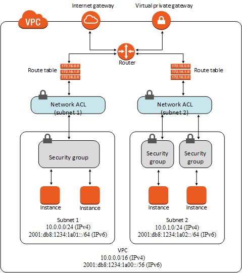
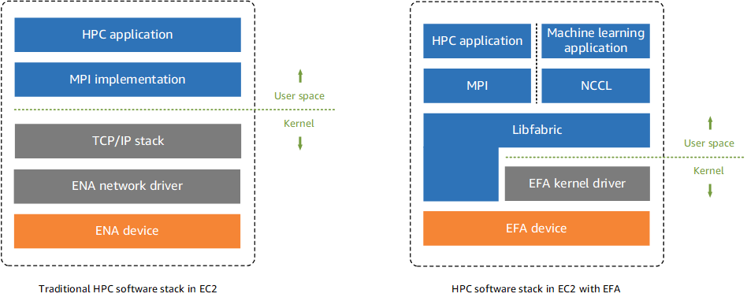

> AWS SAA 시험을 준비하면서, 기억해둘 내용을 저장해 놓는 문서
>
> udemy 연습 테스트 활용

[TOC]

# 연습 테스트 1

- Amazon Elastic Load Balancer는 하나의 리전에서만 실행되도록 설계되었다
- 전송 중 S3 데이터 보호 암호화 방법
  - 서버 측 암호화
    - 데이터 센터의 디스크에  저장하기 전에 객체를 암호화하고 객체를 다운로드 할 때 해독을 위해 Amazon S3에 요청하는 방식
    - Amazon S3 관리형 키를 사용한 서버 측 암호화(SSE-S3)
      - AWS에서 주기적으로 바뀌는 마스터 키를 사용해서 암호화
    - AWS Key Management Service에 저장된 고객 마스터 키(CMK)를 사용한 서버 측 암호화(SSE-KMS)
      - SSE-S3와 비슷하지만 추가 비용이 들고 별도의 권한 설정이 필요함
      - 사용 주체를 표시하는 감사 추적 기능 등 추가 기능을 사용할 수 있음
    - 고객 제공 키를 사용한 서버 측 암호화(SSE-C)
  - 클라이언트 측 암호화
    - 클라이언트 측 데이터를 암호화하여 암호화된 데이터를 Amazon S3에 업로드. 이 경우 사용자가 암호화 프로세스, 키 및 관련 도구를 관리해야 하는 방식
    - AWS Key Management Service에 저장된 고객 마스터 키(CMK)를 사용
    - 애플리케이션 내에 저장한 마스터 키를 사용
      - 객체를 업로드 할 때 Amazon S3 암호화 클라이언트에 클라이언트 측 마스터 키를 제공한다. 그리고 업로드 할 때 이 키를 사용하고, 어떤 키를 사용했는지 설명하는 내용을 메타데이터에 남긴다
- 네트워크 ACL(액세스 제어 목록)
  - 네트워크 ACL(액세스 제어 목록)은 1개 이상의 서브넷 내부와 외부의 트래픽을 제어하기 위한 방화벽 역할을 하는 VPC를 위한 선택적 보안 계층입니다. 보안 그룹과 비슷한 규칙으로 네트워크 ACL을 설정하여 VPC에 보안 계층을 더 추가할 수 있습니다
  - VPC에 있는 각 서브넷을 네트워크 ACL과 연결해야 한다. 명시적으로 연결하지 않으면, 기본 네트워크 ACL에 자동 연결됨
  - 네트워크 ACL을 여러 서브넷과 연결할 수 있다. 하지만 서브넷은 한 번에 하나의 네트워크 ACL에만 연결할 수 있다
  - 네트워크 ACL에는 별개의 인바운드 및 아웃바운드 규칙이 있다. 각 규칙은 트래픽을 허용하거나 거부할 수 있다
  - 네트워크 ACL은 상태 비저장이다. 즉, 허용되는 인바운드 트래픽에 대한 응답이라도 아웃바운드 트래픽에 대한 규칙을 따른다
  - 네트워크 ACL 규칙은 규칙 번호에 따라 가장 **낮은** 규칙에서 높은 규칙까지 평가되며 규칙이 적용되는 트래픽이 있으면 즉시 실행된다
- Amazon EBS 볼륨
  - 인스턴스의 수명과는 독립적으로 유지될 수 있는 오프인스턴스 스토리지이다
  - 프로덕션 중에 실시간 구성 변경을 지원한다. 볼륨 유형, 크기, IOPS 용량 수정 가능
- CIDR 블록
  - 주소 자체를 의미하려면 xxx.xxx.xxx.xxx/32 로 해야함. xxx.xxx.xxx.xxx/0 으로 하면 안됨. 이거는 전체 네트워크를 의미한다고 함
  - 출처
    - https://seogineer.tistory.com/87
- AWS CloudWatch는 AWS 리소스를 위한 모니터링 도구이고, AWS CloudTrail은 AWS 계정의 거버넌스, 규정 준수, 운영 감사, 위험 감사를 지원하는 서비스이다. 이 과정에서 CloudWatch Logs와 통합해서 사용할 수 있다
- RAID 0 vs RAID 1
  - 
  - 따라서 읽기/쓰기 속도를 높이려면 RAID 0이 낫다
  - 출처
    - https://www.partitionwizard.com/partitionmanager/raid-0-vs-raid-1.html
- ACL vs 보안 그룹
  - 
  - 출처
    - https://docs.aws.amazon.com/ko_kr/vpc/latest/userguide/VPC_Security.html
- AWS Snow Family
  - 
  - AWS Snow Family는 까다로운 비데이터 센터 환경 및 네트워크 연결이 일관되지 않은 위치에서 작업을 실행해야하는 고객을 지원한다
  - AWS와 일관된 엣지 컴퓨팅 디바이스
    - 네트워크 연결 없이도 직접 애플리케이션을 실행한다
    - 엣지에서 데이터를 처리하고 AWS로 데이터를 마이그레이션한다
  - snowcone < snowball < snowmobile
  - snowball에서 Glacier로 데이터를 직접 이동할 수는 없다. 먼저 S3를 거친 후 Glacier로 보내야 한다
- AMI
  - Amazon Machine Image
  - AMI는 리전 별로 관리된다. 따라서 다른 리전에서 사용하려면 복사를 먼저 한 후 사용해야 한다
  - AMI에는 네트워크 액세스 제어나 공유 기능이 없다

- VPC 피어링 vs VPC 서브넷 공유
  - VPC 피어링은 서로 다른 VPC 간에 통신이 가능하도록 만들어 주는 기능이다
    - 각 서브넷에 연결된 라우트 테이블을 적절하게 수정해줘야 한다
  - VPC 서브넷 공유는 말 그대로 다른 계정에게 VPC 서브넷을 공유해서 쓰도록 하는 것이다
    - 동일한 AWS Organization에 있는 계정에서만 공유할 수 있다
    - VPC 자체를 공유하지는 못한다. 서브넷을 공유하는 것이다
- AWS Organizations
  - 결제를 관리하고, 액세스, 규정 준수 및 보안을 제어하고 AWS 계정에서 리소스를 공유하는 일을 모두 중앙에서 손쉽게 처리할 수 있다
  - 계정 생성을 자동화하고, 비즈니스 요구를 반영하도록 계정 그룹을 생성하고, 거버넌스를 위해 이러한 그룹에 정책을 적용할 수 있다
    - 거버넌스: 일반적으로 과거의 일방적인 정부 주도적 경향에서 벗어나 정부, 기업, 비정부기구 등 다양한 행위자가 공동의 관심사에 대한 네트워크를 구축하여 문제를 해결하는 새로운 국정운영의 방식'을 말한다
    - 즉 각 부서가 역할에 따라 클라우드 운영을 함께 해나가는 방식을 의미하는 것으로 보인다
  - 계정에서 허용되는 서비스 및 작업을 제한할 수 있다. 서비스 제어 정책(SCP)을 사용하여 AWS identity and Access Management(IAM) 사용자 및 역할에 대한 권한 보호 계층을 적용할 수 있다
    - 예를 들어 조직 계정의 사용자가 허용되지 않는 리전에서 리소스를 실행하는 것을 제한하는 것 등
- 인터넷에서 데이터를 전송할 때 S3 데이터 전송 요금은 없다. S3TA(Transfer Acceleration)을 사용하는 경우에는 가속화된 전송에 대해서만 비용을 지불한다
  - S3에서 인터넷으로 전송할 때 요금을 지불한다. cf) 1GB/월은 0.00 USD
  - S3에서 동일한 버킷과 동일한 리전 내의 AWS 서비스로 전송된 데이터도 요금 x
  - CloudFront로 전송된 데이터도 요금 x
- Amazon S3 Standard-Infrequent Access(S3 Standard-IA)
  - S3 Standard-IA는 자주 액세스하지 않지만 필요할 때 빠르게 액세스해야 하는 데이터에 적합합니다
- Network load balancer(NLB) vs Application load balancer(ALB)
  - ALB
    - Layer7(HTTP/HTTPS traffic)
  - NLB
    - Layer4(TLS/TCP/UDP traffic)
  - ALB는 Layer7 계층 로드 밸런서이므로 HTTP 요청 헤더의 내용을 검사하여 요청을 라우팅할 위치를 결정한다. 따라서 ALB는 콘텐츠 기반 라우팅을 수행한다
  - NLB는 네트워크 및 TCP 계층 변수만을 기반으로 결정을 내리고 응용프로그램을 인식하지 않는다. 애플리케이션이 제대로 콘텐츠를 제공하는지 확인하지 않고, 단순히 ICMP 핑이나 TCP 핸드 셰이크가 정상적이면 정상이라고 판단한다. 반면에 ALB는 HTTP GET과 같은 방식으로 가용성을 확인한다
  - 로드 밸런서는 트래픽을 다른 AWS 리전으로 분산하지 않는다. 따라서 리전 단위로 로드 밸런싱하고 싶으면 Route 53을 사용해야한다
- AWS Trusted Advisor
  - AWS Trusted Advisor는 AWS 모범 사례에 따라 리소스를 프로비저닝하는 데 도움이 되도록 실시간 지침을 제공하는 온라인 도구입니다. Trusted Advisor는 AWS 인프라를 최적화하고 보안과 성능을 향상시키고 전체 비용을 절감하며 서비스 한도를 모니터링할 수 있습니다. 새 워크플로를 설정하든, 애플리케이션을 개발하든, 지속적인 개선의 목적으로 진행하든 상관없이, 정기적으로 Trusted Advisor에서 제시하는 권장 사항을 활용하면 솔루션을 최적으로 프로비저닝된 상태로 유지하는 데 도움이 됩니다
  - AWS Trusted Advisor는 AWS 환경을 분석하여 다음 5가지 카테고리의 모범 사례 권장 사항을 제공합니다.
    - 비용 최적화 : AWS Trusted Advisor는 미사용 및 유휴 리소스를 제거하거나 예약 용량을 약정하여 AWS에서 비용을 절감할 수 있습니다
    - 성능 : AWS Trusted Advisor는 서비스 한도를 점검하고 프로비저닝된 처리량을 활용하는지 확인하며 과다 사용되는 인스턴스를 모니터링함으로써 서비스 성능을 개선할 수 있습니다
    - 보안 : AWS Trusted Advisor는 결함을 없애고 다양한 AWS 보안 기능을 사용하며 권한을 점검하여 애플리케이션 보안을 개선할 수 있습니다
    - 내결함성 : AWS Trusted Advisor는 Auto Scaling, 상태 확인, 다중 AZ 및 백업 기능을 활용하여 AWS 애플리케이션의 가용성과 중복성을 향상시킬 수 있습니다
    - 서비스 한도 : AWS Trusted Advisor는 서비스 사용량이 서비스 한도의 80%를 넘는지 점검합니다. 값은 스냅샷을 기반으로 하므로 현재 사용량은 다를 수 있습니다. 한도 및 사용량에 변경 사항이 반영되는 데 최대 24시간이 걸릴 수 있습니다
- Amazon Inspector
  - Amazon Inspector는 AWS에 배포된 애플리케이션의 보안 및 규정 준수를 개선하는데 도움이 되는 자동 보안 평가 서비스입니다
- Amazon Simple Workflow Service(Amazon SWF)
  - Amazon Simple Workflow Service(Amazon SWF)는 분산 애플리케이션 구성 요소에서 작업을 쉽게 조정할 수 있도록 해주는 웹 서비스입니다. Amazon SWF를 사용하면 광범위한 사용 사례, 예를 들어 미디어 프로세싱, 웹 애플리케이션의 백 엔드, 비즈니스 프로세스 워크플로우, 분석 파이프라인 등에 대한 애플리케이션을 여러 작업의 조정으로 설계할 수 있습니다. 작업은 애플리케이션의 다양한 처리 단계의 호출을 의미하며 실행 코드, 웹 서비스 호출, 사람의 활동 및 스크립트 등을 통해 수행할 수 있습니다
- Elastic Network Adapter(ENA)
  - 향상된 네트워킹에서는 [지원되는 인스턴스 유형](https://docs.aws.amazon.com/ko_kr/AWSEC2/latest/UserGuide/enhanced-networking.html#supported_instances)에서 단일 루트 I/O 가상화(SR-IOV)를 사용하여 고성능 네트워킹 기능을 제공합니다. SR-IOV는 기존 가상 네트워크 인터페이스에 비해 높은 I/O 성능 및 낮은 CPU 사용률을 제공하는 디바이스 가상화 방법입니다. 향상된 네트워킹을 통해 대역폭과 PPS(Packet Per Second) 성능이 높아지고, 인스턴스 간 지연 시간이 지속적으로 낮아집니다
  - EFA는 추가 기능이 있는 ENA(Elastic Network Adapter)입니다. 따라서 추가적인 OS 우회 기능을 포함한 모든 ENA의 기능을 제공합니다. OS 우회는 HPC 및 기계 학습 애플리케이션이 네트워크 인터페이스 하드웨어와 직접 통신하도록 하는 액세스 모델로서 낮은 지연율과 신뢰성 높은 전송 기능을 제공합니다
  - 
  - Windows 인스턴스에서는 EFAs에서 제공하는 OS 우회 기능을 지원하지 않습니다. EFA를 Windows 인스턴스에 연결한 경우 인스턴스는 추가적인 EFA 기능이 없는 ENA(Elastic Network Adapter)로 작동합니다
- AWS ParallelCluster
  - AWS에서 고성능 컴퓨팅 (HPC) 클러스터를 쉽게 배포하고 관리 할 수 있는 오픈 소스 클러스터 관리 도구이다
- AWS Snowball Edge
  - AWS Snowball Edge 는 온보드 스토리지와 일부 AWS 기능을 위한 컴퓨팅 파워를 갖춘 일종의 Snowball 디바이스입니다. Snowball Edge는 로컬 프로세싱 및 에지 컴퓨팅 워크로드를 수행할 수 있으며 로컬 환경과 AWS 클라우드 간에 데이터를 전송할 수도 있습니다
  - 각 Snowball Edge 장치는 인터넷보다 빠른 속도로 데이터를 전송할 수 있습니다. 이 전송은 지역 운송업체를 통해 기기의 데이터를 운송하는 방식으로 이루어집니다. 이 기기는 견고하며 E Ink 배송 라벨이 부착되어 있습니다
  - Snowball 및 Snowball Edge는 서로 다른 두 개의 디바이스입니다. 두 디바이스를 통해 방대한 양의 데이터를 Amazon S3에 업로드하고 다운로드할 수 있습니다. 두 디바이스는 모두 동일한 작업 관리 API를 가지며 동일한 콘솔을 사용합니다. 그러나 두 디바이스의 하드웨어 사양, 일부 기능, 사용되는 전송 도구, 가격은 다릅니다
  - AWS Snowball 디바이스는 AWS Snowball Edge보다 저렴하지만 한 디바이스에 80TB의 데이터를 저장할 수 없습니다. 저장 용량은 Snowball 및 Snowball Edge에 사용 가능한 용량과 다릅니다. 80TB Snowball 어플라이언스 및 100TB Snowball Edge 어플라이언스에는 각각 72TB 및 83TB의 사용 가능한 용량만 있습니다. 따라서 하나의 AWS Snowball Edge 디바이스를 사용하는 것과 비교하여 2개의 Snowball 디바이스를 사용하면 비용이 많이 듭니다
- 연결 드레이닝(connection draining)
  - 기존 연결이 열려 있는 상태에서 Classic Load Balancer가 등록 취소 중이거나 비정상 상태인 인스턴스로의 요청 전송을 중지하도록 하려면 연결 드레이닝을 사용하십시오. 이렇게 하면 로드 밸런서가 등록 취소 중이거나 비정상 상태인 인스턴스로 진행 중인 요청을 완료합니다
  - 연결 드레이닝을 활성화하면 로드 밸런서가 인스턴스의 등록 취소를 보고하기 전에 연결을 유지할 수 있는 최대 시간을 지정할 수 있습니다. 최대 제한 시간 값의 범위는 1 ~ 3,600초입니다(기본은 300초). 최대 제한 시간에 도달하면 로드 밸런서는 등록 취소 중인 인스턴스로의 연결을 강제로 종료합니다
  - 진행 중인 요청이 처리되는 동안 로드 밸런서는 등록 취소 중인 인스턴스의 상태를 InService: Instance deregistration currently in progress로 보고합니다. 등록 취소 중인 인스턴스가 진행 중인 모든 요청의 처리를 완료하거나 최대 제한 시간에 도달하면 로드 밸런서는 인스턴스 상태를 OutOfService: Instance is not currently registered with the LoadBalancer로 보고합니다

# 연습 테스트 2

- S3 접두사 설정을 통해 트랜잭션 성능을 높일 수 있다

  - S3는 요청 성능에서 초당 수천 회의 트랜잭션을 쉽게 달성할 수 있는데, 이는 버킷 접두사 별로 적용된다
  - 예를 들어 접두사 10개를 만들어서 읽기를 병렬화하는 경우 읽기 성능을 초당 55,000개로 늘릴 수 있다
  - 이름에 따라, 날짜에 따라 버킷을 새로 만들어서 쓰는 것은 비효율적일 뿐만 아니라 불가능할 수도 있다. 버킷은 전역적이므로 이름이 중복되면 안되기 때문이다

- DynamoDB와 CloudFront는 Read Replica 기능이 없기 때문에 다중 AZ 배포로 실행 중이라고 할 수 없다

  - RDS와 Aurora는 Read Replica 기능이 있고, 비동기식 복제를 제공한다

- AWS Resource Access Manager(RAM)

  - AWS Resource Access Manager(RAM)는 고객에게 AWS 계정 또는 AWS Organizations 내에서 리소스를 공유할 수 있는 간단한 방법을 제공합니다. 많은 AWS 고객이 여러 AWS 계정을 사용하여 팀에 관리 및 결제 자율성을 제공합니다. 이러한 고객은 이제 중앙 집중식으로 리소스를 생성하고 RAM을 사용하여 여러 계정 간에 공유할 수 있으므로 다중 계정 전략의 이점을 유지하면서 고객의 운영 오버헤드는 줄일 수 있습니다. RAM을 사용하여 리소스를 공유하면 고객이 각 계정에서 중복 리소스를 만들지 않아도 되므로 비용을 절감할 수 있습니다. 공유 리소스의 소비는 AWS Identity and Access Management의 액세스 제어 정책과 AWS Organizations의 서비스 제어 정책에 의해 관리되므로 고객은 보안 및 거버넌스 제어에 대한 기존 투자를 활용할 수 있습니다
  - IAM을 사용하여 다른 AWS 계정에있는 리소스에 대한 액세스 권한을 위임 할 수 있습니다. 이 프로세스는 매우 번거롭고 회사의 모든 AWS 계정에 대한 계정 간 액세스를 수동으로 설정해야하기 때문에 많은 작업 오버 헤드가 필요합니다. 더 나은 솔루션은 AWS Resources Access Manager를 사용해서 IAM을 활용하는 것이다

- AWS Lambda는 함수를 실행하고 저장하는 데 사용할 수 있는 컴퓨팅 및 스토리지 리소스의 양을 제한합니다. 다음과 같은 리전당 할당량이 적용되며 이 할당량 증가 요청을 통해 이를 늘릴 수 있습니다

  | 리소스                                                       | 기본 할당량                                                  | 최대 한도 증가 |
  | :----------------------------------------------------------- | :----------------------------------------------------------- | :------------- |
  | 동시 실행                                                    | 1,000                                                        | 수십만         |
  | 함수 및 계층 스토리지(.zip 파일 아카이브)                    | 75 GB                                                        | TB             |
  | 함수 스토리지(컨테이너 이미지)                               | [Amazon ECR 서비스 할당량](https://docs.aws.amazon.com/AmazonECR/latest/userguide/service-quotas.html)을 참조하세요. |                |
  | [Virtual Private Cloud(VPC)별 탄력적 네트워크 인터페이스](https://docs.aws.amazon.com/ko_kr/lambda/latest/dg/configuration-vpc.html) **참고**이 할당량은 Amazon Elastic File System(Amazon EFS)과 같은 다른 서비스와 공유됩니다. [Amazon VPC 할당량](https://docs.aws.amazon.com/vpc/latest/userguide/amazon-vpc-limits.html)을 참조하세요. | 250                                                          | 수백           |

  - 함수 구성, 배포, 실행에도 할당량이 적용된다. 이는 변경할 수 없다. 대표적인 할당량은 아래와 같다
    - 메모리 할당: 128MB ~ 10,240 MB, 1MB씩 증분됨
    - 제한 시간: 900초 (15 minutes)