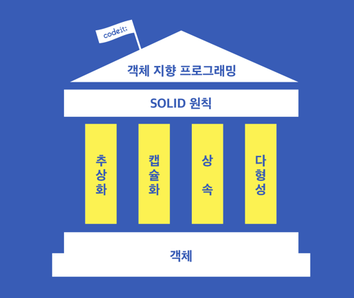

# OOP(Object Oriented Programming) 정리 with Python

- codeit 객체 지향 프로그래밍 강의 정리 문서


## 1. 객체 지향 프로그래밍이란?

- 객체
  - 속성 & 행동으로 이루어진 존재
  - 우리가 살아가면서 보는 모든 존재를 객체라고 생각하면 됨
    - 현실에 존재하든, 가상으로 존재하든 속성 & 행동을 떠올릴 수 있다면 모든 것이 객체임
  - ex)
    - 자동차
      - 속성
        - 의자 갯수
        - 색깔
        - 높이
      - 행동
        - 시동
        - 전진
    - 인스타그램 유저
      - 속성
        - 이메일 주소
        - 비밀번호
        - 친구 목록
      - 행동
        - 좋아요
        - 친구 추가
  
- 객체 지향 프로그래밍
  - 프로그램을 여러 개의 독립된 객체들과 그 객체들 간의 상호 작용으로 파악하는 프로그래밍 접근법
    - 프로그램을 객체들과 객체들 간의 소통으로 바라보는 것
  - 모델링 방법
    1. 프로그램에 어떤 객체들이 필요할지 정한다
    2. 객체들의 속성(변수)과 행동(메소드)을 정한다
    3. 객체들이 서로 어떻게 소통할지 정한다
  - 절차 지향 프로그래밍과의 차이
    - 객체 지향 프로그래밍에서는 객체가 행동의 주체인데, 절차 지향 프로그래밍에서는 데이터만 있는 객체는 함수가 주도적으로 사용하는 대상일 뿐이다
      - C 언어에서는 데이터를 보통 구조체(struct)라는 단위로 묶어 놓는다. 그리고 함수를 정의해서 함수가 구조체를 사용하는 방식의 형태로 프로그래밍 한다
      - C 언어에서도 구조체에 함수를 정의해서 클래스처럼 사용할 수 있지만, 굳이 절차 지향 프로그래밍 언어를 객체 지향식으로 사용하는 것으로 볼 수 있어서 권장되지는 않는다
    - 객체 지향 프로그래밍이라고 해서 어떤 순차나 절차가 없다는 뜻은 아니다. 두 프로그래밍 방법의 차이는 데이터와 함수를 하나로 묶은 객체라는 존재가 행동의 주체가 되느냐, 함수가 주체가 되어 데이터를 다루느냐에 있다
  
- 클래스 vs 객체 vs 인스턴스
  - 클래스: 설계도
  - 객체: 클래스로 구현할 어떤 것
  - 인스턴스: 객체를 객체의 생성자를 통해 실체화 시킨 것. 실제로 메모리에 올려진 객체
  
- 인스턴스 메소드

  - 메소드를 사용할 때 첫 번째 인자로 해당 인스턴스를 받는다

  - ex)

    - ```python
      class User:
          def follow(self, another_user):
              pass
              return
      ```

- 특수 메소드(던더 메소드 ⇔ 더블 언더바 메소드)
  - 특정 상황에서 자동으로 호출되는 메소드. 앞 뒤로 언더바를 두 개씩 넣는 방식으로 표현된다
  - ex)
    - `__init__` 메소드
      - 인스턴스를 생성할 때 자동으로 실행되는 메소드
    - `__str__` 메소드
      - 인스턴스를 print로 출력할 때 실행되어 원하는 문자열을 반환하여 출력되도록 하는 메소드
- 인스턴스 변수를 만드려면 class 안에 `self.변수명`을 쓰면 되고, 클래스 변수를 만드려면 self 없이 그냥 변수명을 쓰면 된다

- 같은 이름의 클래스 변수 vs 같은 이름의 인스턴스 변수

  - 같은 이름의 인스턴스 변수에 우선권이 있다
  - 예를 들어 `count` 라는 클래스 변수가 존재할 때, `인스턴스.count = 123`이라 입력하면 클래스 변수가 수정되는 것이 아니라 `count`라는 같은 이름의 인스턴스 변수가 생성되는 것이다
  - 따라서 인스턴스 변수와 클래스 변수가 헷갈리게 이름 짓지 않는 것이 좋다

- 데코레이터(decorator)

  - 함수를 꾸며서 새로운 함수를 만들어 주는 역할. 데코레이터가 함수라면? 데코레이터 함수

  - ex)

    - ```python
      # 데코레이터 ex1
      def print_hello():
          print("안녕하세요!")
      
      
      # 데코레이터 함수
      # original이라는 함수를 꾸며서 wrapper라는 새로운 함수를 만들어 내는 함수
      def add_print_to(original):  # parameter로 함수를 받음
          def wrapper():
              print("함수시작")
              original()
              print("함수 끝")
          return wrapper
      
      
      print_hello = add_print_to(print_hello)
      print_hello()
      ```

    - ```python
      # 데코레이터 ex2 ⇔ 데코레이터 ex1
      def add_print_to(original):
          def wrapper():
              print("함수시작")
              original()
              print("함수 끝")
          return wrapper
      
      
      @add_print_to  # ex1의 print_hello = add_print_to(print_hello) 이 과정을 @데코레이터함수 방식으로 자동화할 수 있음
      def print_hello():
          print("안녕하세요!")
      
          
      print_hello()
      ```

- 클래스 메소드

  - `@classmethod`라는 데코레이터로 클래스 메소드를 만들 수 있다
  - 클래스 메소드는 첫 번째 인자로 클래스를 받는다
    - 이 때 첫 번째 인자를 `cls`로 쓰는 것이 관습
    - cf) 인스턴스 메소드는 `self`로 인스턴스를 첫 번째 인자로 받음

- 인스턴스 메소드 vs 클래스 메소드

  - ```python
    # 인스턴스 메소드(ex: say_hello) 사용
    User.say_hello(user1)
    user1.say_hello()  # 이 경우에만 say_hello 함수에 user1이 첫 번째 파라미터로 전달 됨
    
    # 클래스 메소드(ex: number_of_users) 사용
    User.number_of_users()  # 이 경우에 number_of_users 함수에 User 클래스가 첫 번째 파라미터로 전달 됨
    user1.number_of_users()  # 이 경우에도 number_of_users 함수에 User 클래스가 첫 번째 파라미터로 전달 됨
    ```

  - 인스턴스 변수만 사용할 때: 인스턴스 메소드 사용

  - 클래스 변수만 사용할 때 or 인스턴스 없이도 필요한 정보가 있을 때: 클래스 메소드 사용

  - 인스턴스 변수와 클래스 변수 둘 다 사용할 때: 인스턴스 메소드 사용(∵ 클래스 메소드에서는 인스턴스 인자를 받을 수 없다)

- 정적 메소드(static method)

  - `@staticmethod` 데코레이터를 사용해서 만든다

  - `self`, `cls` 처럼 자동으로 넘어가는 인자가 없다

  - 정적 메소드는 인스턴스, 클래스 두 가지 모두를 통해 사용 가능하다

    - ```python
      # ex)
      class User:
          ...
          @staticmethod
          def is_valid_email(email_address):
              return "@" in email_address
          
      
      print(User.is_valid_email("taehosung"))
      print(User.is_valid_email("taehosung@codeit.kr"))
          
      print(user1.is_valid_email("taehosung"))
      print(user1.is_valid_email("taehosung@codeit.kr"))
      ```

  - 인스턴스 변수나 클래스 변수와 같은 어떤 속성을 다루지 않고, 단지 기능(행동)적인 역할만 하는 메소드를 정의할 때 정적 메소드를 사용한다

- 파이썬은 순수 객체 지향 언어이다

  - 파이썬에서는 모든 것이 객체다

    - ```python
      # ex)
      print(type(2))  # 정수. <class 'int'> 로 만들어진 객체
      print(type('string'))  # 문자열. <class 'str'> 로 만들어진 객체
      print(type([]))  # 리스트. <class 'list'> 로 만들어진 객체
      print(type({}))  # 딕셔너리. <class 'dict'> 로 만들어진 객체
      print(type(()))  # 튜플. <class 'tuple'> 로 만들어진 객체
      print(type(print))  # 함수. <class 'builtin_function_or_method'> 로 만들어진 객체
      
      # 위의 클래스들은 파이썬 개발자들이 미리 만들어 놓은 class
      ```

  - 다른 언어에는 type이 객체가 아닌 것들도 있다. JAVA와 같은 경우 객체 지향 언어이기는 하지만 순수 객체 지향 언어는 아니다

- 가변 타입 객체 vs 불변 타입 객체

  - 한번 생성한 인스턴스의 속성 변경 가능(ex: list, dict, 직접 작성하는 클래스)
  - 한번 생성한 인스턴스의 속성 변경 불가(ex: bool, int, float, str, tuple)

- 절차 지향 프로그래밍 vs 객체 지향 프로그래밍

  - 절차 지향 프로그래밍은 프로그램에 필요한 동작들 만을, 함수라는 단위로 묶어서 사용한다. 객체 지향 프로그래밍은 프로그램에 필요한 동작과 관련된 데이터도 클래스라는 단위로 함께 묶어서 관리한다

  - ```python
    # 절차 지향 프로그래밍 예시
    # 반복적으로 사용하는 코드를 함수로 정의한다
    def print_person_info(person_name, person_age, person_gender):
        # 사람의 이름, 나이, 성별을 파라미터로 받으면 받은 정보를 이해할 수 있는 문자열로 출력해주는 함수
        print("사람 한 명을 소개합니다")
        print("{}님은 {}살이고 {}입니다".format(person_name, person_age, person_gender))
        
    def is_underage(person_age):
        # 사람의 나이를 파라미터로 받아서 미성년자인지를 리턴해주는 함수
        return person_age < 20
        
    # 영훈이의 정보
    young_name = "영훈"
    young_age = 10
    young_gender = "남자"
        
    # 윤수의 정보
    yoonsoo_name = "윤수"
    yoonsoo_age = 20
    yoonsoo_gender = "남자"
        
    # 영훈/윤수 정보 출력
    print_person_info(young_name, young_age, young_gender)
    print_person_info(yoonsoo_name, yoonsoo_age, yoonsoo_gender)
        
    # 영훈/윤수가 미성년자인지 출력
    print(is_underage(young_age))
    print(is_underage(yoonsoo_age))
    
    
    # 객체 지향 프로그래밍 예시
    # 속성과 행동을 갖는 객체들이 행동을 하는 방식으로 작성한다
    class Person:
        # 사람을 나타내는 클래스
        def __init__(self, name, age, gender):
            # 사람은 이름, 나이, 성별을 속성으로 갖는다
            self.name = name
            self.age = age
            self.gender = gender
        
        def print_info(self):
            # 자신의 정보를 출력하는 메소드
            print("사람 한 명을 소개합니다")
            print("{}님은 {}살이고 {}입니다".format(self.name, self.age, self.gender))
        
        def is_underage(self):
            # 사람의 나이를 파라미터로 받아서 미성년자인지를 리턴해주는 메소드
            return self.age < 20
        
    # 영훈/윤수을 나타내는 객체 생성
    young = Person("영훈", 10, "남자")
    yoonsoo = Person("윤수", 20, "남자")
        
    # 영훈/윤수 정보 출력
    young.print_info()
    yoonsoo.print_info()
        
    # 영훈/윤수가 미성년자인지 출력
    print(young.is_underage())
    print(yoonsoo.is_underage())
    ```

  - 객체 지향 프로그래밍이라고 해서 순서가 없는 것은 아니다. 절차 지향 프로그래밍은 프로그램을 명령어를 순서대로 실행하는 것으로 이해하는 것이고, 객체 지향 프로그래밍은 프로그램을 객체들이 순서대로 소통하는 것으로 이해하는 것이다

  - 어떤 방식이 더 낫다고 할 수는 없지만, 복잡한 프로그램은 객체 지향적으로 하는 것이 나은 경우가 많다

- 모듈(module)

  - 변수, 함수, 클래스 등을 모아놓은 파일

  - 모듈을 만들어 두면 다른 곳에서 가져다 쓸 수 있다

    - `from 모듈의 이름 import 불러올 변수/함수/클래스 이름`

  - ```python
    # ex)
    # calculator.py
    # calculator 모듈
        
    
    # 합
    def sum(x, y):
        return x + y
    ```

    - ```python
      # test.py
      
      # calculator.py에서 sum 함수 불러오기
      from calculator import sum
          
      print(sum(3, 5))
      ```


## 2. 객체 지향 프로그래밍의 4개의 기둥




- 객체 지향 프로그래밍 4개의 기둥
  - 추상화
  - 캡슐화
  - 상속
  - 다형성


### 추상화

- 프로그래머들이 특정 코드를 사용할 때 **필수적인 정보**를 제외한 세부 사항을 가리는 것

- ex) 커피 머신  
  커피를 마실 때 기계안의 복잡한 원리를 알 필요는 없음. 그냥 버튼 누르면 커피가 나온다는 것만 알면 된다

- 추상화를 잘 하려면 이름을 잘 지어야 한다. 이름만 보고도 어떤 기능을 하는지 알 수 있게

- 추상화를 더 잘하려면 문서화를 해야 한다

  - 문서화(docstring)  

    ```python
    # ex)
    
    '''
    이렇게 docstring을 사용할 수 있다
    '''
    ```

  - 파이썬 기본 함수인 `help(클래스명)`를 실행하면 클래스명 혹은 함수명과 함께 해당하는 docstring 내용이 출력된다

  - 문서화의 형식에 꼭 정해진 틀은 없지만, 흔히 사용하는 포맷은 있다  
    ex) Google docstring, 파이썬 공식 문서화 기준, Numpy/SciPy 포맷  
    이러한 기준의 공통적인 특징은 Parameter와 Return이 무엇인지에 관해 설명한다는 것이다

- 파이썬 3.5부터 type hinting 사용이 가능하다

  - 변수 옆에 `: 타입명`을 붙여서 사용 가능하고, 함수 파라미터 괄호 오른쪽에 ` -> 타입명`을 붙여서 사용 가능하다

  - ```python
    # ex)
    class BankAccount:
        def deposit(self, amount: float) -> None:
            self.balance += amount
    
    ```


### 캡슐화

- 캡슐화의 정의

  1. 객체의 일부 구현 내용에 대한 외부로부터의 **직접적인 액세스를 차단**하는 것
  2. 객체의 **속성**과 그것을 사용하는 **행동**을 하나로 묶는 것

- 객체 내부 숨기기(캡슐화의 첫 번째 정의)

  - 변수나 메소드 이름 앞에 언더바 두 개 붙이기

  - ```python
    # ex)
    self.__age = 14
    
    def __authenticate(self, name):
        ...
        
    ```

  - 이렇게 숨겨놓은 변수나 메소드를 클래스 밖에서 사용하려고 하면 오류난다

- 객체 내부의 변수나 메소드를 숨기고 해당하는 정보를 설정하거나 읽는 메소드를 따로 만들어서 해당 메소드로 객체 내부에 숨겨둔 변수나 메소드를 사용한다(간접 접근)

  - 이런식으로 객체의 속성과 그것을 사용하는 행동을 하나로 묶어서 사용하는 것이 캡슐화이다(캡슐화의 두 번째 정의).
  - ex) getter, setter 메소드를 사용하는 방식. 물론 모든 숨겨놓은 변수에 getter나 setter 메소드를 만들 필요는 없다

- 사실 파이썬은 언어 차원에서 캡슐화를 지원하지 않는다

  - 클래스 안의 변수나 메소드 앞에 언더바 두 개를 붙여서 캡슐화하더라도 그냥 이름만 바꿔줄 뿐이다(name mangling). dir 함수로 인스턴스의 모든 변수와 메소드를 볼 수 있는데, 이를 통해 캡슐화된 변수나 메소드를 사용할 수 있다
  - Java에서는 private 같은 키워드를 통해 외부로부터의 접근을 완벽히 차단할 수 있다
  - 파이썬 개발자들 사이에서는 언더바 한 개를 붙여서 만든 변수나 메소드에는 접근하면 안된다는 경고를 주는 문화가 형성되어 있다(파이썬 코딩 스타일 가이드).  
    그럼 그냥 언더 바 두 개짜리를 접근하지 말라는 의미로 쓰면 안되는가? 언더 바 두 개는 name mangling이 지원되므로 서로 다른 클래스에서 같은 변수를 사용할 때 헷갈리지 않으려고 할 때 쓴다고 한다
  - 파이썬이 언어 차원의 캡슐화를 지원하지 않는 것은 파이썬의 문화라고 한다. 파이썬에서는 캡슐화를 엄격하게 사용하지 않는다

- 데코레이터를 사용한 캡슐화

  - 어떤 인스턴스 변수에 대해 캡슐화를 사용하지 않다가 갑자기 캡슐화를 하고 싶어질 때, 데코레이터를 사용하면 편하게 할 수 있다.  
    데코레이터를 사용하지 않는다면 해당 인스턴스 변수가 들어간 모든 곳에 언더바를 붙여야 한다. 하지만 데코레이터(`@property`, `@해당인스턴스변수명.setter`)를 사용해서 getter, setter 함수만 만들면 해당 인스턴스 변수를 캡슐화할 수 있다  
    또한, 캡슐화한 해당 인스턴스 변수를 사용할 때도 getter, setter 메소드를 사용하는 것처럼 사용하는 것이 아니고 직접 접근하는 것처럼 사용하면 되기 때문에, 사용하기에도 편하다

  - ```python
    # ex) 두 함수의 이름이 캡슐화하고 싶은 변수명이라는 것이 포인트
    @property
    def age(self):
        print('나이를 리턴합니다')
        return self._age
    
    @age.setter
    def age(self, value):
        print('나이를 설정합니다')
        self._age = value
        
        
    # 그냥 캡슐화 안된 변수에 접근하는 것처럼 사용할 수 있다
    인스턴스.age = 10
    print(인스턴스.age)
    ```

- 변수 직접 접근 사용 최소화 → 유지 보수 쉬운 코드


### 상속

- 상속을 통해 클래스 별로 중복되는 코드를 줄인다
- 상속 관계에 있는 두 클래스가 있을 때, 자식 클래스로 만든 인스턴스는 부모 클래스의 인스턴스이기도 하다. `isinstance(인스턴스명, 클래스명)`으로 확인 가능
- 상속해서 오버라이딩하면 부모 클래스의 메소드를 수정할 수 있다
  - `클래스명.mro()`를 확인하면 상속 순서를 확인할 수 있다. 이 순서는 메소드 검색 순서를 의미하기도 한다. 그래서 오버라이딩 하면 자식의 메소드가 먼저 사용되는 것이다. MRO(Method Resolution Order)
- 파이썬에서는 다중상속이 가능하다
  - 이 경우에는 `super()`는 첫번째 부모만을 의미한다. 따라서 부모 클래스 명을 직접 사용해야 여러 부모를 다 표현할 수 있다.  
    단, super() 를 이용하는 경우에는 자동으로 self가 넘어가지만 부모의 이름을 이용하는 경우에는 self가 넘어가지 않기 때문에 명시적으로 첫번째 매개변수에 self를 넘겨줘야 한다
  - 여러 부모가 같은 이름의 메소드를 갖고 있다면 부모 클래스 명을 직접 명시하지 않는 경우 내가 의도한 방향으로 프로그램이 만들어지지 않을 수 있다.  
    이런 경우를 배제하기 위해, 부모 클래스끼리 같은 이름의 메소드를 갖지 않도록 하고 같은 이름의 메소드는 자식 클래스에서 오버라이딩 하는 방식으로 극복하기도 한다.  
    이러한 문제들 때문에, 되도록 다중 상속을 하지 않는 것이 바람직하다
  - 자바에서는 이러한 문제를 없애기 위해 다중 상속을 허용하지 않고, 오직 하나의 부모 클래스만을 상속받을 수 있게 되어 있다


### 다형성

- 여러 가지의 형태를 갖는 성질

  - ex)  
    사각형과 원이 있을 때, '도형의 넓이, 도형의 둘레' 라는 표현이 가능하다. 이 때, '도형'이라는 단어는 다형성을 갖는다고 말할 수 있다. 이렇게 다형성을 갖는 변수를 활용하여 프로그램을 만들 수 있다

- 다형성을 활용하다보면 표현에 문제가 생길 수 있다. 예를 들면, 원통이라는 도형에는 넓이라는 개념이 없고 사각형이라는 도형에는 부피라는 개념이 없다.  
  따라서 이를 해결하기 위해 상속을 활용하기도 한다. 예를 들면, 사각형과 원은 2차원 도형을 상속 받게 하고 원통은 3차원 도형을 상속받게 해서 `isinstance()` 함수로 도형이라는 표현을 구분하는 것이다

- 추상 클래스

  - 여러 클래스들의 공통점을 추상화해서 모아놓은 클래스

    - 추상 클래스로는 인스턴스를 만들 수 없다
    - 추상 클래스를 상속받으면 추상 메소드의 오버라이딩이 강제된다
    - 추상 클래스를 상속받고 추상 메소드를 오버라이딩 하지 않으면? 상속 받은 클래스도 여전히 추상 클래스로 남아 있기 때문에 인스턴스 생성이 불가하다. 오류남

  - ex) 도형이라는 클래스는 넓이와 둘레를 계산할 수 있는 어떤 것

  - 클래스 메소드 내용을 `pass`로 두고 자식 클래스가 이를 오버라이딩 하여 구현하도록 강제하지 않는다면, 오류 발생 가능성이 생긴다. 자식 클래스가 오버라이딩을 하지 않더라도 자동으로 빈 메소드가 상속되기 때문이다

  - 사용법

    - ```python
      # ex)
      # ABC: Abstract Base Class
      from abc import ABC, abstractmethod
      
      
      class Shape(ABC):
          @abstractmethod
          def area(self):
              pass
          
          @abstractmethod
          def perimeter(self):
              pass
      ```

  - 추상 클래스를 만들때 type hinting을 사용하면 좀더 명확하게 표현할 수 있다

  - 추상 메소드의 내용에 `pass`말고도 다른 내용을 넣어줄 수도 있다. 오버라이딩 할 때, `super().추상메소드()` 방식으로 공통되는 부분을 가져다 쓰는 용도로 쓸 수 있도록

  - `@property` 와 `@abstractmethod`를 함께 사용해서 추상 클래스에서 특정 변수의 사용을 강제할 수도 있다. `@property`로 getter 메소드 사용을 강제하면 해당 변수도 써야할 거고 setter 메소드도 써야할 테니까. 물론 무시하고 다른 형태로 오버라이딩할 수도 있지만, 파이썬의 문화를 잘 따르는 개발자는 이를 따를 것이다

- 추상 클래스 다중 상속은 일반적으로 많이 사용한다. 추상 메소드는 반드시 오버라이딩 해야하니까.  
  다만 추상 클래스여도 추상 클래스 내에 이름이 겹치는 일반 메소드가 있으면 일반 클래스의 다중 상속 상황과 동일한 문제가 생긴다

- 함수/메소드 다형성

  - 클래스 다형성 이외에도, 함수/메소드도 다형성을 사용할 수 있다
    1. Optional Parameter 사용
       - Optional Parameter는 꼭 일반 Parameter 뒤에 정의해야 한다
    2. 함수 호출할 때, 파라미터 이름 명시하기
       - ex)  
         `print_name(last_name='김', first_name='철수')`  
         `print_name(first_name='철수', last_name='김')`
    3. 개수가 확정되지 않은 파라미터
       - ex)  
         `def print_message_and_add_numbers(message, *numbers): ...`

- 파이썬 EAFP 코딩 스타일

  - LBYL(Look Before You Leap)

    - 어떤 작업을 수행하기 전에 그 작업을 수행해도 괜찮을지 확인

    - ex)  

      ```python
      def add_shape(self, shape):
          if isinstance(shape, Shape):
              self.shapes.append(shape)
          else:
              print('도형 클래스가 아닌 인스턴스는 추가할 수 없습니다!')
              
      def total_area_of_shapes(self):
          return sum([shape.area() for shape in self.shapes])
      ```

  - EAFP(Easier to Ask for Forgiveness than Permission)

    - 일단 먼저 빨리 싱행하고, 문제가 생기면 처리한다

    - LBYL와 정반대 스타일

    - ex)  

      ```python
      def add_shape(self, shape):
          self.shapes.append(shape)
          
      def total_area_of_shapes(self):
          total_area = 0
          
          for shape in self.shapes:
              try:
                  total_area += shape.area()
              except:
                  print('그림판에 area 메소드가 없거나 잘못 정의되어 있는 인스턴스 {}가 있습니다.'.format(shape))
                  
          return total_area
      ```

    - 이게 파이썬스러운 스타일이라고 한다


## 3. 견고한 객체 지향 프로그래밍

- SOLID 원칙

  1. **단일 책임 원칙** (Single Responsibility Principle)
  2. **개방 폐쇄 원칙** (Open-Closed Principle)
  3. **리스코프 치환 원칙** (Liskov Substitution Principle)
  4. **인터페이스 분리 원칙** (Interface Segregation Principle)
  5. **의존 관계 역전 원칙** (Dependency Inversion Principle)

  - Robert C. Martin이 2000년도에 처음 소개한 객체 설계의 기본 원칙
  - 객체 지향 프로그래밍에서 사실상 표준 규칙으로 알려져 있음
  - 프로그램의 크기가 커질수록  SOLID 원칙을 잘 지키는 것이 중요함


### 단일 책임 원칙

- 모든 클래스는 단 한가지의 책임만을 갖고, 클래스 안에 정의되어 있는 모든 기능은, 이 하나의 책임을 수행하는데 집중되어 있어야 한다
  - 단일 책임 원칙은 결국 어떤 코드 수정이 필요할 때 같은 이유로 수정되어야할 것들을 묶고, 다른 이유로 수정되어야 할 것들은 분리하는 것이다. 책임이란 **수정되어야 할 이유**를 기준으로 그 범위가 정해진다
- GOD Object
  - 하나의 클래스가 많은 책임을 지는 것을 비유적으로 표현하는 말
- 코드를 작성할 때, **단일 책임 원칙** 신경 쓰기!
  - 클래스에 분리할 수 있는 변수와 메소드가 많으면 의심해 봐야함
  - 처음엔 별 문제 없어도, 프로그램이 커질 수록 유지보수가 힘들어질 수 있음
- 프로그램의 유지 보수 차원에서, **한 클래스**는 **한가지 책임에 관한 변경사항이 생겼을 때**만 코드를 수정하게 되는 구조가 좋은 구조


### 개방 폐쇄 원칙

- 클래스는 확장에 열려 있어야하며, 수정에는 닫혀 있어야 한다

  - > 확장에 열려 있다는 것은 프로그램의 기존 기능을 확장할 수 있다는 것이고, 수정에 닫혀 있다는 건 한 번 작성한 코드를 바꾸지 않아도 되는 것이다

  - 즉, 기존 클래스를 확장해서 사용할 때, 코드를 바꾸지 않아도 되도록 설계해야 한다는 뜻

- 추상 클래스를 사용하여 다형성을 사용하면 개방 폐쇄 원칙을 지킬 수 있다

  - 같은 기능을 하는 객체는 추상 클래스를 상속 받아서 쓰게하면 된다

- 개방 폐쇄 원칙을 지키면, 더 쉽게 협력하고 더 편하게 수정할 수 있다
  
  - 추상 클래스로 일종의 제약을 두면 제약에 대한 확신이 있으므로 믿음을 가지고 클래스를 수평 확장할 수 있다


### 리스코프 치환원칙

- 부모 클래스의 인스턴스를 사용하는 위치에 자식 클래스의 인스턴스를 대신 사용했을 때, 코드가 원래 의도대로 작동해야 한다
  - 자식 클래스의 인스턴스는 부모 클래스의 인스턴스이기도 하다.  
    따라서, 부모 클래스의 행동 규약을 자식 클래스가 어기지 말라는 것
- 자식 클래스가 오버라이딩을 잘못하면 이 원칙을 어길 수 있다
  1. 자식 클래스가 부모 클래스의 변수 타입을 바꾸거나 메소드의 파라미터 또는 리턴 값의 타입 or 갯수를 바꾸는 경우(형식적 측면)
  2. 자식 클래스가 부모 클래스의 의도와 다르게 메소드를 오버라이딩 하는 경우(내용적 측면)
- 무조건 자식 클래스가 부모 클래스의 행동 규약을 따르도록 강제해서는 안됨. 부모의 행동 규약을 의미적으로 지키기 어렵다면, 애초에 상속 관계를 주지 않아야 하는 관계일 수도 있음
- 리스코프 치환원칙을 지키는 것은 함께 협업하는 다른 개발자를 위해서도 중요하다


### 인터페이스 분리 원칙

- 추상 클래스 중에서 추상 메소드만 있고 일반 메소드는 없는 것(파이썬에는 없는 개념).
- 클래스가 사용하지 않을 메소드에 의존할 것을 강요하면 안 된다
  - 클래스가 나중에 사용하지도 않을 메소드를 가지도록 강제하지 말라
  - 추상 클래스의 추상 메소드는 반드시 오버라이딩 해야하므로, 쓰지 않을 추상 메소드를 정의 해놓은 추상 클래스를 상속받게 하지 말고 인터페이스를 분리하라는 말
- 뚱뚱한 인터페이스를 여러 개의 역할 인터페이스(role interface)로 나눠라
  - 무조건 추상 메소드를 쪼개라는 말은 아니고 기능과 역할에 맞게 쪼개라


### 의존 관계 역전 원칙

- 상위 모듈은 하위 모듈의 구현 내용에 의존하면 안 된다. **상위 모듈과 하위 모듈 모두 추상화된 내용에 의존**해야 한다
  - cf) 모듈: 변수, 함수, 클래스 등을 모아놓은 파일. 위 쪽에 정리 해놓은 내용
  - 상위 모듈: 사용하는 모듈  
    하위 모듈: 사용당하는 모듈
  - 상위 모듈과 하위 모듈 모두 추상화된 내용에 의존해야한다
    - 추상 클래스를 상속받지 않은 하위 모듈의 일반 메소드를 그대로 가져다가 코드에 쓰지 말고, 하위 모듈의 추상화 클래스를 만들어서 하위 모듈이 이를 상속받아서 메소드를 오버라이딩 하도록 해라. 이렇게 프로그램을 만들면 추상화 된 내용에 의존하는 것이므로 좀더 안전하니까
- 추가 설명
  - 의존 관계 역전 원칙은 상위 모듈이 하위 모듈을 사용할 때 직접 인스턴스를 가져다가 쓰지 말라는 뜻입니다. 왜냐하면 인스턴스를 바로 가져다가 쓴다는 말은 하위 모듈의 구체적인 내용에 상위 모듈이 의존하게 되어 하위 모듈에 변화가 있을 때마다 상위 모듈의 코드를 자주 바꿔줘야 하기 때문입니다. 이에 대한 해결책은  **추상 클래스**로 상위 모듈과 하위 모듈 사이에 **추상화 레이어**를 만드는 것입니다
  - 이 내용은 개방-폐쇄 원칙과도 연결되어 있다. 이처럼 SOLID 원칙은 각각 별도의 것이 아니라 서로 긴밀하다