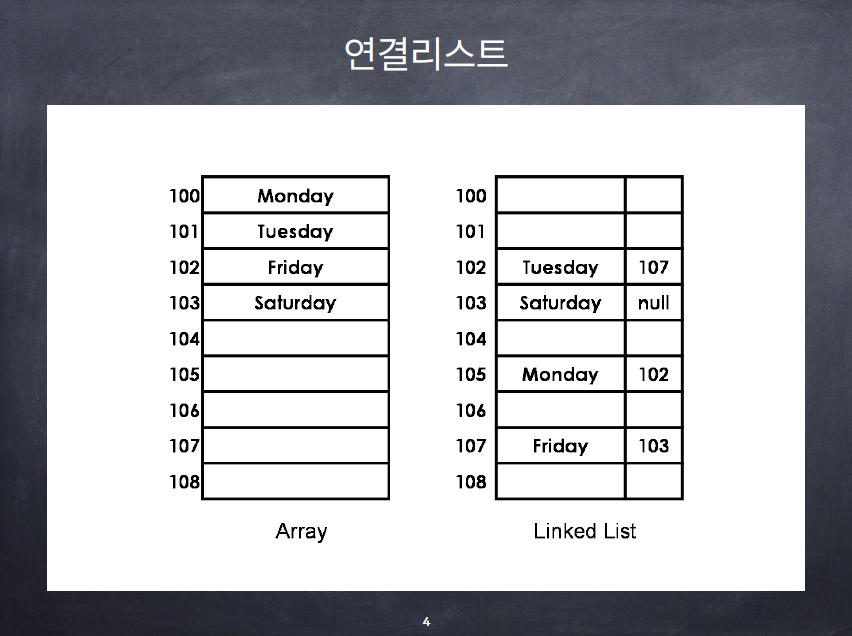

# 연결리스트의 개념과 기본 연산

## Java로 배우는 자료 구조

- 대체로 연결리스트까지 자료 구조를 학습하면 이후의 단계에서 coding skill에는 거의 문제가 없다. 여기서 coding skill이란 어떤 아이디어나 개념을 코드로 옮기는 것을 얘기함.
  - 이후에는 어떤 문제의 자료 구조, 알고리즘을 이해하거나 활용하는 부분에서의 문제만 남는 경우가 많음.
  - 따라서 연결리스트는 중요하다!

### 리스트(list)

- 리스트(list)
  - 기본적인 연산: 삽입(insert), 삭제(remove), 검색(search) 등
  - 리스트를 구현하는 대표적인 두 가지 방법: 배열, 연결리스트
- 배열의 단점
  - 크기가 고정 - reallocation이 필요
  - 리스트의 중간에 원소를 삽입하거나 삭제할 경우 다수의 데이터를 옮겨야 함.
- 연결리스트
  - 다른 데이터의 이동없이 중간에 삽입이나 삭제가 가능하며, 길이의 제한이 없음.
  - but, 랜덤 액세스가 불가능
    - ex) mp3, 자기테이프 방식의 테잎
  - 

### 노드

- 각각의 노드는 "데이터 필드"와 하나 혹은 그 이상의 "링크 필드"로 구성
- 링크 필드는 다음 노드를 참조
- 첫 번째 노드의 주소는 따로 저장해야함

- 단순연결리스트에서 어떤 노드를 삭제할 때는 삭제할 노드의 바로 앞 노드의 주소가 필요하다. 삭제할 노드의 주소만으로는 삭제할 수 없다!

