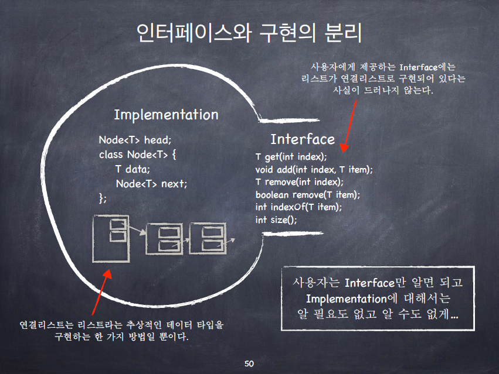
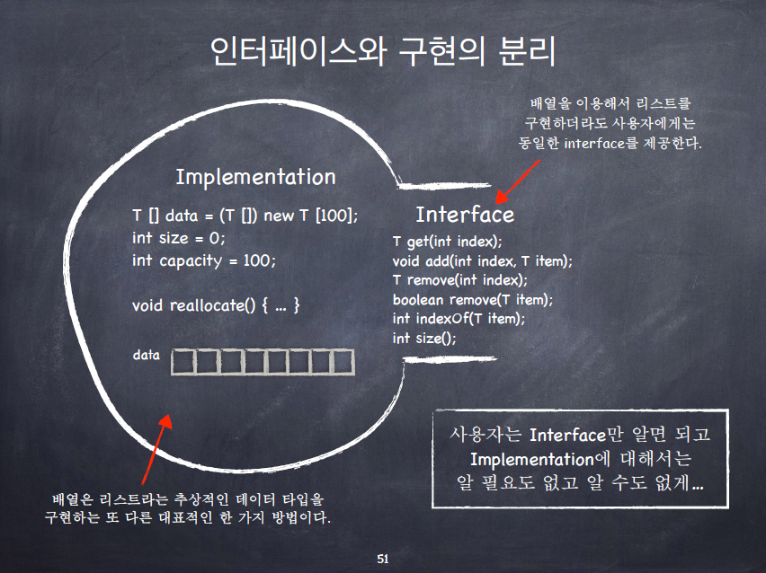

# 연결리스트와 iterator

## Java로 배우는 자료구조

### 객체 지향 프로그래밍

- 중요한 것: 인터페이스(Interface)와 구현(implementation)의 분리
  - Information Hiding
  - Data Encapsulation
  - Abstract Data Type
- 인터페이스와 구현의 분리
  - 연결 리스트는 "리스트"라는 추상적인 데이터 타입을 구현하는 한 가지 방법일 뿐이다. 가령 배열 혹은 ArrayList는 또 다른 구현 방법의 예이다.
  - 사용자는 리스트에 데이터를 삽입, 삭제, 검색할 수 있으면 된다. 그것의 구현에 대해서 세부적으로 알 필요는 없다.
    - 사용자가 필요로 하는 이런 기능들을 public method들로 제공한다. 이 public method들은 가능한 내부 구현과 독립적이어야 한다.
  - 인터페이스와 구현을 분리하면 코드의 모듈성(modularity)가 증가하며, 코드의 유지/보수, 코드의 재사용이 용이해진다.
  - 
  - 


### 연결리스트의 순회: Iterator의 필요성

- ```java
  // 이전에 했던 방식. head와 class Node의 멤버들이 모두 public으로 공개되어야 한다. 이것은 바람직하지 않다!
  Node p = aList.head;
  while (p!=null) {
      String str = p.data;
      // do something with str
      p = p.next;
  }
  ```

- public method 만으로 순회하려면 어떻게 해야할까?

- 

