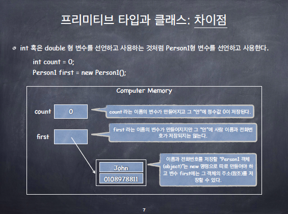
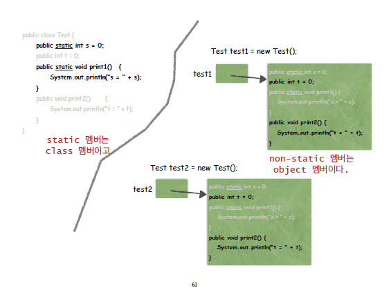

# 파이썬과 자바의 차이점

## 자바는 컴파일 언어이다

- 컴파일(compile)이란 소스코드에서 목적코드(바이너리 코드)로 옮기는 것을 말합니다.
  - 컴파일을 하게 되면 실행가능한 파일(프로그램)이 생성됩니다. 

- 파이썬은 인터프리터 언어입니다.
  - 인터프리터(interpreter, 해석기)란 소스코드를 바로 실행하는 컴퓨터 프로그램 또는 환경을 말합니다. 소스코드를 목적코드로 옮기는 컴파일과 대비됩니다.


## 자바는 Class들의 집합이다

- C 프로그래밍이 함수들의 집합이라면, Java 프로그래밍은 Class들의 집합입니다.
- 자바는 Class 사용이 강제됩니다.
  - 따라서 main 함수도 class 안에 구현되어야 합니다.
  - 파이썬은 Class 사용이 강제되지 않습니다.

- 자바에서 변수를 선언할 수 있는 곳은?

  - method 내부

    - method 내의 지역 변수로써 활용 가능합니다.

  - Class 내부

    - `static` 예약어의 사용 여부에 따라 클래스 변수 혹은 인스턴스 변수로 활용 가능합니다.

  - ```java
    public class test {
        int iv; // 인스턴스 변수
        static int cv; // 클래스 변수
        
        void method() {
            int lv; // 지역 변수
        }
    }
    ```


## 자바는 정적 타입의 언어이다

- 파이썬과 다르게 자바에서는 type을 명시해주어야 합니다.

- ```java
  int a = 10;
  String b = "안녕하세요";
  
  String c = 1;  // 컴파일 에러남
  ```

- 여기서 `int`는 primitive type 이고, `String`은 reference type 입니다.

  - 자바에서, primitive type을 제외한 모든 타입은 reference type 입니다.
  - primitive type
    - byte, short, int, long, float, double, char, boolean

- 클래스는 결국 하나의 "타입"입니다. 마치 int, double 처럼.

- 다만 Java가 primitive 타입과 같이 미리 내부적으로 정해놓은 타입이 아니기 때문에 "reference 타입"이라고 부릅니다.


### primitive 타입과 reference 타입 차이점

- primitive 타입은 변수 "안"에 값을 저장한다.
- 하지만 class는 변수 "안"에 값을 저장하는 것이 아니라, 값은 다른 객체에 따로 저장하고 변수에는 그 객체의 주소(참조)를 저장하는 것이다.

- 


## Static 예약어

- 클래스는 타입이다. 집이 아니라 집의 설계도이다. 즉, 실체가 아니다.
- 따라서 클래스의 데이터 필드에 데이터를 저장할 수는 없고, 클래스의 멤버 메서드를 실행할 수도 없다. 왜냐하면 실체가 아니므로!!
- new 명령으로 해당 클래스 타입의 객체를 만든 후, 그 객체에 데이터를 저장하고, 그 객체의 멤버 메서드를 실행하는 것이다.
- 여기에는 하나의 예외가 존재하는데 그것이 static 멤버이다.
- static 멤버는 클래스 안에 실제로 존재하며 객체에는 존재하지 않는다!
- 
- 왜 main 메서드는 반드시 static이어야 하는가?
  - Java에서 프로그램이란 클래스들의 집합이다. 어떤 것이든 클래스 사용이 강제된다. 따라서 main 메서드도 클래스 안에 있어야한다. 그래서 main 메서드는 반드시 static으로 실체를 만들어 두어야 프로그램이 실행 가능하다.
- 왜 static 메서드에서 같은 클래스의 non-static 멤버를 액세스 할 수 없는가?
  - non-static은 object 멤버이기 때문에 new 예약어로 객체를 생성하기 전에는 실제로 존재하지 않기 때문이다. static 메서드는 이미 실제로 존재하는 메서드인데 non-static 같이 실제로 존재하지 않는 변수를 액세스해서는 안된다.
  - 그럼 왜 같은 클래스의 non-static 메서드에서는 non-static 멤버를 액세스 할 수 있나?
    - non-static 메서드 역시 아직 실체가 없는 설계도 상에 존재하는 메서드이기때문에 non-static 멤버를 액세스해도 문제 없다! 객체가 생성되었을 때 둘다 함께 실제로 만들어질 것들이기 때문에..
- static 메서드/필드의 용도는?
  - mains 메서드
  - 상수 혹은 클래스 당 하나만 유지하고 있으면 되는 값(혹은 객체)
    - ex) Math.PI, System.out
  - 순수하게 기능만으로 정의되는 메서드. 대표적인 예로는 수학 함수들
    - ex) Math.abs(k), Math.sqrt(n), Math.min(a, b)


## 다형성(Polymorphism)

- Java의 객체 지향 프로그래밍에서 가장 중요한 개념.

- 정의: "수퍼클래스 타입의 변수가 서브클래스 타입의 객체를 참조할 수 있다."

  - ex) Notebook 클래스가 Computer 클래스를 상속받았을 때, 이런 식으로 표현이 가능하다.
  - `Computer theComputer = new Notebook("Bravo", "Intel", 4, 240, 2/4, 15.07.5);`

- static binding vs. dynamic binding

  - 다형성이 적용되었을 때, superclass와 subclass에 같은 이름의 메소드가 있으면 어떤 메소드가 실행될까?
    - static binding: 컴파일러가 참조 변수의 type을 기준으로 객체의 멤버를 판단해서 실행을 결정하는 방식. 즉, 다형성이 적용되었을 때 superclass의 메소드를 실행한다.
    - dynamic binding: 런타임에 참조 변수의 type이 아닌 실제 참조되고 있는 객체의 멤버를 판단해서 실행을 결정하는 방식. 즉, 다형성이 적용되었을 때 subclass의 메소드를 실행한다.
    - Java의 규칙은? 동적바인딩!

- 왜 필요함?

  - 자바는 정적 타입의 언어입니다. 따라서 배열을 생성할 때도 타입을 반드시 설정해줘야 합니다.

  - 만약 Computer 클래스를 상속받아서 만들어진 Notebook과 Desktop이라는 클래스가 있고, Computer를 관리해야한다고 가정합시다. 이때, 다음과 같이 클래스의 배열을 각각 생성하면 비효율적입니다.

  - ```java
    Notebook [] a = new Notebook [100];
    Desktop [] b = new Desktop [100];
    ```

  - 다형성의 원리를 적용하여 다음과 같이 배열을 만들면 Notebook과 Desktop을 한꺼번에 관리할 수 있습니다.

  - ```java
    Computer [] c = new Computer [100];
    ```

  - 자바에서는 이러한 원리를 활용하여 객체지향적인 프로그래밍이 가능하도록 설계되어 있습니다.