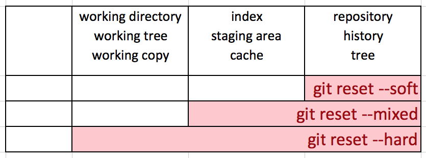
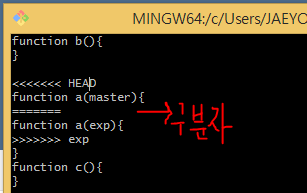

# GIT 정리

## 소개 및 간단한 사용 설명

### 소개

- Version Control Systems

  - Version Management, not by changing the file name
  - Back up, Recovery, Collaboration
  - ex) CVS, SVN, GIT
  - Version: 프로그램에 의미 있는 변화가 생겼을 때 매기는 번호

- 왜 우리는 GIT과 같은 도구를 써야하나?

  - Complexity of GIT < Complexity of Code 인 경우 큰 도움이 된다.
    - 그렇지 않다면 dropbox나 google drive가 더 도움이 될지도..?

- git의 혁신 - branch

  - 버전 관리할 때 분기해서 관리할 수 있는 기능.
    - ex) report1, report2, report2\_고객용, report3, report4, report2\_고객용2 등등... 이렇게 가지가 생기면서 점점 복잡할 것이다. 이런 상황에서 버전 관리를 하게 될 때 유용한 기능이다.
  - 이전에 존재하던 버전 관리 시스템에도 branch 기능이 있지만 여러 문제점으로 사용하기가 어려웠다. git은 이를 좀더 쉽게 만들었다.


### 개념도





> 커밋을 지정할 때, '~(틸드, 물결기호)'와 '^(캐럿, 삽입기호)'을 사용하여 현재 커밋으로부터 특정 커밋의 위치를 가리킬 수 있습니다. 이 때 자주 사용하는 것이 'HEAD' 로서, '~(틸드)'와 숫자를 'HEAD' 뒤에 붙여 몇 세대 앞의 커밋을 가리킬 수 있습니다. '^(캐럿)'은, 브랜치 병합에서 원본이 여럿 있는 경우 몇 번째 원본인지를 지정할 수 있습니다.


### 간단한 사용 설명

- CLI에서 git + '명령어' 이런식으로 사용하면 된다.
- init : 초기화. git에게 이 폴더를 인식하라고 하는 것
- status : 폴더의 상태 확인
  - Untracked files : 아직 git이 추적하고 있지 않은 파일이라는 뜻
  - add 명령어로 추적(tracking)하게 하는 것.
  - add 명령어로 최초에만 추적하게 하는 것이 아니라 파일이 변화했을 때도 그것을 add로 알려주는 것임.
  - 왜 이런 식으로? 자동으로 하면 될텐데? 개발 과정에서 임시 파일이 있기 때문에. 그런 파일들은 따로 버전 관리 안할테니까 명확하게 지정하는 시스템임. + 원래 commit은 각 파일 별로 하는 것이 좋음. 근데 작업하다보면 시기를 놓치기도 함. 그래서 선택적으로 commit 할 수 있도록 add를 따로따로 할 수 있다는 의의도 있음. 예전의 버전관리시스템과 차이점임!
- commit: add 명령어로 stage area에 올린 변경 사항을 repository에 저장하는 명령어.
  - 여기에다가 현재 버전의 메세지를 적는 것임. commit message.
  - 이 변화가 어떤 변화를 담고 있는지. 파일들이 왜 변경됐는지 이유를 적어 놓는 것.
  - stage area
    - add를 하면 stage area로 올라간다.
    - commit 대기 지역
    - commit을 하고 나면? repository로 가는 것!
- branch : 존재하는 branch 목록 확인
  - branch '브랜치명' : branch 생성
  - checkout '브랜치명' : branch 변경
  - git log --branches --decorate 라고 치면 모든 branch 별 정보 확인 가능.
    - git log --branches --graph 라고 치면 branch 그래프로 시각화해줌.
  - git log '브랜치x'..'브랜치y': 브랜치x와 브랜치y를 비교해줌
    - -p 옵션 주면 파일 유무, 소스 코드 변화 유무를 알려줌
  - branch -d '브랜치명': branch 삭제
- checkout A: A 브랜치로 HEAD를 옮기기
- merge B: B 브랜치와 현재 HEAD 브랜치를 병합한다.
- 


## 사용시 문제가 되었던 것 및 주의할 사항 정리

### branch 병합시 충돌 해결

- branch 병합 시, branch 별로 다른 부분에 해당하는 내용이 파일 단위라면? 새로운 merge commit 쓰는 식으로 merge 잘 됨! merge 하는 쪽에서 없는 파일 추가하면 되는 거니까 간단함.
- 근데 branch 병합 시 파일이 같으면 문제가 될 수 있음!
  - 파일이 같아도 기존의 내용을 유지하면서 다른 내용을 추가 했다면, 새로운 merge commit에서 그것들을 각자 추가해서 잘 반영 해준다.
  - 하지만 기존의 내용을 유지하지 않고 그 부분을 둘다 수정했다면??
    - Automatic merge failed와 CONFLICT 알림이 뜸.
    - git status 해보면, both modified 라는 말이 뜬다.
    - 실제 충돌난 파일을 열어보면 다음과 같다.
    - 
    - =========== 표시는 구분자이고 그 위 쪽에 HEAD는 현재 checkout 한 branch를 말한다. 아래의 exp는 HEAD와 충돌난 branch이다. git이 저 부분에서 둘이 충돌했다고 말해주면서 자동으로 해결 못하겠으니 해결하라고 말해주는 것임.
    - 문제가 되는 부분을 직접 수정하고 난 후에 평소와 같이 add 하고 commit 해주면 merge 완료!


### 팀원들이 각자 branch 따서 작업하는 도중 master가 변경 되었을 때의 문제

- 문제 상황: 본인의 branch를 올리기 위해 master와 병합하고 remote repository(origin)에 올리려고 했는데 이미 master가 변경되어 있는 경우
  - 방지책
    - merge 직전에 master를 pull 받고 하자
      - conflict가 난다면 수정하고 다시 master에 올리자.
    - master를 수정할 때는 다른 사람들에게 꼭 알리자. slack 같은 곳에 push 하면 알림 가게 하는 식으로..


### 현재 작업하던 branch A에서 다른 branch B로 옮겨갈 때

- 문제 상황1: master가 변경된 것을 알았다. 그래서 master를 pull 하려고 하는데 현재 branch 에서 작업하던 것은 두고 master로 옮겨가야하는 상황.

  - 해결책
    - stash를 활용하자
    - stash : (안전한 곳에) 넣어 두다[숨기다]
    - 다른 브랜치로 checkout을 해야 하는데 아직 현재 브랜치에서 작업이 끝나지 않은 경우는 커밋을 하기가 애매합니다. 이런 경우 stash를 이용하면 작업중이던 파일을 임시로 저장해두고 현재 브랜치의 상태를 마지막 커밋의 상태로 초기화 할 수 있습니다. 그 후에 다른 브랜치로 이동하고 작업을 끝낸 후에 작업 중이던 브랜치로 복귀한 후에 이전에 작업하던 내용을 복원할 수 있습니다. 여기서는 이 기능에 대해서 알아봅니다.
    - 작업을 하다가 commit을 하지 않으면 다른 branch로 못간다는 뜻이 아니라 하다가 commit 안하고 다른 branch로 가면 현재까지의 수정사항(아직 commit 하지 않은)이 다른 branch로 까지 옮겨가버리는 현상이 일어난다.
    - git stash : 이 명령어로 save 가능
    - stash를 하고 나면 git status를 해도 clean하다고 나온다! 임시 저장만 된 상태로 넘겼으니까!
    - git stash apply : 가장 최신에 save했던 stash 내용를 불러올 수 있다.
    - git stash list : save했던 stash 내용의 리스트를 불러올 수 있다.
    - git reset --hard로 마지막 commit으로 돌아가더라도 stash 내용들은 사라지지 않는다! stash를 명시적으로 삭제하지 않는 이상 살아있음.
    - git stash drop : 가장 최신에 save했던 stash 내용을 삭제한다.
    - git stash apply + git stash drop = git stash pop
    - 주의 사항) stash는 임시 저장 개념으로서, 이미 tracked 되고 있는 파일(add 명령을 통해서)에 한해서 임시 저장되는 것이다. 새로운 파일을 만들어서 수정한 내용은(아직 tracked되지 않은) stash로 임시 저장할 수 없다.

- 문제 상황2: master가 변경된 것을 알았고, master로 checkout 했는데 이전 브랜치에서 add 해놓았던 사항도 함께 옮겨져 갔다.(checkout할 때 add 해놓은 내용을 commit이나 stash하지 않아서. checkout할 때 add 해놓은 내용(stage에 올려놓은 내용)은 함께 옮겨져 감) 그래서 master에서 pull 받으려고 하니까 충돌남.

  - 해결책

    - 일단 stash로 add 내용을 보존한다

    - 현재 master 에서의 목적은 remote의 master를 pull 해오는 것이기 때문에 이를 수행할 것이다.

    - ```bash
      git fetch --all
      git reset --hard origin/master
      git pull origin master
      ```

      - 수정한 파일이 conflict되면 fetch로 파일들을 remote 저장소에서 이전 fetch들을 받은 다음 local에서 다시 reset hard를 사용하여 제 상태를 컨플릭트 나기전인 수정하기 전으로 되돌립니다. 이후 pull 하면 remote에서 loacal로 정상적으로 다운받아집니다.

      - > fetch 할 때 Git은 현재 브랜치에 존재하지 않는 커밋을 현재 브랜치에서 수집 한 다음 로컬 리포지토리에 저장합니다. 현재 로컬의 상태와 병합하지 않습니다. 이 기능은 저장소를 최신 상태로 유지해야하지만 파일을 업데이트 할 때 손상 될 수있는 작업을 수행 할 때 특히 유용합니다. 

