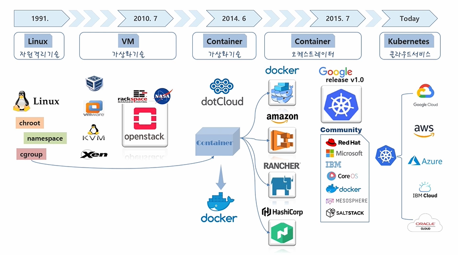
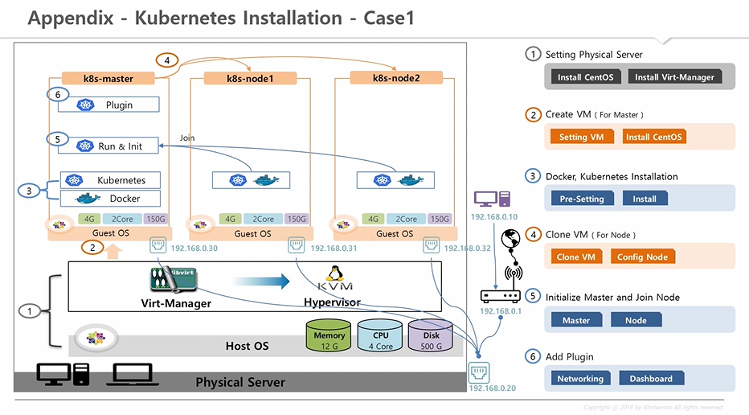
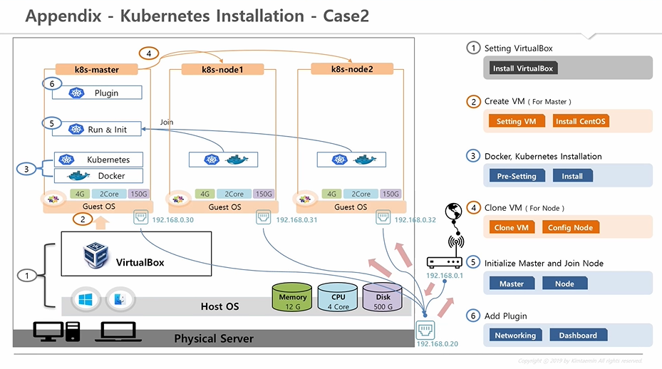
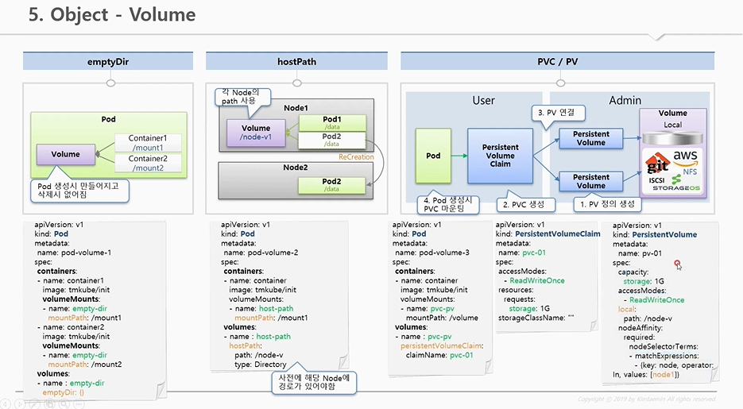

# kubernetes 정리

- inflearn [대세는 쿠버네티스] 강의 메모
- 참조: https://kubetm.github.io/practice/  
  위에 올려진 강의 노트를 간단하게 훑어볼때 쓰기위해 정리함

## Introduction

- 큰 기업들은 대규모의 서비스를 운영하고 있고 있기 때문에 최대한 자원을 효율적으로 쓰고, 운영 환경을 자동화하고 싶어한다.  
  그래서 가상화 기술과 이를 자동 운영하는 오케스트레이터 기술의 발전이 이루어졌다
- 

## [기초편] 기초 다지기

### 1. Why Kubernetes?

- 서버 자원을 효율적으로 사용할 수 있다
  - 예를 들어 전통적인 방식에서 3가지 시스템이 있다면, 각 시스템 별로 3대씩 서버를 미리 준비해놓아야 한다. 하지만 3가지 시스템의 트래픽이 몰리는 시간이 다르다면? 많은 서버는 그 시간 동안 자원을 낭비하는 셈이 된다.  
    쿠버네티스는 이러한 낭비를 Auto scaling, Auto Healing(장애 복구), Deployment(Rolling Update, ReCreate) 등의 기능으로 줄여준다

### 2. VM vs Container

- 
- 
- Container는 리눅스 가상화 기술인 namespace와 cgroups를 이용한다. 이를 사용하여 여러 컨테이너들이 호스트 자원을 나눠쓰게 한다(격리).  
  namespace는 커널 영역(mnt, pid, net, ipc, uts, user)을 나눠서 쓰게 해주고, cgroups는 자원 영역(memory, CPU, I/O, network)을 나눠서 쓰게 해준다

### 3. Getting started - Kubernetes

- 

### 4. Kubernetes Overview

- 

### 0. 쿠버네티스 설치

- 세 가지 Usecase  
  

- Usecase1[베어메탈]  
    
  https://kubetm.github.io/practice/appendix/installation_case1/
- Usecase2[내 PC + VirtualBox]  
    
  https://kubetm.github.io/practice/appendix/installation_case2/

### 5. Object - Pod

- 

### 5. Object - Service

- 

### 5. Object - Volume

- 
- 