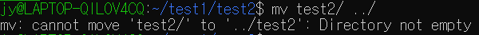
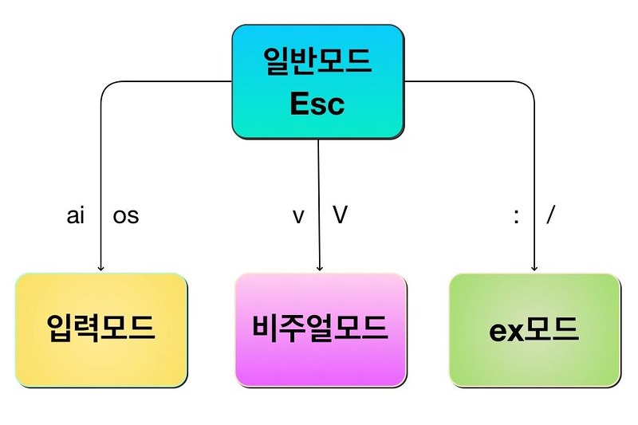
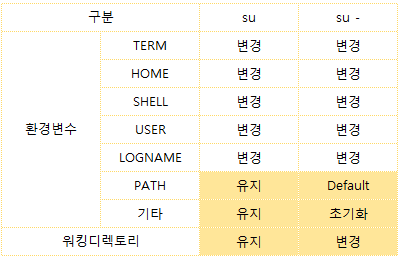

# 유닉스 커맨드 라인 정리

> codeit 유닉스 커맨드 라인 강의 중 나중에 다시 볼 내용을 정리  
> https://www.codeit.kr/courses/unix-command-line

[TOC]


## 1. 유닉스 커맨드 배우기

### 1. CLI 환경과 유닉스

- 개발자로서 일하기 위해서는 Linux, ubuntu, Red Hat, Chrome OS 등의 운영체제를 다룰 줄 알아야 한다. 모든 것을 알 필요는 없지만 최소한 명령어는 다룰 줄 알아야 한다. 다행히(?)도 윈도우를 제외한 많은 운영체제가 UNIX 계열 운영체제(UNIX라는 뿌리를 가진)이기 때문에, UNIX 커맨드를 배우면 여러 운영체제를 어느정도 다룰 수 있다

- 보통 운영체제에는 1000개 이상의 command가 있지만, 20~30 command만 알아도 업무에 지장이 없다고 한다

- Unix
  - 1970년대 초 미국 벨 연구소에서 켄 톰슨과 데니스 리치의 주도로 개발된 운영체제
  - 대부분 C언어로 작성되었기 때문에 다른 컴퓨터에 수정해서 적용하기 쉬웠음
    - 따라서 다양한 Unix가 생길 수 있었다
    - POSIX: Unix라면 갖춰야 할 규격과 기능을 정의한 표준
  - 벨 연구소는 AT&T 소속이었기 때문에 Unix를 사용하거나 수정하려면 라이센스 비용이 발생했다
  
- GNU/Linux
  - 자유 소프트웨어 재단(Free Software Foundation)에서 Unix의 코드를 한 줄도 사용하지 않고 Unix와 유사한 운영 체제를 만들고자 GNU 프로젝트를 시작하였다. GNU는 "GNU is Not Unix"라는 재귀적인 의미를 담고 있다
  - 하지만 GNU는 운영체제의 핵심 부분인 Kernel이 Unix에 비해 부족하다는 어려움을 겪고 있었다. 이 때, Linus Torvalds라는 핀란드 대학생이 UNIX의 교육용 버전인 MINIX에서 아이디어를 얻어 새로운 커널을 만들었고 이를 Linux Kernel이라는 이름으로 공개했다
  - GNU 프로젝트에서는 이 커널을 가져다 쓰기로 했고 결국 GNU 운영 체제가 완성되었다. Linux Kernel을 사용했기 때문에, 운영체제의 이름은 GNU/Linux가 되었다 
  - 원래 제대로 얘기하려면 Linux는 Linux Kernel만들 얘기하는 것이고 운영체제의 정확한 이름은 GNU/Linux가 맞다. 하지만 그냥 Linux라고 하는 경우가 많다
  - 원래 인기가 많던 UNIX의 편의성에, 무료로 사용할 수 있어서 반응이 좋았다
  - GNU/Linux를 변형해서 ubuntu, Red Hat, CentOS, debian 등의 운영체제가 만들어 졌으며 이를 리눅스 배포판이라고 한다
  - 이러한 GNU/Linux들도 유닉스 표준인 POSIX를 사실상 대부분 만족하도록 만들어져 있다
  - Unix-certified vs Unix-like
    - POSIX 인증을 받으면 Unix-certified가 되는 것이고 인증 없이 비슷한 경우 Unix-like라고 한다
    - HP unix, AIX, macOS 등은 인증을 받은 정식 Unix이고, ubuntu, Red Hat, CentOS, debian 등은 Unix-like이다
    - POSIX를 모두 만족하지만 라이센스 비용때문에 인증을 안받는 경우도 있다
  
- GUI(Graphical User Interface) vs CLI(Command Line Interface)
  - CLI의 장점
    1. 성능
       - 정보를 표현할 때 그래픽 작업이 없기 때문에 성능이 좋다
    2. 명확성
       - 마우스로 많은 단계를 거치다보면 실수할 가능성이 높다
       - 커맨드를 한번 만들어 놓고 복사해서 사용하면 실수할 가능성이 적고 많은 과정을 한 번의 커맨드로 요약할 수 있기 때문에 명확하다. 따라서 처음에 익숙해지기 어려울 수 있지만 한번 익숙해지면 오히려 컴퓨터를 단순하고 정확하게 사용할 수 있다
  
- 커맨드 인자(argument) vs 옵션

  - 인자와 옵션을 사용해서 커맨드를 입맛에 맞게 사용할 수 있다. 커맨드에 따라 사용방법이 정해져 있으므로 그에 맞게 사용하면 된다

  - 인자는 커맨드가 작동할 대상을 지정하고, 옵션은 커맨드가 구체적으로 어떤 방식으로 동작할지를 정한다

  - 형식적으로 옵션은 앞에는 하이픈이 붙고 인자는 붙지 않는다

  - 인자와 옵션 모두 넓은 의미에서 인자라고 부르는 경우도 있지만 보통 구별해서 말한다

  - 옵션에도 인자가 필요한 경우가 있는데, 이를 옵션의 값(value) 혹은 옵션의 인자(argument)라고 한다. 이 경우에는 반드시 커맨드에 옵션의 인자를 넣어줘야 한다

  - ```bash
    # 인자 및 옵션 사용 기본 ex
    cal -A 3  # 현재 날짜가 포함된 달력 + 이후 3달의 달력을 함께 출력하는 커맨드
    cal -B 2  # 현재 날짜가 포함된 달력 + 이전 2달의 달력을 함께 출력하는 커맨드
    cal -j  # 모든 날짜를 1월 1일을 기준으로 몇 번째 날짜인지 출력하는 커맨드
    
    # 인자 및 옵션을 함께 사용할 수도 있다
    cal -B 2 -A 3 -j
    
    # 인자가 필요없는 옵션의 경우, 옵션을 중첩해서 적용해도 된다
    cal -jB 2 -A 3
    
    # 하지만 옵션의 순서가 중요하다. 인자가 필요없는 옵션이 항상 앞으로 가야한다
    cal -Bj 2 -A 3  # 오류나는 커맨드(나의 환경인 Ubuntu 20.04 LTS에서는 오류는 안나는데 결과가 이상하게 나옴).
    ```

- man 커맨드

  - 공식 메뉴얼을 불러오는 커맨드


### 2. 디렉토리와 파일

- ~: 틸드. 현재 사용자의 홈 디렉토리

- pwd

  - Print the name of Working Directory
  - 현재 작업 중인 디렉토리를 출력하는 명령어

- cd -: 바로 직전에 있었던 디렉토리로 이동한다

- ls

  - -l 옵션: 결과를 긴 리스트 형식(long listing format)으로 출력
    - 이 때 결과에 나오는 total 숫자의 의미는 파일이나 디렉토리 갯수를 뜻하는 것이 아니라 디스크에 기록된 블록의 갯수가 몇 개인지를 말해주는 것이다
  - -a 옵션: 숨겨져 있는 자식 디렉토리나 파일을 출력
    - 리눅스에서는 `.파일혹은디렉토리이름` 이런식으로 하면 숨김 파일이나 숨김 디렉토리가 됨

- 유닉스에는 다양한 종류의 파일이 있다. 이에 대해 알기 위해서는 파일 시스템(file system) 부분을 따로 공부해야 한다

  - `ls -al` 명령어를 입력했을 때 맨 앞쪽 문자는 파일 종류를 나타낸다

    - | 파일 종류        | 문자 |
      | ---------------- | ---- |
      | 일반 파일        | -    |
      | 디렉토리         | d    |
      | 캐릭터 장치 파일 | c    |
      | 블록 장치 파일   | b    |
      | 소켓             | s    |
      | 파이프           | p    |
      | 심볼릭 링크      | l    |

    - 위와 같은 종류가 있는데, 일단은 d와 -만 알아두고 나머지는 유닉스를 좀더 깊게 공부해야 알 수 있다

- mv '옮길파일|디렉토리' '옮길경로'

  - 파일/디렉토리의 이름을 변경하거나 위치를 이동시키는 명령어
  - 주의할 점
    1. 파일을 옮기는 경우, 이름이 같은 파일이 있을 시 덮어쓰기가 된다. `mv -i file ../alreadyExists` 이렇게 -i 옵션을 주면 사용자에게 덮어쓸 거냐고 물어보기 때문에 실수로 덮어쓰는 경우를 방지할 수 있다. `cp`로 복사-붙여넣기할 때도 마찬가지다
    2. 디렉토리를 옮기는 경우, 이름이 같은 디렉토리가 있을 시 옮겨지지 않는다.
       - 

- 디렉토리를 복사-붙여넣기 할 때는 안에 여러 파일이나 디렉토리가 있으므로 그냥 복사하면 실행이 안된다.  `-r` 옵션을 줘야 한다(recursive). 삭제할 때도 마찬가지다

- cat '파일명1' [파일명2...]

  - concatenate. 이어 붙이다. 파일들의 내용을 이어서 출력
  - 봐야할 내용이 단순할 때 보통 쓴다

- less '파일명1' [파일명2...]

  - 한 화면에 하나의 파일을 보여줌. 마치 vi 편집기 처럼
  - `:n`: next. 다음 파일로 이동
  - `:p`: previous. 이전 파일로 이동

- 파일 내용 간단하게 파악하기

  - head|tail [-n '출력할 라인 수'] '파일명'
  - head는 파일 맨 앞 부분, tail은 파일 맨 뒷 부분을 출력. 기본 값은 10줄


### 3. 커맨드를 자유자재로

- history
  - 지금까지 실행했던 명령어를 보여줌
  - `!실행명령어번호` 를 입력하면 이전의 명령어를 다시 실행한다


### 4. Vim

- CLI 환경에서 사용하는 텍스트 에디터

- 4가지 사용 모드

  - | 일반 모드       | 입력 모드   | 비주얼 모드      | 명령 모드                |
    | --------------- | ----------- | ---------------- | ------------------------ |
    | 커서 이동       | 텍스트 입력 | 텍스트 블록 지정 | 내용 저장                |
    | 텍스트 붙여넣기 |             | 텍스트 복사      | vim 종료                 |
    | 텍스트 삭제     |             |                  | 특정 텍스트 검색 및 치환 |
    | 작업 취소       |             |                  |                          |

  -   
    출처: https://nolboo.kim/blog/2016/11/15/vim-for-beginner/

  1. 일반 모드(Normal Mode)  

     | 기능                                     | 키                           |
     | ---------------------------------------- | ---------------------------- |
     | 왼쪽으로 이동                            | h                            |
     | 오른쪽으로 이동                          | l                            |
     | 아래쪽으로 이동                          | j                            |
     | 위쪽으로 이동                            | k                            |
     | 5칸(왼쪽, 오른쪽, 아래쪽, 위쪽)으로 이동 | 5(h/l/j/k)                   |
     | 커서가 있는 줄의 첫 번째 칸으로 이동     | 0                            |
     | 커서가 있는 줄의 마지막 칸으로 이동      | $                            |
     | 파일의 첫 번째 줄로 이동                 | gg                           |
     | 파일의 마지막 줄로 이동                  | G                            |
     | 한 글자 삭제                             | x                            |
     | 5글자 삭제                               | 5x                           |
     | 한 줄 삭제                               | dd                           |
     | 5줄 삭제                                 | 5dd                          |
     | 작업 취소                                | u                            |
     | 텍스트 붙여넣기                          | p(커서 다음 칸 혹은 다음 줄) |
     | 텍스트 붙여넣기                          | P(커서 이전 칸 혹은 이전 줄) |

  2. 입력 모드(Insert Mode)  

     | 기능                                                     | 키   |
     | -------------------------------------------------------- | ---- |
     | 커서 위치부터 바로 입력 모드 시작                        | i    |
     | 커서 위치를 바로 다음 칸으로 옮기고 입력 모드 시작       | a    |
     | 커서 위치를 그 줄의 첫 번째 칸으로 옮기고 입력 모드 시작 | I    |
     | 커서 위치를 그 줄의 마지막 칸으로 옮기고 입력 모드 시작  | A    |
     | 커서 위치를 바로 다음 줄로 옮기고 입력 모드 시작         | o    |
     | 커서 위치를 바로 이전 줄로 옮기고 입력 모드 시작         | O    |

  3. 비주얼 모드(Visual Mode)  

     | 기능              | 키   |
     | ----------------- | ---- |
     | 일반 블록 지정    | v    |
     | 줄 단위 블록 지정 | V    |
     | 텍스트 복사       | y    |
     | 텍스트 잘라내기   | d    |

  4. 명령 모드(Command Mode)  

     | 기능                                                      | 키             |
     | --------------------------------------------------------- | -------------- |
     | 입력 내용 저장하기                                        | :w             |
     | vim 종료하기                                              | :q             |
     | 입력 내용 저장하고 바로 vim 종료하기                      | :wq            |
     | 수정사항 반영하지 않고 그대로 vim 종료하기                | :q!            |
     | 특정 텍스트 검색                                          | /keyword       |
     | 특정 텍스트 검색 시 다음 텍스트로 이동                    | n              |
     | 특정 텍스트 검색 시 이전 텍스트로 이동                    | N              |
     | 커서가 있는 줄의 첫 번째 해당 텍스트 교체하기             | :s/old/new     |
     | 커서가 있는 줄의 모든 해당 텍스트 교체하기                | :s/old/new/g   |
     | 모든 줄의 모든 해당 텍스트 교체하기                       | :%s/old/new/g  |
     | 모든 줄에서 모든 해당 텍스트를 하나씩 확인하면서 교체하기 | :%s/old/new/gc |


### 5. 외부 프로그램 설치하기

- sudo apt install '프로그램명'
- sudo apt remove '프로그램명'
- cf)  
  su '사용자 계정': 현재의 환경 변수, PATH를 유지한 채로 계정 변경  
  su - '사용자 계정': 현재의 환경 변수, PATH 유지하지 않고 계정 변경  
    
  출처: https://storycompiler.tistory.com/44

