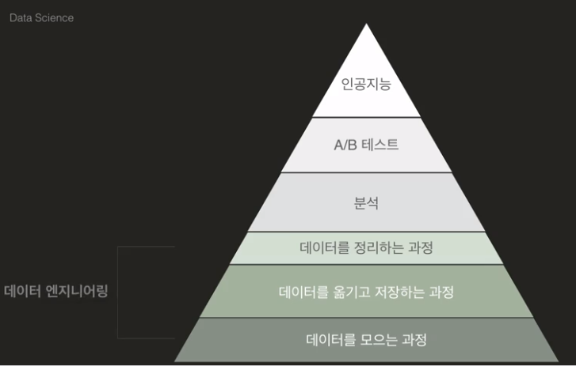

[TOC]

> 코드잇 데이터 사이언스 입문 강의 중 다시 볼 내용을 정리한 문서
>
> https://www.codeit.kr/learn/courses/data-science


# 데이터 사이언스 개요

## 데이터 사이언스

### 데이터 사이언스란?

- 데이터를 다루는 일
- 데이터가 많다 → 할 수 있는 일이 많다
- 데이터를 모으는 일등 공신은 소프트웨어
  - 데이터를 모으고 분석하는 일은 과거에도 있었다
  - 하지만 소프트웨어의 발전과 함께 그 중요성이 증대됨
- 데이터 과학이란, 다양한 데이터로부터 지식과 인사이트를 추출하는 분야다
- 프로그래밍 + 수학/통계 + 도메인 지식


### 데이터 사이언스에 대한 오해

1. 데이터 사이언스에서 가장 중요한 건 인공지능, 딥러닝이다




- 인공 지능, 딥러닝이 전부는 아니다. 많은 기업들은 인공지능 아래 단계까지만 해도 적은 노력으로 큰 효과를 거둘 수 있음
- 출처: https://hackernoon.com/the-ai-hierarchy-of-needs-18f111fcc007


2. 데이터 사이언티스트는 하루 종일 수학과 컴퓨터만 하는 사람일 것 같다

- 비즈니스에 필요한 핵심 및 문제점을 파악하기 위해서는 인사이트와 커뮤니케이션도 중요하다. 도메인 지식도 필요하고 다양한 부서의 사람들과 소통해야 하기 때문이다. ex) 마케팅 부서, 엔지니어 부서, 경영 부서 등


### 데이터 사이언스 프로세스

1. 문제 정의하기

   - 목표 설정
   - 기간 설정
   - 평가 방법 설정
   - 필요한 데이터 설정

2. 데이터 모으기

   - 웹 크롤링
   - 자료 모으기
   - 기존에 있는 데이터 파일 읽고 쓰기

3. 데이터 다듬기

   - > garbage in, gabage out

   - 데이터 관찰하기

   - 데이터 오류 제거

   - 데이터 정리하기

4. 데이터 분석하기

   - 데이터 파악하기
   - 데이터 변형하기
   - 통계 분석
   - 인사이트 발견
   - 의미 도출

5. 데이터 시각화 및 커뮤니케이션

   - 다양한 시각화
   - 커뮤니케이션
   - 리포트


## Numpy

- Numerical Python

- numpy array vs python list

  - numpy는 C로 쓰여 있어서 그냥 python으로 계산하는 것보다 빠르다. 따라서 많은 데이터를 다룰 때 성능이 좋다

- 배열 중심으로 계산할 때 표현이 간단하다

- ```python
  # ex1)
  import numpy as np
  
  revenue_in_yen = [
      300000, 340000, 320000, 360000, 
      440000, 140000, 180000, 340000, 
      330000, 290000, 280000, 380000, 
      170000, 140000, 230000, 390000, 
      400000, 350000, 380000, 150000, 
      110000, 240000, 380000, 380000, 
      340000, 420000, 150000, 130000, 
      360000, 320000, 250000
  ]
  
  revenue_in_yen_array = np.array(revenue_in_yen)
  filter = np.where(revenue_in_yen_array <= 200000)
  bad_days_revenue = revenue_in_yen_array[filter]
  
  bad_days_revenue
  ```


## Pandas

- Numpy를 기본적으로 포함하고, 외부 데이터 읽고 쓰기, 데이터 정리, 데이터 분석 등의 기능을 추가한 라이브러리

- Data science에서 Python의 인기가 많아지게 한 라이브러리

- 그럼 Numpy 안쓰고 Pandas만 쓰면 되지 않나?

  - Numpy 만의 장점이 있음. 연산이 빠르다는 점 그리고 선형대수, 푸리에변환 등 산술계산에 필요한 여러 기능이 있음
  - Pandas는 구조화된 데이터들을 변형하거나 자르는 등 유연하게 처리하는 데 특화되어 있음
  - 따라서 두 가지를 함께 쓰는 경우가 많다
  - Numpy: 수학과 과학 연산을 위한 파이썬 패키지.  
    참고: https://medium.com/@5eo1ab/numpy-%EC%93%B0%EB%8A%94-%EC%9D%B4%EC%9C%A0-37895f4fdc03
  - Pandas: 데이터 베이스(데이터 프레임)을 다루기 위한 패키지.  
    참고: https://medium.com/@5eo1ab/pandas-%EC%93%B0%EB%8A%94-%EC%9D%B4%EC%9C%A0-9063a90b0bd5

- ```python
  # ex1)
  import pandas as pd
  
  celebrities = [
      ['Taylor Swift', 'December 13, 1989', 'Singer-songwriter'],
      ['Aaron Sorkin', 'June 9, 1961', 'Screenwriter'],
      ['Harry Potter', 'July 31, 1980', 'Wizard'],
      ['Ji-Sung Park', 'February 25, 1981', 'Footballer']
  ]
  
  df = pd.DataFrame(celebrities, columns=['name', 'birthday', 'occupation'])
  
  # ex2) ⇔ ex1)
  dict1 = {
      'name': ['Taylor Swift', 'Aaron Sorkin', 'Harry Potter', 'Ji-Sung Park'],
      'birthday': ['December 13, 1989', 'June 9, 1961', 'July 31, 1980', 'February 25, 1981'],
      'occupation': ['Singer-songwriter', 'Screenwriter', 'Wizard', 'Footballer'],
  }
  df = pd.DataFrame(dict1)
  ```


# DataFrame 다루기

### DataFrame 인덱싱

| 이름으로 인덱싱하기           | 기본 형태                             | 단축 형태                      |
| ----------------------------- | ------------------------------------- | ------------------------------ |
| 하나의 row 이름               | `df.loc["row4"]`                      |                                |
| row 이름의 리스트             | `df.loc[["row4", "row5", "row3"]]`    |                                |
| row 이름의 리스트 슬라이싱    | `df.loc["row2":"row5"]`               | `df["row2":"row5"]`            |
| 하나의 column 이름            | `df.loc[:, "col1"]`                   | `df["col1"]`                   |
| column 이름의 리스트          | `df.loc[:, ["col4", "col6", "col3"]]` | `df[["col4", "col6", "col3"]]` |
| column 이름의 리스트 슬라이싱 | `df.loc[:, "col2":"col5"]             |                                |

| 위치로 인덱싱하기             | 기본 형태               | 단축 형태 |
| ----------------------------- | ----------------------- | --------- |
| 하나의 row 위치               | `df.iloc[8]`            |           |
| row 위치의 리스트             | `df.iloc[[4, 5, 3]]`    |           |
| row 위치의 리스트 슬라이싱    | `df.iloc[2:5]`          | `df[2:5]` |
| 하나의 column 위치            | `df.iloc[:, 3]`         |           |
| column 위치의 리스트          | `df.iloc[:, [3, 5, 6]]` |           |
| column 위치의 리스트 슬라이싱 | `df.iloc[:, 3:7]`       |           |


### 데이터 변형하기

```python
# ex1)
import pandas as pd

df = pd.read_csv('data/body_imperial1.csv', index_col=0)

df.loc[1, 'Weight (Pound)'] = 200
df.drop(21, axis='index', inplace=True)
df.loc[20] = [70, 200]
# 출력
df

# ex2)
import pandas as pd
    
df = pd.read_csv('data/toeic.csv')

df['합격 여부'] = (df['LC'] >= 250) & (df['RC'] >= 250) & (df['LC'] + df['RC'] >= 600)
# 출력
df
```


### 큰 데이터 다루기

```python
# ex)
import pandas as pd

df = pd.read_csv('data/enrolment_3.csv')

# 코드를 작성하세요.
# 과목별 인원 가져오기
allowed = df["status"] == "allowed"
course_counts = df.loc[allowed, "course name"].value_counts()

# 각 강의실 규모에 해당되는 과목 리스트 만들기
auditorium_list = list(course_counts[course_counts >= 80].index)
large_room_list = list(course_counts[(80 > course_counts) & (course_counts >= 40)].index)
medium_room_list = list(course_counts[(40 > course_counts) & (course_counts >= 15)].index)
small_room_list = list(course_counts[(15 > course_counts) & (course_counts > 4)].index)

# 강의실 이름 붙이기
for i in range(len(auditorium_list)):
    df.loc[(df["course name"] == sorted(auditorium_list)[i]) & allowed, "room assignment"] = "Auditorium-" + str(i + 1)

for i in range(len(large_room_list)):
    df.loc[(df["course name"] == sorted(large_room_list)[i]) & allowed, "room assignment"] = "Large-" + str(i + 1)
    
for i in range(len(medium_room_list)):
    df.loc[(df["course name"] == sorted(medium_room_list)[i]) & allowed, "room assignment"] = "Medium-" + str(i + 1)
    
for i in range(len(small_room_list)):
    df.loc[(df["course name"] == sorted(small_room_list)[i]) & allowed, "room assignment"] = "Small-" + str(i + 1)

# column 이름 바꾸기
df.rename(columns={"room assignment": "room number"}, inplace = True)
# 정답 출력
df
```


# 데이터 분석과 시각화

## 시각화 개요

- 데이터를 시각화해야 분석이 편하다

  - outlier 같은 값들도 한번에 알아볼 수 있고 인사이트를 얻기 좋다는 장점이 있다
  - 다른 사람들에게 보고를 할 때 이해하기 쉽고 관심을 얻기도 좋다

- ```python
  # ex1)
  %matplotlib inline
  import pandas as pd
  
  df = pd.read_csv('data/silicon_valley_summary.csv')
  
  # 코드를 작성하세요.
  boolean_male = df['gender']=='Male'
  boolean_manager = df['job_category'] == 'Managers'
  boolean_not_all = df['race_ethnicity'] != 'All'
  
  df[boolean_male & boolean_manager & boolean_not_all].plot(kind='bar', x='race_ethnicity',  y='count')
  ```

- 선 그래프, 막대 그래프, 파이 그래프, 히스토그램, 박스 플롯, 산점도 등 적절한 그래프를 사용하면 분석에 효율적이다


## Seaborn 시각화

- 다양한 그래프를 사용할 수 있는 라이브러리
- Statistical Data Visualization
- PDF(Probability Density Function)
  - 확률 밀도 함수
  - 히스토그램의 막대 갯수를 무한대로 늘려서 확률 밀도 함수를 추정할 수 있다
    - 다른 방법들도 있음(커널방법(kernel method), 국소가능도방법(local likelihood method))
  - 특정 구간의 확률은 그래프 아래 그 구간의 면적과 동일
- KDE(Kernel Density Estimation)
  - 확률 밀도 함수 추정법 중 하나
  - 갖고 있는 데이터를 바탕으로 확률 밀도 함수를 추정해준다
  - Seaborn 라이브러리로 히스토그램, 박스 플롯, 산점도 등에 PDF 관련 그래프를 그릴 수 있다. 산점도 같은 경우 등고선으로 표현된다


## 통계 분석

- 평균값 vs 중간값
  - 평균값은 잘못된 데이터의 영향을 크게 받는다. 예를 들어 엄청나게 큰 수가 잘못 들어왔을 때
  - 하지만 평균값이 더 좋은 인사이트를 주는 경우도 있다. 잘못된 데이터가 없다는 가정하에서 평점 평균 같은 경우 중간 값보다 좀더 좋은 결과를 줄 수 있으니까
- 피어슨 상관 계수
  - -1 ~ 1 까지의 계수를 가짐
  - 1은 확실한 상관 관계, 0은 관계 없음, -1은 반대의 상관 관계를 갖는다는 것을 의미한다


## Exploratory Data Analysis(EDA)

- 데이터 셋을 다양한 관점에서 살펴보고 탐색하면서 인사이트를 찾는 것

  - 각 row는 무엇을 의미하는가?
  - 각 column은 무엇을 의미하는가?
  - 각 column은 어떤 분포를 보이는가?
  - 두 column은 어떤 연관성이 있는가?
  - 등등

- EDA는 공식이 없다

  - 시각적인 방법, 통계적인 방법 등. 이 중 시각적인 방법이 많이 사용되는 편이다

- ```python
  # 상관관계를 통한 분석 예시
  import pandas as pd
  
  df = pd.read_csv('young_survey.csv')
  df.corr()
  
  brunch_df[1:19].sort_values(ascending=True)  # 음악 장르가 있는 1~18 column 골라서 정렬하기
  
  df.corr().loc['Writing notes', 'New environment']  # 가설 "메모를 자주 하는 사람들은 새로운 환경에 쉽게 적응할 것이다"의 상관 계수 구하기
  ```

- 


# 데이터 퀄리티 높이기


# 데이터 만들기


