> 코드잇 머신 러닝 강의 중 다시 볼 내용을 정리한 문서
>
> https://www.codeit.kr/learn/courses/machine-learning


[TOC]


# 1. 머신 러닝 기본기

## 1.1. 머신 러닝이란?

### 머신 러닝

- > 기계가 학습한다는 건, 프로그램이 특정 작업(T)을 하는 데 있어서 경험(E)을 통해 작업의 성능(P)을 향상 시키는 것
  >
  > -톰 미첼(Tom Mitchell)-

- Program vs Machine Learning Program

  - 기존 프로그램은 항상 똑같은 결과가 나온다. 머신 러닝 프로그램은 경험을 통해서 스스로 업무 능력이 향상된다


### 학습의 유형

- 지도 학습(Supervised learning)
  - "답"이 있고 이 답을 맞추는 게 학습의 목적
  - 분류(Classfication) 유형
    - 몇 가지 옵션 중 하나를 골라서 결과를 맞추는 유형
  - 회귀(Regression)
    - 결과 값이 무수히 많고 연속적임. 이 결과를 맞추는 유형
- 비지도 학습(Unsupervised learning)
  - "답"이 없고 이 답을 맞추는 게 학습의 목적
  - ex) 프로그램이 정답 없이 "비슷한" 기준대로 묶는 것


### k-NN 알고리즘

- 데이터의 결과를 예측할 때, k 개의 가까운 데이터를 사용해서 예측하는 것
- 이 알고리즘이 머신 러닝인가? 그렇다
  - 데이터가 많아지면 많아질수록(경험↑) kNN 알고리즘의 성능이 향상되니까


### 머신 러닝의 수학

- 선형 대수학
  - 일차식이나 일차 함수를 다루는 학문
  - 행렬
    - 계산을 효율적으로 할 수 있음
- 미적분학
  - 최적화하는 과정에서 사용됨(최소값, 최대값 등)
- 통계
  - 데이터의 큰 흐름 파악
- 확률
  - 가능성을 수치로 계산하는 데 쓰임


## 1.2. 선형 대수학 & 미분

- 행이 하나이거나 열이 하나인 행렬을 벡터로 보면 된다
  - 보통 별 말 없으면 열벡터를 뜻함
- 선형 시스템(일차 다항식 여러 개 있는 것)을 행렬과 벡터로 쉽게 표현할 수 있다
- 머신 러닝을 할 때, 데이터를 일차식에 사용하는 경우가 많다. 행렬을 사용하면 식을 간편하게 정의할 수 있고, 효율적인 계산이 가능하다
- 편미분으로 기울기 벡터를 구할 수 있다
  - 기울기 벡터의 의미는 어떤 방향으로 가야 가장 가파르게 올라갈지 아니면 가장 가파르게 내려갈 지 알 수 있다는 것에 있다
  - 기울기 벡터는 각 변수를 편미분한 결과를 벡터로 모아놓은 것이다
  - ∇f(x, y) = [2x, 4y] 이런 식으로 표시한다
- 머신 러닝에 미분이 필요한 이유
  - 머신 러닝 성능을 평가하는 기준을 함수로 표현하고 해당 함수값을 최적화하는 방식으로 성능을 평가할 수 있기 때문에


# 2. 기본 지도 학습 알고리즘

## 2.1. 선형 회귀(Linear Regression)

- 데이터에 가장 잘 맞는 "최적선(line of best fit)"을 찾는 것
- 지도 학습 알고리즘
- 목표 변수
  - 맞추려고 하는 값(target variable / output variable)
- 입력 변수
  - 맞추는 데 사용하는 값(input variable / feature)


### 가설 함수

- 가설 함수(hypothesis function)
  - 최적선을 찾는 데 쓰이는 함수
  - $h_θ = θ_0 + θ_1x^1 + θ_2x^2 + θ_3x^3 + \cdots$
  - 적절한 세타 값들을 찾는 것이 최적선을 찾는 것이다
    - 학습을 통해 찾아낸 최적선을 모델이라고 부른다


### 평균 제곱 오차(MSE)

- 가설 함수 평가 방법 중 하나
- 오차(가설 함수 값 - 실제 값)를 제곱해서 평균내는 방식
  - 제곱하는 이유
    - 양수 음수 한꺼번에 처리
    - 오차 많이 나는 경우 더 크게 반영하려고


### 손실 함수(loss function)

- 가설 함수를 평가하기 위한 함수
- 선형 회귀의 경우에는 평균 제곱 오차가 손실 함수의 아웃풋임
- 
  - 분모가 2m인 이유는 이후에 계산을 더 편하게 하기 위한 장치라고 함
  - 인풋이 세타인 것 주의


### 경사 하강법(Gradient Descent)

- 손실 함수의 아웃풋을 최소화하는 방향으로 손실 함수의 세타를 조정해 나가는 것
- 기울기 벡터를 이용해서 손실 함수의 극소점을 찾아 나갈 수 있음
  - 해당 방향으로 세타들을 각각 조정해 나가는데, 기울기 만큼 바로 조정하는 것이 아니라 learning rate를 정해서 일정 비율을 반영해서 세타 값들을 조정해 나가는 것이다
- 
  - 주의할 점은 세타0을 먼저 조정한다고 가정할 경우, 세타1을 조정할 때는 기존의 세타0을 사용해야한다는 것이다
- 
- 
  - 위처럼 error 혹은 error * x의 평균을 나타내는 기호로 간단하게 나타낼 수도 있다


### 학습률(learning rate) 알파

- 학습률에 따라서 손실 함수의 최적화가 잘 될 수도, 안 될 수도, 오래 걸릴 수도 있다
- 학습률이 너무 크다면, 극소점을 사이에 두고 왔다 갔다 하다고 오히려 멀어져 버릴 수도 있다
- 학습률이 너무 작다면, 극소점까지 접근하는 iteration이 많이 필요할 수 있다
- 따라서 적당한 학습률을 찾아야 하는데, 이는 여러 개를 실험해보면서 찾아야 한다
  - 일반적으로 1.0 ~ 0.0 사이의 숫자를 정해서 실험한다


### 모델 평가하기

- 평균 제곱근 오차(RMSE, root mean square error)를 많이 씀
  - MSE의 제곱근 값
  - 제곱하면 단위도 제곱되니까 단위를 맞추기 위해서 제곱근을 사용
- 학습과 평가를 위한 데이터를 나눈 후, 학습된 모델에 평가 데이터를 집어 넣어서 평가함
  - 학습에 쓰인 데이터를 집어넣으면 해당 데이터로 학습된 모델이므로 당연히 평가 결과가 좋게 나올 테니까


### scikit-learn

- 머신 러닝에 쓰이는 수식들을 미리 구현해놓은 라이브러리

- ```python
  # ex)
  # 필요한 라이브러리 import
  from sklearn import datasets
  from sklearn.model_selection import train_test_split
  from sklearn.linear_model import LinearRegression
  from sklearn.metrics import mean_squared_error
  
  import pandas as pd  
  
  # 보스턴 집 데이터 갖고 오기
  boston_house_dataset = datasets.load_boston()
  
  # 입력 변수를 사용하기 편하게 pandas dataframe으로 변환
  X = pd.DataFrame(boston_house_dataset.data, columns=boston_house_dataset.feature_names)
  
  # 목표 변수를 사용하기 편하게 pandas dataframe으로 변환
  y = pd.DataFrame(boston_house_dataset.target, columns=['MEDV'])
  
  # 코드를 쓰세요
  X = X[['CRIM']]
  X_train, X_test, y_train, y_test = train_test_split(X, y, test_size = 0.2, random_state=5)
  linear_regression_model = LinearRegression()
  linear_regression_model.fit(X_train, y_train)
  y_test_predict = linear_regression_model.predict(X_test)
  
  # 테스트 코드 (평균 제곱근 오차로 모델 성능 평가)
  mse = mean_squared_error(y_test, y_test_predict)
  
  mse ** 0.5
  ```


## 2.2. 다중 선형 회귀(Multiple Linear Regression)

### 다중 선형 회귀(경사 하강법 사용)

- 선형 회귀와 개념은 똑같다
- 그냥 선형 회귀에서는 feature를 하나만 썼던 거고, 다중 선형 회귀는 feature를 여러 개를 사용하는 것. 선형이기는 하나 2차원에 나타내지지 않는 것뿐

- 다중 선형 회귀 표현법

  - 
  - i번째 데이터의 j번째 feature를 나타냄

- 가설 함수를 벡터로 간결하게 표현하기

  - 
  - 
  - 

- 다중 선형 회귀에서도 손실 함수에 의한 경사 하강법은 똑같다. 조절해야하는 세타 갯 수가 늘어난다는 것뿐

  - 일반화하면 아래와 같다
  - 
  - 행렬을 사용해서 좀더 간단하게 표현하면 아래와 같다
  - 
    - 
    - 
    - 

- ```python
  # ex) 라이브러리 안쓰고 numpy로만 다중 선형 회귀 구현
  import numpy as np
  
  def prediction(X, theta):
      """다중 선형 회귀 가정 함수. 모든 데이터에 대한 예측 값을 numpy 배열로 리턴한다"""
      # 전 과제 코드를 갖고 오세요
      return X @ theta
  
  def gradient_descent(X, theta, y, iterations, alpha):
      """다중 선형 회귀 경사 하강법을 구현한 함수"""
      m = len(X)  # 입력 변수 개수 저장
      
      for _ in range(iterations):
          # 코드를 쓰세요
          error = prediction(X, theta) - y
          theta = theta - alpha / m * (X.T @ error)
          
      return theta
      
  
  # 입력 변수
  house_size = np.array([1.0, 1.5, 1.8, 5, 2.0, 2.5, 3.0, 3.5, 4.0, 5.0, 6.0, 7.0, 8.0, 8.5, 9.0, 10.0])  # 집 크기
  distance_from_station = np.array([5, 4.6, 4.2, 3.9, 3.9, 3.6, 3.5, 3.4, 2.9, 2.8, 2.7, 2.3, 2.0, 1.8, 1.5, 1.0])  # 지하철역으로부터의 거리 (km)
  number_of_rooms = np.array([1, 1, 1, 1, 2, 2, 2, 2, 3, 3, 3, 3, 4, 4, 4, 4])  # 방 수
  
  # 목표 변수
  house_price = np.array([3, 3.2, 3.6 , 8, 3.4, 4.5, 5, 5.8, 6, 6.5, 9, 9, 10, 12, 13, 15])  # 집 가격
  
  # 설계 행렬 X 정의
  X = np.array([
      np.ones(16),
      house_size,
      distance_from_station,
      number_of_rooms
  ]).T
  
  # 입력 변수 y 정의
  y = house_price
  
  # 파라미터 theta 초기화
  theta = np.array([0, 0, 0, 0])
  
  # 학습률 0.01로 100번 경사 하강
  theta = gradient_descent(X, theta, y, 100, 0.01)
  
  theta
  ```


### 다중 선형 회귀(정규 방정식 사용)

- 손실 함수를 최적화할 때, learning rate에 따라 세타 값을 수정해가면서 하는 것이 아니라, 아예 극소점을 방정식으로 풀어서 최적화하는 방식

- ```python
  # ex) 정규 방정식을 사용한 다중 선형 회귀
  import numpy as np
  
  def normal_equation(X, y):
      """설계 행렬 X와 목표 변수 벡터 y를 받아 정규 방정식으로 최적의 theta를 구하는 함수"""
      # 코드를 쓰세요
      return np.linalg.pinv(X.T @ X) @ X.T @ y
      
  # 입력 변수
  house_size = np.array([1.0, 1.5, 1.8, 5, 2.0, 2.5, 3.0, 3.5, 4.0, 5.0, 6.0, 7.0, 8.0, 8.5, 9.0, 10.0])  # 집 크기
  distance_from_station = np.array([5, 4.6, 4.2, 3.9, 3.9, 3.6, 3.5, 3.4, 2.9, 2.8, 2.7, 2.3, 2.0, 1.8, 1.5, 1.0])  # 지하철역으로부터의 거리 (km)
  number_of_rooms = np.array([1, 1, 1, 1, 2, 2, 2, 2, 3, 3, 3, 3, 4, 4, 4, 4])  # 방 수
  
  # 목표 변수
  house_price = np.array([3, 3.2, 3.6 , 8, 3.4, 4.5, 5, 5.8, 6, 6.5, 9, 9, 10, 12, 13, 15])  # 집 가격
  
  # 입력 변수 파라미터 X 정의
  X = np.array([
      np.ones(16),
      house_size,
      distance_from_station,
      number_of_rooms
  ]).T
  
  # 입력 변수 y 정의
  y = house_price
  
  # 정규 방정식으로 theta 계산
  theta = normal_equation(X, y)
  theta
  ```


### 경사 하강법 vs 정규 방정식

- 정규 방정식 장점
  - learning rate를 찾을 필요가 없다
  - 반복문을 사용하지 않고, 한번에 극소점을 찾을 수 있다
- 정규 방정식 단점
  - feature 개수가 많아지면 경사 하강법에 비해 계산하는 비용이 너무 커진다
  - 역행렬이 존재하지 않는 경우도 있다. 물론 pseudo inverse를 구해서 계산이 가능하기 때문에 큰 문제는 아니다
- 상황따라 다르지만, 일반적으로 feature 개수가 1000개를 넘어가면 경사 하강법을 사용한다고 한다


### Convex 함수

- 아래로 볼록인 함수
- 손실 함수가 convex 함수가 아니라면, 경사 하강법이나 정규 방정식을 사용해서 얻은 최적화된 세타 값이 손실 함수를 최소화 하는 값인지 확실하게 알 수 없다
- 선형 회귀의 평균 제곱 오차 손실 함수는 항상 convex 함수이기 때문에, 경사 하강법이나 정규 방정식을 사용해서 항상 최적의 세타 값을 구할 수 있다


### scikit-learn 예시

- ```python
  # ex) 다중 선형 회귀 예시
  # 필요한 라이브러리 import
  from sklearn import datasets
  from sklearn.model_selection import train_test_split
  from sklearn.linear_model import LinearRegression
  from sklearn.metrics import mean_squared_error
  
  import pandas as pd  
  
  # 당뇨병 데이터 갖고 오기
  diabetes_dataset = datasets.load_diabetes()
  
  # 입력 변수를 사용하기 편하게 pandas dataframe으로 변환
  X = pd.DataFrame(diabetes_dataset.data, columns=diabetes_dataset.feature_names)
  
  # 목표 변수를 사용하기 편하게 pandas dataframe으로 변환
  y = pd.DataFrame(diabetes_dataset.target, columns=['diabetes'])
  
  # 코드를 쓰세요
  X_train, X_test, y_train, y_test = train_test_split(X, y, test_size = 0.2, random_state=5)
  
  linear_regression_model = LinearRegression()
  linear_regression_model.fit(X_train, y_train)
  
  y_test_predict = linear_regression_model.predict(X_test)
  
  # 평균 제곱 오차의 루트를 통해서 테스트 데이터에서의 모델 성능 판단
  mse = mean_squared_error(y_test, y_test_predict)
  
  mse ** 0.5
  ```


## 2.3. 다항 회귀(Polynomial Regression)

- 가설 함수를 곡선으로 하는 방법
- 다항 회귀의 의미
  - 선형 회귀에서는 많은 feature를 사용하더라도 각 feature가 독립적이기 때문에 속성 사이의 관계에 대한 정보가 예측에 포함되지 않는다
  - 예를 들어, feature 중 집의 높이와 너비는 서로 같이 커야 집 값이 커질 텐데, 선형 회귀를 사용하면 두 feature의 관계를 학습하지는 못한다. 다만 독립적으로 집 값을 최대화 하는 세타 값들을 찾아낼 뿐
  - feature들을 서로 곱해서 차수를 높여줌으로써 선형 회귀를 다항 회귀 문제로 만들어주면 feature 간의 관계를 프로그램에 학습시킬 수 있다

- 
- 위 처럼 곡선으로 모델을 만들면 좀더 fit한 모델을 만들어 낼 수도 있다


### 단일 속성 다항 회귀

- feature를 하나만 선정해서 이 것의 차수를 높인 후 다중 선형 회귀하듯이 계산해서 세타 값을 구해내면 된다
- 
- 위와 같이 하나의 x에 대해 가설 함수를 만든다. 예시는 3차 다항식으로 만든 가설 함수
  - 이렇게 만들어진 가설 함수는 마치 다중 선형 회귀에서 본 식과 비슷하게 생겼다
  - 따라서 $x, x^2, x^3$을 $x_1, x_2, x_3$처럼 생각하고 다중 선형 회귀에서 본 방식대로 세타 값을 찾는 방식으로 모델을 학습시킬 수 있는 것이다
  - 예를 들어 x를 집 크기라고 한다면 다음과 같이 데이터를 만들어서 다중 선형 회귀 방식으로 세타 값을 찾아내면 된다
  - 
  - 


### 다중 다항 회귀

- feature를 여러 개 선정해서 이 것의 차수를 높인 후 다중 선형 회귀하듯이 계산해서 세타 값을 구해내면 된다
- 단일 속성 다항 회귀와 다른 점은 차수를 높이는 경우의 수가 feature 갯수에 따라 늘어난다는 것이다
- 예를 들어, feature를 3개 선정하고 가설 함수의 차수를 2차로 하기로 했다면 조합에 의한 경우의 수는 6이다
  - 
  - 항의 갯수가 많아지긴 했지만 이것 역시 세타 값을 계산하는 데 있어서는 다중 선형 회귀 하듯이 하면 된다
  - 
  - 위와 같이 데이터를 만들어서 하면 된다


### scikit-learn 예시

- ```python
  # 다중 다항 회귀 예시
  # 필요한 라이브러리 import
  from sklearn import datasets
  from sklearn.preprocessing import PolynomialFeatures
  from sklearn.model_selection import train_test_split
  from sklearn.linear_model import LinearRegression
  from sklearn.metrics import mean_squared_error
  
  import pandas as pd  
  
  diabetes_dataset = datasets.load_diabetes()
  
  # 지난 과제 코드를 가지고 오세요.
  polynomial_transformer = PolynomialFeatures(2)  # 2 차식 변형기를 정의한다
  polynomial_features = polynomial_transformer.fit_transform(diabetes_dataset.data)  # 당뇨 데이터를 2차항 문제로 변환
  
  features = polynomial_transformer.get_feature_names(diabetes_dataset.feature_names)  # 입력 변수 이름들도 맞게 바꾼다
  
  X = pd.DataFrame(polynomial_features, columns=features)
  
  # 목표 변수
  y = pd.DataFrame(diabetes_dataset.target, columns=['diabetes'])
  
  # 코드를 쓰세요
  X_train, X_test, y_train, y_test = train_test_split(X, y, test_size = 0.2, random_state=5)
  
  linear_regression_model = LinearRegression()
  linear_regression_model.fit(X_train, y_train)
  
  y_test_predict = linear_regression_model.predict(X_test)
  
  mse = mean_squared_error(y_test, y_test_predict)
  mse ** 0.5
  ```


## 2.4. 로지스틱 회귀(Logistic Regression)

### 분류 문제

- 지도 학습 중, 회귀는 연속적인 값 예측, 분류는 정해진 몇 개의 값 중 예측

- 보통 분류 문제는 각 결과 값에 숫자 값을 지정해서 푼다
  - ex) 야구: 0, 축구: 1, 농구: 2
- 선형 회귀 방법으로도 분류를 할 수 있기는 하지만, 선형 회귀로 분류를 하면 예외적인 데이터에 민감하게 반응하기 때문에 잘 사용하지 않는다


### 로지스틱 회귀

- 가설 함수를 만들때, 시그모이드 함수를 사용해서 데이터에 가장 잘 맞는 모델을 만드는 방법
  - 

- 분류 문제를 풀 때 사용한다
  - 분류 문제인데 왜 회귀라는 용어를 사용하나?
    - 결국 시그모이드 함수의 리턴 값도 연속적인 값이기 때문


### 시그모이드 함수

- 0과 1사이의 함수값을 갖는 함수. 예외적인 데이터에 영향을 덜 받기 때문에 분류에 더 적합하다
- cf) 선형 회귀는 결과가 범위 없이 얼마든지 크거나 작아질 수 있음


### 로지스틱 가설 함수

- 선형 회귀에서 썼던 가설 함수를 시그모이드 함수에 합성해서 만든다
  - 가설 함수의 함수 값을 0과 1사이로 제한해서 이를 확률로 해석하고자 하는 것이다
    - 0.5가 넘으면 1로 분류하고, 0.5가 안되면 0으로 분류하는 식으로
    - 강의에서는 가설 함수가 0.9면 90%의 확률이라고 했는데, 수학적으로 그렇게 딱 맞는 것인지는 확인해봐야할 것 같다
  - 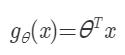
  - 
  - 
  - 결국에 여기서도 학습을 통해 적절한 세타 값을 찾아서 최적화된 모델을 찾는 것이 목적이다
- 세타 값에 따른 가설 함수 변화 ex)
  - 가설 함수에 feature가 1개라고 가정했을 때, 다음과 같다
  - 
  - 
    - x축 평행이동
  - 
    - 곡선 모양 변화


### Decision Boundary

- 분류를 구별하는 경계선

- feature가 한 개인 경우
  - 
  - 
  - 위와 같은 경우 47이라는 값이 Decision Boundary가 된다
- feature가 두 개인 경우
  - 가설함수
    - 
  - 
    - 색으로 결과 정보(통과, 탈락) 표현
  - 
  - 위와 같은 경우 Decision Boundary는 주황색 선이 된다


### 로지스틱 회귀의 손실 함수

- 가설 함수를 평가할 수 있는 손실 함수가 필요하다

- 로그 손실(log-loss / cross entropy)을 사용한다
  - cf) 선형 회귀에서는 MSE(평균 제곱 오차)를 손실 함수로 사용했었다
  - 손실의 정도를 로그 함수를 이용해서 표현하므로 로그 손실이라 부름
- 
  - 
  - 같은 표현임
- 
  - 손실 함수를 만드는 데 쓰는 거니까 함수 값이 작을 수록 잘하고 있는 것임
- 로그 손실을 활용한 로지스틱 회귀 손실 함수
  - 각 데이터에 대해 로그 손실을 구한 후 평균 내는 방식
  - 


### 로지스틱 회귀 경사 하강법

- 손실 함수 및 가설 함수가 다르지만 선형 회귀와 방법은 똑같다
- 
- 이런식으로 세타 값이 3개 있다고 했을 때, 손실 함수를 편미분해서 각 세타 값을 조절해 나가는 것이다

- 행렬을 사용한 표현법

  - 
  - 
  - 
  - 
  - 
  - 
    - y는 목표 변수 벡터
  - 
    - 로지스틱 손실 함수를 편미분 하고나면 마치 선형 회귀의 손실 함수(MSE)를 편미분 했을 때랑 똑같은 표현이 나옴
  - 따라서, 최종적인 표현은 다음과 같다
    - 

- ```python
  # ex) numpy로만 구현한 예시
  import numpy as np
  
  def sigmoid(x):
      """시그모이드 함수"""
      return 1 / (1 + np.exp(-x))
      
      
  def prediction(X, theta):
      """로지스틱 회귀 가정 함수"""
      # 지난 과제에서 작성한 코드를 갖고 오세요
      return sigmoid(X @ theta)
      
  
  def gradient_descent(X, theta, y, iterations, alpha):
      """로지스틱 회귀 경사 하강 알고리즘"""
      m = len(X)  # 입력 변수 개수 저장
  
      for _ in range(iterations):
          # 코드를 쓰세요
          error = prediction(X, theta) - y
          theta = theta - alpha / m * (X.T @ error)
              
      return theta
      
      
  # 입력 변수
  hours_studied = np.array([0.2, 0.3, 0.7, 1, 1.3, 1.8, 2, 2.1, 2.2, 3, 4, 4.2, 4, 4.7, 5.0, 5.9])  # 공부 시간 (단위: 100시간)
  gpa_rank = np.array([0.9, 0.95, 0.8, 0.82, 0.7, 0.6, 0.55, 0.67, 0.4, 0.3, 0.2, 0.2, 0.15, 0.18, 0.15, 0.05]) # 학년 내신 (백분률)
  number_of_tries = np.array([1, 2, 2, 2, 4, 2, 2, 2, 3, 3, 3, 3, 2, 4, 1, 2])  # 시험 응시 횟수
  
  # 목표 변수
  passed = np.array([0, 0, 0, 0, 0, 0, 0, 0, 1, 1, 1, 1, 1, 1, 1, 1])  # 시험 통과 여부 (0: 탈락, 1:통과)
  
  # 설계 행렬 X 정의
  X = np.array([
      np.ones(16),
      hours_studied,
      gpa_rank,
      number_of_tries
  ]).T
  
  # 입력 변수 y 정의
  y = passed
  
  theta = [0, 0, 0, 0]  # 파라미터 초기값 설정
  theta = gradient_descent(X, theta, y, 300, 0.1)  # 경사 하강법을 사용해서 최적의 파라미터를 찾는다
  theta
  ```


### 분류가 3개 이상일 때

- 위에서 사용한 가설 함수는 둘 중에 하나로 분류해준다. 따라서 분류가 3개 이상일 때는 가설 함수의 갯수를 늘려서 분류한다
- 예를 들어 3가지 음식(짜장, 짬뽕, 볶음밥)을 구분해야 한다면, 각각을 구분하는 가설 함수(짜장인지 아닌지, 짬뽕인지 아닌지, 볶음밥인지 아닌지에 대한 가설 함수)를 만들어서 학습 시킨다. 그래서 테스트 데이터를 각 가설 함수에 넣어서 가장 높은 확률을 갖는 곳으로 분류한다


### 로지스틱 회귀의 정규 방정식

- 로지스틱 회귀에서는 손실 함수가 아래로 볼록하기는 하다. 하지만 손실 함수를 편미분 했을 때 선형식이 아니므로 단순 행렬 연산만으로는 최소 지점을 찾아낼 수 없다
- 하지만 아래로 볼록이므로 경사 하강법으로는 항상 최적의 세타 값들을 찾아낼 수 있다


### scikit-learn 예시

- ```python
  # ex)
  # 필요한 라이브러리 import
  from sklearn import datasets
  from sklearn.model_selection import train_test_split
  from sklearn.linear_model import LogisticRegression
  
  import pandas as pd  
  
  wine_data = datasets.load_wine()
  """ 데이터 셋을 살펴보는 코드
  print(wine_data.DESCR)
  """
  
  # 입력 변수를 사용하기 편하게 pandas dataframe으로 변환
  X = pd.DataFrame(wine_data.data, columns=wine_data.feature_names)
  
  # 목표 변수를 사용하기 편하게 pandas dataframe으로 변환
  y = pd.DataFrame(wine_data.target, columns=['Y/N'])
  
  # 코드를 쓰세요
  X_train, X_test, y_train, y_test = train_test_split(X, y, test_size = 0.2, random_state=5)
  y_train = y_train.values.ravel()
  
  logistic_model = LogisticRegression(solver='saga', max_iter=7500)  # sci-kit learn에서 로지스틱 모델을 가지고 온다
  logistic_model.fit(X_train, y_train)
  
  y_test_predict = logistic_model.predict(X_test)
  
  # 테스트 코드
  score = logistic_model.score(X_test, y_test)
  y_test_predict, score
  ```


# 3. 머신 러닝, 더 빠르고 정확하게

## 3.1. 전처리

### Feature Scaling

- 입력 변수의 크기를 일정 수준으로 맞추는 것

- 예를 들어 연봉과 나이를 같은 feature로서 다루면 차이가 너무 많이 난다. 이런 경우 학습이 잘 안될 수 있기 때문에 Scale을 맞춰주는 것이다

  - 특정 feature가 크면 해당 feature의 세타 값이 가설 함수와 손실 함수에 영향을 많이 주게 되므로 좋지 않다
  - 따라서 Scale을 맞춰주면 경사 하강법 속도도 빨라진다
  - 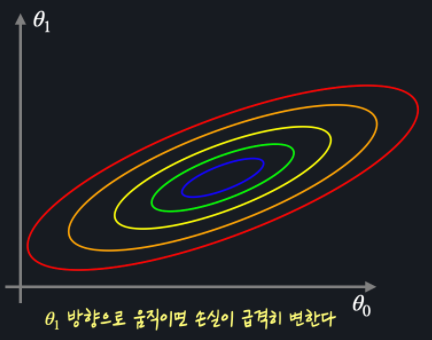
  - 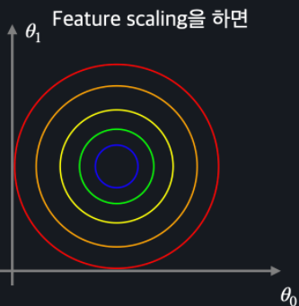
  - 위 그림은 3차원 손실 함수를 2차원 등고선 형태로 표시했을 때 feature scaling의 시각적 예시다

- Min-Max Normalization

  - 많이 쓰이는 normalization
  - 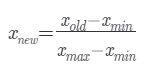

- 통계에서 쓰는 표준화(standardization)도 normalization의 방법으로 쓰인다

- scikit-learn 예시

  - ```python
    # ex) min-max normalization 예시
    from sklearn import preprocessing
    import pandas as pd
    
    PATIENT_FILE_PATH = './datasets/liver_patient_data.csv'
    pd.set_option('display.float_format', lambda x: '%.5f' % x)
    
    # 데이터 파일을 pandas dataframe으로 가지고 온다
    liver_patients_df = pd.read_csv(PATIENT_FILE_PATH)
    
    # Normalization할 열 이름들
    features_to_normalize = ['Total_Bilirubin','Direct_Bilirubin', 'Alkaline_Phosphotase', 'Alamine_Aminotransferase']
    
    # 코드를 쓰세요
    scaler = preprocessing.MinMaxScaler()
    
    normalized_data = scaler.fit_transform(liver_patients_df[features_to_normalize])
    normalized_df = pd.DataFrame(normalized_data, columns = features_to_normalize)
    
    normalized_df.describe()
    
    # 채점용 코드
    normalized_df.describe()
    ```


### One-hot Encoding

- 데이터 종류

  - 수치형(numerical) 데이터
  - 범주형(categorical) 데이터
    - ex) 혈액형, 성별
    - 많은 머신 러닝 알고리즘은 입력 변수가 수치형 데이터여야 하기 때문에 범주형 데이터를 수치형 데이터로 바꿔준다
      - 그런데 이 과정에서 잘못된 개념이 학습될 수 있다. 예를 들면 A형에 1을 대입하고, O형에 4를 대입하면, 1은 크고 4는 작다는 개념도 함께 대입되므로 이를 제거해줘야 한다

- 범주형 데이터를 수치형 데이터로 바꿀 때 개별적인 카테고리를 하나의 새로운 열로써 변환 시키는 방법

- 

- pandas로 one-hot encoding 하는 예시

  - ```python
    import pandas as pd
    
    GENDER_FILE_PATH = './datasets/gender.csv'
    
    gender_df = pd.read_csv(GENDER_FILE_PATH)
    input_data = gender_df.drop(['Gender'], axis=1)
    
    # 여기 코드를 쓰세요
    X = pd.get_dummies(input_data)
    
    X.head()
    ```

  - get_dummies() 메소드의 파라미터를 조절해서 따로 input_data 떼지 않는 방법도 있음


## 3.2. 정규화(Regularization)

### 편향(Bias)과 분산(Variance)

- 편향
  - 단순한 모델로 인한 Error
  - 모델이 너무 간단하면 training 데이터의 관계를 잘 학습하지 못한다
- 분산
  - 복잡한 모델로 인한 Error
  - 모델이 너무 복잡하면 training 데이터를 잘 학습하기는 하지만, test 데이터는 잘 예측하지 못할 수 있다
- 편향과 분산은 trade-off 관계다. 이 두 error를 합쳐서 total error가 가장 작은 모델을 선택하는 것이 좋다
  - 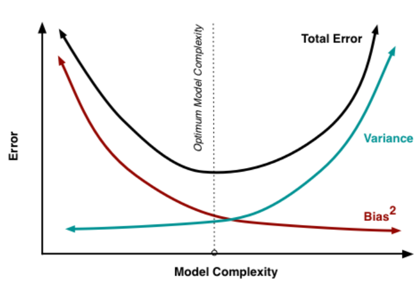
- 출처: https://bkshin.tistory.com/entry/%EB%A8%B8%EC%8B%A0%EB%9F%AC%EB%8B%9D-12-%ED%8E%B8%ED%96%A5Bias%EC%99%80-%EB%B6%84%EC%82%B0Variance-Trade-off
- 편향이 낮고 분산이 높은 경우(overfit)
  - 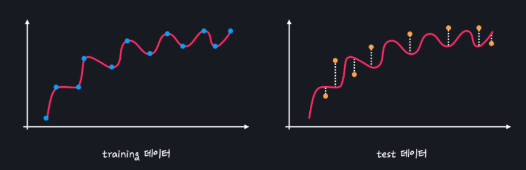
- 편향이 높고 분산이 낮은 경우(underfit)
  - 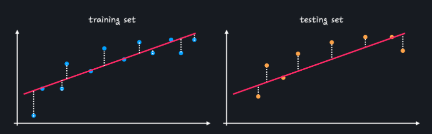

- 적당한 모델
  - 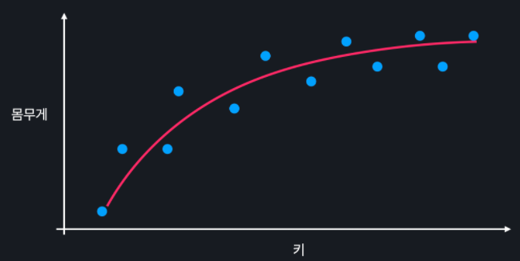


### 정규화

- 가설 함수의 세타 값들이 너무 커지는 것을 방지해서 모델이 과적합되지 않도록 하는 것
  - 과적합되는 원인은 세타 값이 너무 커져서 주어진 training data에 너무 딱 들어맞는 모델이 만들어지기 때문이므로
  - 손실 함수에 세타 값의 크기에 대한 내용(정규화항)을 추가해서, 모델을 평가할 때 이를 반영하는 방식으로 구현

- L1 정규화
  - L1 정규화를 사용하는 모델을 Lasso 회귀 모델이라고 부름
  - 세타 절대 값을 모두 합한 것을 정규화항으로 쓰는 방식
  - 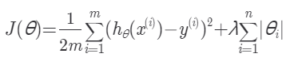
    - 다항 회귀 모델 손실 함수에서 L1 정규화를 사용하는 예시이다
    - 세타0는 과적합과 상관이 없기 때문에 더해주지 않는다
    - λ(람다)는 세타에 대해 얼만큼 페널티를 줄 것인지를 결정하는 상수이다
- L2 정규화
  - L2 정규화를 사용하는 모델을 Ridge 회귀 모델이라고 부름
  - 세타의 제곱 값을 모두 합한 것을 정규화항으로 쓰는 방식
  - 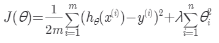
    - 다항 회귀 모델 손실 함수에서 L1 정규화를 사용하는 예시이다
- 다항 회귀 모델 뿐만 아니라 다중 회귀, 로지스틱 회귀 모델 등에도 정규화를 적용할 수 있다. 그냥 해당 손실 함수에 정규화 항을 추가해주면 되니까
  - scikit-learn 같은 라이브러리에서는 기본적으로 정규화를 해주는 경우도 있다
  - 예를 들어 LogisticRegression 모듈은 기본적으로 L2 정규화 옵션이 설정되어 있다. 파라미터 조정을 통해 L1 정규화를 사용하거나 정규화를 사용하지 않도록 할 수도 있다
  - 딥러닝 모델을 만들 때도 정규화를 사용한다
- L1 정규화 vs L2 정규화
  - L1 정규화는 어떤 모델에 쓰이는 속성 또는 변수의 개수를 줄이고 싶을 때 사용한다
    - L1 정규화를 사용하면, 세타의 값을 0으로 만들어서 모델에 중요하지 않다고 생각되는 속성을 아예 없애는 방향으로 최적화 되는 경우가 많기 때문이다
    - 반면에 L2 정규화는 세타 값을 0으로 만들어서 없애기보다는 조금씩 줄이는 방향으로 최적화 되는 경우가 많다
  - 정규화 항을 최적화할 때, L1 정규화의 세타 값이 0으로 최적화 되는 경우가 많은 이유는 정규화 항의 모양 때문이다
    - 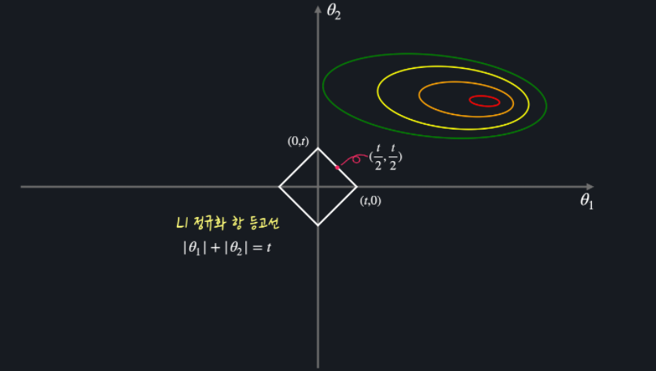
    - 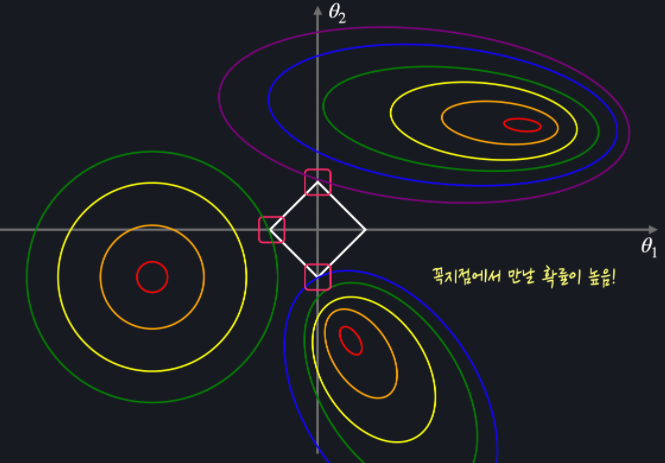
    - 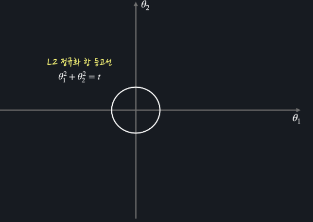
    - 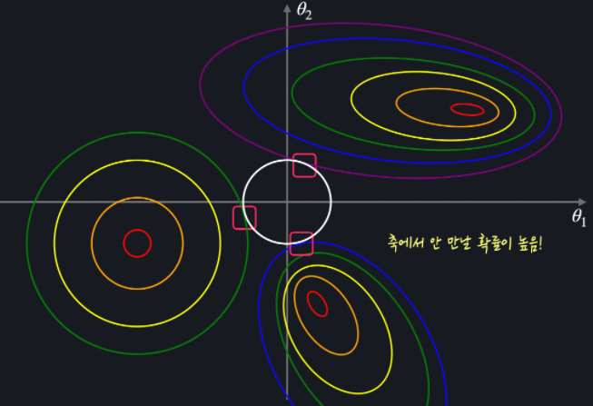


### scikit-learn 예시

- ```python
  # ex) L1 정규화 예시
  from sklearn.linear_model import Lasso
  from sklearn.model_selection import train_test_split
  from sklearn.metrics import mean_squared_error
  from sklearn.preprocessing import PolynomialFeatures
  from math import sqrt
  
  import numpy as np
  import pandas as pd
  
  # 데이터 파일 경로 정의
  INSURANCE_FILE_PATH = './insurance.csv'
  
  insurance_df = pd.read_csv(INSURANCE_FILE_PATH)  # 데이터를 pandas dataframe으로 갖고 온다 (insurance_df.head()를 사용해서 데이터를 한 번 살펴보세요!)
  insurance_df = pd.get_dummies(data=insurance_df, columns=['sex', 'smoker', 'region'])  # 필요한 열들에 One-hot Encoding을 해준다
  
  # 입력 변수 데이터를 따로 새로운 dataframe에 저장
  X = insurance_df.drop(['charges'], axis=1)
  
  polynomial_transformer = PolynomialFeatures(4)  # 4 차항 변형기를 정의
  polynomial_features = polynomial_transformer.fit_transform(X.values)  #  4차 항 변수로 변환
  
  features = polynomial_transformer.get_feature_names(X.columns)  # 새로운 변수 이름들 생성
  
  X = pd.DataFrame(polynomial_features, columns=features)  # 다항 입력 변수를 dataframe으로 만들어 준다
  y = insurance_df[['charges']]  # 목표 변수 정의
  
  # 여기 코드를 쓰세요
  X_train, X_test, y_train, y_test = train_test_split(X, y, test_size=0.3, random_state=5)
  
  model = Lasso(alpha=1, max_iter=2000, normalize=True)
  model.fit(X_train, y_train)
  
  y_test_predict = model.predict(X_test)
  y_train_predict = model.predict(X_train)
  
  # 채점용 코드
  mse = mean_squared_error(y_train, y_train_predict)
  
  print("training set에서 성능")
  print("-----------------------")
  print(f'오차: {sqrt(mse)}')
  
  mse = mean_squared_error(y_test, y_test_predict)
  
  print("testing set에서 성능")
  print("-----------------------")
  print(f'오차: {sqrt(mse)}')
  ```

- ```python
  # ex) L2 정규화 예시 - L1과 모델 만들 때 쓰는 모듈만 다름
  from sklearn.linear_model import Ridge
  from sklearn.model_selection import train_test_split
  from sklearn.metrics import mean_squared_error
  from sklearn.preprocessing import PolynomialFeatures
  from math import sqrt
  
  import numpy as np
  import pandas as pd
  
  INSURANCE_FILE_PATH = './datasets/insurance.csv'
  
  insurance_df = pd.read_csv(INSURANCE_FILE_PATH)
  insurance_df = pd.get_dummies(data=insurance_df, columns=['sex', 'smoker', 'region'])
  
  # 기존 데이터에서 입력 변수 데이터를 따로 저장한다
  X = insurance_df.drop(['charges'], axis=1)
  
  polynomial_transformer = PolynomialFeatures(4)  # 4 차항 변형기를 정의한다
  polynomial_features = polynomial_transformer.fit_transform(X.values)  # 데이터 6차 항 변수로 바꿔준다
  
  features = polynomial_transformer.get_feature_names(X.columns)  # 변수 이름들도 바꿔준다
  
  # 새롭게 만든 다항 입력 변수를 dataframe으로 만들어 준다
  X = pd.DataFrame(polynomial_features, columns=features)
  y = insurance_df[['charges']]
  
  # 여기 코드를 쓰세요
  X_train, X_test, y_train, y_test = train_test_split(X, y, test_size=0.3, random_state=5)
  
  model = Ridge(alpha=0.01, max_iter=2000, normalize=True)
  model.fit(X_train, y_train)
  
  y_test_predict = model.predict(X_test)
  y_train_predict = model.predict(X_train)
  
  # 채점용 코드
  mse = mean_squared_error(y_train, y_train_predict)
  
  print("training set에서 성능")
  print("-----------------------")
  print(f'오차: {sqrt(mse)}')
  
  mse = mean_squared_error(y_test, y_test_predict)
  
  print("testing set에서 성능")
  print("-----------------------")
  print(f'오차: {sqrt(mse)}')
  ```


## 3.3. 모델 평가와 하이퍼파라미터

### k겹 교차 검증(k-fold cross validation)

- training set과 test set을 고정해서 검증하는 것이 아니라 여러 방식으로 검증하는 것을 교차 검증이라고 한다
  - 운 좋게 해당 test set에서만 성능이 좋게 나올 수도 나쁘게 나올 수도 있으니까
- k겹 교차 검증은 data set을 k 개로 나누고 1개를 test set으로 정하고 나머지를 training set으로 정해서 성능을 평가한다. 그래서 여러 개의 성능 데이터를 평균 내는 방식으로 해당 모델의 성능을 검증한다
- 일반적으로 k를 5로 두는 경우가 많다


### scikit-learn 예시(k겹 교차 검증)

- ```python
  # ex)
  from sklearn.linear_model import LogisticRegression
  from sklearn.model_selection import cross_val_score
  
  import numpy as np
  import pandas as pd
  
  GENDER_FILE_PATH = './gender.csv'
  
  # 데이터 셋을 가지고 온다
  gender_df = pd.read_csv(GENDER_FILE_PATH)
  
  X = pd.get_dummies(gender_df.drop(['Gender'], axis=1)) # 입력 변수를 one-hot encode한다
  y = gender_df[['Gender']].values.ravel()
  
  # 여기에 코드를 쓰세요
  logistic_model = LogisticRegression(solver='saga', max_iter=2000)
  
  k_fold_score = np.average(cross_val_score(logistic_model, X, y, cv=5))
  
  # 채점용 코드
  k_fold_score
  ```


### 그리드 서치(Grid Search)

- 하이퍼 파라미터
  - 학습을 하기 전에 사람이 미리 정해 줘야 하는 변수 또는 파라미터들
- 그리드 서치는 적절한 하이퍼 파라미터를 찾는 방법이다
  - 각 하이퍼 파라미터의 후보 값들을 정해서 해당 후보들의 조합으로 모델을 학습시켜서 성능이 가장 좋은 하이퍼 파라미터 조합을 찾는다


### scikit-learn 예시(그리드 서치)

- ```python
  # ex)
  from sklearn.linear_model import LogisticRegression
  from sklearn.model_selection import GridSearchCV
  
  import numpy as np
  import pandas as pd
  
  # 경고 메시지 출력 억제 코드
  import warnings
  warnings.simplefilter(action='ignore')
  
  GENDER_FILE_PATH = './gender.csv'
  
  # 데이터 셋을 가지고 온다
  gender_df = pd.read_csv(GENDER_FILE_PATH)
  
  X = pd.get_dummies(gender_df.drop(['Gender'], axis=1)) # 입력 변수를 one-hot encode한다
  y = gender_df[['Gender']].values.ravel()
  
  # 여기 코드를 쓰세요
  logistic_model = LogisticRegression()
  
  hyper_parameters = {
      'penalty': ['l1', 'l2'],
      'max_iter': [500, 1000, 1500, 2000]
  }
  
  hyper_parameter_tuner = GridSearchCV(estimator=logistic_model, param_grid=hyper_parameters, cv=5)
  
  hyper_parameter_tuner.fit(X, y)
  best_params = hyper_parameter_tuner.best_params_
  
  # 채점용 코드
  best_params
  ```


# 4. 결정 트리와 앙상블

## 4.1. 결정 트리(Decision Tree)

### 결정 트리

- 예, 아니오로 답할 수 있는 질문들을 따라가면서 데이터를 분류하는 머신 러닝 알고리즘
- leaf 노드는 항상 특정 예측 값을 갖고 있고, 나머지 노드들은 예/아니오로 답할 수 있는 질문을 갖고 있다
- 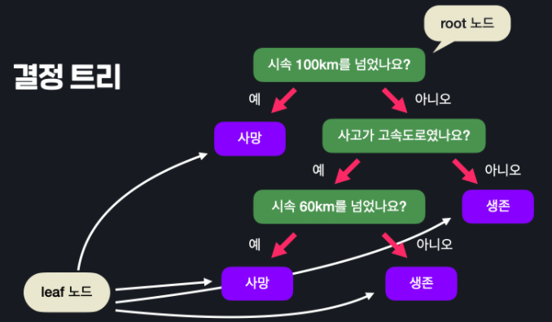


### 지니 불순도(Gini Impurity)

- 머신 러닝 프로그램이 결정 트리를 만들 때는 질문 내용을 정해놓고 하는 것이 아니다. 경험을 통해 직접 정해나가야 한다
  - 각 위치 노드에서 어떤 질문을 할지 스스로 골라야 한다
- 결정 트리의 목적은 학습 데이터를 직접 분류해보면서, 데이터들을 가장 잘 분류할 수 있는 노드들을 찾아내는 것이다
- 이 때 사용되는 개념이 지니 불순도이다
- 지니 불순도는 데이터 셋 안에 서로 데이터들이 얼만큼 섞여있는지를 보여주는 지표이다
  - 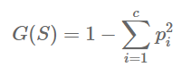
    - 출처: https://leedakyeong.tistory.com/entry/%EC%9D%98%EC%82%AC%EA%B2%B0%EC%A0%95%EB%82%98%EB%AC%B4Decision-Tree-CART-%EC%95%8C%EA%B3%A0%EB%A6%AC%EC%A6%98-%EC%A7%80%EB%8B%88%EA%B3%84%EC%88%98Gini-Index%EB%9E%80
  - 지니 불순도가 작을 수록 데이터 셋이 순수하고, 클수록 데이터 셋이 불순하다


### 분류 노드 평가

- 데이터가 분류 되어지고 있는 노드를 말한다
- 좋은 분류 노드는 최대한 데이터를 맞게 분류해야 한다. 즉, 모든 데이터를 하나의 분류로 예측했을 때 최대한 많이 맞아야 한다는 뜻이다
- 분류 노드를 평가할 때, 지니 불순도를 사용하면 이 분류 노드의 현재 분류 정도를 평가할 수 있다


### 질문 노드 평가

- 질문을 통해 나뉘어진 두 데이터 셋(분류 노드)의 지니 불순도를 사용한다
- 두 분류 노드의 지니 불순도를 구한 후, 두 분류 노드의 지니 불순도를 가중 평균내서 질문 노드를 평가할 수 있다
- 낮을 수록 순수하게 분류 했다는 의미가 되므로 성능이 좋은 것이다
- 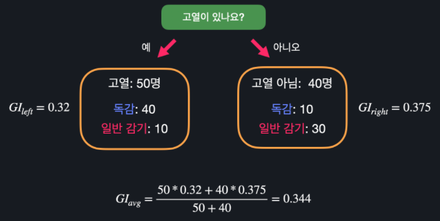


## 4.2. 랜덤 포레스트(Random Forest)


## 4.3. 에다 부스트(Adaboost)

