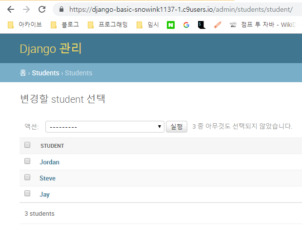

# 20190124 workshop(17workshop)

- ```python
  # model.py
  
  from django.db import models
  
  # Create your models here.
  class Student(models.Model):
      name = models.CharField(max_length=50)
      email = models.CharField(max_length=50)
      birthday = models.DateField()
      age = models.IntegerField()
      
      def __str__(self):
          return f'{self.name}'
          
      
  ```

- migration

  - ` $ python manage.py makemigrations students`
  - `$ python manage.py sqlmigrate students 0001`
  - `$ python manage.py migrate`

- ```python
  # admin.py
  
  from django.contrib import admin
  
  from .models import Student
  # Register your models here.
  admin.site.register(Student)
  ```

- 